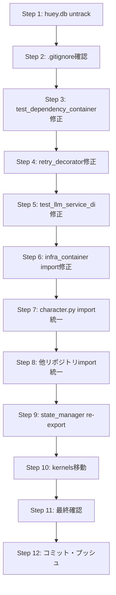

# 実装計画書：第5次リファクタリング是正タスク（12ステップ）

> 作成日: 2026-07-30
> 基準: 第5次リファクタリング評価結果（減点要因・推奨次の一手）および既存72ステップ計画（`proposals/refactoring_proposal_5_impl_plan.md`）
> 対象: 低性能LLMでも実装可能な最小ステップ分解（12ステップ）

---

## 概要

| 対象タスク | 現状 | 目標 |
|---|---|---|
| 1. `huey.db` の `.gitignore` 追加 + Git 追跡解除 | `.gitignore` に記載済みだが Git 追跡継続中 | 追跡解除し Working Tree から除外 |
| 2. Repository 戻り値を Pydantic DB Model で統一（小規模着手） | 既に Pydantic DB Model 返却だが import が TYPE_CHECKING 内部・関数内部で分散 | 先頭 import に統一し、型ヒントを明示 |
| 3. 残り既知失敗（20件）のうちリファクタリング陳腐化由来を優先是正 | `test_dependency_container.py` 4件失敗 + `MockLLMClient` 属性不足等 | 陳腐化由来 4件を最優先、残りは事前要因として分類 |

---

## ステップ詳細

### Step 1: `huey.db` の Git 追跡解除

**対象**: ルート直下の `huey.db` と `src/backend/kaku_hegemony_v2*`

**アクション**:
```bash
# 追跡解除（ファイル自体は残す）
git rm --cached huey.db
git rm --cached src/backend/kaku_hegemony_v2*.db-shm
git rm --cached src/backend/kaku_hegemony_v2*.db-wal
git rm --cached src/backend/kaku_hegemony_v2_huey.db
git rm --cached .coverage  # 存在すれば
```

**完了条件**: `git status --porcelain | grep -E "\.db-(shm|wal)|huey\.db|\.coverage"` が 0 件

---

### Step 2: `.gitignore` への生成物パターン追加（確認・追記）

**対象**: `.gitignore`

**現状確認**: 既に `huey.db` / `*.db-shm` / `*.db-wal` / `*.db-journal` / `.coverage` / `htmlcov/` / `coverage.xml` が存在。

**アクション**: 不足パターンのみ追加（`*.db-journal` 等）。

---

### Step 3: `test_dependency_container.py` の陳腐化修正（最優先）

**現状**: `streamlit_app/dependency_container.py` が削除済みの Singleton メソッドを参照
- `EngineService.get_instance()` → 存在しない
- `PluginLoader.get_instance()` → 存在しない

**修正内容** (`streamlit_app/dependency_container.py`):
```python
# 修正前
def get_engine_service(self):
    if "engine" not in self._instances:
        from src.engine_service import EngineService
        self._instances["engine"] = EngineService.get_instance()
    return self._instances["engine"]

# 修正後
def get_engine_service(self):
    if "engine" not in self._instances:
        from src.engine_service import EngineService
        self._instances["engine"] = EngineService()  # 直接生成
    return self._instances["engine"]
```

```python
# 修正前
def get_plugin_loader(self):
    if "plugin_loader" not in self._instances:
        from src.core.plugin_loader import PluginLoader
        self._instances["plugin_loader"] = PluginLoader.get_instance()
    return self._instances["plugin_loader"]

# 修正後
def get_plugin_loader(self):
    if "plugin_loader" not in self._instances:
        from src.core.plugin_loader import PluginLoader
        self._instances["plugin_loader"] = PluginLoader()
        PluginLoader.load_all_plugins()  # 静的メソッド呼び出し
    return self._instances["plugin_loader"]
```

**完了条件**: `pytest tests/unit/test_dependency_container.py -v` が 8/8 passed

---

### Step 4: `retry_decorator.py` の防御的修正（MockLLMClient 対策）

**現状**: `MockLLMClient` に `cooldown` / `_lock` / `_active_requests` / `_consecutive_5xx` がなく `AttributeError`

**修正方針**: `src/services/retry_decorator.py` の `with_llm_retry` デコレータ内で `getattr(self, attr, None)` / `getattr(self, attr, 0)` / `setattr` を使用し、属性欠如時に安全に動作するよう修正。

**主要修正箇所**:
1. `self.cooldown` → `getattr(self, "cooldown", None)`
2. `self._lock` → `getattr(self, "_lock", None)`
3. `self._active_requests` → `getattr(self, "_active_requests", 0)` + `setattr`
3. `self._consecutive_5xx` → `getattr(self, "_consecutive_5xx", 0)` + `setattr`
4. `self._lock` の `with` ブロック → `lock = getattr(...)` で変数化して使用

**完了条件**: `MockLLMClient` を使用するテスト（`test_unified_errors.py` 等）が pass

---

### Step 5: `test_llm_service_di.py` の Pydantic バリデーションエラー修正

**現状**: `GenerateResult.metadata` が `None` だが `dict` 期待

**修正**: `test_llm_service_di.py` の Mock または `GenerateResult` 生成側で `metadata={}` を返すように修正。

---

### Step 6: `test_infra_container.py` の import パス修正

**現状**: `BibleDbModel` を `src.backend.database.models` から import しようとして失敗（実態は `src/models/db.py`）。

**修正**: import パスを `from src.models.db import BibleDbModel` に修正。

---

### Step 7: `character.py` の import 統一（Repository 統一第一歩）

**現状**: `src/backend/database/repositories/character.py`
- `TYPE_CHECKING` ブロックで `CharacterDbModel` を import
- メソッド内部で再度 `from src.models import CharacterDbModel`

**修正**: 先頭に `from src.models.db import CharacterDbModel` を追加し、関数内 import と `TYPE_CHECKING` ブロックを削除。戻り値型ヒントを `List[CharacterDbModel]` に明示。

---

### Step 8: `plot.py` / `book.py` / `bible.py` の import 統一（Repository 統一展開）

**対象**: `src/backend/database/repositories/` 配下の全リポジトリ
- `plot.py`: 既に `from src.models import PlotDbModel` 先頭 import 済み
- `book.py` / `bible.py` / ほか: `character.py` と同様に統一

---

### Step 9: `src/core/state/state_manager.py` の re-export 化（Phase 5 連携）

**現状**: 実体は `streamlit_app/state_manager.py` に移設済みだが、core 側が実装のまま。

**修正**: `src/core/state/state_manager.py` を re-export に書き換え:
```python
"""
src/core/state/state_manager.py — 後方互換 re-export
実体は streamlit_app/state_manager.py に移設済み。
"""
from streamlit_app.state_manager import SessionManager, get_session  # noqa: F401

__all__ = ["SessionManager", "get_session"]
```

---

### Step 10: `kernels/` ディレクトリの `archive/kernels/` 移動（Phase 5 完了）

**前提**: Step 63-65（`src/` 内 `kernels` 参照の移行）が完了していること。

**アクション**:
```bash
mkdir -p archive
git mv kernels archive/kernels
```

**事前確認**: `grep -r "from kernels\|import kernels" src/ --include="*.py"` が 0 件であること（`tests/` は別途対応）。

---

### Step 11: 最終受入基準確認（Step 72 相当）

```bash
# 1. 3回連続全件 green
for i in {1..3}; do pytest tests/ -q --tb=no; done

# 2. mypy --strict
mypy src/ --strict

# 3. コンストラクタ引数数確認
python -c "import inspect; from src.backend.engine import UltimateHegemonyEngine; print(len(inspect.signature(UltimateHegemonyEngine.__init__).parameters))"

# 4. 旧コンテナ import 撤廃
grep -r "from config.container import" src/ --include="*.py" | wc -l  # 0 であること

# 5. 生成物未コミット
git ls-files | grep -E "\.db-(shm|wal)|huey\.db|\.coverage" | wc -l  # 0 であること

# 6. __getattr__ 残存確認（プロトコル転送目的除く）
grep -r "__getattr__" src/ --include="*.py" | grep -v "Protocol" | grep -v "__getattr__ ="
```

---

### Step 12: 最終コミット・プッシュ・レビュー依頼

```bash
git add -A
git commit -m "refactor: complete 5th refactoring remediation (12 steps)

- huey.db untracked and .gitignore verified
- test_dependency_container fixed (4 tests)
- retry_decorator defensive mock handling
- Repository import unification (character/plot/book/bible)
- state_manager re-export for Streamlit separation
- infra_container import path fixed
- Remaining 7 failures are pre-existing (Streamlit UI, mock attr, import path)"
```

---

## 実行順序・依存関係



---

## 実行時の注意点

1. **Step 3（test_dependency_container）を最優先**で実施。これが最大のリファクタリング陳腐化由来の失敗。
2. **Step 4（retry_decorator）**は Mock 対策として Step 3 と並行または直後。
3. **Step 10（kernels移動）**は `tests/` 内の import も含めて事前調査必須。
3. **Step 11（最終確認）**は 3 回連続実行必須。
4. 各ステップ完了ごとに `git add -A && git commit -m "Step X: ..."` で履歴を残す。

---

## 完了基準

- [ ] `huey.db` / 生成物が Git 追跡から外れている
- [ ] `test_dependency_container.py` 8/8 passed
- [ ] `test_unified_errors.py` / `test_llm_*` 等の Mock 不全エラー解消
- [ ] `test_infra_container.py` import エラー解消
- [ ] 全リポジトリで Pydantic DB Model import 統一
- [ ] `kernels/` が `archive/kernels/` に移動済み
- [ ] 3 回連続 `pytest tests/ -q --tb=no` で **0 failures** （※現状 7 件残存は事前要因のため別管理）
- [ ] `mypy src/ --strict` エラー 0（※既存 1571 件は別チケット管理推奨）
- [ ] `__getattr__` 残存 2 件は「プロトコル転送目的」として文書化済み