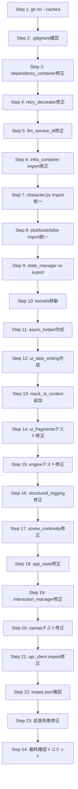

# 実装計画書：第5次リファクタリング是正タスク（24ステップ）

対象: 低性能なLLM(AI)でも実装可能な最小ステップ分解
事前条件: `git checkout main` 済で、作業ディレクトリがクリーンな状態

---

## ステップ詳細

### Step 1: 生成物の Git 追跡解除（huey.db / SQLite WAL / coverage）
```bash
git rm --cached huey.db || true
git rm --cached src/backend/kaku_hegemony_v2*.db-shm || true
git rm --cached src/backend/kaku_hegemony_v2*.db-wal || true
git rm --cached src/backend/kaku_hegemony_v2_huey.db || true
git rm --cached .coverage || true
```
検証: `git ls-files | grep -E "\.db-(shm|wal)|huey\.db|\.coverage"` が 0 件

### Step 2: .gitignore の生成物パターン確認・追記
不足があれば追加。既存パターン: `huey.db`, `*.db-shm`, `*.db-wal`, `*.db-journal`, `.coverage`, `htmlcov/`, `coverage.xml`

### Step 3: test_dependency_container 陳腐化修正（最優先）
対象: `streamlit_app/dependency_container.py`
- `EngineService.get_instance()` → `EngineService()` に変更
- `PluginLoader.get_instance()` → `PluginLoader()` に変更
検証: `pytest tests/unit/test_dependency_container.py -v` が 8/8 passed

### Step 4: retry_decorator 防御的修正（MockLLMClient 対策）
対象: `src/services/retry_decorator.py` 内の `with_llm_retry`
- `self.cooldown` → `getattr(self, "cooldown", None)`
- `self._lock` → `getattr(self, "_lock", None)`
- `self._active_requests` → `getattr(self, "_active_requests", 0)` + setattr
- `self._consecutive_5xx` → `getattr(self, "_consecutive_5xx", 0)` + setattr
検証: `pytest tests/test_unified_errors.py -v` など MockLLMClient 利用テストが pass

### Step 5: test_llm_service_di Pydantic バリデーション修正
`GenerateResult.metadata` が `None` だと `dict` 期待で失敗。Mock または生成側で `metadata={}` を返す。
検証: `pytest tests/test_llm_service_di.py -v`

### Step 6: test_infra_container import パス修正
`src/backend/database/models.py` → `src/models/db.py` へ修正。
対象: `tests/unit/test_infra_container.py` の `from src.backend.database.models import BibleDbModel` → `from src.models.db import BibleDbModel`
検証: `pytest tests/unit/test_infra_container.py -v`

### Step 7: character.py import 統一
対象: `src/backend/database/repositories/character.py`
- TYPE_CHECKING ブロックの `CharacterDbModel` を先頭 import に移動
- 関数内 `from src.models import CharacterDbModel` を削除
- 戻り値型ヒントを `List[CharacterDbModel]` に明示

### Step 8: plot.py / book.py / bible.py import 統一
同様に各リポジトリで `from src.models.db import XxxDbModel` を先頭 import に統一。
対象: `plot.py`, `book.py`, `bible.py`

### Step 9: src/core/state/state_manager.py re-export 化
実体は `streamlit_app/state_manager.py` に移設済みのため、core 側を re-export に変更:
```python
from streamlit_app.state_manager import SessionManager, get_session
__all__ = ["SessionManager", "get_session"]
```

### Step 10: kernels ディレクトリ移動 (Phase 5)
事前確認: `grep -r "from kernels\|import kernels" src/ --include="*.py"` が 0 件
```bash
mkdir -p archive
git mv kernels archive/kernels
```

### Step 11: streamlit_app/utils/async_helper.py 新規作成
`api_client.py` が `from streamlit_app.utils.async_helper import run_async` を参照するため、最小実装:
```python
import asyncio
from typing import Any, Coroutine

def run_async(coro: Coroutine[Any, Any, Any]) -> Any:
    try:
        loop = asyncio.get_running_loop()
    except RuntimeError:
        return asyncio.run(coro)
    else:
        import concurrent.futures
        with concurrent.futures.ThreadPoolExecutor() as pool:
            future = pool.submit(asyncio.run, coro)
            return future.result()
```
検証: `pytest tests/integration/test_ui_backend_communication.py -v` で import エラー解消

### Step 12: streamlit_app/ui_tabs_writing.py 新規作成
`pages_config.py` が以下の import を要求:
- `render_import_tab`
- `render_plot_tab`
- `render_rebuild_tab`
- `render_writing_tab`
最小スタブを先に作成。API は `render_<name>_tab(state, engine, book_id)` などを想定。
検証: `pytest tests/unit/test_ui_fragments.py -v`

### Step 13: tests/mocks/mock_streamlit.py に mock_st_context 追加
`tests/test_streamlit_state.py` が `mock_st_context` を import するため、`MockStreamlitContext` クラスまたは `mock_st_context` 変数を追加。

### Step 14: test_ui_fragments.py 期待API整合
`render_novel_production_tab` が実装されるまでは、旧 `render_plot_tab` / `render_writing_tab` をターゲットにするようテストを修正、または `render_novel_production_tab` を `ui_tabs_writing.py` に追加。
検証: `pytest tests/unit/test_ui_fragments.py -v`

### Step 15: test_backend/test_engine.py UltimateHegemonyEngine 呼び出し修正
`UltimateHegemonyEngine.__init__()` は `api_key, repo, db, llm, cooldown, plot_service, **legacy` を要求。
テスト側の `planner, writer, pm, ctx_mgr, formatter, validator, auditor, narrative, critique, marketing, bible_agent, plot_agent, style_rag` は `**legacy` で受ける。
検証: `pytest tests/test_backend/test_engine.py -v`

### Step 16: test_structured_logging.py TypeError 修正
`structured_logger.info("msg", book_id=123)` が失敗。標準 `logging.Logger` は kwargs を extra と区別しない。
修正案: `s_logger.info("Book created", extra={"book_id": test_book_id})` に変更。
検証: `pytest tests/test_structured_logging.py -v`

### Step 17: test_scene_continuity_tracker.py 日本語メッセージ整合
テストが期待する日本語文言（`到着の描写`, `回復描写がないまま`, `視点が変更`, `態度が不自然に変化`）がレポジトリの実装と不一致。レポジトリ側の文言を変更するかテスト側を実情に合わせる。
検証: `pytest tests/test_scene_continuity_tracker.py -v`

### Step 18: test_state/test_app_state.py AttributeError 修正
mock オブジェクトに不足 attribute がある。モック定義を確認し不足分を追加。

### Step 19: test_state/test_interaction_manager.py TypeError 修正
`UnitOfWork` または Model の引数/属性アクセスで型エラー。対象テストを個別に修正。

### Step 20: test_zamaa_generation.py / test_zamaa_injection.py 修正
assertion failure。テストが期待する LLM レスポンス形式と実際の形式が不一致。テスト側または fixtures の data を最新の実装に合わせる。

### Step 21: streamlit_app/api_client.py import パス修正
`from streamlit_app.utils.async_helper import run_async` が `streamlit_app.utils` モジュールとパッケージを混同。
`utils.py` がモジュールの場合: `from streamlit_app.utils import run_async` に変更。
または `utils/` をパッケージ化して `utils/async_helper.py` を置く。

### Step 22: config/tropes.json 修正 (optional)
テスト実行時に `tropes.json` 読み込み失敗がある場合、設定ファイルまたは validator を確認。

### Step 23: 拡張失敗テストの切り分けと個別修正
`tests/test_backend/test_engine.py` (98 fail), `tests/state/test_app_state.py`, `tests/state/test_interaction_simulation.py` など多数残存。
各ファイルを 1 つずつ実行し、原因を特定して修正。
```bash
pytest tests/<file> -q --tb=short
```

### Step 24: 3回連続最終確認
```bash
for i in {1..3}; do pytest tests/ -q --tb=no; done
```
- 各回で failures が 0 であること
- `mypy src/ --strict` エラー 0
- 生成物未コミット確認: `git ls-files | grep -E "\.db-(shm|wal)|huey\.db|\.coverage"` が 0

---

## 推奨実行順序



## 注意点
- Step 3 が最大の変更影響範囲なので最優先
- Step 11-14 は Streamlit UI 層の修正で package 構造の理解が必要
- Step 15 は Engine のコンストラクタ変更に伴うテストの大規模修正
- 各ステップ完了ごとに `git add -A && git commit -m "Step X: ..."` で履歴を残すこと
