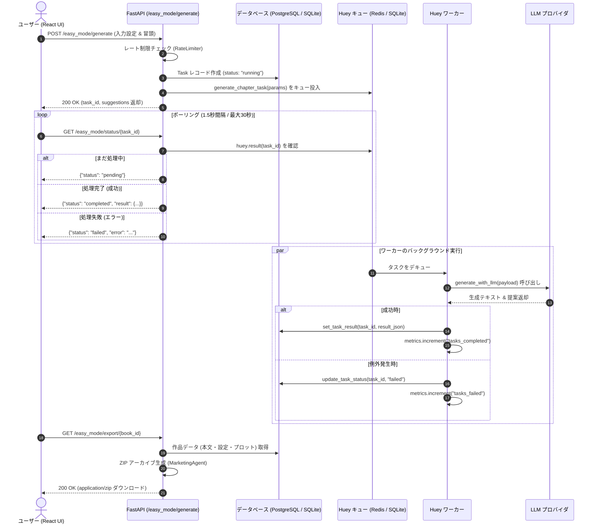
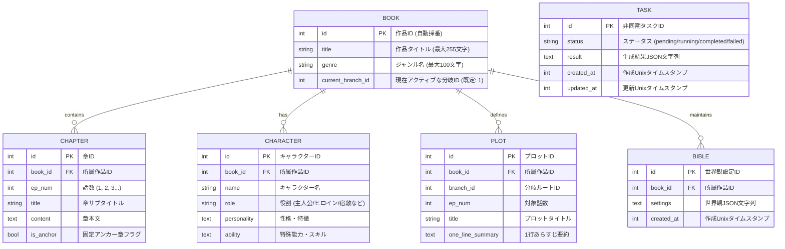
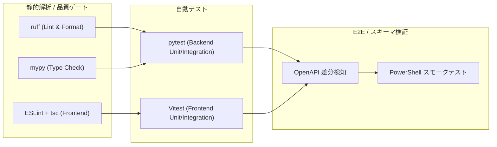

# AutoNovel

<div align="center">

**次世代AI小説執筆・納品オーケストレーション基盤**

*FastAPI + React 18/TypeScript + Huey + SQLAlchemy 2.x + PostgreSQL/Redis*

[](https://www.python.org/)
[](https://react.dev/)
[](https://fastapi.tiangolo.com/)
[](https://www.postgresql.org/)
[](https://redis.io/)
[](https://www.docker.com/)
[](https://github.com/astral-sh/ruff)
[](https://mypy-lang.org/)
[](LICENSE)

</div>

---

## 📖 目次

- [1. プロジェクト概要](#1-プロジェクト概要)
- [2. 主要機能とハイライト](#2-主要機能とハイライト)
- [3. システムアーキテクチャ](#3-システムアーキテクチャ)
- [4. 非同期生成パイプライン & シーケンス](#4-非同期生成パイプライン--シーケンス)
- [5. データモデル & ER設計](#5-データモデル--er設計)
- [6. ディレクトリ構成 & レイヤー責務](#6-ディレクトリ構成--レイヤー責務)
- [7. 必要環境](#7-必要環境)
- [8. クイックスタート](#8-クイックスタート)
  - [ワンクリック起動 (Windows バッチ)](#ワンクリック起動-windows-バッチ)
  - [Docker Compose 起動 (開発環境 / 本番環境)](#docker-compose-起動)
  - [ローカル手動起動 (PowerShell / Bash)](#ローカル手動起動)
- [9. かんたんモード操作マニュアル & 納品パッケージ仕様](#9-かんたんモード操作マニュアル--納品パッケージ仕様)
- [10. LLMアダプタの実装と拡張ガイド](#10-llmアダプタの実装と拡張ガイド)
- [11. REST API 完全リファレンス](#11-rest-api-完全リファレンス)
- [12. セキュリティ設計](#12-セキュリティ設計)
- [13. オブザーバビリティ (ロギング・ヘルスチェック・メトリクス)](#13-オブザーバビリティ)
- [14. 本番デプロイ & 運用設計](#14-本番デプロイ--運用設計)
- [15. テスト戦略 & 品質ゲート](#15-テスト戦略--品質ゲート)
- [16. トラブルシューティング & よくある質問 (FAQ)](#16-トラブルシューティング--よくある質問-faq)
- [17. 開発ワークフロー & コントリビューション](#17-開発ワークフロー--コントリビューション)
- [18. ライセンス & クレジット](#18-ライセンス--クレジット)

---

## 1. プロジェクト概要

**AutoNovel** は、Web小説（特にハイファンタジー・ダークファンタジー・異世界転生などのR15向け作品群）の執筆・構成・プロット管理・キャラクター設定・データ納品をエンドツーエンドで支援する**統合AI小説制作エンジン**です。

従来の大規模言語モデル（LLM）を用いたテキスト生成では、長文執筆に伴う「文脈喪失」「設定の矛盾」「タイムアウトによる生成中断」「成果物取り出しの煩雑さ」が大きな課題でした。AutoNovel はこれらの課題を解決するため、以下のコアコンセプトに基づいて設計されています：

1. **非同期分散キューイング**: 時間のかかるAI章生成処理をキュー（Huey / Redis / SQLite）に委譲し、Webサーバーのタイムアウトを完全回避。
2. **多重安全トランザクション**: 執筆タスクの状態遷移（`pending` → `running` → `completed` / `failed`）をDBで確実に追跡し、失敗時のロールバックと原因追跡を担保。
3. **ワンクリック納品パッケージング**: 本文だけでなく、登場人物設定集・世界観設定（Bible）・各話プロット概要・JSONデータダンプを即座にZIPアーカイブ化してダウンロード可能。
4. **プラグイン式LLM統合**: OpenAI、Anthropic Claude、Google Gemini、ローカルLLM（Ollama, vLLM）など任意の推論エンジンを差し替え可能な疎結合アーキテクチャ。

---

## 2. 主要機能とハイライト

### ✨ かんたん制作モード (Easy Mode)
- **ミニマル入力**: 作品ジャンル・主人公設定（名前、性格、能力）・冒頭プロンプトを入力するだけで直ちに執筆を開始。
- **インテリジェント・ダイジェスト**: 前話の文脈を `digest_service` が自動的に整形・抽出してプロンプトへ注入。
- **次話展開サジェスチョン**: 生成完了後、AIが次話への展開案（Chips）を即座に提案し、連続執筆をアシスト。

### 📦 納品パッケージ (ZIP) 自動生成
- **01_本文.txt**: 第1話から最新話までのテキストをフォーマット整形して収録。
- **02_キャラクター・世界観設定集.txt**: 作品固有のキャラクタープロファイルと世界観設定を統合テキスト化。
- **03_プロット概要.txt**: 章ごとの1行要約・あらすじを一覧化。
- **04_データダンプ.json**: フロントエンド・外部連携用の一式完全JSONデータ。
- **フォールバック保証**: DBに作品データが存在しない状態でも、デモ用フォールバックデータで常に正常なZIPを生成・返却（テスト・デモ展示が常に破綻しない設計）。

### 🛡️ エンタープライズ水準のセキュリティ
- **ホワイトリスト型 CORS**: 環境変数 `CORS_ORIGINS` により許可オリジンのみを厳格に制限。
- **インメモリ・スライディングウィンドウ・レートリミッター**: `/easy_mode/generate` への過剰リクエスト（DoS・総当たり）をIP単位で自動遮断 (HTTP 429)。
- **安全なシークレット注入**: Docker Compose 本番構成において、データベースおよびRedisパスワードの未設定起動を強制エラー化。

### 📊 3本柱のオブザーバビリティ
- **構造化 JSON ロギング**: `python-json-logger` により、全ログへ `timestamp`, `level`, `app`, `version`, `env` を自動付与。
- **多段ヘルスチェック (`/health`)**: PostgreSQL/SQLite の疎通性 (`SELECT 1`)、キューバックエンドの生存確認、メトリクススナップショットを統合判定。
- **プロセス内メトリクス (`/metrics`)**: タスク投入数、完了数、失敗数、エクスポート成功数、ヘルスチェック呼出数を追跡。

---

## 3. システムアーキテクチャ

AutoNovel はフロントエンド（React/Vite）、バックエンド（FastAPI）、分散ワーカー（Huey Consumer）、永続化層（PostgreSQL/SQLite）、メッセージブローカー（Redis/SQLite）で構成されるマイクロサービス指向のクリーンアーキテクチャを採用しています。

```mermaid
graph TD
    User["クライアント (ブラウザ / Web UI)"]

    subgraph "Frontend Layer (Port 5173 / 8080)"
        UI["React 18 + TypeScript + Vite"]
        Nginx["Nginx Reverse Proxy (本番時)"]
    end

    subgraph "Backend API Layer (FastAPI, Port 8200)"
        Server["server.py (FastAPI App)"]
        RateLimit["rate_limit.py (Sliding Window)"]
        EasyRouter["routers/easy_mode.py"]
        Obs["observability.py (Health & Metrics)"]
        Log["logging_config.py (JSON StructLog)"]
    end

    subgraph "Domain & Persistence Layer"
        Repo["repository.py (BookRepository)"]
        Models["SQLAlchemy 2.0 Models (Book, Chapter, Task, Plot, Character, Bible)"]
        DB[(PostgreSQL 16 / SQLite)]
    end

    subgraph "Async Task Queue Layer"
        HueyBroker["Huey Queue Broker"]
        RedisQueue[(Redis 7 / SQLite)]
        Worker["Huey Consumer (generation_tasks.py)"]
        LLMAdapter["LLM Adapter (generate_with_llm)"]
    end

    User -->|HTTP / SPA| Nginx
    Nginx -->|Static Assets| UI
    Nginx -->|Reverse Proxy /easy_mode/*| Server
    UI -->|Direct API (Dev)| Server

    Server --> RateLimit
    RateLimit --> EasyRouter
    Server --> Obs
    Server --> Log

    EasyRouter --> Repo
    Repo --> Models
    Models --> DB

    EasyRouter -->|Enqueue Task| HueyBroker
    HueyBroker --> RedisQueue
    Worker -->|Dequeue Task| RedisQueue
    Worker --> LLMAdapter
    Worker -->|Update Status & Result| Repo
    Worker -->|Increment Counters| Obs
```

---

## 4. 非同期生成パイプライン & シーケンス

生成処理は、クライアントからのリクエスト受信からDB永続化、ステータスポーリング、結果受取まで完全な非同期イベント駆動で進行します。



---

## 5. データモデル & ER設計

SQLAlchemy 2.0 の宣言的マッピング (`Mapped`, `mapped_column`) により構築された型安全なドメインモデル群です。



---

## 6. ディレクトリ構成 & レイヤー責務

```
ssssda/
├── src/                               # バックエンド Python ソースコード
│   ├── backend/
│   │   ├── server.py                  # FastAPI アプリケーション定義・CORS・lifespan・例外ハンドラ
│   │   ├── rate_limit.py              # IP単位スライディングウィンドウ・レートリミッター
│   │   ├── observability.py           # ヘルスチェック (/health) & プロセス内メトリクス (/metrics)
│   │   ├── logging_config.py          # 構造化 JSON / テキストログ設定 (python-json-logger)
│   │   ├── exceptions.py              # アプリケーション共通カスタム例外定義
│   │   ├── database/
│   │   │   ├── __init__.py            # SQLAlchemy Engine, SessionLocal, get_db(), init_db()
│   │   │   └── repository.py          # BookRepository (データアクセス集約・トランザクション制御)
│   │   ├── routers/
│   │   │   └── easy_mode.py           # かんたんモード API (/easy_mode/generate, status, export)
│   │   └── tasks/
│   │       ├── huey.py                # Huey インスタンス (Redis / SQLite 自動切替)
│   │       └── generation_tasks.py    # 非同期生成ワーカータスク (generate_chapter_task)
│   ├── models/                        # ドメインモデル & Pydantic スキーマ
│   │   ├── base.py                    # SQLAlchemy DeclarativeBase
│   │   ├── book.py                    # Book, Chapter, Character, Plot, Bible モデル
│   │   ├── task.py                    # Task モデル
│   │   └── easy_mode_schemas.py       # EasyModeInput, CharacterParams, GenerationResponse
│   └── services/                      # ドメインサービス層
│       ├── digest_service.py          # 章本文ダイジェスト・サジェスチョン生成
│       └── marketing.py               # ZIP 納品パッケージ生成 (MarketingAgent)
│
├── frontend/                          # フロントエンド React アプリケーション
│   ├── src/
│   │   ├── App.tsx                    # メインレイアウト & トースト通知管理
│   │   ├── index.css                  # デザインシステム (CSS変数, レスポンシブ, トースト)
│   │   ├── main.tsx                   # React DOM エントリポイント
│   │   ├── api/
│   │   │   └── easyMode.ts            # バックエンド API 通信クライアント (fetch)
│   │   ├── components/
│   │   │   ├── GeneratePanel.tsx      # 制作設定フォーム & ポーリング進行制御
│   │   │   └── ExportPanel.tsx        # プレビュー表示 & ZIP エクスポート
│   │   └── types/
│   │       └── easyMode.ts            # TypeScript 型定義 (EasyModeInput, TaskStatus 等)
│   ├── tests/                         # Vitest + React Testing Library + MSW
│   ├── Dockerfile                     # マルチステージビルド (dev / production nginx)
│   ├── package.json                   # npm 依存定義 & scripts
│   ├── tsconfig.json                  # TypeScript 設定 (strict)
│   └── vite.config.ts                 # Vite 設定 & プロキシ & テストカバレッジ閾値
│
├── tests/                             # バックエンド統合 & ユニットテスト
│   ├── conftest.py                    # pytest 共通フィクスチャ (real_db_manager)
│   ├── test_health.py                 # /health, /metrics, 入力バリデーションテスト
│   ├── unit/                          # ルーター・単体ロジックテスト
│   └── integration/                   # 非同期生成・エクスポート・DB永続化統合テスト
│
├── scripts/                           # 運用・保守・CI 自動化スクリプト
│   ├── verify_all.ps1                 # 全品質ゲート一括実行 (ruff, mypy, pytest, vitest)
│   ├── smoke_test.ps1                 # 稼働中サーバーに対する E2E スモークテスト
│   ├── generate_openapi.py            # OpenAPI 3.1 仕様書 (docs/openapi.json) 再生成
│   └── release.ps1                    # バージョンタグ付け & リリース検証
│
├── docs/                              # ドキュメント・仕様書・デモアセット
│   ├── api.md                         # REST API 仕様書 (Markdown)
│   ├── openapi.json                   # OpenAPI 3.1 完全スキーマ (自動生成)
│   └── demo.gif                       # アプリケーション動作デモアニメーション
│
├── Dockerfile                         # バックエンド用マルチステージ Dockerfile
├── docker-compose.yml                 # 開発用 Docker Compose (Hot reload 有効)
├── docker-compose.prod.yml            # 本番用 Docker Compose (Nginx + Postgres + Redis)
├── pyproject.toml                     # Python プロジェクト設定 (ruff, mypy, pytest, build)
├── requirements.txt                   # 本番 Python 依存パッケージ (バージョン固定)
├── requirements-dev.txt               # 開発用 Python 依存パッケージ
├── .env.example                       # 環境変数テンプレート
├── Makefile                           # 開発・ビルドコマンド集
├── アプリ起動.bat                     # Windows 用ワンクリック起動バッチ (Docker)
└── アプリ起動_ローカル.bat            # Windows 用ワンクリック起動バッチ (ローカル)
```

---

## 7. 必要環境

| ツール | 推奨バージョン | 備考 |
|--------|----------------|------|
| **Python** | 3.12 以上 | 3.12 / 3.13 / 3.14 対応 |
| **Node.js** | 18.x / 20.x LTS | フロントエンド開発・ビルド時 |
| **Docker** | 24.0 以上 | コンテナ実行時 |
| **Docker Compose** | v2.20 以上 | `docker compose` コマンド |
| **OS** | Windows 10/11, macOS, Linux | PowerShell 7+ または bash 推奨 |

---

## 8. クイックスタート

### ワンクリック起動 (Windows バッチ)

Windows 環境では、付属のバッチファイルをダブルクリックするだけで環境が立ち上がります。

1. **`アプリ起動.bat`** (推奨 / Docker Compose 構成)
   - バックエンド、Huey ワーカー、React フロントエンド、PostgreSQL 16、Redis 7 を一括起動します。
   - 起動完了後、自動的にブラウザで `http://localhost:5173` が開きます。

2. **`アプリ起動_ローカル.bat`** (軽量 / ローカル Python + SQLite)
   - Docker を使わず、ローカルの Python 仮想環境 (`.venv`) と SQLite で軽量起動します。

---

### Docker Compose 起動

#### 開発環境 (ホットリロード有効)
コードを変更するとバックエンド・フロントエンド双方が即座にリロードされます。

```bash
# コンテナのビルドと起動
docker compose up --build

# アクセスURL:
# フロントエンド (Vite Dev Server): http://localhost:5173
# バックエンド (FastAPI / Swagger): http://localhost:8200/docs
```

#### 本番構成 (Nginx リバースプロキシ + PostgreSQL + Redis 認証)
Nginx が静的アセットを高速配信し、`/easy_mode/*` のみを内部の FastAPI サーバーへリバースプロキシします。

```bash
# 1. 本番用環境変数ファイルを作成
cp .env.example .env
# ※ .env 内の POSTGRES_PASSWORD と REDIS_PASSWORD を安全な値に変更してください

# 2. 本番コンテナの起動
docker compose -f docker-compose.prod.yml up -d --build

# アクセスURL:
# 公開 Web アプリケーション: http://localhost:8080
# ヘルスチェック確認: curl http://localhost:8080/health
```

停止コマンド:
```bash
docker compose down
# 本番の場合: docker compose -f docker-compose.prod.yml down
```

---

### ローカル手動起動

ターミナルを複数開いて手動起動する場合の手順です。

```powershell
# ----------------------------------------------------
# 1. Python 仮想環境の構築と依存関係インストール
# ----------------------------------------------------
py -m venv .venv
.\.venv\Scripts\Activate.ps1
py -m pip install --upgrade pip
py -m pip install -r requirements-dev.txt
py -m pip install -e .

# ----------------------------------------------------
# 2. フロントエンドの依存関係インストール
# ----------------------------------------------------
cd frontend
npm install
cd ..

# ----------------------------------------------------
# 3. ターミナル 1: バックエンド API 起動 (SQLite モード)
# ----------------------------------------------------
$env:HUEY_BACKEND = "sqlite"
$env:DATABASE_URL = "sqlite:///./autonovel.db"
py -m uvicorn src.backend.server:app --reload --port 8200

# ----------------------------------------------------
# 4. ターミナル 2: Huey キューワーカー起動
# ----------------------------------------------------
$env:HUEY_BACKEND = "sqlite"
$env:DATABASE_URL = "sqlite:///./autonovel.db"
py -m huey.bin.huey_consumer src.backend.tasks.huey.huey

# ----------------------------------------------------
# 5. ターミナル 3: React フロントエンド起動
# ----------------------------------------------------
cd frontend
npm run dev
# ブラウザで http://localhost:5173 を開く
```

---

## 9. かんたんモード操作マニュアル & 納品パッケージ仕様

### 執筆ステップ
1. **設定入力**:
   - 作品ジャンル（ハイファンタジー / ダークファンタジー / 異世界転生 等）
   - 主人公の名前（例: `アルト`）
   - 性格・特徴（例: `熱血・正義感が強い`）
   - 特殊能力・スキル（例: `古代魔導剣術`）
   - 冒頭 / 前話プロンプト（例: `薄暗いダンジョンの中、青年アルトは古代の剣を手に取った。`）
2. **生成開始**:
   - 「🪄 かんたん執筆開始」ボタンをクリック。
   - バックエンドへ生成タスクがエンキューされ、画面上にポーリング進行バーが表示されます。
3. **プレビュー & サジェスト確認**:
   - ワーカーが生成を完了すると、右ペインの「📖 執筆プレビュー」に本文がリアルタイム表示されます。
   - 下部に「💡 次話へのAI提案」Chipsが表示され、次の展開のヒントを確認できます。
4. **納品パッケージのダウンロード**:
   - 「📦 納品パッケージ (ZIP) ダウンロード」をクリックすると、`export_1.zip` がブラウザ経由で即座にダウンロードされます。

### 納品パッケージ (ZIP) の構造
```
export_1.zip
├── 01_本文.txt                     # 第1話〜最新話までの全章統合テキスト
├── 02_キャラクター・世界観設定集.txt # キャラクターシート ＆ 世界観設定
├── 03_プロット概要.txt             # 各話のあらすじ・1行要約リスト
└── 04_データダンプ.json            # システム間連携用の完全構造化JSON
```

---

## 10. LLMアダプタの実装と拡張ガイド

現在 `src/backend/routers/easy_mode.py` 内の `generate_with_llm()` はプラグイン式のスタブ関数となっています。実際の生成AIサービス（OpenAI, Anthropic Claude, Gemini, Local LLM）を接続するには、この関数を実装します。

### 実装例: OpenAI (GPT-4o) 連携

```python
# src/backend/routers/easy_mode.py の generate_with_llm を以下のように実装

import os
from typing import Any
import httpx

async def generate_with_llm(payload: dict[str, Any]) -> dict[str, Any]:
    """OpenAI API を用いた本番用章生成アダプタ。"""
    api_key = os.getenv("OPENAI_API_KEY")
    if not api_key:
        # APIキー未設定時のモック生成フォールバック
        return {
            "text": f"【生成本文】{payload.get('current_chapter', '')}\n\n運命の扉が今、静かに開かれた……。",
            "suggestions": ["謎の少女との出会い", "古代遺跡への突入", "宿敵の影"],
            "time": 1200,
        }

    char = payload.get("character", {})
    prompt = f"""
あなたはプロのR15ファンタジー小説家です。以下の設定と文脈に基づいて、魅力的な次章の本文（約1500〜2000文字）を執筆してください。

【主人公設定】
名前: {char.get('name', '名無しの勇者')}
性格: {char.get('personality', '勇敢')}
能力: {char.get('ability', '剣術')}
ジャンル: {char.get('genre', 'ファンタジー')}

【前話・導入】
{payload.get('current_chapter', '')}
"""

    async with httpx.AsyncClient(timeout=60.0) as client:
        response = await client.post(
            "https://api.openai.com/v1/chat/completions",
            headers={"Authorization": f"Bearer {api_key}"},
            json={
                "model": "gpt-4o",
                "messages": [
                    {"role": "system", "content": "R15ファンタジー小説の執筆アシスタントです。"},
                    {"role": "user", "content": prompt}
                ],
                "temperature": 0.7,
            }
        )
        data = response.json()
        generated_text = data["choices"][0]["message"]["content"]

        return {
            "text": generated_text,
            "suggestions": [
                "次の戦闘シーンへ展開",
                "ヒロインとの対話イベント",
                "新たなスキルの覚醒"
            ],
            "time": int(data.get("usage", {}).get("total_tokens", 0)),
        }
```

---

## 11. REST API 完全リファレンス

Base URL: `http://localhost:8200`（Nginx本番時: `http://localhost:8080`）
完全なスキーマ定義は [docs/openapi.json](docs/openapi.json) またはブラウザで `/docs` を参照してください。

### 1. `POST /easy_mode/generate`
章生成タスクを非同期キューへ投入します（レートリミッター適用対象）。

- **Request Body**:
  ```json
  {
    "chapter_history": ["前話のテキスト..."],
    "current_chapter": "薄暗いダンジョンの中、15歳の青年アルトは古代の剣を手に取った。",
    "character_params": {
      "name": "アルト",
      "personality": "熱血・正義感が強い",
      "ability": "古代魔導剣術",
      "genre": "ファンタジー (R15)"
    },
    "content_length_limit": 2000
  }
  ```
- **Response (200 OK)**:
  ```json
  {
    "task_id": "c7a8b9e1-2f3a-4b5c-6d7e-8f9a0b1c2d3e",
    "output": "",
    "completion_time_ms": 0,
    "error": "",
    "suggestions": [
      "生成タスク ID: c7a8b9e1-2f3a-4b5c-6d7e-8f9a0b1c2d3e を投入しました。ステータスを /easy_mode/status/c7a8b9e1-2f3a-4b5c-6d7e-8f9a0b1c2d3e で確認してください。"
    ]
  }
  ```
- **Error Responses**:
  - `422 Unprocessable Entity`: 入力バリデーション違反（文字数超過、負の数値など）
  - `429 Too Many Requests`: レート制限超過（同一IPから短時間の連続リクエスト）

---

### 2. `GET /easy_mode/status/{task_id}`
非同期生成タスクの進行状態および完了結果を取得します。

- **Parameters**: `task_id` (文字列 / パスパラメータ)
- **Response - 処理中 (200 OK)**:
  ```json
  {
    "task_id": "c7a8b9e1-2f3a-4b5c-6d7e-8f9a0b1c2d3e",
    "status": "pending"
  }
  ```
- **Response - 完了 (200 OK)**:
  ```json
  {
    "task_id": "c7a8b9e1-2f3a-4b5c-6d7e-8f9a0b1c2d3e",
    "status": "completed",
    "result": {
      "text": "生成された小説本文...",
      "suggestions": ["次話提案1", "次話提案2"],
      "time": 1540
    }
  }
  ```
- **Response - 失敗 (200 OK)**:
  ```json
  {
    "task_id": "c7a8b9e1-2f3a-4b5c-6d7e-8f9a0b1c2d3e",
    "status": "failed",
    "error": "LLM API timeout error"
  }
  ```

---

### 3. `GET /easy_mode/export/{book_id}`
指定作品の全データをZIPアーカイブとしてストリーミングダウンロードします。

- **Parameters**: `book_id` (1以上の整数 / パスパラメータ)
- **Response (200 OK)**:
  - `Content-Type: application/zip`
  - `Content-Disposition: attachment; filename="export_1.zip"; filename*=UTF-8''export_1.zip`
- **Error Responses**:
  - `422 Unprocessable Entity`: `book_id < 1` の場合

---

### 4. `GET /health`
データベース疎通、タスクキュー稼働状態、システムメトリクスを含む総合ヘルスチェック。

- **Response (200 OK)**:
  ```json
  {
    "status": "ok",
    "components": {
      "database": {
        "status": "ok",
        "latency_ms": 1.254
      },
      "queue": {
        "status": "ok",
        "backend": "RedisHuey"
      }
    },
    "metrics": {
      "tasks_enqueued": 42,
      "tasks_completed": 40,
      "tasks_failed": 2,
      "exports_attempted": 15,
      "exports_succeeded": 15,
      "health_checks": 120
    }
  }
  ```

---

### 5. `GET /metrics`
軽量インメモリ・メトリクスカウンタのスナップショットを取得します。

- **Response (200 OK)**:
  ```json
  {
    "tasks_enqueued": 42,
    "tasks_completed": 40,
    "tasks_failed": 2,
    "exports_attempted": 15,
    "exports_succeeded": 15,
    "health_checks": 120
  }
  ```

---

## 12. セキュリティ設計

| セキュリティ項目 | 実装内容 | 対象ファイル |
|------------------|----------|--------------|
| **CORS 制御** | 環境変数 `CORS_ORIGINS` による許可オリジンホワイトリスト制御 | `src/backend/server.py` |
| **レート制限** | IPベース・スライディングウィンドウ方式による過剰リクエスト遮断 (HTTP 429) | `src/backend/rate_limit.py` |
| **認証 & パスワード** | Docker本番環境における `POSTGRES_PASSWORD`, `REDIS_PASSWORD` 未設定起動防止 | `docker-compose.prod.yml` |
| **DB トランザクション** | 操作例外発生時の自動 `session.rollback()` とセッション確実開放 | `src/backend/tasks/generation_tasks.py` |
| **型バリデーション** | Pydantic v2 スキーマによる入力データ型・長さ制限 (`CharacterParams`) | `src/models/easy_mode_schemas.py` |

---

## 13. オブザーバビリティ

### 構造化ロギング (`src/backend/logging_config.py`)
環境変数 `LOG_FORMAT=json`（既定）により、Logstash、Fluentbit、CloudWatch、Datadog 等のログ集約基盤にそのまま流し込める JSON フォーマットを出力します。

```json
{
  "timestamp": "2026-08-31T18:00:00.123456",
  "level": "INFO",
  "logger": "src.backend.routers.easy_mode",
  "message": "Enqueued generation task: db_id=1, huey_id=c7a8b9e1-2f3a-4b5c-6d7e-8f9a0b1c2d3e",
  "app": "autonovel",
  "version": "0.2.0",
  "env": "production"
}
```

---

## 14. 本番デプロイ & 運用設計

### 環境変数一覧

| 環境変数名 | デフォルト値 | 説明 |
|------------|--------------|------|
| `DATABASE_URL` | `sqlite:///./autonovel.db` | SQLAlchemy DB 接続文字列 (PostgreSQL 利用時は `postgresql+psycopg2://...`) |
| `HUEY_BACKEND` | `sqlite` | タスクキューバックエンド (`redis` または `sqlite`) |
| `REDIS_URL` | `redis://localhost:6379/0` | Redis 接続 URL (`HUEY_BACKEND=redis` 時に使用) |
| `CORS_ORIGINS` | `http://localhost:5173,http://localhost:8080...` | 許可するオリジン (カンマ区切り) |
| `POSTGRES_PASSWORD` | (なし / 本番必須) | PostgreSQL パスワード |
| `REDIS_PASSWORD` | (なし / 本番必須) | Redis 接続パスワード |
| `LOG_LEVEL` | `INFO` | ルートログレベル (`DEBUG`, `INFO`, `WARNING`, `ERROR`) |
| `LOG_FORMAT` | `json` | ログ出力形式 (`json` または `text`) |
| `APP_ENV` | `local` | 環境識別子 (`local`, `staging`, `production`) |
| `UVICORN_WORKERS` | `2` | 本番 Uvicorn ワーカープロセス数 |

---

## 15. テスト戦略 & 品質ゲート

AutoNovel は、堅牢な品質を担保するため、コミット・PR・リリース前の多層テストを自動化しています。



### テスト実行コマンド集

```powershell
# 1. バックエンド単体 & 統合テスト (pytest)
py -m pytest -q --tb=short

# 2. Python 静的解析 (ruff)
py -m ruff check src tests

# 3. Python 型検査 (mypy)
py -m mypy src

# 4. フロントエンドテスト & カバレッジ (Vitest)
cd frontend; npm run test:ci; cd ..

# 5. フロントエンド Lint & 型検査
cd frontend; npm run lint; npm run typecheck; cd ..

# 6. 全検証の一括実行 (推奨)
.\scripts\verify_all.ps1
```

---

## 16. トラブルシューティング & よくある質問 (FAQ)

### Q1: フロントエンドで「生成リクエストに失敗しました」または 429 エラーが出る
- **原因**: レートリミッター（同一IPから短時間での過剰連打）に抵触した可能性があります。
- **対処**: 60秒待機してから再試行してください。開発環境で制限を緩和したい場合は `src/backend/rate_limit.py` の `max_requests` を調整してください。

### Q2: ポーリングがずっと `pending` のまま完了しない
- **原因**: Huey ワーカープロセスが起動していないか、タスクキューのバックエンド設定 (`HUEY_BACKEND`) が API とワーカー間で不一致です。
- **対処**:
  - ローカル実行時: ターミナルで `py -m huey.bin.huey_consumer src.backend.tasks.huey.huey` が実行中であることを確認してください。
  - Docker 実行時: `docker compose ps` で `autonovel_worker` が稼働中か確認してください。

### Q3: 本番 Docker Compose の起動時にエラーで即座に落ちる
- **原因**: `.env` ファイルに `POSTGRES_PASSWORD` または `REDIS_PASSWORD` が設定されていません。
- **対処**: `.env.example` を `.env` にコピーし、両パスワードに適切な文字列を設定してください。

---

## 17. 開発ワークフロー & コントリビューション

開発における一般的なコマンドは `Makefile` に集約されています。

```bash
make help          # 利用可能な make コマンド一覧を表示
make install       # バックエンドの依存関係をインストール
make dev           # バックエンド + フロントエンドの全セットアップ
make test          # バックエンドの pytest を実行
make lint          # ruff による静的コード解析
make typecheck     # mypy による型検査
make openapi       # docs/openapi.json を再生成
make frontend-test # フロントエンドの Vitest テストを実行
make frontend-lint # フロントエンドの ESLint + 型検査を実行
make verify        # 全ての検証を一括実行 (PR前必須)
make clean         # キャッシュや一時データベースをクリーンアップ
```

コントリビューションの詳細は [CONTRIBUTING.md](CONTRIBUTING.md) をご覧ください。

---

## 18. ライセンス & クレジット

本プロジェクトは [MIT License](LICENSE) の下で公開されています。商用利用・改変・再配布が自由に認められています。

---

<div align="center">
  <sub>Built with ❤️ for AI Creators and Novelists.</sub>
</div>
