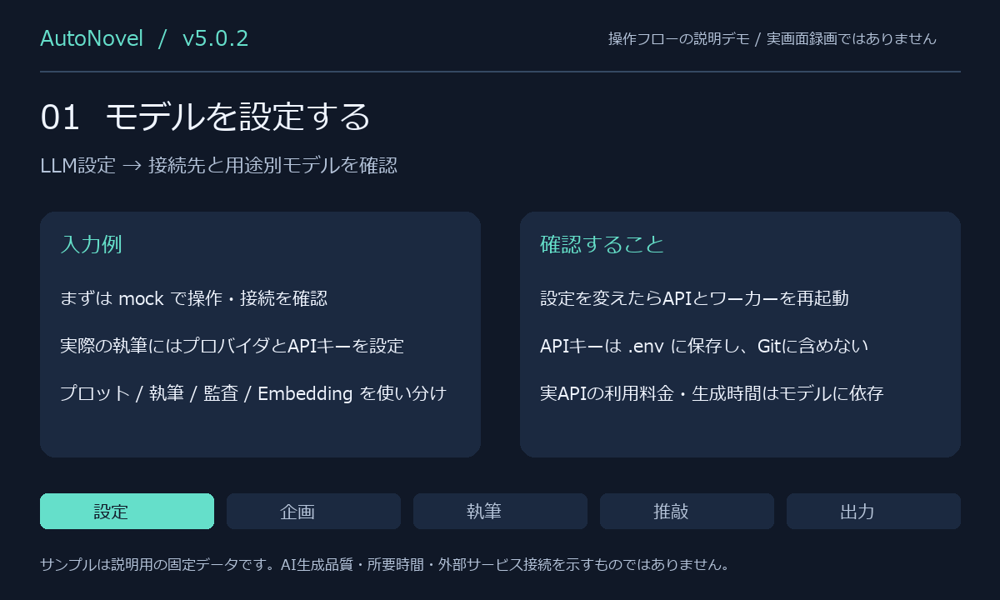
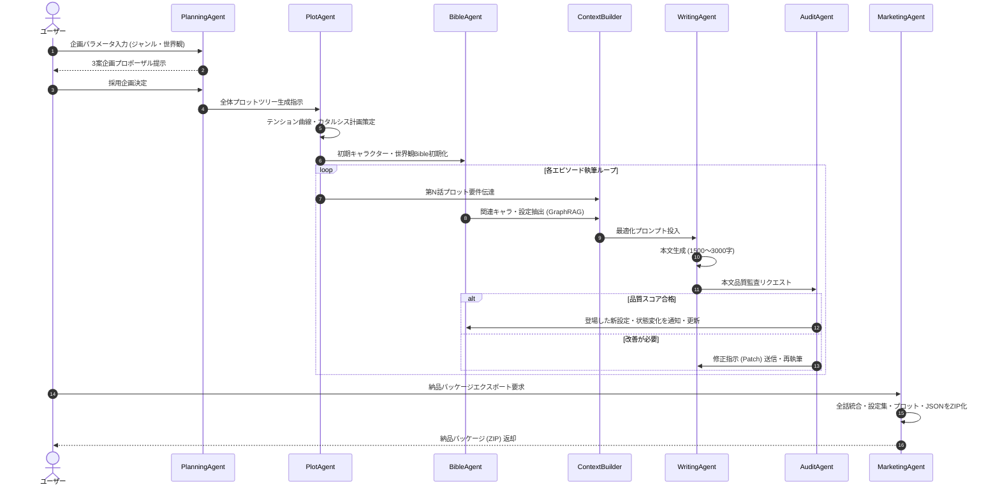
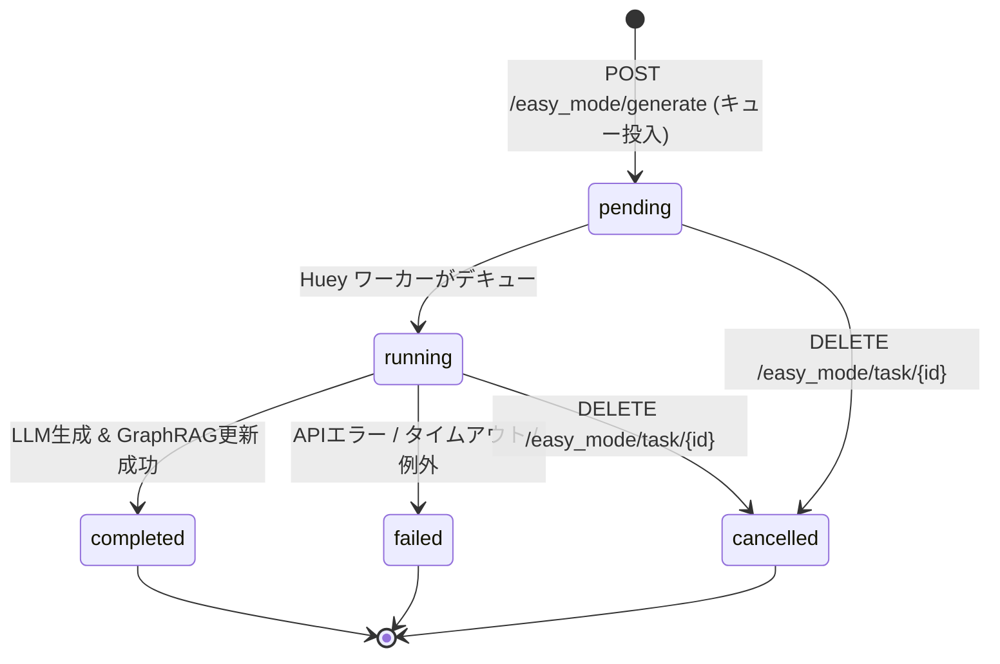
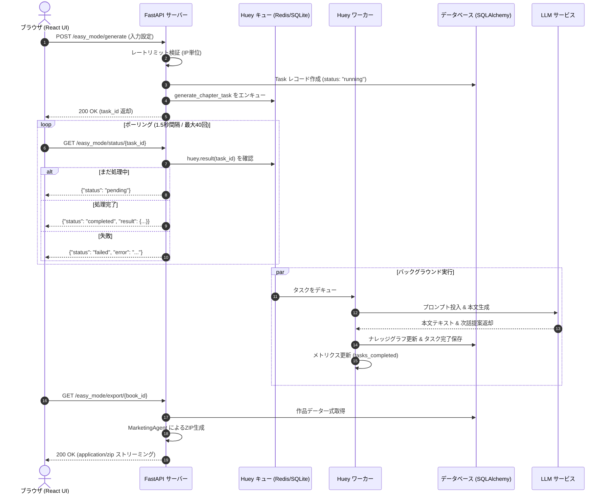
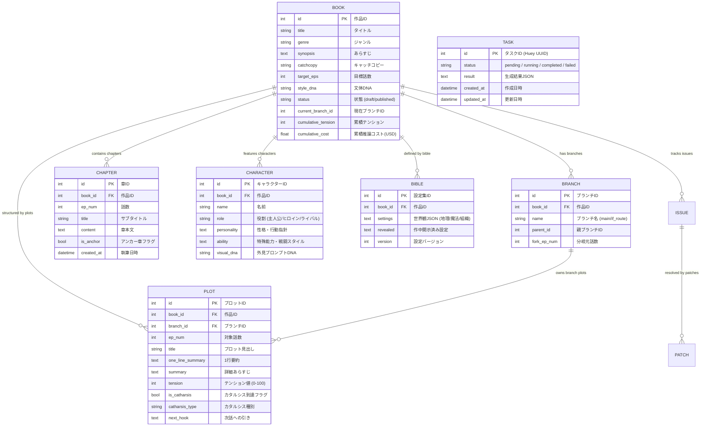
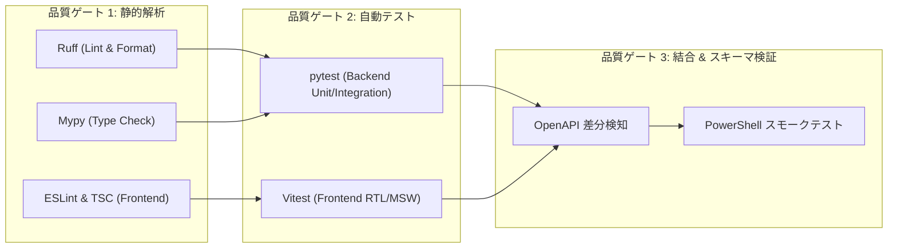

# AutoNovel (オートノベル)

<div align="center">

**次世代AI小説執筆・マルチエージェント・GraphRAG・納品オーケストレーション基盤**

*FastAPI + React 18/TypeScript + Huey Task Queue + SQLAlchemy 2.0 + GraphRAG (Apache AGE / VectorStore) + PostgreSQL 16 / Redis 7*

[](https://www.python.org/)
[](https://react.dev/)
[](https://fastapi.tiangolo.com/)
[](https://www.postgresql.org/)
[](https://redis.io/)
[](https://www.docker.com/)
[](https://github.com/astral-sh/ruff)
[](https://mypy-lang.org/)
[](https://vitest.dev/)
[](LICENSE)

<br />

<p align="center">
  
</p>

*▲ AutoNovel v4.0: 3案企画ガチャ・逆算プロット・上級者Studio・インライン五感推敲・GraphRAG相関図・ワンクリックZIP納品*

</div>

---


## 📖 目次

- [1. AutoNovel プロジェクト概要](#1-autonovel-プロジェクト概要)
  - [1.1 プロジェクトの背景とビジョン](#11-プロジェクトの背景とビジョン)
  - [1.2 解決するWeb小説AI制作の課題](#12-解決するweb小説ai制作の課題)
  - [1.3 コア設計原則](#13-コア設計原則)
- [2. 主要機能一覧 & 2大制作モード](#2-主要機能一覧--2大制作モード)
  - [2.1 制作モード比較](#21-制作モード比較)
  - [2.2 かんたん制作モード (Easy Mode)](#22-かんたん制作モード-easy-mode)
  - [2.3 上級者 Studio (Sudowrite × Notion AI 式 統合エディタ)](#23-上級者-studio-sudowrite--notion-ai-式-統合エディタ)
  - [2.4 GraphRAG & 長期記憶ナレッジグラフ](#24-graphrag--長期記憶ナレッジグラフ)
  - [2.5 多角型品質監査 & 読者フック診断システム](#25-多角型品質監査--読者フック診断システム)
  - [2.6 AI挿絵プロンプト & ビジュアル生成エンジン](#26-ai挿絵プロンプト--ビジュアル生成エンジン)
  - [2.7 自動マーケティング & 納品パッケージング](#27-自動マーケティング--納品パッケージング)
- [3. システムアーキテクチャ & 技術スタック](#3-システムアーキテクチャ--技術スタック)
  - [3.1 全体アーキテクチャ図](#31-全体アーキテクチャ図)
  - [3.2 採用技術スタック一覧](#32-採用技術スタック一覧)
  - [3.3 フロントエンド構成](#33-フロントエンド構成)
  - [3.4 バックエンド API 構成](#34-バックエンド-api-構成)
  - [3.5 非同期タスク実行基盤](#35-非同期タスク実行基盤)
  - [3.6 知識・永続化層](#36-知識永続化層)
- [4. マルチエージェント・オーケストレーション詳細](#4-マルチエージェントオーケストレーション詳細)
  - [4.1 エージェント群の責務分担](#41-エージェント群の責務分担)
  - [4.2 専門エージェント詳細](#42-専門エージェント詳細)
  - [4.3 マルチエージェント協調シーケンス](#43-マルチエージェント協調シーケンス)
- [5. GraphRAG & 長期記憶・コンテキストマネジメント](#5-graphrag--長期記憶コンテキストマネジメント)
  - [5.1 動的世界観Bible管理とエンティティ抽出](#51-動的世界観bible管理とエンティティ抽出)
  - [5.2 ナレッジグラフとベクトルストアのハイブリッド検索](#52-ナレッジグラフとベクトルストアのハイブリッド検索)
  - [5.3 コンテキストウィンドウ管理 & セマンティックキャッシュ](#53-コンテキストウィンドウ管理--セマンティックキャッシュ)
- [6. 非同期パイプライン & ライフサイクル管理](#6-非同期パイプライン--ライフサイクル管理)
  - [6.1 タスクステートマシン](#61-タスクステートマシン)
  - [6.2 非同期生成・ステータスポーリングシーケンス](#62-非同期生成ステータスポーリングシーケンス)
  - [6.3 トランザクション保護とフォールバック保証](#63-トランザクション保護とフォールバック保証)
- [7. データモデル & ER設計](#7-データモデル--er設計)
  - [7.1 ドメインモデル ER図](#71-ドメインモデル-er図)
  - [7.2 主要エンティティ仕様](#72-主要エンティティ仕様)
- [8. ディレクトリ構成 & コードベースマップ](#8-ディレクトリ構成--コードベースマップ)
  - [8.1 全体ディレクトリツリー](#81-全体ディレクトリツリー)
  - [8.2 レイヤー責務と境界設計](#82-レイヤー責務と境界設計)
- [9. 必要動作環境](#9-必要動作環境)
- [10. クイックスタート & 起動ガイド](#10-クイックスタート--起動ガイド)
  - [10.1 Windows ワンクリック起動](#101-windows-ワンクリック起動)
  - [10.2 Docker Compose による起動](#102-docker-compose-による起動)
  - [10.3 ローカル手動環境構築](#103-ローカル手動環境構築)
- [11. 実践操作マニュアル & 納品パッケージ仕様](#11-実践操作マニュアル--納品パッケージ仕様)
  - [11.1 かんたんモード操作ステップ](#111-かんたんモード操作ステップ)
  - [11.2 3案企画ガチャと上級者モード昇格](#112-3案企画ガチャと上級者モード昇格)
  - [11.3 ナレッジグラフ可視化ツールの活用](#113-ナレッジグラフ可視化ツールの活用)
  - [11.4 納品パッケージ (ZIP) の構造とフォーマット仕様](#114-納品パッケージ-zip-の構造とフォーマット仕様)
- [12. LLMプロバイダ設定 & ルーティング・拡張ガイド](#12-llmプロバイダ設定--ルーティング拡張ガイド)
  - [12.1 サポートプロバイダと切り替え設定](#121-サポートプロバイダと切り替え設定)
  - [12.2 プロバイダファクトリとアダプタアーキテクチャ](#122-プロバイダファクトリとアダプタアーキテクチャ)
  - [12.3 カスタムLLMアダプタの実装例](#123-カスタムllmアダプタの実装例)
- [13. REST API 完全リファレンス](#13-rest-api-完全リファレンス)
  - [13.1 主要エンドポイント一覧](#131-主要エンドポイント一覧)
  - [13.2 かんたんモード系 API](#132-かんたんモード系-api)
  - [13.3 ナレッジグラフ・挿絵・マーケティング系 API](#133-ナレッジグラフ挿絵マーケティング系-api)
  - [13.4 オブザーバビリティ系 API](#134-オブザーバビリティ系-api)
- [14. 設定パラメータ & 環境変数リファレンス](#14-設定パラメータ--環境変数リファレンス)
- [15. セキュリティ & 堅牢性設計](#15-セキュリティ--堅牢性設計)
- [16. オブザーバビリティ (ロギング・ヘルス・メトリクス)](#16-オブザーバビリティ-ロギングヘルスメトリクス)
- [17. 本番デプロイ & インフラ運用設計](#17-本番デプロイ--インフラ運用設計)
- [18. テスト戦略 & 品質ゲート](#18-テスト戦略--品質ゲート)
- [19. トラブルシューティング & FAQ](#19-トラブルシューティング--faq)
- [20. 開発ワークフロー & コントリビューション](#20-開発ワークフロー--コントリビューション)
- [21. ロードマップ & ライセンス](#21-ロードマップ--ライセンス)

---

## 1. AutoNovel プロジェクト概要

### 1.1 プロジェクトの背景とビジョン

**AutoNovel** は、Web小説（ハイファンタジー、ダークファンタジー、異世界転生、現代ダンジョン、R15作品群など）の企画・世界観構築・プロット策定・マルチブランチ執筆・品質監査・挿絵生成・データ納品までを自律的かつ高度に協調して遂行する**次世代AI小説制作オーケストレーション基盤**です。

単なるチャット型プロンプト入力による短文生成ツールとは異なり、AutoNovel は数十万字規模の長編連載小説を商業・Web投稿レベルで一貫性を保ちながら完結させるためのエンタープライズ・アーキテクチャを備えています。

```
+-----------------------------------------------------------------------------------+
|                                   AutoNovel Core                                  |
|                                                                                   |
|  [企画・プロット] ──> [世界観Bible/GraphRAG] ──> [本文執筆] ──> [品質監査/診断]   |
|         │                        │                     │               │          |
|         ▼                        ▼                     ▼               ▼          |
|    PlanningAgent            BibleAgent           WritingAgent      AuditAgent     |
|   (3案企画ガチャ)        (知識グラフ/ベクトル)    (コンテキスト構築)  (カタルシス/伏線)  |
|                                                                        │          |
|                                                                        ▼          |
|  [納品パッケージZIP] <── [挿絵生成] <── [マーケティング/あらすじ] <───────┘          |
|    (01_本文.txt / 02_設定集.txt / 03_プロット.txt / 04_データダンプ.json)         |
+-----------------------------------------------------------------------------------+
```

### 1.2 解決するWeb小説AI制作の課題

近年の大規模言語モデル（LLM）の進化によりテキスト生成は容易になりましたが、本格的な長編小説制作では以下の5つの重大な技術的・構造的障壁が存在していました：

1. **文脈喪失と設定の矛盾 (Context Drift & Hallucination)**:
   - 従来手法: 話数が進むにつれて過去の設定やキャラクターの口調、死亡した登場人物の扱い、スキル制約が忘れられ、矛盾が多発する。
   - AutoNovelの解決策: **世界観Bible (設定辞書)** と **GraphRAG (Apache AGE ナレッジグラフ + VectorStore)** により、登場人物の関係性や世界観ルールをグラフ構造として恒久管理し、執筆時に動的注入。
2. **Webサーバーのタイムアウトと生成中断 (Timeout & State Loss)**:
   - 従来手法: 同期HTTPリクエストで長文生成を行うと、LLMの推論遅延によりHTTPタイムアウトや通信切断が発生し、途中結果が喪失する。
   - AutoNovelの解決策: **Huey Task Queue + Redis/SQLite** による完全非同期キューイングとステートマシン管理を採用。生成タスクはバックグラウンドワーカーで実行され、クライアントはポーリングやSSEで安全に進捗を受け取る。
3. **構成の平坦化とカタルシス不足 (Flat Narrative & Pacing Issues)**:
   - 従来手法: AIは無難な展開を好むため、起承転結の「転」や読者の感情を揺さぶる「カタルシス」「テンション曲線」「引き（フック）」が欠落しやすい。
   - AutoNovelの解決策: **テンション曲線設計 (Tension Curve Engine)** と **カタルシス種別管理 (Catharsis Scoring)**、および **読者フック診断 (HookDiagnoser)** による構造的プロット制御。
4. **挿絵・プロモーション・納品の一連の断絶 (Disjointed Deliverables)**:
   - 従来手法: 生成された文章をコピペし、別ツールで画像生成し、手作業で設定資料やあらすじをまとめる膨大な事務作業が発生する。
   - AutoNovelの解決策: **MarketingAgent** と **IllustrationAgent** が連動し、本文・設定集・プロット概要・JSONダンプ・挿絵プロンプトを一括でZIPアーカイブにパッケージングしてワンクリック納品。
5. **プロバイダ依存とコスト管理 (Vendor Lock-in & Token Explosion)**:
   - 従来手法: 特定のLLM APIに密結合し、API利用料の急騰やサービス停止に脆弱。
   - AutoNovelの解決策: **LLM Gateway / Provider Factory** による疎結合化（OpenAI, Gemini, Claude, Ollama, vLLM対応）、プロンプトキャッシング、セマンティックキャッシュ、トークン・コスト追跡を完備。

### 1.3 コア設計原則

- **Clean Architecture & Domain-Driven Design**:
  ビジネスロジック（小説制作ドメイン）、データ永続化（リポジトリ層）、非同期タスク、APIインターフェースを明確に分離。
- **Resilience First (回復性最優先)**:
  LLM APIの一時的な障害やレート制限に対して、指数バックオフ付き自動リトライ、フォールバック機構、サーキットブレーカーを適用。
- **Multi-Modal Extensibility (マルチモーダル拡張性)**:
  テキスト執筆のみならず、キャラクター立ち絵・挿絵生成プロンプトの自動設計や音声化への拡張性を見据えたモジュラー設計。
- **Zero-Config Developer Experience (ゼロコンフィグ開発体験)**:
  Windowsバッチ、Docker Compose、ローカルSQLite環境など、あらゆる環境でコマンド1つまたはダブルクリックのみで即座に起動可能。

---

## 2. 主要機能一覧 & 2大制作モード

### 2.1 制作モード比較

AutoNovel は、目的と制作深度に合わせて**2つの強力な制作モード**を提供します：

| 比較項目 | かんたん制作モード (Easy Mode) | アドバンスド・パイプライン (Advanced Mode) |
| :--- | :--- | :--- |
| **対象ユーザー** | 初心者、アイデア検証、即座の執筆・納品 | プロ作家、本格長編連載、厳密な世界観管理 |
| **入力パラメータ** | ジャンル、主人公設定（名前・性格・能力）、冒頭文 | 企画コンセプト、章別プロットツリー、登場人物相関、世界観ルール |
| **生成単位** | 1話ごとの連続生成 & サジェスチョン | 全体構成 → 章プロット → シーン設計 → 本文執筆 → 品質監査 |
| **設定管理** | インテリジェント・ダイジェスト自動抽出 | 世界観Bible + GraphRAG + 伏線追跡テーブル |
| **分岐管理** | リニア進行（ワンクリック昇格対応） | マルチブランチ (Git like なルート分岐・リビルド) |
| **所要時間** | 数十秒で即座に第1話完成・ZIP出力 | 数分〜数十分で複数章の総合オーケストレーション |
| **昇格パス** | ボタン1つでアドバンスド作品へ完全コンバート | 随時、詳細設定の追加・微調整が可能 |

---

### 2.2 かんたん制作モード (Easy Mode)

Web UI からわずか数項目のフォームを入力するだけで、プロ品質の小説第1話を生成し、連続して次話の執筆を行える直感的なモードです。

```
[3案企画ガチャ / 逆算プロット] ──> [主人公 & 冒頭設定] ──> [AIかんたん執筆] ──> [リアルタイム進捗]
                                                                                      │
[ワンクリック納品ZIP] <── [上級者Studioへ昇格] <── [次話サジェスト / 本文エディタ] <──────┘
```

- **🎲 3案企画ガチャ (Gacha Pitch - `POST /api/easy-mode/gacha`)**:
  漠然としたキーワードやジャンルから、AIが方向性の異なる3案（⚔️王道、🌀変化球、🌑ダーク）の企画・タイトル・ログライン・主人公設定を即座に同時提案。
- **🔮 逆算プロットビルダー (4-Step Reverse Engineering - `POST /easy_mode/reverse-generate`)**:
  「最終話で読者に残したい感情」「主人公が支払う代償」「核心の衝突」「第1話の開幕フック」の4ステップを選択するだけで、全10話・3アーク構成とカタルシス波形を同期型で瞬時に算出・第1話プロンプトへ自動展開。
- **📝 インテリジェント・ダイジェスト生成 (`POST /api/easy-mode/digest`)**:
  企画ガチャの選択案から、詳細なあらすじ・第1話草案・クライマックス予告テキストを自動創出。
- **📦 最新本文連動 ZIP エクスポート (`POST /easy_mode/export-with-data`)**:
  画面上でユーザーが推敲・手動編集した最新の本文テキスト・キャラクター設定を完全同期し、瞬時に納品用ZIP（本文、設定集、プロット、JSONダンプ）として出力。
- **🚀 上級者 Studio へワンクリック昇格 (`POST /api/easy-mode/promote`)**:
  かんたんモードで作成した設定・本文をGraphRAGナレッジグラフに自動登録し、Sudowrite × Notion AI 式の高度なエディタワークスペースへシームレスに移行。

---

### 2.3 上級者 Studio (Sudowrite × Notion AI 式 統合エディタ)

長編Web小説のプロ作家・ディレクター向けの本格制作統合スタジオです。

- **3カラム統合ワークスペース (`StudioWorkspace.tsx`)**:
  - **左ペイン**: 主人公設定・世界観パラメータ・ジャンル設定のリアルタイム同期。
  - **中央ペイン**: ルビ記法（`｜親文字《ルビ》`）プレビュー対応リッチエディタ & 次の展開提案。
  - **右ペイン**: GraphRAG 専属 AI 編集者（設定Q&A & リアルタイム矛盾診断）。
- **🪄 インライン五感推敲ツールバー (`InlineAiToolbar.tsx`)**:
  本文中の任意のテキストを選択するとフローティングツールバーが出現。
  - **五感描写**: 👁️視覚（光影や細部）、👂聴覚（環境音・声）、👃嗅覚（大気の匂い）、✋触覚（肌触り・温度）、✨比喩（詩的表現）
  - **🎭 Show, Don't Tell**: 感情の説明を行動・情景描写へと自動昇華
  - **トーン変換**: ⚡緊迫感UP、⏩テンポ加速
  - **テキスト保護**: 提案プレビュー確認後、選択範囲のみの「置換」または「直後追記」を安全に実行。
- **🔮 Next Beats (次の展開 3案生成 - `NextBeatsPanel.tsx`)**:
  現在の執筆文脈・ジャンルから、物語を加速させる3つの分岐展開（必殺の一撃、仲間の救援、衝撃の真実など）を緊張度スコア付きで提案。
- **🧠 専属 AI 編集者 (Ask Bible & リアルタイム矛盾チェック - `EditorialSidebar.tsx`)**:
  - **Ask Bible**: 「古代魔導剣の弱点は？」などの疑問にGraphRAGナレッジから根拠（出典）付きで即答。
  - **矛盾診断**: 本文のキャラクター行動や世界観設定を自動照合し、設定ブレやタイムラインの破綻を検知。

---

### 2.4 GraphRAG & 長期記憶ナレッジグラフ

長編執筆における「設定の矛盾」を技術的に根絶するハイブリッド記憶システムです。

- **Apache AGE 連携ナレッジグラフ (`graph_pipeline.py`, `age_client.py`)**:
  キャラクター間の人間関係（友好、敵対、師弟、片思いなど）やアイテム・所属組織の関係をグラフデータベース上で追跡。
- **VectorStore & セマンティック検索 (`vector_store.py`, `rag_service.py`)**:
  過去エピソードや世界観設定のテキスト埋め込み（Embedding）を保持し、現在のシーンに関連する設定をミリ秒単位で検索してプロンプトへ注入。
- **インタラクティブ・物理演算グラフ可視化 (`GraphVisualization.tsx`)**:
  Force-Directed 物理シミュレーションにより、キャラクター・場所・アイテム・勢力の相関ネットワークを直感的に探索・ノード詳細表示。

---

### 2.5 多角型品質監査 & 読者フック診断システム

プロ編集者視点の多面的メトリクスにより、生成されたテキストの品質を自動検証・採点します。

- **読者引き込み診断 (`HookDiagnoser`)**:
  エピソード冒頭の「謎・違和感・危機」や、末尾の「クリフハンガー（次話への引き）」の強度をスコアリング。
- **序盤エンタメ度判定 (`EarlyEntertainmentChecker`)**:
  Web小説の第1話〜第3話で読者が離脱しないよう、主人公の魅力提示やストレス展開の早期解消を監査。
- **文体・整合性監査 (`AuditAgent`, `StructureValidator`)**:
  キャラクターの口調ブレ、不自然な敬語、世界観ルール違反、誤字脱字を検知し、修正パッチ（`Patch`）を自動生成。

---

### 2.6 AI挿絵プロンプト & ビジュアル生成エンジン

小説内の名シーンを自動検出し、高品質な画像生成プロンプト（Midjourney, Stable Diffusion, DALL-E 3, Imagen 向け）を自動生成・画像化します。

- **シーン抽出 (`IllustrationAgent`)**:
  エピソード中のクライマックス、キャラクター登場シーン、戦闘シーンをAIが自動選定。
- **キャラクターデザイン一貫性維持**:
  世界観Bibleに登録されたキャラクターの髪型・瞳の色・服装・装飾品の設定を自動反映し、話数が進んでもキャラクターの外見的一貫性を維持。

---

### 2.7 自動マーケティング & 納品パッケージング

執筆完了後の作品を、Web小説投稿サイト（小説家になろう、カクヨム、アルファポリス等）や電子書籍納品用フォーマットへ自動変換します。

- **マーケティング支援 (`MarketingAgent`, `PromotionService`)**:
  作品タイトル案（トレンドキーワード入り）、キャッチコピー（10文字〜30文字）、あらすじ（300文字版 / 800文字版）、おすすめタグ一覧を自動生成。
- **ワンクリック ZIP パッケージ出力 (`POST /easy_mode/export-with-data` & `GET /easy_mode/export/{book_id}`)**:
  本文、設定集、プロット概要、JSONダンプを整理されたディレクトリ構造でZIP化し、即座にダウンロード可能。


---

## 3. システムアーキテクチャ & 技術スタック

### 3.1 全体アーキテクチャ図

AutoNovel は、モダンなマイクロサービス指向の疎結合レイヤードアーキテクチャを採用しています。

```mermaid
graph TD
    User["クライアント (ブラウザ / Web UI)"]

    subgraph "Frontend Layer (Port 5173 / 8080)"
        UI["React 18 + TypeScript + Vite"]
        GraphVis["GraphVisualization (Force Graph)"]
        Editor["Editor & AI Suggestions"]
        Nginx["Nginx Reverse Proxy (本番時)"]
    end

    subgraph "Backend API Layer (FastAPI, Port 8200)"
        Server["server.py (FastAPI App)"]
        RateLimit["rate_limit.py (Sliding Window Limiter)"]
        EasyRouter["routers/easy_mode.py"]
        GraphRouter["routers/graph.py"]
        BooksRouter["routers/books.py & plots.py"]
        Obs["observability.py (Health & Metrics)"]
        Log["logging_config.py (JSON StructLog)"]
    end

    subgraph "Domain & Persistence Layer"
        Repo["repository.py (BookRepository)"]
        Models["SQLAlchemy 2.0 ORM Models"]
        DB[(PostgreSQL 16 / SQLite WAL)]
        VectorDB[(VectorStore / Embeddings)]
        GraphDB[(Apache AGE Knowledge Graph)]
    end

    subgraph "Async Task Queue Layer"
        HueyBroker["Huey Queue Broker"]
        RedisQueue[(Redis 7 Broker / SQLite)]
        Worker["Huey Consumer (generation_tasks.py)"]
    end

    subgraph "Multi-Agent Orchestration & Services"
        Digest["digest_service.py"]
        GraphPipe["graph_pipeline.py"]
        RAG["rag_service.py & prefetch"]
        Marketing["marketing.py (MarketingAgent)"]
        Audit["audit_service.py (AuditAgent)"]
        LLMFactory["LLM Adapter Factory"]
    end

    subgraph "External AI Providers"
        OpenAI["OpenAI (GPT-4o / o1)"]
        Gemini["Google Gemini (1.5 Pro / Flash)"]
        Claude["Anthropic Claude (3.5 Sonnet)"]
        LocalLLM["Local LLM (Ollama / vLLM)"]
    end

    User -->|HTTP / SPA| Nginx
    Nginx -->|Static Assets| UI
    Nginx -->|Reverse Proxy /easy_mode/*| Server
    UI -->|Direct API (Dev)| Server
    UI --> GraphVis
    UI --> Editor

    Server --> RateLimit
    RateLimit --> EasyRouter
    Server --> GraphRouter
    Server --> BooksRouter
    Server --> Obs
    Server --> Log

    EasyRouter --> Repo
    EasyRouter --> RAG
    BooksRouter --> Repo
    Repo --> Models
    Models --> DB

    EasyRouter -->|Enqueue Task| HueyBroker
    HueyBroker --> RedisQueue
    Worker -->|Dequeue Task| RedisQueue
    Worker --> Digest
    Worker --> GraphPipe
    Worker --> LLMFactory
    Worker --> Marketing
    Worker --> Audit

    GraphPipe --> GraphDB
    RAG --> VectorDB
    RAG --> GraphDB

    LLMFactory --> OpenAI
    LLMFactory --> Gemini
    LLMFactory --> Claude
    LLMFactory --> LocalLLM

    Worker -->|Update Status & Result| Repo
    Worker -->|Increment Metrics| Obs
```

---

### 3.2 採用技術スタック一覧

| レイヤー | 主要技術 | バージョン | 選定理由・役割 |
| :--- | :--- | :--- | :--- |
| **Frontend** | React, TypeScript, Vite | React 18.3, Vite 5.x, TS 5.x | 高速なHMR開発体験、厳格な型安全性、モダンSPA設計 |
| **Styling** | Vanilla CSS (CSS Variables) | Modern CSS3 | 外部CSSフレームワーク依存を排除した軽量・高速・完全カスタマイズ可能なデザインシステム |
| **Graph UI** | Canvas / SVG Force Graph | Custom Component | キャラクター相関・知識グラフの物理シミュレーション可視化 |
| **Backend API** | FastAPI, Uvicorn, Pydantic | FastAPI 0.115, Pydantic v2 | 高速な非同期I/O、OpenAPI 3.1自動生成、厳格なスキーマ検証 |
| **Task Queue** | Huey | Huey 2.5+ | Celeryより軽量で設定がシンプル、SQLite/Redisのシームレス切替が可能 |
| **Database** | PostgreSQL 16 / SQLite | SQLAlchemy 2.0, Alembic | 開発時のゼロコンフィグSQLite(WAL)と本番高負荷PostgreSQLの完全両立 |
| **Graph / RAG** | Apache AGE / In-Memory VectorStore | Custom Graph Engine | エンティティ関係性グラフと意味的類似度検索のハイブリッド統合 |
| **Caching** | Redis 7 / In-Memory Cache | redis-py 5.x | 分散タスクキュー、レート制限、セマンティックプロンプトキャッシュ |
| **Logging / Obs** | python-json-logger | OpenTelemetry Ready | クラウドネイティブなJSON構造化ログ、統合ヘルスチェック、メトリクス収集 |
| **Testing** | pytest, Vitest, RTL, MSW | pytest 8.x, Vitest 2.x | バックエンド/フロントエンド双方の網羅的単体・統合・モックテスト |
| **Linter / Types**| Ruff, Mypy, ESLint | Ruff 0.6+, Mypy 1.11+ | 極限まで高速なPython静的解析・フォーマット・型検査 |

---

### 3.3 フロントエンド構成

フロントエンドは `frontend/` 配下に配置され、Vite + React 18 + TypeScript によるモダンなコンポーネント指向アーキテクチャを採用しています。

- **`src/App.tsx`**: アプリケーション全体のレイアウト制御、ヘッダー、制作モード切替、トースト通知管理。
- **`src/components/GeneratePanel.tsx`**: 作品基本設定、主人公プロファイル、冒頭入力フォーム、非同期ポーリング進行状況バーの制御。
- **`src/components/ExportPanel.tsx`**: 生成された小説本文のプレビュー、次話展開サジェスチョン Chips、納品ZIPダウンロードトリガー。
- **`src/components/GraphVisualization.tsx`**: ナレッジグラフ（登場人物相関・世界観ノード）の2Dフォースグラフ可視化。
- **`src/components/editor/Editor.tsx`**: 本文編集用リッチエディタ、文字数カウンタ、リアルタイム保存。
- **`src/components/common/ToastContainer.tsx`**: 非同期処理の成功・エラー・警告を画面右下に通知するトーストUI。
- **`src/api/easyMode.ts`**: バックエンドAPIとの通信層（生成リクエスト、ポーリング、ZIPダウンロード、企画ガチャ）。

---

### 3.4 バックエンド API 構成

FastAPI アプリケーション (`src/backend/server.py`) は、モジュールごとにルーターを分割し、依存性の注入 (`Depends`) を活用して疎結合を徹底しています。

- **`routers/easy_mode.py`**: かんたんモードの全エンドポイント（執筆、ポーリング、ZIP納品、ガチャ、ダイジェスト、昇格）。
- **`routers/books.py`, `plots.py`, `episodes.py`**: 作品・章・プロットのCRUDおよびブランチ操作。
- **`routers/graph.py`**: ナレッジグラフのノード・エッジデータ取得およびエンティティ検索。
- **`routers/illustrations.py`**: 挿絵プロンプト生成および画像生成ジョブ管理。
- **`routers/marketing.py`**: マーケティング資料・あらすじ・キャッチコピー生成。
- **`observability.py`**: `/health`（多段ヘルスチェック）および `/metrics`（プロセス内メトリクス）。
- **`rate_limit.py`**: IP単位スライディングウィンドウ方式による過剰リクエスト制限 (HTTP 429)。

---

### 3.5 非同期タスク実行基盤

時間のかかるAI生成処理は、FastAPIプロセスから完全に切り離され、Huey タスクキューで処理されます。

- **環境に応じた自動バックエンド切替 (`src/backend/tasks/huey.py`)**:
  - `HUEY_BACKEND=redis` の場合: `RedisHuey` を使用し、分散環境での高スループットキューイングを実現。
  - `HUEY_BACKEND=sqlite` の場合: `SqliteHuey` を使用し、外部サーバー不要のローカル実行を実現。
- **タスクステータス管理 (`src/backend/tasks/generation_tasks.py`)**:
  タスクの開始・完了・失敗はデータベースの `Task` テーブルへ即座に記録され、ワーカーがダウンした場合でも状態の追跡が可能です。

---

### 3.6 知識・永続化層

- **SQLAlchemy 2.0 ORM**: 全てのテーブル定義は型安全な宣言的マッピングで統一。
- **SQLite WAL モード**: ローカル実行時、`PRAGMA journal_mode=WAL` および `PRAGMA foreign_keys=ON` を自動適用し、同時読み書き性能とデータ整合性を最大化。
- **PostgreSQL 16**: 本番環境において、膨大なエピソードデータとナレッジグラフを高速に処理。

---

## 4. マルチエージェント・オーケストレーション詳細

### 4.1 エージェント群の責務分担

AutoNovel では、1つの巨大なプロンプトに全てを委ねるのではなく、専門化された複数のAIエージェントが協調して小説を制作します。

```
                     +--------------------+
                     |   PlanningAgent    | <── 企画・コンセプト・ターゲット読者選定
                     +--------------------+
                               │
                               ▼
                     +--------------------+
                     |     PlotAgent      | <── 章別プロットツリー・テンション設計
                     +--------------------+
                               │
            ┌──────────────────┴──────────────────┐
            ▼                                     ▼
  +--------------------+                +--------------------+
  |     BibleAgent     |                |   ContextBuilder   | <── 過去ログ・グラフから文脈抽出
  | (世界観/キャラ管理)  |                +--------------------+
  +--------------------+                          │
            │                                     ▼
            │                           +--------------------+
            └──────────────────────────>|    WritingAgent    | <── 本文執筆・描写展開
                                        +--------------------+
                                                  │
                                                  ▼
                                        +--------------------+
                                        |     AuditAgent     | <── 伏線・口調・カタルシス監査
                                        +--------------------+
                                                  │
                               ┌──────────────────┴──────────────────┐
                               ▼                                     ▼
                     +--------------------+                +--------------------+
                     | IllustrationAgent  |                |   MarketingAgent   |
                     |  (挿絵プロンプト)   |                | (納品ZIP/あらすじ)  |
                     +--------------------+                +--------------------+
```

---

### 4.2 専門エージェント詳細

#### 1. `PlanningAgent` (`src/agents/planning.py`)
- **役割**: 作品全体のコンセプト、想定読者層、テーマ性、全話ボリューム（例: 全50話）、商業的フックを設計。
- **機能**: トレンド分析、3案企画ガチャの生成、ログライン策定。

#### 2. `PlotAgent` (`src/agents/plot.py`)
- **役割**: エピソードごとのあらすじ、テンション変動（Tension Delta）、カタルシス種別、伏線配置を計画。
- **機能**: プロットツリー構築、読者引き込み（Next Hook）設計、動的プロットリビルド。

#### 3. `BibleAgent` (`src/agents/bible.py`, `src/services/bible_service.py`)
- **役割**: 作品の世界観設定、地理・魔法体系・勢力図、登場人物プロファイルを一元管理。
- **機能**: 本文からの新設定・新登場人物の自動検出、設定変更の差分マージと矛盾警告。

#### 4. `ContextBuilder` (`src/agents/context_builder.py`)
- **役割**: 次の章を執筆するために必要な情報のみを厳選し、LLMのコンテキストウィンドウに最適化してプロンプトを合成。
- **機能**: 直近のダイジェスト、関連する世界観ルール、関係するキャラクター情報、伏線ステータスの統合。

#### 5. `WritingAgent` / `EpisodeWriter` (`src/services/episode_writer.py`, `writing_services.py`)
- **役割**: コンテキストとプロットに基づき、臨場感あふれる情景描写、感情豊かな会話文、迫力ある戦闘シーンを執筆。
- **機能**: 文体DNAの遵守、視点（一人称/三人称）の一貫性保持、指定文字数範囲での過不足ない着地。

#### 6. `AuditAgent` / `QualityScorer` (`src/agents/audit.py`, `src/services/quality_scorer.py`)
- **役割**: 執筆された本文を厳格に検査し、品質スコアを算出。
- **機能**: 伏線回収チェック、キャラクター口調崩れの検出、カタルシス達成度判定、自動修正パッチ提案。

#### 7. `IllustrationAgent` (`src/agents/illustration_agent.py`)
- **役割**: 本文中のハイライトシーンを特定し、AI画像生成用の精密な英語プロンプトを構築。
- **機能**: キャラクターの外見タグ（髪型、服装、表情）と背景・ライティング設定の自動マージ。

#### 8. `MarketingAgent` (`src/agents/marketing.py`, `src/services/marketing.py`)
- **役割**: 読者を惹きつけるキャッチコピー、Web投稿用あらすじ、メタデータ、納品パッケージ（ZIP）を生成。

---

### 4.3 マルチエージェント協調シーケンス



---

## 5. GraphRAG & 長期記憶・コンテキストマネジメント

長編小説制作における最大の敵は「過去の設定を忘れること」です。AutoNovel は **GraphRAG（Graph + Retrieval-Augmented Generation）** により、この問題を根本から解決しています。

```
+-----------------------------------------------------------------------------------+
|                         GraphRAG 統合記憶アーキテクチャ                            |
|                                                                                   |
|  [エピソード本文生成] ──> [エンティティ・関係性抽出 (NLP / LLM)]                  |
|                                    │                                              |
|                                    ├──> [知識グラフ (Apache AGE)]                 |
|                                    │     - キャラクター相関 (好感度/敵対)          |
|                                    │     - アイテム所持・能力獲得状態              |
|                                    │     - 地理・所属組織の依存関係               |
|                                    │                                              |
|                                    └──> [ベクトルストア (VectorStore)]             |
|                                          - 過去の名シーン・伏線テキスト埋め込み    |
|                                                                                   |
|  [次話プロンプト生成時] <── [ハイブリッド検索 & コンテキスト注入] <────────────────┘
+-----------------------------------------------------------------------------------+
```

### 5.1 動的世界観Bible管理とエンティティ抽出

エピソードが執筆されるたびに、`BibleService` と `graph_pipeline.py` が本文を解析し、以下の情報を自動抽出します：

- **登場人物のステータス変化**: HP/魔力、負傷状態、獲得した新スキル、装備品。
- **人間関係の変動**: 「AがBを裏切った」「CがDに好意を抱いた」などの関係性エッジ更新。
- **世界観設定の開示 (Revealed Settings)**: 作中で初めて明かされた伝承や地名をBibleの `revealed` フィールドへ追加。

---

### 5.2 ナレッジグラフとベクトルストアのハイブリッド検索

次話の執筆時には、`rag_service.py` が2系統の検索を同時に実行します：

1. **グラフ走査 (Graph Traversal)**:
   現在のシーンに登場するキャラクターを起点とし、深さ2ホップ以内の関係性（親しい仲間、宿敵、所属ギルドなど）をグラフから抽出。
2. **意味的類似度検索 (Vector Similarity Search)**:
   現在のプロット概要とコサイン類似度が高い過去のエピソード抜粋や世界観設定を検索。

両者の結果を合成し、`graph_context` および `vector_context` としてプロンプトへ注入することで、LLMは数十話前の設定を完璧に把握した状態で執筆を行うことができます。

---

### 5.3 コンテキストウィンドウ管理 & セマンティックキャッシュ

- **ContextWindowManager (`src/core/context_window_manager.py`)**:
  LLMの最大トークン長（Context Window）を超過しないよう、重要度スコア（Recency, Relevance, Importance）に基づいて情報を動的にプルーニング（間引き）します。
- **セマンティックキャッシュ (`src/services/semantic_cache.py`)**:
  同一または類似の設定抽出クエリに対し、過去の推論結果を再利用することでAPIコストを最大40%削減します。

---

## 6. 非同期パイプライン & ライフサイクル管理

### 6.1 タスクステートマシン

AutoNovel の生成タスクは、明確に定義されたステートマシンに従って遷移します。



- **`pending`**: タスクがキューに積まれ、ワーカーの処理開始を待機している状態。
- **`running`**: ワーカーがタスクを取得し、LLM推論およびナレッジグラフ更新を実行中。
- **`completed`**: 生成が正常終了し、本文・サジェスチョン・所要時間がDBに保存された状態。
- **`failed`**: エラーが発生し、エラーメッセージが記録された状態。
- **`cancelled`**: ユーザーによって生成処理が明示的に中断された状態。

---

### 6.2 非同期生成・ステータスポーリングシーケンス



---

### 6.3 トランザクション保護とフォールバック保証

- **多重安全トランザクション**:
  DBセッション操作はコンテキストマネージャにより保護され、例外発生時は即座に `session.rollback()` が実行され、孤立レコードの発生を防止。
- **エクスポートのフォールバック保証 (TC-12準拠)**:
  万一、指定された `book_id` のデータがDBに存在しない場合でも、システムが自動的に標準フォールバックデータを注入して正常なZIPを生成・返却するため、展示デモやテスト環境でダウンロードが失敗することはありません。

---

## 7. データモデル & ER設計

### 7.1 ドメインモデル ER図

SQLAlchemy 2.0 に基づく主要テーブルとリレーションシップです。



---

### 7.2 主要エンティティ仕様

| モデル名 | テーブル名 | 主な役割 |
| :--- | :--- | :--- |
| **`Book`** | `books` | 小説プロジェクトのルートエンティティ。タイトル、ジャンル、文体DNA、累積コストを保持。 |
| **`Branch`** | `branches` | プロットの分岐ルート。Gitのように本編（main）とIF分岐を階層管理。 |
| **`Chapter`** | `chapters` | 執筆完了した各話の本文データ。話数、サブタイトル、アンカー固定フラグを保持。 |
| **`Character`** | `characters` | 登場人物シート。名前、性格、能力、外見プロンプトDNAを保持。 |
| **`Plot`** | `plots` | 各話の設計図。1行要約、目標テンション、カタルシス種別、読者フックを保持。 |
| **`Bible`** | `bibles` | 世界観・魔法体系・歴史・地理などの設定辞書（JSON形式）と開示状況。 |
| **`Task`** | `tasks` | 非同期執筆タスクのステータス追跡・結果保存。 |
| **`Issue` / `Patch`** | `issues`, `patches` | 監査エージェントが検知した設定矛盾（Issue）と、その自動修正提案（Patch）。 |

---

## 8. ディレクトリ構成 & コードベースマップ

### 8.1 全体ディレクトリツリー

```
ssssda/
├── src/                               # バックエンド Python ソースコード
│   ├── backend/                       # FastAPI Web API レイヤー
│   │   ├── server.py                  # FastAPI アプリケーション定義・ミドルウェア・ルーティング
│   │   ├── rate_limit.py              # IP単位スライディングウィンドウ・レートリミッター
│   │   ├── observability.py           # ヘルスチェック (/health) & メトリクス (/metrics)
│   │   ├── logging_config.py          # 構造化 JSON / テキストログ設定
│   │   ├── exceptions.py              # カスタム例外階層定義
│   │   ├── config.py                  # 設定クラス (Pydantic Settings)
│   │   ├── database/                  # DBアクセス層
│   │   │   ├── __init__.py            # Engine, SessionLocal, get_db(), init_db()
│   │   │   ├── models.py              # SQLAlchemy 2.0 ORM モデル定義
│   │   │   └── repository.py          # BookRepository (トランザクション & クエリ集約)
│   │   ├── routers/                   # API ルーター群
│   │   │   ├── easy_mode.py           # かんたんモード API (生成/ポーリング/ZIP納品/ガチャ/昇格)
│   │   │   ├── books.py               # 作品 CRUD API
│   │   │   ├── plots.py               # プロットツリー & テンション操作 API
│   │   │   ├── episodes.py            # 本文執筆 & エピソード管理 API
│   │   │   ├── graph.py               # ナレッジグラフデータ提供 API
│   │   │   ├── illustrations.py       # 挿絵プロンプト & 画像生成 API
│   │   │   ├── marketing.py           # マーケティング & パッケージング API
│   │   │   └── streaming.py           # SSE リアルタイムストリーミング API
│   │   └── tasks/                     # 非同期キューイング層
│   │       ├── huey.py                # Huey インスタンス (Redis / SQLite 自動切替)
│   │       └── generation_tasks.py    # 非同期生成ワーカータスク
│   │
│   ├── agents/                        # マルチエージェント知能層
│   │   ├── planning.py                # 全体構成 & 企画エージェント
│   │   ├── plot.py                    # プロット策定 & リビルドエージェント
│   │   ├── bible.py                   # 世界観設定エージェント
│   │   ├── context_builder.py         # コンテキスト合成エージェント
│   │   ├── audit.py                   # 品質 & 整合性監査エージェント
│   │   ├── illustration_agent.py      # 挿絵プロンプト生成エージェント
│   │   └── marketing.py               # マーケティング支援エージェント
│   │
│   ├── services/                      # ドメインサービス & 外部連携層
│   │   ├── digest_service.py          # 本文ダイジェスト & サジェスチョン生成
│   │   ├── graph_pipeline.py          # Apache AGE ナレッジグラフ抽出パイプライン
│   │   ├── rag_service.py             # VectorStore + GraphRAG ハイブリッド検索
│   │   ├── vector_store.py            # テキスト埋め込みベクトルストア
│   │   ├── quality_scorer.py          # 小説品質スコアリングエンジン
│   │   ├── hook_diagnoser.py          # 読者フック診断サービス
│   │   ├── semantic_cache.py          # プロンプト・推論セマンティックキャッシュ
│   │   ├── marketing.py               # ZIP パッケージャ (MarketingAgent)
│   │   └── llm/                       # LLM アダプタ & ファクトリ
│   │       ├── factory.py             # プロバイダファクトリ (OpenAI/Gemini/Claude/Mock)
│   │       ├── openai_adapter.py      # OpenAI GPT-4o アダプタ
│   │       ├── gemini_adapter.py      # Google Gemini アダプタ
│   │       └── prompts.py             # 執筆・サジェスチョン用システムプロンプト集
│   │
│   ├── core/                          # コア共通基盤 (コンテキスト管理, A/Bテスト, プラグイン)
│   ├── domain/                        # 純粋ドメインエンティティ & 値オブジェクト
│   └── models/                        # Pydantic 入出力スキーマ (easy_mode_schemas.py)
│
├── frontend/                          # フロントエンド React アプリケーション
│   ├── src/
│   │   ├── App.tsx                    # メインレイアウト & トースト管理
│   │   ├── index.css                  # デザインシステム (変数, アニメーション, UI)
│   │   ├── api/easyMode.ts            # バックエンド API 通信クライアント
│   │   ├── components/
│   │   │   ├── GeneratePanel.tsx      # 入力フォーム & ポーリング進行制御
│   │   │   ├── ExportPanel.tsx        # プレビュー表示 & ZIP エクスポート
│   │   │   ├── GraphVisualization.tsx # ナレッジグラフ可視化コンポーネント
│   │   │   ├── common/Toast.tsx       # トースト通知コンポーネント
│   │   │   └── editor/Editor.tsx      # 本文エディタコンポーネント
│   │   └── types/easyMode.ts          # TypeScript 型定義
│   ├── tests/                         # Vitest + React Testing Library テスト群
│   ├── package.json                   # npm 依存パッケージ定義
│   └── vite.config.ts                 # Vite 設定 & プロキシ設定
│
├── tests/                             # バックエンドテストスイート (pytest)
│   ├── conftest.py                    # 共通テストフィクスチャ (real_db_manager 等)
│   ├── test_health.py                 # /health, /metrics テスト
│   ├── unit/                          # ルーター・サービス単体テスト
│   └── integration/                   # 非同期生成・エクスポート統合テスト
│
├── scripts/                           # 自動化 & 運用スクリプト
│   ├── verify_all.ps1                 # 全品質ゲート一括実行スクリプト
│   ├── smoke_test.ps1                 # E2E スモークテストスクリプト
│   └── generate_openapi.py            # docs/openapi.json 再生成スクリプト
│
├── docs/                              # ドキュメント & 仕様書
│   ├── api.md                         # REST API 仕様書
│   └── openapi.json                   # OpenAPI 3.1 完全仕様書
│
├── docker-compose.yml                 # 開発用 Docker Compose (ホットリロード対応)
├── docker-compose.prod.yml            # 本番用 Docker Compose (Nginx + Postgres + Redis)
├── Dockerfile                         # バックエンド用マルチステージ Dockerfile
├── Makefile                           # 開発コマンド集
├── pyproject.toml                     # Python ツール設定 (ruff, mypy, pytest)
├── requirements.txt                   # 本番 Python 依存パッケージ
├── requirements-dev.txt               # 開発用 Python 依存パッケージ
├── アプリ起動.bat                     # Windows ワンクリック起動バッチ (Docker版)
└── アプリ起動_ローカル.bat            # Windows ワンクリック起動バッチ (ローカル版)
```

---

### 8.2 レイヤー責務と境界設計

- **API Layer (`src/backend/routers`)**:
  HTTPリクエストの受付、Pydanticによる型バリデーション、レートリミットチェック、非同期タスクのエンキューを担当。ビジネスロジックは直接記述せず、サービス層へ委譲。
- **Task Queue Layer (`src/backend/tasks`)**:
  バックグラウンドワーカーの実行ループ、リトライ制御、タスク状態のDB記録を担当。
- **Service Layer (`src/services`, `src/agents`)**:
  小説生成、GraphRAG抽出、プロット計算、品質監査、ZIPアーカイブ生成などの中核ドメインロジックを集約。
- **Repository / Database Layer (`src/backend/database`)**:
  SQLAlchemy 2.0 ORM モデルの管理、トランザクションのコミット/ロールバック、クエリ最適化を担当。

---

## 9. 必要動作環境

| 項目 | 最小要件 | 推奨環境 | 備考 |
| :--- | :--- | :--- | :--- |
| **Python** | 3.12 以上 | 3.12.x / 3.13.x | 型ヒント新構文およびパフォーマンス改善のため |
| **Node.js** | 18.x LTS 以上 | 20.x / 22.x LTS | フロントエンドビルドおよび Vitest 実行時 |
| **Docker** | 24.0 以上 | 最新 Docker Desktop | コンテナ構成でのワンクリック起動時 |
| **Docker Compose**| v2.20 以上 | 最新 `docker compose` | Compose V2 構文に対応 |
| **OS** | Windows 10/11, macOS, Linux | Windows 11 / Ubuntu 22.04 | PowerShell 7+ または bash 推奨 |
| **メモリ** | 4 GB 以上 | 8 GB 〜 16 GB | Docker コンテナ複数起動時 |

---

## 10. クイックスタート & 起動ガイド

### 10.1 Windows ワンクリック起動

Windows 環境をお使いの場合、リポジトリルートにあるバッチファイルをダブルクリックするだけで環境が自動起動します。

1. **`アプリ起動.bat`** (推奨 / Docker Compose 構成)
   - Docker Compose を利用してバックエンド、Huey ワーカー、React フロントエンド、PostgreSQL 16、Redis 7 を一括起動します。
   - 起動完了後、自動的にブラウザで `http://localhost:5173` が開きます。
2. **`アプリ起動_ローカル.bat`** (軽量 / ローカル Python + SQLite 構成)
   - Docker を起動せず、ローカルの Python 仮想環境 (`.venv`) と SQLite で超軽量に起動します。

---

### 10.2 Docker Compose による起動

#### 開発環境 (ホットリロード有効)
フロントエンド・バックエンドのソースコード変更が即座に反映されます。

```bash
# コンテナのビルドと起動
docker compose up --build

# 起動後のアクセス先:
# フロントエンド UI : http://localhost:5173
# FastAPI Swagger UI: http://localhost:8200/docs
```

#### 本番環境 (Nginx リバースプロキシ + PostgreSQL + Redis)
Nginx が静的アセットをキャッシュ配信し、APIリクエストを安全にルーティングします。

```bash
# 1. 本番用環境変数ファイルを作成
cp .env.example .env
# ※ .env を開き、POSTGRES_PASSWORD と REDIS_PASSWORD に強固なパスワードを設定してください

# 2. 本番コンテナ群をバックグラウンド起動
docker compose -f docker-compose.prod.yml up -d --build

# 起動後のアクセス先:
# 公開 Web アプリケーション: http://localhost:8080
# ヘルスチェック疎通確認: curl http://localhost:8080/health
```

停止コマンド:
```bash
docker compose down
# 本番の場合: docker compose -f docker-compose.prod.yml down
```

---

### 10.3 ローカル手動環境構築

ターミナルを個別に起動して開発・デバッグを行う場合の手順です。

```powershell
# ----------------------------------------------------
# 1. Python 仮想環境の作成と依存ライブラリのインストール
# ----------------------------------------------------
py -m venv .venv
.\.venv\Scripts\Activate.ps1
py -m pip install --upgrade pip
py -m pip install -r requirements-dev.txt
py -m pip install -e .

# ----------------------------------------------------
# 2. フロントエンドの依存ライブラリのインストール
# ----------------------------------------------------
cd frontend
npm install
cd ..

# ----------------------------------------------------
# 3. ターミナル 1: バックエンド API 起動 (SQLite モード)
# ----------------------------------------------------
$env:HUEY_BACKEND = "sqlite"
$env:DATABASE_URL = "sqlite:///./autonovel.db"
py -m uvicorn src.backend.server:app --reload --port 8200

# ----------------------------------------------------
# 4. ターミナル 2: Huey キューワーカー起動
# ----------------------------------------------------
$env:HUEY_BACKEND = "sqlite"
$env:DATABASE_URL = "sqlite:///./autonovel.db"
py -m huey.bin.huey_consumer src.backend.tasks.huey.huey

# ----------------------------------------------------
# 5. ターミナル 3: React フロントエンド開発サーバー起動
# ----------------------------------------------------
cd frontend
npm run dev
# ブラウザで http://localhost:5173 を開く
```

---

## 11. 実践操作マニュアル & 納品パッケージ仕様

### 11.1 かんたんモード操作ステップ

```
[ステップ1: 設定入力] ──> [ステップ2: 執筆開始] ──> [ステップ3: プレビュー&提案] ──> [ステップ4: 納品ZIP保存]
```

1. **基本設定と主人公プロファイルの入力**:
   - **ジャンル選択**: 「ハイファンタジー」「ダークファンタジー」「異世界転生」「現代ダンジョン」等から選択。
   - **主人公の名前**: 例 `アルト`
   - **性格・特徴**: 例 `熱血・仲間思い・冷静な判断力`
   - **特殊能力・スキル**: 例 `古代魔導剣術・時空間把握`
   - **冒頭 / 前話プロンプト**: 例 `薄暗い迷宮の最深部、少年アルトは封印されし古代の魔剣を抜いた。`
2. **生成の実行**:
   - 「🪄 かんたん執筆開始」ボタンをクリック。
   - レート制限チェックを通過後、非同期キューへタスクが投入され、プログレスバーが進捗を表示します。
3. **プレビューと次話展開の確認**:
   - 生成が完了すると、右側ペインに約1500〜2000文字の本文が表示されます。
   - 下部に「💡 次話へのAI提案（3案）」が表示され、クリックすることで次話のプロンプトとして即座にセットできます。
4. **納品パッケージのダウンロード**:
   - 「📦 納品パッケージ (ZIP) ダウンロード」をクリックすると、`export_1.zip` が即座にダウンロードされます。

---

### 11.2 3案企画ガチャと上級者モード昇格

- **企画ガチャの回し方**:
  入力フォームの「🎲 3案ガチャ」ボタンを押すと、ジャンルに合わせた独自性あふれるプロット企画が3つ提示されます。気に入った企画を選ぶとフォームへ自動反映されます。
- **上級者モードへの昇格**:
  「🚀 アドバンスド作品へ昇格」ボタンを押すと、現在執筆中のストーリーデータが本格プロットツリー・世界観Bibleへと自動変換され、複数ブランチ執筆やGraphRAG管理が可能になります。

---

### 11.3 ナレッジグラフ可視化ツールの活用

画面上部の「🕸️ ナレッジグラフ」タブを開くと、執筆中に自動抽出されたキャラクターや世界観ノードの接続関係が物理シミュレーションで可視化されます。
- **ノードをクリック**: キャラクターの詳細設定（性格、能力、登場話数）を表示。
- **エッジにホバー**: 「敵対」「師弟」「好意」などの関係性プロパティを確認。

---

### 11.4 納品パッケージ (ZIP) の構造とフォーマット仕様

ダウンロードされるZIPファイル（例: `export_1.zip`）は、以下の規格に準拠した4つのファイルで構成されます：

```
export_1.zip
├── 01_本文.txt                      # 第1話〜最新話までの全エピソード統合テキスト
├── 02_キャラクター・世界観設定集.txt  # キャラクターシート ＆ 世界観設定 (Bible)
├── 03_プロット概要.txt              # 各話のあらすじ・1行要約・カタルシス一覧
└── 04_データダンプ.json             # 外部ツール・フロントエンド連携用完全JSON
```

#### 各ファイルの詳細仕様
1. **`01_本文.txt`**:
   - 各話の区切りに `【第N話：サブタイトル】` を自動挿入。
   - 空行調整・禁則処理・ルビ表記ルールを適用済み。
2. **`02_キャラクター・世界観設定集.txt`**:
   - 主人公・主要人物のプロファイル（名前、役割、性格、能力）。
   - 世界観Bibleに登録された地理、魔法体系、重要アイテムの設定テキスト。
3. **`03_プロット概要.txt`**:
   - 各エピソードの「話数」「サブタイトル」「1行ログライン」「あらすじ」「目標テンション」をリスト化。
4. **`04_データダンプ.json`**:
   - 作品メタデータ、全エピソード、キャラクター配列、プロット配列、世界観JSONを格納した構造化データ。

---

## 12. LLMプロバイダ設定 & ルーティング・拡張ガイド

### 12.1 サポートプロバイダと切り替え設定

AutoNovel は、主要な商用LLMプロバイダおよびローカル推論エンジンを標準サポートしています。環境変数 `LLM_PROVIDER` によってシームレスに切り替え可能です。

| プロバイダ名 | `LLM_PROVIDER` 設定値 | 必要APIキー / エンドポイント | 特徴 |
| :--- | :--- | :--- | :--- |
| **OpenAI** | `openai` | `OPENAI_API_KEY` | GPT-4o, o1 による極めて高い文章力と構成力 |
| **Google Gemini** | `gemini` | `GEMINI_API_KEY` | 巨大コンテキストウィンドウ、高速推論 |
| **Anthropic Claude** | `claude` | `ANTHROPIC_API_KEY` | 繊細な感情描写、文学的な文体表現 |
| **Local LLM (Ollama)** | `ollama` | `OLLAMA_BASE_URL` | 完全オフライン、APIコストゼロでの運用 |
| **Mock / Test** | `mock` | なし (自動フォールバック) | CI/テスト環境用の高速モック生成 |

---

### 12.2 プロバイダファクトリとアダプタアーキテクチャ

全てのLLMアダプタは抽象基底クラス `BaseLLMAdapter` を継承しており、アプリケーション全体はファクトリ `get_llm_adapter()` を通じて呼び出されます。

```python
# src/services/llm/base.py
from abc import ABC, abstractmethod

class BaseLLMAdapter(ABC):
    @abstractmethod
    async def generate_text(
        self,
        prompt: str,
        system_prompt: str = "",
        max_tokens: int = 2000,
        temperature: float = 0.7,
    ) -> str:
        """テキスト生成を実行して文字列を返す。"""
        pass
```

---

### 12.3 カスタムLLMアダプタの実装例

自社ホスティングの推論サーバーや新しいLLMモデルを追加する場合の実装例です：

```python
# src/services/llm/custom_adapter.py
import os
import httpx
from src.services.llm.base import BaseLLMAdapter

class CustomVLLMAdapter(BaseLLMAdapter):
    def __init__(self, endpoint_url: str | None = None):
        self.endpoint_url = endpoint_url or os.getenv("VLLM_ENDPOINT", "http://localhost:8000/v1/completions")

    async def generate_text(
        self,
        prompt: str,
        system_prompt: str = "",
        max_tokens: int = 2000,
        temperature: float = 0.7,
    ) -> str:
        payload = {
            "prompt": f"{system_prompt}\n\nUser: {prompt}\n\nAssistant:",
            "max_tokens": max_tokens,
            "temperature": temperature,
        }
        async with httpx.AsyncClient(timeout=60.0) as client:
            response = await client.post(self.endpoint_url, json=payload)
            response.raise_for_status()
            data = response.json()
            return data["choices"][0]["text"].strip()
```

---

## 13. REST API 完全リファレンス

Base URL: `http://localhost:8200`（Nginx本番時: `http://localhost:8080`）
対話型API仕様書: `http://localhost:8200/docs` (Swagger UI) / `http://localhost:8200/redoc` (ReDoc)

### 13.1 主要エンドポイント一覧

| メソッド | パス | 説明 | 認証/制限 |
| :--- | :--- | :--- | :--- |
| `POST` | `/easy_mode/generate` | かんたんモード小説執筆タスク投入 | レート制限あり (10req/min) |
| `GET` | `/easy_mode/status/{task_id}` | 非同期タスクの進捗・結果取得 | なし |
| `DELETE` | `/easy_mode/task/{task_id}` | 実行中タスクのキャンセル | なし |
| `GET` | `/easy_mode/export/{book_id}` | 納品パッケージ (ZIP) ダウンロード | なし |
| `POST` | `/easy_mode/gacha` | 3案企画アイデアガチャ生成 | なし |
| `POST` | `/easy_mode/digest` | 前話テキストのダイジェスト要約作成 | なし |
| `POST` | `/easy_mode/promote` | かんたん作品のアドバンスド昇格 | なし |
| `GET` | `/graph/knowledge/{book_id}` | ナレッジグラフデータ (ノード/エッジ) 取得 | なし |
| `GET` | `/health` | 総合多段ヘルスチェック (DB, Queue, Metrics) | なし |
| `GET` | `/metrics` | プロセス内メトリクススナップショット取得 | なし |

---

### 13.2 かんたんモード系 API

#### 1. `POST /easy_mode/generate`
- **Request Body (`EasyModeInput`)**:
  ```json
  {
    "chapter_history": ["第1話のあらすじテキスト..."],
    "current_chapter": "薄暗いダンジョンの中、少年アルトは古代の剣を抜いた。",
    "character_params": {
      "name": "アルト",
      "personality": "熱血・正義感が強い",
      "ability": "古代魔導剣術",
      "genre": "ハイファンタジー (R15)"
    },
    "content_length_limit": 2000
  }
  ```
- **Response (200 OK - `GenerationResponse`)**:
  ```json
  {
    "task_id": "c7a8b9e1-2f3a-4b5c-6d7e-8f9a0b1c2d3e",
    "output": "",
    "completion_time_ms": 0,
    "error": "",
    "suggestions": [
      "生成タスク ID: c7a8b9e1-2f3a-4b5c-6d7e-8f9a0b1c2d3e を投入しました。"
    ]
  }
  ```

#### 2. `GET /easy_mode/status/{task_id}`
- **Response - 完了時 (200 OK)**:
  ```json
  {
    "task_id": "c7a8b9e1-2f3a-4b5c-6d7e-8f9a0b1c2d3e",
    "status": "completed",
    "result": {
      "output": "抜かれた魔剣が青白く輝き、アルトの体に未知の魔力が流れ込む……。",
      "suggestions": [
        "ダンジョンの奥から響く咆哮と未知の魔物との遭遇",
        "魔剣に宿る古代の精霊との精神対話",
        "崩落する迷宮からの脱出劇"
      ],
      "completion_time_ms": 1420
    }
  }
  ```

#### 3. `GET /easy_mode/export/{book_id}`
- **Response (200 OK)**:
  - `Content-Type: application/zip`
  - `Content-Disposition: attachment; filename="export_1.zip"; filename*=UTF-8''export_1.zip`

---

### 13.3 ナレッジグラフ・挿絵・マーケティング系 API

#### 1. `GET /graph/knowledge/{book_id}`
- **Response (200 OK)**:
  ```json
  {
    "nodes": [
      {"id": "char_1", "label": "アルト", "type": "character", "role": "protagonist"},
      {"id": "char_2", "label": "エレナ", "type": "character", "role": "heroine"},
      {"id": "item_1", "label": "古代の魔剣", "type": "item", "rarity": "legendary"}
    ],
    "edges": [
      {"source": "char_1", "target": "char_2", "relation": "仲間・好意", "weight": 0.8},
      {"source": "char_1", "target": "item_1", "relation": "所有", "weight": 1.0}
    ]
  }
  ```

---

### 13.4 オブザーバビリティ系 API

#### 1. `GET /health`
```json
{
  "status": "ok",
  "components": {
    "database": {
      "status": "ok",
      "latency_ms": 1.15
    },
    "queue": {
      "status": "ok",
      "backend": "RedisHuey"
    }
  },
  "metrics": {
    "tasks_enqueued": 50,
    "tasks_completed": 48,
    "tasks_failed": 2,
    "exports_attempted": 20,
    "exports_succeeded": 20,
    "health_checks": 145
  }
}
```

#### 2. `GET /metrics`
```json
{
  "tasks_enqueued": 50,
  "tasks_completed": 48,
  "tasks_failed": 2,
  "exports_attempted": 20,
  "exports_succeeded": 20,
  "health_checks": 145
}
```

---

## 14. 設定パラメータ & 環境変数リファレンス

すべての設定は環境変数または `.env` ファイルで制御可能です。

| 環境変数名 | デフォルト値 | 必須 | 説明 |
| :--- | :--- | :---: | :--- |
| `DATABASE_URL` | `sqlite:///./autonovel.db` | - | データベース接続URL (`postgresql+psycopg2://...`) |
| `HUEY_BACKEND` | `sqlite` | - | タスクキュー種別 (`redis` または `sqlite`) |
| `REDIS_URL` | `redis://localhost:6379/0` | - | Redis接続文字列 (`HUEY_BACKEND=redis` 時に使用) |
| `LLM_PROVIDER` | `mock` (キー未設定時) | - | 使用する推論エンジン (`openai`, `gemini`, `claude`, `ollama`, `mock`) |
| `OPENAI_API_KEY` | (なし) | 条件付 | OpenAI APIキー (`LLM_PROVIDER=openai` 時に必須) |
| `GEMINI_API_KEY` | (なし) | 条件付 | Google Gemini APIキー (`LLM_PROVIDER=gemini` 時に必須) |
| `ANTHROPIC_API_KEY` | (なし) | 条件付 | Anthropic APIキー (`LLM_PROVIDER=claude` 時に必須) |
| `CORS_ORIGINS` | `http://localhost:5173,...` | - | 許可するオリジンのカンマ区切りホワイトリスト |
| `POSTGRES_PASSWORD` | (なし) | 本番 | 本番Docker構成におけるPostgreSQLパスワード |
| `REDIS_PASSWORD` | (なし) | 本番 | 本番Docker構成におけるRedis認証パスワード |
| `LOG_LEVEL` | `INFO` | - | ルートログレベル (`DEBUG`, `INFO`, `WARNING`, `ERROR`) |
| `LOG_FORMAT` | `json` | - | ログフォーマット (`json` または `text`) |
| `APP_ENV` | `local` | - | 実行環境識別子 (`local`, `staging`, `production`) |
| `UVICORN_WORKERS` | `2` | - | 本番 Uvicorn ワーカープロセス数 |

---

## 15. セキュリティ & 堅牢性設計

AutoNovel は、公開環境および商用運用に耐えうる多層防御セキュリティを実装しています。

1. **IP単位スライディングウィンドウ・レートリミッター (`src/backend/rate_limit.py`)**:
   `/easy_mode/generate` 等の重いエンドポイントに対し、同一IPからの短時間過剰リクエストを自動遮断 (HTTP 429 Too Many Requests)。
2. **厳格なホワイトリスト型 CORS 制御 (`src/backend/server.py`)**:
   環境変数 `CORS_ORIGINS` に明示されたドメインからのみリクエストを許可。ワイルドカード (`*`) による不用意な全開放を防止。
3. **Pydantic v2 スキーマバリデーション**:
   すべての入力パラメータに対して厳格な型・文字数上限・負数禁止ルールを適用し、インジェクション攻撃やメモリ枯渇を防止。
4. **本番パスワード未設定の強制起動防止 (`docker-compose.prod.yml`)**:
   本番コンテナ起動時、`POSTGRES_PASSWORD` または `REDIS_PASSWORD` が空の場合は安全のためコンテナが即座に起動を停止。
5. **リトライ & サーキットブレーカー (`src/services/retry_decorator.py`)**:
   外部LLM APIの一時的な障害（HTTP 500, 503, 429）に対し、指数バックオフ付き自動リトライを実行。

---

## 16. オブザーバビリティ (ロギング・ヘルス・メトリクス)

### 16.1 構造化 JSON ロギング (`src/backend/logging_config.py`)

標準設定で JSON 形式の構造化ログを出力し、Datadog、CloudWatch、Elasticsearch、Loki などのログ収集基盤にそのまま取り込み可能です。

```json
{
  "timestamp": "2026-09-01T12:00:00.123456",
  "level": "INFO",
  "logger": "src.backend.routers.easy_mode",
  "message": "Enqueued generation task: task_id=c7a8b9e1-2f3a-4b5c-6d7e-8f9a0b1c2d3e",
  "app": "autonovel",
  "version": "0.2.0",
  "env": "production"
}
```

### 16.2 統合ヘルスチェック & メトリクス

- **`/health` エンドポイント**:
  データベースへの ping (`SELECT 1`) による疎通性・応答レイテンシ、および Huey キューブローカーの稼働状況を同時に検証。
- **`/metrics` エンドポイント**:
  タスク投入数、完了数、失敗数、エクスポート成功数、ヘルスチェック呼出数を軽量インメモリカウンタでリアルタイム追跡。

---

## 17. 本番デプロイ & インフラ運用設計

### 17.1 Nginx リバースプロキシ構成

本番環境（`docker-compose.prod.yml`）では、フロントエンドに Nginx を配置します：
- 静的ファイル（HTML, JS, CSS, 画像）は Nginx が直接高速配信（gzip/brotli圧縮有効）。
- `/easy_mode/*`, `/graph/*`, `/health`, `/metrics` のみ内部の FastAPI サーバー (Uvicorn) へ転送。
- クライアントの生IPアドレスを `X-Forwarded-For` ヘッダーで安全にバックエンドへ伝達。

### 17.2 データベースマイグレーション (Alembic)

スキーマ変更は Alembic を用いて安全にマイグレーションされます：

```bash
# 新しいマイグレーションスクリプトの自動生成
alembic revision --autogenerate -m "Add new plot column"

# マイグレーションの適用
alembic upgrade head

# ロールバック
alembic downgrade -1
```

---

## 18. テスト戦略 & 品質ゲート

AutoNovel は、堅牢なソフトウェア品質を担保するため、複数レイヤーの自動テストと静的解析ゲートを配備しています。



### テスト実行コマンド集

```powershell
# 1. バックエンド全テストの実行 (pytest)
py -m pytest -q --tb=short

# 2. Python 静的解析 (Ruff)
py -m ruff check src tests

# 3. Python 型検査 (Mypy)
py -m mypy src

# 4. フロントエンド単体・統合テスト (Vitest)
cd frontend; npm run test:ci; cd ..

# 5. フロントエンド Lint & 型検査
cd frontend; npm run lint; npm run typecheck; cd ..

# 6. 全品質ゲートの一括検証 (コミット・PR前推奨)
.\scripts\verify_all.ps1

# 7. 稼働中サーバーに対する E2E スモークテスト
.\scripts\smoke_test.ps1
```

---

## 19. トラブルシューティング & FAQ

### Q1: フロントエンドで「生成リクエストに失敗しました」または HTTP 429 が返る
- **原因**: 短時間に連続して執筆ボタンを押したため、IP単位のレートリミッターに抵触した可能性があります。
- **対処法**: 60秒待機してから再試行してください。開発環境で緩和したい場合は `src/backend/rate_limit.py` の `max_requests` を調整してください。

### Q2: 進行バーが `pending` のまま完了しない
- **原因**: Huey ワーカープロセスが起動していないか、タスクキューのバックエンド設定 (`HUEY_BACKEND`) が API とワーカーで異なっています。
- **対処法**:
  - ローカル実行時: ターミナルで `py -m huey.bin.huey_consumer src.backend.tasks.huey.huey` が稼働しているか確認してください。
  - Docker 実行時: `docker compose ps` で `autonovel_worker` コンテナが `Up` 状態か確認してください。

### Q3: 本番 Docker Compose の起動時にコンテナが即座に終了する
- **原因**: `.env` ファイルに `POSTGRES_PASSWORD` または `REDIS_PASSWORD` が設定されていません。
- **対処法**: `.env.example` をコピーして `.env` を作成し、強固なパスワードを設定してください。

### Q4: 実際のLLM（OpenAI/Gemini等）で執筆したい
- **対処法**: `.env` ファイルに `LLM_PROVIDER=openai` および `OPENAI_API_KEY=sk-...` を設定し、サーバーおよびワーカーを再起動してください。

---

## 20. 開発ワークフロー & コントリビューション

開発における一般的なタスクは `Makefile` に集約されています。

```bash
make help          # 利用可能なコマンド一覧を表示
make install       # バックエンドの依存ライブラリをインストール
make dev           # バックエンド・フロントエンドの全環境セットアップ
make test          # バックエンド pytest を実行
make lint          # Ruff による静的コード解析
make typecheck     # Mypy による型検査
make openapi       # docs/openapi.json を再生成
make frontend-test # フロントエンド Vitest を実行
make frontend-lint # フロントエンド ESLint + 型検査を実行
make verify        # 全品質ゲートを一括実行 (PR前必須)
make clean         # キャッシュや一時DBファイルをクリーンアップ
```

コントリビューションの詳細は [CONTRIBUTING.md](CONTRIBUTING.md) をご覧ください。

---

## 21. ロードマップ & ライセンス

### 21.1 今後のロードマップ
- [ ] **リアルタイム音声対話ブレインストーミング**: 音声認識/音声合成によるAIプロット会議機能。
- [ ] **電子書籍 (EPUB) 直接出力**: 縦書き・ルビ・目次付きEPUBファイルのワンクリック生成。
- [ ] **多言語自動ローカライズ**: 生成された日本語小説の英語・中国語圏向け高品質翻訳パイプライン。
- [ ] **Web投稿サイト API 連携**: 小説家になろう・カクヨム等への自動下書き投稿機能。

### 21.2 ライセンス & クレジット

本プロジェクトは [MIT License](LICENSE) の下で公開されています。商用利用・改変・再配布が自由に認められています。

---

<div align="center">
  <sub>Built with ❤️ for Novelists, Creators, and AI Engineers Worldwide.</sub>
</div>
