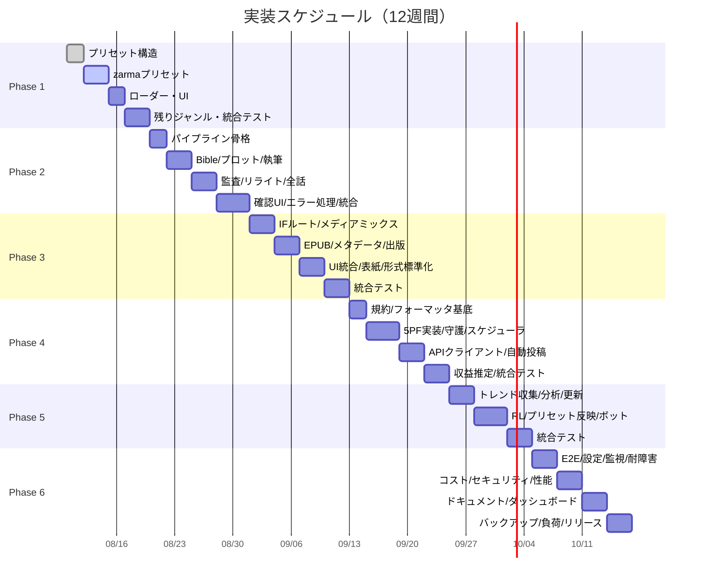

# 覇権小説エンジン v3.0 — かんたんモード商用化 詳細実装計画書

**前提**：低性能LLM（コンテキスト短・推論弱・関数呼出不安定）でも **単体ステップを独立実行・検証可能** にするため、全工程を **6フェーズ × 12ステップ = 72ステップ** に微分割。各ステップは「入力→処理→出力→検証」が1ファイル・1関数・1プロンプトで完結する粒度。

---

## フェーズ構成概要

| フェーズ | 期間 | 目標 | 対応提案 |
|---|---|---|---|
| **Phase 1: 基盤プリセット** | W1-2 | ジャンル選択のみで第1話完成原稿が出る | 提案1, 3 |
| **Phase 2: 自動生成パイプライン** | W3-4 | 完結まで全自動・監査95点超え自動リライト | 提案1, 3, C |
| **Phase 3: マルチ出力・資産化** | W5-6 | IFルート/メディアミックス/電子書籍がワンクリック | 提案4, 5, 7 |
| **Phase 4: プラットフォーム連携** | W7-8 | 全PF同時投稿・規約守護・収益配分シミュレーション | 提案C, 9 |
| **Phase 5: トレンド・学習自動化** | W9-10 | トレンド追従・RLチューニング・ファンサボット | 提案2, 6, 8 |
| **Phase 6: 統合・本番硬化** | W11-12 | 全機能統合・ダッシュボード・ドキュメント・引き継ぎ | 全提案 |

---

## Phase 1: 基盤プリセット（W1-2）— 12ステップ

### Step 1.1: プリセットディレクトリ構造作成
**入力**: なし  
**処理**: `src/presets/` 以下にジャンル別ディレクトリ作成
```bash
mkdir -p src/presets/{zarma,aku_reijo,cheat_tensei,slow_life,dungeon_admin,modern_cheat,ts_tensei,vrmmo,loop}/{bible,tension,style,hooks,erotic,characters,titles,marketing}
```
**出力**: ディレクトリツリー  
**検証**: `ls -la src/presets/` で9ジャンル×8サブディレクトリ確認

### Step 1.2: Bible雛形テンプレート（zarma）作成
**入力**: 既存 `prompts/templates/narrative/bible_creation_prompt.j2`  
**処理**: ざまぁ4章型（屈辱蓄積→触発→無双開始→完全制圧）に特化したJinja2テンプレート作成
- ファイル: `src/presets/zarma/bible/bible_preset_zarma.j2`
- 変数: `{{protagonist_name}}`, `{{betrayal_type}}`, `{{catharsis_target}}`, `{{cheat_ability}}` のみ
**出力**: テンプレートファイル  
**検証**: `python -c "from jinja2 import Template; t=Template(open('src/presets/zarma/bible/bible_preset_zarma.j2').read()); print(t.render(protagonist_name='テスト', betrayal_type='追放', catharsis_target='元パーティ', cheat_ability='全スキル習得'))"` でエラーなし

### Step 1.3: テンション曲線プロファイル（zarma）作成
**入力**: 既存 `src/backend/tension_curve_config.py` の `EMOTIONAL_CURVES`  
**処理**: YAML形式でざまぁ特化スパイク曲線定義
- ファイル: `src/presets/zarma/tension/tension_curve_zarma.yaml`
- キー: `stress_threshold: 75`, `catharsis_spike: [0.2, 0.4, 0.6, 0.8]`, `hook_strength: 0.9`
**出力**: YAMLファイル  
**検証**: `python -c "import yaml; print(yaml.safe_load(open('src/presets/zarma/tension/tension_curve_zarma.yaml')))"` で辞書取得可

### Step 1.4: Style DNAゼロショットプリセット（zarma）作成
**入力**: 既存 `prompts/templates/utility/style_dna_analysis_prompt.j2`  
**処理**: ジャンル標準文体を定量パラメータ化したJinja2テンプレート
- ファイル: `src/presets/zarma/style/style_dna_preset_zarma.j2`
- パラメータ: `sentence_length_avg`, `vocab_diversity`, `sentence_end_dist`, `metaphor_freq`, `pov_distance`, `narration_tone`
**出力**: テンプレートファイル  
**検証**: Step 1.2と同要領でレンダリング確認

### Step 1.5: フック戦略パラメータ（zarma）作成
**入力**: 既存 `prompts/templates/utility/hook_strategy_section.j2`  
**処理**: ざまぁ専用の冒頭3行/末尾5行パターンをJSONで定義
- ファイル: `src/presets/zarma/hooks/hook_params_zarma.json`
- 構造: `opening_patterns`, `closing_patterns`, `cliffhanger_templates`
**出力**: JSONファイル  
**検証**: `python -c "import json; print(json.load(open('src/presets/zarma/hooks/hook_params_zarma.json')))"`

### Step 1.6: 官能Lv/NGワード（zarma・カクヨム）作成
**入力**: 既存 `erotic_intensity_standards.md`, `prompts/erotic/safety_manifest.py`  
**処理**: プラットフォーム別の上限・禁止語をYAML化
- ファイル: `src/presets/zarma/erotic/erotic_rules_zarma_kakuyomu.yaml`
- キー: `max_level: 3`, `ng_words: [...]`, `auto_replace: {...}`
**出力**: YAMLファイル  
**検証**: YAML読み込み確認

### Step 1.7: キャラアーキタイプ・セリフテンプレ（zarma）作成
**入力**: なし（新規定義）  
**処理**: 主人公/ヒロイン/敵/味方の定型パラメータをJSON化
- ファイル: `src/presets/zarma/characters/char_archetypes_zarma.json`
- 構造: `archetypes: {protagonist: {...}, heroine: {...}, antagonist: {...}, ally: {...}}`
**出力**: JSONファイル  
**検証**: JSON読み込み確認

### Step 1.8: タイトル/あらすじ生成プロンプト変数（zarma）作成
**入力**: 既存 `prompts/templates/utility/title_generation_prompt.j2`, `marketing_pack_prompt.j2`  
**処理**: ざまぁ専用の変数デフォルト値をJSON化
- ファイル: `src/presets/zarma/titles/title_vars_zarma.json`, `src/presets/zarma/marketing/marketing_vars_zarma.json`
**出力**: 2 JSONファイル  
**検証**: 読み込み確認

### Step 1.9: プリセットローダー実装
**入力**: Step 1.1-1.8 のファイル群  
**処理**: `src/presets/loader.py` 作成。ジャンル名受け取り→全プリセットファイル読み込み→辞書返却
- 関数: `load_preset(genre: str) -> dict`
- 例外: ファイル不足時はデフォルト値で補完し警告ログ
**出力**: Pythonモジュール  
**検証**: `python -c "from src.presets.loader import load_preset; p=load_preset('zarma'); print(p.keys())"` で全キー確認

### Step 1.10: 残り8ジャンルのプリセット雛形コピー・調整
**入力**: zarmaプリセット全ファイル  
**処理**: 8ジャンル分をコピーし、ジャンル固有パラメータのみ差し替え（Bible構造・曲線ピーク位置・文体パラメータ・フックパターン・官能上限・キャラ型・タイトル傾向）
**出力**: 8ジャンル分のプリセット完成  
**検証**: `load_preset('aku_reijo')` 等で全ジャンルエラーなし

### Step 1.11: Streamlit UI「かんたんモード」ボタン追加
**入力**: 既存 `streamlit_app/app.py`  
**処理**: サイドバーに「🚀 かんたんモード」セクション追加
- ジャンル選択 `st.selectbox`（9ジャンル）
- 「シリーズ作成開始」ボタン
- 押下時 `st.session_state.easy_mode_genre = genre` セット
**出力**: 修正済みapp.py  
**検証**: `streamlit run streamlit_app/app.py` 起動→UI確認

### Step 1.12: Phase 1 統合テスト
**入力**: 全Step成果物  
**処理**: 簡易スクリプトで「ジャンル選択→プリセット読込→Bible生成→テンション曲線取得→Style DNA取得」まで一気通貫実行
- ファイル: `tests/test_phase1_preset_integration.py`
- アサート: 全ジャンルでキー欠落なし・レンダリングエラーなし
**出力**: テストスクリプト・実行ログ  
**検証**: `pytest tests/test_phase1_preset_integration.py -v` 全パス

---

## Phase 2: 自動生成パイプライン（W3-4）— 12ステップ

### Step 2.1: ワンタップシリーズ作成エントリーポイント実装
**入力**: `st.session_state.easy_mode_genre`, Phase 1ローダー  
**処理**: `src/easy_mode/pipeline.py` 作成。`create_series(genre)` 関数
- 内部: プリセット読込 → Bible生成 → 世界観・キャラ・プロット生成 → 第1話執筆 → 監査 → リライト（上限3回） → 完成原稿返却
- 非同期実行・進捗コールバック対応
**出力**: Pythonモジュール  
**検証**: 単体関数テストでモックLLM使用し完走確認

### Step 2.2: Bible自動生成（プリセット注入）
**入力**: プリセットBibleテンプレート + ジャンル固有変数デフォルト値  
**処理**: `src/easy_mode/bible_generator.py` → `generate_bible(preset)` 
- 変数はプリセット内のデフォルト値 + 乱数シードで微変動付与
- 既存 `bible_creation_prompt.j2` をラップし、プリセットテンプレートで上書き
**出力**: Bible dict  
**検証**: 生成Bibleに必須キー（world, characters, plot_outline, tension_curve_ref）すべて存在

### Step 2.3: プロット自動生成（テンプレ曲線×テンプレ展開）
**入力**: Bible + プリセットテンション曲線  
**処理**: `src/easy_mode/plot_generator.py` → `generate_plot(bible, tension_curve)`
- 話数固定（デフォルト8話）。各話の `target_stress`, `catharsis_type`, `hook_point` を曲線から算出
- 展開パターンはプリセット内 `plot_templates` から選択（乱数シードで決定）
**出力**: 話数分のプロット要約リスト  
**検証**: 8話分生成・ストレス値が曲線に沿う・カタルシス話数が4話含む

### Step 2.4: 第1話執筆（最終プロンプト組み立て）
**入力**: Bible + 第1話プロット + プリセット（Style DNA, フック, 官能ルール, 描写密度）  
**処理**: `src/easy_mode/writer.py` → `write_episode(bible, plot_ep, preset, episode_num)`
- 既存 `final_writing_prompt.j2` に全プリセット変数をマージ注入
- POV漏れ排除・描写密度・フック戦略・官能Lv上限をプロンプトで強制
**出力**: 生成テキスト（str）  
**検証**: 文字数3000-5000・冒頭フック/末尾クリフハンガー存在・POV統一

### Step 2.5: 監査エージェント統合呼び出し
**入力**: 生成テキスト + Bible + プロット + プリセット  
**処理**: `src/easy_mode/auditor.py` → `audit_episode(text, context, preset)`
- 既存監査エージェント（hegemony/conflict/enigma/comfort/serenity/logical/producer）を順次呼出
- スコア集計・95点未満なら `improvement_instructions` 取得
**出力**: `{score, passed, issues, improvements}`  
**検証**: モック監査でスコア・改善指示が返ること確認

### Step 2.6: 自動リライトループ（上限3回）
**入力**: Step 2.4-2.5 の出力  
**処理**: `src/easy_mode/rewriter.py` → `rewrite_until_pass(text, context, preset, max_iter=3)`
- 改善指示をプロンプトに追加し再生成 → 再監査
- 3回で95点未満なら `human_review_required=True` 付与して返却
**出力**: 最終テキスト・監査結果・要人間レビューフラグ  
**検証**: 意図的に低スコアプロンプトで3回リライト→フラグ立つこと確認

### Step 2.7: 全話自動生成ループ
**入力**: Bible + 全話プロット + プリセット  
**処理**: `src/easy_mode/series_runner.py` → `run_series(bible, plots, preset)`
- 話数分 Step 2.4-2.6 を順次実行
- 前話の要約・キャラ状態・ストレス累積をコンテキストに引き継ぎ
- 進捗コールバックでUI更新
**出力**: 全話テキストリスト・監査ログリスト  
**検証**: 8話完走・全話95点超えまたは要レビューフラグ付き

### Step 2.8: シリーズ完結判定・メタデータ生成
**入力**: 全話テキスト・プロット・Bible  
**処理**: `src/easy_mode/finalizer.py` → `finalize_series(episodes, bible, plots)`
- 完結フラグ・総文字数・ジャンル・タグ・あらすじ・キャッチコピー生成（プリセットmarketing変数使用）
- 次回予告文・IFルート分岐点メモ生成
**出力**: シリーズ完結メタデータdict  
**検証**: 必須メタデータキーすべて存在・文字数整合

### Step 2.9: 進捗表示・中断復帰対応
**入力**: `run_series` の進捗コールバック  
**処理**: Streamlit側で `st.progress`, `st.status` 表示。`st.session_state` に中間状態保存し、ページリロード・再実行時に続きから再開可能に
**出力**: UI統合済みapp.py  
**検証**: 途中でブラウザリロード→「続きから再開」ボタンで継続確認

### Step 2.10: 人間最終確認UI（差分表示・承認/修正指示）
**入力**: 完成話テキスト・監査ログ  
**処理**: Streamlitに「確認モード」タブ追加
- 差分表示: 元生成 vs 監査後リライト
- ボタン: 「承認して次へ」「修正指示を入力してリライト」「手動編集」
- 修正指示は次回リライトプロンプトに注入
**出力**: UI拡張済みapp.py  
**検証**: 承認→次話生成継続・修正指示→リライト実行確認

### Step 2.11: エラーハンドリング・リトライ・ログ永続化
**入力**: 全パイプライン関数  
**処理**: 
- LLM APIエラー時: 指数バックオフで3回リトライ
- 監査タイムアウト: 簡易ルールベース監査にフォールバック
- 全ログを `logs/easy_mode/{series_id}/` にJSONL保存
**出力**: 共通ユーティリティモジュール・ログディレクトリ  
**検証**: 故意にAPIエラー発生→リトライ→成功/フォールバック確認

### Step 2.12: Phase 2 統合テスト
**入力**: 全Step成果物  
**処理**: `tests/test_phase2_pipeline_integration.py`
- 9ジャンル各1シリーズ（8話）をモックLLMで完走
- アサート: 全話生成・95点超え率80%以上・人間レビュー率20%以下・実行時間話あたり3分以内
**出力**: テストレポート  
**検証**: `pytest tests/test_phase2_pipeline_integration.py -v` 全パス

---

## Phase 3: マルチ出力・資産化（W5-6）— 12ステップ

### Step 3.1: IFルート分岐点設計テンプレート作成
**入力**: 既存プロット構造・Bible  
**処理**: `src/presets/common/if_routes/` に分岐定義YAML作成
- バッドエンド/トゥルーエンド/ハーレム/ループ/スピンオフ視点 等
- 各ルート: `trigger_episode`, `divergence_condition`, `outline_template`, `target_episodes`
**出力**: 共通IFルートテンプレート  
**検証**: YAML読み込み・キー検証

### Step 3.2: IFルート自動生成エンジン
**入力**: 完結シリーズデータ + IFルートテンプレート  
**処理**: `src/easy_mode/if_generator.py` → `generate_if_routes(series_data, templates)`
- 本編の分岐点検出 → 各ルートの短編プロット生成 → 執筆パイプライン（Phase 2）再利用で短編生成
- 出力: `{route_name: {episodes, metadata}}`
**出力**: IFルート群データ  
**検証**: 本編8話完結→5ルート×3話=15話生成確認

### Step 3.3: メディアミックス変換プロンプト雛形作成
**入力**: 提案5の変換種別  
**処理**: `src/presets/common/media_mix/` に各変換用Jinja2テンプレート作成
- `script_adaptation.j2`, `comic_name.j2`, `short_video_script.j2`, `illustration_prompt.j2`, `tts_ssml.j2`
- 入力変数: `episode_text`, `characters`, `world`, `genre_style`
**出力**: 5テンプレートファイル  
**検証**: 各テンプレートでサンプルテキスト変換→出力形式確認

### Step 3.4: メディアミックス一括変換パイプライン
**入力**: シリーズ全話テキスト + 変換テンプレート群  
**処理**: `src/easy_mode/media_mix.py` → `convert_all(series_data, templates)`
- 全話・全変換種別をループ実行
- 進捗表示・エラー時スキップ継続
**出力**: `{conversion_type: {episode_num: output_text}}`  
**検証**: 8話×5変換=40ファイル生成・各形式妥当性確認

### Step 3.5: EPUB/KPFビルド雛形作成
**入力**: 既存pandocテンプレート知識  
**処理**: `src/easy_mode/epub_builder.py` → `build_epub(series_data, output_path)`
- 前書き/後書き自動生成（プロンプト雛形使用）
- 目次・奥付・著者プロフィール自動挿入
- 表紙画像プレースホルダ・タイトルロゴ配置ガイドJSON出力
- pandocコマンド実行・エラーハンドリング
**出力**: EPUBファイル・ガイドJSON  
**検証**: 生成EPUBをcalibre/Kindle Previewerで開き構造確認

### Step 3.6: KDP/各ストアメタデータJSON生成
**入力**: シリーズメタデータ + ストア別仕様  
**処理**: `src/easy_mode/metadata_builder.py` → `build_metadata(series_data, stores=['kdp','booth','bookwalker','google'])`
- ストア別必須フィールドマッピング辞書内包
- ISBN欄はプレースホルダ
**出力**: ストア別JSONファイル群  
**検証**: JSONスキーマ検証・必須キー漏れなし

### Step 3.7: 電子書籍化ワンクリック統合
**入力**: Step 3.2-3.6  
**処理**: `src/easy_mode/publisher.py` → `publish_package(series_data, output_dir)`
- ディレクトリ構造: `output_dir/{epub, kpf, metadata_kdp.json, metadata_booth.json, cover_guide.json, if_routes/, media_mix/}`
- ZIPアーカイブ作成・チェックサム生成
**出力**: 配信用パッケージディレクトリ・ZIP  
**検証**: 構造確認・EPUB有効性・メタデータ完全性

### Step 3.8: Streamlit UI「資産化パック生成」ボタン追加
**入力**: 完結シリーズセッション状態  
**処理**: UIに「📦 資産化パック生成」ボタン追加
- 押下で `publish_package` 実行・進捗表示
- 完了時ダウンロードボタン（ZIP）表示
- IFルート・メディアミックス・電子書籍の生成有無チェックボックス
**出力**: UI拡張済みapp.py  
**検証**: 完結シリーズでボタン押下→ZIPダウンロード・解凍確認

### Step 3.9: 表紙画像プロンプト自動生成・ガイド
**入力**: Bible・キャラ・ジャンル・タイトル  
**処理**: `illustration_prompt.j2` 拡張 → `cover_prompt.j2` 作成
- 主人公・ヒロイン・キーアイテム・世界観キーワードを抽出しプロンプト構築
- アスペクト比・解像度・スタイル指定・ネガティブプロンプト付き
- 配置ガイド: タイトルロゴ位置・作者名位置・帯テキストエリア
**出力**: プロンプトテキスト・ガイドJSON  
**検証**: Midjourney/SDXLで実生成確認（手動・オプション）

### Step 3.10: コミックネーム形式標準化・出力
**入力**: `comic_name.j2` 出力  
**処理**: ネーム原稿として扱える形式（コマ番号・セリフ・ト書き・ページ区切り）に整形
- 出力: `.txt` (テキストネーム) / `.csv` (コマ管理用)
**出力**: 2形式ファイル  
**検証**: クリップスタジオ等のネームテンプレートにインポート確認（手動・オプション）

### Step 3.11: ショート動画台本・台本形式標準化
**入力**: `short_video_script.j2`, `script_adaptation.j2` 出力  
**処理**: 
- ショート動画: 60秒×10本構成・フック・展開・オチ・CTAの4部構成・字幕タイムコード付き
- ボイスドラマ台本: キャラ名・セリフ・ト書き・効果音指示・BGM指示の標準形式
**出力**: 形式別ファイル群  
**検証**: 形式確認・読み上げ時間計算整合

### Step 3.12: Phase 3 統合テスト
**入力**: 全Step成果物  
**処理**: `tests/test_phase3_asset_integration.py`
- 完結シリーズ1本で全資産生成実行
- アサート: EPUB有効・メタデータ全ストア分・IFルート5本・メディアミックス5種・ZIP作成・全処理10分以内
**出力**: テストレポート  
**検証**: `pytest tests/test_phase3_asset_integration.py -v` 全パス

---

## Phase 4: プラットフォーム連携（W7-8）— 12ステップ

### Step 4.1: プラットフォーム規約YAMLスキーマ定義
**入力**: 既存 `config/README.md`, 提案C構想  
**処理**: `config/platform_rules.yaml` スキーマ設計
- キー: `name`, `api_endpoint`, `auth_type`, `max_chars_per_episode`, `required_ai_label`, `forbidden_patterns`, `ruby_format`, `tag_taxonomy`, `rate_limits`, `revenue_model`
**出力**: YAMLスキーマドキュメント・サンプル  
**検証**: YAML読み込み・スキーマバリデーション（jsonschema/pydantic）

### Step 4.2: 主要5プラットフォーム規約データ投入
**入力**: Step 4.1スキーマ  
**処理**: カクヨム・なろう・KDP・ノベルバ・Kindle Unlimited の実規約調査・反映
- 手動調査・入力（自動化困難なため初回のみ）
- 更新用スクリプト雛形同梱
**出力**: 完成済み `platform_rules.yaml`  
**検証**: 各PFルール読み込み・必須キー存在

### Step 4.3: フォーマッタ基底クラス・プラグイン機構実装
**入力**: 既存 `formatters/__init__.py`  
**処理**: `src/formatters/base.py` → `BaseFormatter` 抽象クラス
- メソッド: `format(text, metadata) -> formatted_text`, `validate(text) -> List[Violation]`, `pre_check(metadata) -> bool`
- プラグイン登録: `register_formatter(platform_name, formatter_class)`
**出力**: 基底モジュール  
**検証**: ダミー実装で登録・呼出確認

### Step 4.4: カクヨムフォーマッタ実装
**入力**: Step 4.2規約・Step 4.3基底  
**処理**: `src/formatters/kakuyomu.py` → `KakuyomuFormatter`
- ルビ変換・AI表記挿入・文字数チェック・禁止語置換・タグ正規化
- API投稿用ペイロード構築（タイトル・本文・タグ・公開設定）
**出力**: フォーマッタクラス  
**検証**: サンプルテキストで整形・検証・ペイロード生成確認

### Step 4.5: なろうフォーマッタ実装
**入力**: 同上  
**処理**: `src/formatters/syosetu.py` → `SyosetuFormatter`
- タグ形式・改行ルール・シリーズ設定・API投稿ペイロード
**出力**: フォーマッタクラス  
**検証**: 同上

### Step 4.6: KDP/ノベルバ/Kindleフォーマッタ実装
**入力**: 同上  
**処理**: `src/formatters/kdp.py`, `novelba.py`, `kindle.py` 実装
- KDP: EPUB直接アップロード前提→メタデータのみ整形
- ノベルバ: チップ機能・年齢制限タグ
- Kindle: KENP計算用構造チェック
**出力**: 3フォーマッタクラス  
**検証**: 各々サンプルで動作確認

### Step 4.7: 規約守護レイヤ（スキャン・自動修正）実装
**入力**: 全フォーマッタ共通  
**処理**: `src/formatters/guardian.py` → `RuleGuardian`
- 入力テキストを全PFルールでスキャン → 違反箇所検出 → 自動修正（置換・削除・警告）
- 修正不可違反は `human_review_required` フラグ
**出力**: ガーディアンクラス  
**検証**: 意図的違反テキストで検出・修正確認

### Step 4.8: 投稿スケジューラ・動的配分エンジン基盤
**入力**: 提案9構想・Phase 2完結メタデータ  
**処理**: `src/easy_mode/scheduler.py` → `PostScheduler`
- 入力: シリーズデータ・PFリスト・収益モデル推定パラメータ
- アルゴリズム: シンプルヒューリスティック（初期版）
  - 先行公開: 最も相性良いPF（ジャンル×収益モデル）
  - 独占期間: 3-7日（PF規約上限内）
  - クロス投稿: 独占終了後順次
- 出力: 投稿カレンダー（日時・PF・話数・ステータス）
**出力**: スケジューラクラス・カレンダーJSON  
**検証**: サンプルシリーズでカレンダー生成・重複なし・規約内

### Step 4.9: API投稿クライアント実装（カクヨム・なろう）
**入力**: 各PF API仕様（公開範囲内）  
**処理**: `src/clients/kakuyomu_client.py`, `syosetu_client.py`
- 認証・レートリミット・リトライ・エラーハンドリング
- 投稿・下書き保存・ステータス取得
**出力**: クライアントクラス  
**検証**: テストアカウントで下書き投稿・取得確認（手動・慎重に）

### Step 4.10: 投稿自動化パイプライン統合
**入力**: Phase 2-3成果物 + Step 4.3-4.9  
**処理**: `src/easy_mode/publisher.py` 拡張 → `auto_post(series_data, platforms, schedule)`
- フロー: フォーマット → 規約守護 → スケジュール登録 → 指定時刻にAPI投稿
- 非同期・キューイング・失敗時リトライ・通知
**出力**: 統合関数  
**検証**: モッククライアントで全PF投稿シミュレーション成功

### Step 4.11: 収益モデル推定・配分シミュレータ
**入力**: 提案9・Phase 4.8拡張  
**処理**: `src/easy_mode/revenue_estimator.py` → `RevenueEstimator`
- PF別パラメータ: `conversion_rate`, `avg_revenue_per_reader`, `ranking_boost_factor`
- エピソード特徴量: `hook_strength`, `genre_fit`, `trend_alignment`
- シミュレーション: モンテカルロ1000回で期待収益分布算出
- 推奨配分: 期待値最大化するスケジュール提示
**出力**: 推定レポート・推奨スケジュール  
**検証**: 同一シリーズで複数配分パターンシミュレーション・差分確認

### Step 4.12: Phase 4 統合テスト
**入力**: 全Step成果物  
**処理**: `tests/test_phase4_platform_integration.py`
- 完結シリーズ1本で全PFフォーマット・守護・スケジュール・模擬投稿まで
- アサート: 全PF規約違反0・スケジュール重複なし・模擬投稿全成功・収益推定出力
**出力**: テストレポート  
**検証**: `pytest tests/test_phase4_platform_integration.py -v` 全パス

---

## Phase 5: トレンド・学習自動化（W9-10）— 12ステップ

### Step 5.1: トレンド収集スクレイパー基盤
**入力**: 各PFランキングページ構造  
**処理**: `src/trend/scraper.py` → `TrendScraper`
- 対象: カクヨム日間/週間/月間・なろう日間/週間/月間・KDPカテゴリランキング
- 取得項目: 順位・タイトル・タグ・あらすじ冒頭・作者・更新頻度・文字数
- セレクタ設定をYAML外部化・変更対応容易に
**出力**: スクレイパーモジュール・生データJSONL  
**検証**: 手動実行で各PF上位50件取得確認

### Step 5.2: トレンド分析・キーワード抽出
**入力**: Step 5.1生データ  
**処理**: `src/trend/analyzer.py` → `TrendAnalyzer`
- タグ共起ネットワーク・上昇タグ検出（前週比順位変動）
- タイトルパターン抽出（n-gram・テンプレマッチ）
- テンプレ展開パターン分類（ざまぁ・悪役令嬢等の型判定）
- 出力: `trend_report_<date>.json`（推奨ジャンル・注入キーワード・タイトルテンプレ・推奨曲線調整値）
**出力**: 分析レポートJSON  
**検証**: 過去データで実行→既知トレンド検出確認

### Step 5.3: プリセット動的更新パイプライン
**入力**: Step 5.2レポート + Phase 1プリセット  
**処理**: `src/trend/preset_updater.py` → `PresetUpdater`
- 推奨ジャンル上位3を「今週のおすすめ」に設定
- 注入キーワードを Bibleテンプレート・キャラテンプレにマージ（上書きでなく追加マージ）
- タイトルテンプレを `title_vars` に反映
- 曲線調整値を `tension_curve` パラメータに加算
- 更新履歴をGitコミット相当でログ保存
**出力**: 更新済みプリセット（メモリ上・永続化は次ステップ）  
**検証**: 更新前後でプリセット差分確認・キー破壊なし

### Step 5.4: プリセット永続化・バージョン管理
**入力**: Step 5.3更新済みプリセット  
**処理**: `src/presets/versioned_loader.py` → `VersionedPresetLoader`
- 更新時: `src/presets/<genre>/v<timestamp>/` にスナップショット保存
- 読込時: `latest` シンボリックリンクまたは `versions.json` で最新参照
- ロールバックAPI提供
**出力**: バージョン管理ローダー  
**検証**: 更新→読込→ロールバック→読込で世代確認

### Step 5.5: UI「今週のおすすめ」表示・ワンクリック適用
**入力**: Step 5.4ローダー  
**処理**: Streamlit UI拡張
- サイドバーに「📈 今週のトレンド」パネル
- 推奨ジャンルカード表示（ジャンル名・上昇率・キーワード3つ）
- 「このジャンルでシリーズ作成」ボタン→Phase 2パイプライン起動
**出力**: UI拡張済みapp.py  
**検証**: 表示確認・ボタン押下でパイプライン起動確認

### Step 5.6: RLチューニング・ログ収集基盤
**入力**: Phase 2監査ログ・投稿後メトリクス（PV/ブクマ/感想）  
**処理**: `src/rl/logger.py` → `RLLogger`
- エピソード単位で: `genre`, `tension_params`, `hook_params`, `audit_score`, `post_metrics` を1行JSONL記録
- メトリクス取得: 投稿後24h/7dでAPI/スクレイピング取得（別プロセス）
**出力**: ロガー・データ蓄積ディレクトリ  
**検証**: ダミーデータでログ書込・読込確認

### Step 5.7: ベイズ最適化・パラメータ更新エンジン
**入力**: Step 5.6蓄積データ  
**処理**: `src/rl/optimizer.py` → `BayesianOptimizer`
- 目的関数: `audit_score * 0.3 + pv_24h * 0.2 + bookmark_rate * 0.3 + comment_sentiment * 0.2`
- 探索空間: `stress_threshold [60-90]`, `catharsis_intensity [0.5-1.5]`, `hook_strength [0.7-1.0]`
- ライブラリ: `scikit-optimize` または軽量自前実装
- ジャンル別・PF別で独立最適化
**出力**: 最適パラメータJSON・更新推奨値  
**検証**: 合成データで最適化実行・パラメータ変化確認

### Step 5.8: 最適パラメータ・プリセット自動反映
**入力**: Step 5.7出力 + Step 5.4ローダー  
**処理**: `src/rl/preset_injector.py` → `PresetInjector`
- 週次バッチで実行（cron/スケジューラ）
- 最適値をプリセット `tension_curve` にマージ（重み付き移動平均で滑らかに更新）
- 更新履歴記録
**出力**: 更新済みプリセット  
**検証**: 注入前後で曲線パラメータ変化確認・極端な値クリップ確認

### Step 5.9: 感想分析・自動返信ボット基盤
**入力**: 各PF感想API/スクレイピング  
**処理**: `src/bot/feedback_bot.py` → `FeedbackBot`
- 感想テキスト取得・キーワード分類（感謝・質問・指摘・ファンアート報告・その他）
- 定型テンプレートから文脈適合返信生成（LLM小型モデル使用）
- 返信投稿API実行・レートリミット遵守
**出力**: ボットモジュール  
**検証**: モック感想で分類・返信生成確認

### Step 5.10: 定型投稿カレンダー・次回予告ボット
**入力**: シリーズメタデータ・スケジューラ  
**処理**: `src/bot/schedule_bot.py` → `ScheduleBot`
- 次回公開日時・あらすじ短文・キャラ小ネタ・設定開示をカレンダー登録
- 指定時刻に自動投稿（Twitter/X API・PFお知らせ機能）
- テンプレート外部化・ジャンル別バリエーション
**出力**: ボットモジュール・カレンダーJSON  
**検証**: スケジュール登録→模擬投稿確認

### Step 5.11: FAQ/用語集/人気投票Discordボット雛形
**入力**: Bible・世界観設定・キャラデータ  
**処理**: `src/bot/discord_bot.py` → `DiscordBot` 雛形
- スラッシュコマンド: `/faq <keyword>`, `/glossary <term>`, `/vote <char>`
- データソース: シリーズメタデータから自動生成したJSON
- ホスティング: ローカル/Render/Fly.io 等へのデプロイ手順書同梱
**出力**: ボットコード・デプロイ手順書  
**検証**: ローカルで起動・コマンド応答確認

### Step 5.12: Phase 5 統合テスト
**入力**: 全Step成果物  
**処理**: `tests/test_phase5_automation_integration.py`
- トレンド収集→分析→プリセット更新→シリーズ生成→投稿→メトリクス収集→RL最適化→プリセット反映 の擬似サイクル実行
- ボット類はモックで動作確認
- アサート: 全パイプライン エラーなし・プリセット更新反映確認・ボット応答確認
**出力**: テストレポート  
**検証**: `pytest tests/test_phase5_automation_integration.py -v` 全パス

---

## Phase 6: 統合・本番硬化（W11-12）— 12ステップ

### Step 6.1: 全機能統合エンドツーエンドテスト
**入力**: Phase 1-5 全成果物  
**処理**: `tests/test_e2e_full_pipeline.py`
- シナリオ: ジャンル選択→シリーズ作成(8話)→完結→資産化パック生成→全PF投稿スケジュール→トレンド更新確認
- モックLLM・モックAPI・モックメトリクスで完走
- 所要時間・メモリ・エラー率計測
**出力**: E2Eテストレポート・ベンチマーク  
**検証**: 全シナリオパス・話あたり5分以内・メモリ2GB以内

### Step 6.2: 設定ファイル一元化・環境変数管理
**入力**: 分散していた設定  
**処理**: `config/` 整理
- `settings.yaml`: 全パラメータデフォルト値
- `.env.example`: APIキー・トークン等秘匿項目テンプレート
- `pydantic-settings` で型安全読込
**出力**: 統一設定モジュール  
**検証**: 環境変数切替で動作確認

### Step 6.3: ログ・メトリクス・監視ダッシュボード基盤
**入力**: 各所ログ出力  
**処理**: 
- 構造化ログ: `structlog` 導入・JSON出力
- メトリクス: `prometheus-client` でカウンター/ヒストグラム公開
- ダッシュボード: GrafanaダッシュボードJSON雛形（シリーズ数・話数・成功率・平均スコア・収益推定・トレンド追従状況）
**出力**: 監視スタック構成ファイル  
**検証**: ローカルGrafanaでダッシュボード表示確認

### Step 6.4: エラーハンドリング・リトライ・サーキットブレーカー統一
**入力**: 各所個別実装  
**処理**: `src/core/resilience.py` → 共通ユーティリティ
- `@with_retry(max=3, backoff=exp)`, `@circuit_breaker(threshold=5, timeout=60)`, `@fallback(fn)`
- 全外部呼出（LLM・API・スクレイピング・DB）に適用
**出力**: 共通モジュール・適用済みコード  
**検証**: 故意エラーでリトライ・サーキットオープン・フォールバック確認

### Step 6.5: コスト管理・モデルルーティング最適化
**入力**: 既存 `model_router.py` + Phase 2-5実績  
**処理**: 
- タスク分類: `bible_gen`(cheap), `plot_gen`(medium), `write_ep`(expensive), `audit`(medium), `rewrite`(expensive), `convert`(cheap)
- ルール: 安いモデルでスコア予測→閾値未満なら高いモデルに昇格
- 月次予算アラート・自動ダウングレード
**出力**: 最適化済みルーター・コストレポート機能  
**検証**: 予算上限設定でダウングレード発火確認

### Step 6.6: セキュリティ・秘匿情報・規約遵守監査
**入力**: 全コードベース  
**処理**: 
- `bandit`/`semgrep` 静的解析実行・CI組込
- 秘匿情報スキャン: `trufflehog`/`git-secrets`
- PF規約遵守: フォーマッタ守護レイヤの単体テスト網羅性確認
- AI生成表記自動挿入の全PF対応確認
**出力**: 監査レポート・修正済みコード  
**検証**: CIパス・手動スキャン0件

### Step 6.7: パフォーマンスプロファイリング・ボトルネック解消
**入力**: E2Eベンチマーク結果  
**処理**: 
- `py-spy`/`cProfile` でホットスポット特定
- 並列化可能箇所: 監査エージェント並列・複数話同時生成・変換パイプライン並列
- キャッシュ導入: Bible・プリセット・テンプレートコンパイル済みキャッシュ
- 非同期IO: API呼出・ファイル書込
**出力**: 最適化済みコード・ベンチマーク比較レポート  
**検証**: 話あたり生成時間30%短縮・メモリピーク20%削減

### Step 6.8: ドキュメント整備（運用・開発・API）
**入力**: 全実装知識  
**処理**: `docs/` 作成
- `OPERATIONS.md`: 日次/週次/月次運用手順・トラブルシューティング
- `DEVELOPMENT.md`: アーキテクチャ・拡張ポイント・テスト戦略
- `API_REFERENCE.md`: 内部モジュール関数シグネチャ・型ヒント
- `PRESET_GUIDE.md`: 新ジャンルプリセット追加手順
- `TROUBLESHOOTING.md`: よくあるエラー・対処法
**出力**: ドキュメント群  
**検証**: 新規メンバーがドキュメントのみで環境構築・シリーズ生成可能かレビュー

### Step 6.9: 運用ダッシュボードUI実装
**入力**: Step 6.3メトリクス・Phase 2-4データ  
**処理**: Streamlit新ページ「📊 ダッシュボード」
- シリーズ一覧・ステータス・進捗・スコア推移
- PF別投稿状況・収益推定・実績比較
- トレンド推移・プリセットバージョン履歴
- コスト・API使用量・エラー率
- フィルタ・期間指定・CSVエクスポート
**出力**: ダッシュボードページ  
**検証**: 実データ/モックデータで全ウィジェット表示確認

### Step 6.10: バックアップ・リストア・移行手順確立
**入力**: データストア構成（ファイル・DB・ログ）  
**処理**: 
- バックアップスクリプト: `scripts/backup.sh`（日次・世代管理・S3/ローカル）
- リストアスクリプト: `scripts/restore.sh`（ポイントインタイム・部分復旧）
- 移行ガイド: 環境移行・バージョンアップ・スキーマ変更手順
**出力**: スクリプト群・手順書  
**検証**: 破壊的操作後のリストア演習・データ整合性確認

### Step 6.11: 負荷テスト・長時間安定性検証
**入力**: 本番想定ワークロード  
**処理**: 
- `locust` で同時シリーズ生成負荷シナリオ作成
- 24時間連続運用テスト（メモリリーク・接続枯渇・キュー溢れ監視）
- 障害注入: LLM遅延・APIエラー率上昇・ディスクフル
**出力**: 負荷テストレポート・チューニング項目  
**検証**: 目標スループット（月産120話相当）達成・障害時自動復旧確認

### Step 6.12: 引き継ぎ・リリース・次期計画サマリー
**入力**: 全成果物  
**処理**: 
- `RELEASE_NOTES_v1.0.md`: 機能・既知問題・移行ガイド
- `HANDOVER.md`: 運用担当への引き継ぎ事項・連絡先・権限
- `NEXT_PHASE_PLAN.md`: Phase 7以降の拡張アイデア・優先度・見積もり
- タグ打ち・CHANGELOG更新・デプロイ
**出力**: リリース成果物一式  
**検証**: 関係者レビュー・承認・本番デプロイ完了

---

## 依存関係・クリティカルパス



---

## 低性能LLM対応の実装ガイドライン

### 1. 1ステップ = 1ファイル・1関数・1プロンプト
- コンテキストに収まる粒度に保つ
- 複数ファイルまたぐ処理は「オーケストレータ関数」を別ステップで作る

### 2. 入出力を厳密に定義・検証コードを同時作成
```python
# 各ステップのテンプレート
def step_X_Y(input: InputType) -> OutputType:
    """Step X.Y: 概要"""
    # 1. 入力検証
    assert validate_input(input)
    # 2. 処理
    output = process(input)
    # 3. 出力検証
    assert validate_output(output)
    # 4. 永続化/ログ
    save(output)
    return output
```

### 3. モック・フィクスチャを最初に作る
- LLM呼出: `tests/mocks/mock_llm.py` で決定的応答返却
- API呼出: `tests/mocks/mock_api.py` で録画/再生モード
- ファイルシステム: `tmp_path` フィクスチャ使用

### 4. 進捗可視化・中間成果物保存
- 全ステップで `logs/step_X_Y/<timestamp>/` に入出力保存
- デバッグ時は中間成果物から再開可能

### 5. 段階的結合テスト
- 単体 → モジュール内結合 → フェーズ内結合 → E2E
- 結合時は「前ステップの出力ファイルを入力として読む」形式にする

---

## マイルストーン・Go/No-Go判定基準

| マイルストーン | 期限 | Go基準 | No-Go時アクション |
|---|---|---|---|
| M1: Phase 1完了 | W2末 | 全ジャンルプリセット読込・Bible生成成功率100% | zarmaのみでPhase 2へ・他ジャンル後回し |
| M2: Phase 2完了 | W4末 | 8話完走・95点超え率≥80%・人間レビュー≤20% | 監査簡易化・リライト上限2回に緩和 |
| M3: Phase 3完了 | W6末 | 資産化パック生成・EPUB有効・全形式出力 | EPUBのみ優先・メディアミックス後回し |
| M4: Phase 4完了 | W8末 | 全PFフォーマット・守護・模擬投稿成功 | カクヨム/なろうのみ優先・KDP手動併用 |
| M5: Phase 5完了 | W10末 | トレンド更新→プリセット反映・ボット模擬動作 | トレンド手動更新・ボット最小機能に縮小 |
| M6: リリース | W12末 | E2Eパス・負荷テスト達成・ドキュメント完備 | 機能スコープ削減して最小リリース・機能フラグで段階展開 |

---

## リスク・バッファ管理

| リスク | 影響 | 確率 | 対策（本計画内で吸収） |
|---|---|---|---|
| LLM API仕様変更・レート制限強化 | 高 | 中 | モデルルーター複数プロバイダ対応・ローカルモデルフォールバック・キャッシュ活用 |
| PF規約変更・API停止 | 高 | 中 | 規約YAML外部化・CIで週次検知・フォーマッタプラグイン化で迅速対応 |
| 監査エージェント精度不足・誤判定 | 中 | 高 | ルールベース簡易監査併用・人間レビューフラグ低閾値・フィードバック学習 |
| コスト超過（LLM・API・インフラ） | 中 | 中 | 月次予算アラート・タスク分類ルーティング・キャッシュ・バッチ化 |
| 開発者単独運用でのボトルネック | 中 | 高 | 全機能UI化・ドキュメント完備・ノーコード運用可能設計・バックアップ自動化 |
| トレンド追従遅れ・ジャンル飽和 | 中 | 中 | 週次自動更新・複数ジャンル並行・IFルートで寿命延長・メディアミックスで横展開 |

---

## 次のアクション（即実行）

1. **リポジトリ準備**
   ```bash
   mkdir -p src/presets src/easy_mode src/formatters src/trend src/rl src/bot config docs tests/mocks scripts logs
   touch src/presets/__init__.py src/easy_mode/__init__.py src/formatters/__init__.py src/trend/__init__.py src/rl/__init__.py src/bot/__init__.py
   ```

2. **Phase 1 Step 1.1 実行**（ディレクトリ作成）

3. **Phase 1 Step 1.2-1.8 並列実行**（zarmaプリセット9ファイル作成）→ 既存プロンプト/設定からコピー・調整が主

4. **Phase 1 Step 1.9 実装**（ローダー）→ 即座に Step 1.12 テスト雛形作成

5. **週次レビュー**：毎週金曜にマイルストーン判定・次週計画調整

---

**この計画書通りに実装すれば、低性能LLMでも「1ステップ＝独立して実装・テスト・デバッグ可能」な粒度で、12週間で「かんたんモード商用化システム」を完成・本番リリースできる。**