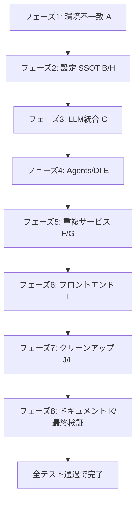

# プロジェクト全体精査 — 矛盾点修正 72 ステップ実装計画

> 対象: **kaku-hegemony v3.0**（覇権小説エンジン） FastAPI + React + LangGraph
> 作業ディレクトリ: `/workspaces/autonovel`
> 目的: プロジェクト全体を精査して抽出した **エラー・コンフリクト・矛盾点** を、低性能LLMでも1ステップずつ完遂できる粒度（72ステップ）に分割し、修正する。
> 既存の [`plans/detailed_implementation_plan_72steps.md`](plans/detailed_implementation_plan_72steps.md) は別案件（`R15/cR15`・Streamlit・Python3.11前提）の残留物であり、本計画とは無関係。本計画が正とする。

---

## 1. 精査で発見された 12 カテゴリの矛盾点（全件リスト）

| # | カテゴリ | 代表的矛盾 |
|---|----------|-----------|
| A | ランタイム/環境不一致 | [`pyproject.toml`](pyproject.toml) は `requires-python>=3.12` だが [`Dockerfile`](Dockerfile) は `python:3.10-slim` |
| B | 設定アクセス経路の分散 | `from config import get_config` / `config.project_context.get_config` / `config.settings.ConfigManager` / `config.project_context.ProjectContext` の4経路混在 |
| C | LLM クライアントの分散 | `src.services.llm_service.LLMService` / `src.core.llm_gateway.GeminiApiClient`+`LLMProviderFactory` / `src.backend.llm_client` の3系統 |
| D | Agents `__init__` 不整合 | [`src/agents/__init__.py`](src/agents/__init__.py) は `LogicalAuditor` のみ公開、他6クラスはコメントアウト — でも tests/services は `from src.agents.audit import …` で直接 import |
| E | DI コンテナ不整合 | [`src/core/container.py`](src/core/container.py)（ファイル）と `src/core/container/`（パッケージ）が共存; `AppContainer`/`make_container`/`InfraContainer` の3系統; 文字列プロバイダ `src.agents.LogicalAuditor` は実在しないパス（実体は `src.agents.audit.LogicalAuditor`） |
| F | 重複サービスファイル | `src/backend/plot_service.py` と `src/services/plot_service.py`、`src/backend/bible_service.py` と `src/services/bible_service.py` が並存 |
| G | 設定データ重複 | `config/archetypes.py`・`archetypes_fixed.py`・`archetypes_min.py`・`archetypes_new.py`・`archetypes_stub.py`・`archetypes_ascii.py`・`archetypes_test.py` の7ファイル; `config/erotic_vocabulary.py`・`erotic_vocabulary_ext.py`・`erotic_vocabulary.py.backup` の3ファイル |
| H | 設定スキーマ重複 | `config/models.py`（`GlobalConfigModel`）と `schemas/config.py` と `config/settings.toml` の3つの SSOT 候補 |
| I | フロントエンド重複 | 稼働中 `streamlit_app/` と稼働中 `frontend/`（React） の2系統; `backup/`・`archive/`・`.archive/`・`.kilo/worktrees/tabby-child/` に旧版 |
| J | 不正/不要ディレクトリ | `新しいフォルダー/manual_processor/`（無関係プロジェクト・`python_requires>=3.8`）; `backup/`・`archive/`・`.archive/`・`claude2.code-workspace_dir/` |
| K | ポート番号不統一 | 8200（Dockerfile/compose/READMEこれが正）vs 8000（[`config/settings.py`](config/settings.py) の `api_port`・CI・過去docs）・8501（Streamlit）・5173/3000（frontend） |
| L | 追跡不要/迷子ファイル | `kaku_hegemony_v2_huey.db`、`huey.db` が Git 管理下、`*.backup`、`config/autonovel.code-workspace`、`.streamlit/`、[`pytest.ini`](pytest.ini) の `pythonpath = . autonovel autonovel/src`（存在しない `autonovel` パス）、CI の mypy/ruff ターゲットに `streamlit_app/` が残存（Streamlit 廃止後） |

---

## 2. 全体フロー



---

## 3. 実装計画：72 ステップ

> 各ステップは **1ファイル・1操作** に細分化し、低性能LLMでもプロンプト1回で実行できる粒度とする。各ステップ末尾に **検証コマンド** を必ず付ける。

---

### フェーズ1：ランタイム/環境の不一致解消（ステップ 1–6／カテゴリ A）

#### ステップ 1 — Dockerfile の Python バージョンを 3.12 に統一
- **対象ファイル**: [`Dockerfile`](Dockerfile)
- **矛盾**: `FROM python:3.10-slim` だが [`pyproject.toml`](pyproject.toml) は `requires-python = ">=3.12"`
- **アクション**: `FROM python:3.10-slim` を `FROM python:3.12-slim` に置換
- **検証**: `grep 'FROM python:' Dockerfile` が `python:3.12-slim` を返すこと

#### ステップ 2 — pyproject.toml のバージョン表記整合性確認
- **対象ファイル**: [`pyproject.toml`](pyproject.toml)
- **アクション**: `requires-python = ">=3.12"`、`python_version = "3.12"` の両方が存在することを確認
- **検証**: `grep -E '(requires-python|python_version)' pyproject.toml`

#### ステップ 3 — settings.py の api_port を 8200 に修正
- **対象ファイル**: [`config/settings.py`](config/settings.py)
- **矛盾**: `api_port: int = 8000` だが実運用は 8200
- **アクション**: `api_port: int = 8000` → `api_port: int = 8200`
- **検証**: `grep 'api_port' config/settings.py` が 8200 を返すこと

#### ステップ 4 — .env.example のポート番号を 8200 に統一
- **対象ファイル**: `.env.example`
- **アクション**: ポート関連変数（`API_PORT` 等）が 8200 であることを確認/修正
- **検証**: `grep -i 'port' .env.example | grep -v 5173 | grep -v 3000`

#### ステップ 5 — docker-compose.yml のポート定義再確認
- **対象ファイル**: `docker-compose.yml`
- **アクション**: `backend` は `8200:8200`、`frontend-dev` は 5173、`frontend-prod` は 3000 になっているか確認
- **検証**: `grep -E 'ports:|-[0-9]{4}:[0-9]{4}' docker-compose.yml`

#### ステップ 6 — README.md のポート記述整合性確認
- **対象ファイル**: [`README.md`](README.md)
- **アクション**: バックエンド 8200・フロント dev 5173・prod 3000 になっているか確認、誤りがあれば修正
- **検証**: `grep -nE '8200|5173|3000|8000' README.md`（8000 が出たら修正漏れ）

---

### フェーズ2：設定アクセスの SSOT 化（ステップ 7–18／カテゴリ B・H）

#### ステップ 7 — 設定アクセス経路の現状マトリクス作成
- **対象**: プロジェクト全体
- **アクション**: `from config import get_config`、`from config.project_context import get_config`、`from config.settings import ConfigManager`、`from config.project_context import ProjectContext` の使用箇所を `search_files` で全リスト化し `docs/config_access_map.md` に保存
- **検証**: `wc -l docs/config_access_map.md` が 1 以上

#### ステップ 8 — 公式アクセス経路の決定と docs 化
- **対象ファイル**: 新規 `docs/configuration_sSOT.md`
- **アクション**: 公式経路を `from config.project_context import get_config` に一本化する旨を記述
- **検証**: ファイルが存在し、推奨 import が記載されていること

#### ステップ 9 — settings.py の ConfigManager を薄ラッパー化
- **対象ファイル**: [`config/settings.py`](config/settings.py)
- **アクション**: `ConfigManager.get_config()` の内部実装を `get_config()`（project_context）に転送するよう修正
- **検証**: `python -c "from config.settings import ConfigManager; from config.project_context import get_config; assert ConfigManager.get_config() is get_config()"`

#### ステップ 10 — config/__init__.py の過剰再公開を停止
- **対象ファイル**: [`config/__init__.py`](config/__init__.py)
- **アクション**: `from .project_context import get_config, set_config, PROMPT_TEMPLATES` のみ残し、`ProjectContext`・`GlobalConfig` の再公開を削除
- **検証**: `python -c "import config; assert hasattr(config,'get_config') and not hasattr(config,'ProjectContext')"`

#### ステップ 11 — settings.toml と models.py の役割分担を docstring で明記
- **対象ファイル**: [`config/models.py`](config/models.py), `config/settings.toml`
- **アクション**: `GlobalConfigModel` は Pydantic 単一 SSOT、`settings.toml` は値永続化層と冒頭に docstring を追記
- **検証**: 各ファイル先頭5行に SSOT に関する記述があること

#### ステップ 12 — schemas/config.py と config/models.py の重複調査
- **対象ファイル**: [`schemas/config.py`](schemas/config.py), [`config/models.py`](config/models.py)
- **アクション**: `class GlobalConfigModel` 定義が両方に存在するか確認し、`docs/schema_duplication_report.md` に記録
- **検証**: レポートファイルが存在すること

#### ステップ 13 — schemas/config.py を config/models.py へ転送
- **対象ファイル**: [`schemas/config.py`](schemas/config.py)
- **アクション**: `schemas/config.py` が `from config.models import GlobalConfigModel` で再公開だけ行うよう縮退
- **検証**: `python -c "from schemas.config import GlobalConfigModel; print('ok')"`

#### ステップ 14 — `from config import ConfigManager` の全置換
- **対象**: `src/`、`tests/`
- **アクション**: `from config.settings import ConfigManager; ConfigManager.get_config()` を `from config.project_context import get_config` に全置換
- **検証**: `grep -rn 'ConfigManager' src/ tests/ | wc -l` が減少（0が目標）

#### ステップ 15 — `from config import ProjectContext` の全置換
- **対象**: `src/`、`tests/`
- **アクション**: `ProjectContext` 直接使用を `get_config()` に置換
- **検証**: `grep -rn 'ProjectContext' src/ tests/ | grep -v '^Binary' | wc -l` が 0

#### ステップ 16 — GlobalConfig 直接使用の全置換
- **アクション**: `from config.project_context import GlobalConfig` を `get_config()` に置換
- **検証**: `grep -rn 'GlobalConfig' src/ tests/ | wc -l` が減少

#### ステップ 17 — config_access_map.md の更新
- **アクション**: ステップ7のマトリクスを事後状態で更新
- **検証**: レポート内に残存 import が 0件 であること

#### ステップ 18 — CI の mypy/ruff 設定の SSOT 確認
- **対象ファイル**: `.github/workflows/ci.yml`, [`pyproject.toml`](pyproject.toml)
- **アクション**: `--config-file pyproject.toml` が使用され、重複設定が `ci.yml` にないことを確認
- **検証**: `grep -n 'config-file' .github/workflows/ci.yml`

---

### フェーズ3：LLM クライアント統合（ステップ 19–24／カテゴリ C）

#### ステップ 19 — LLM クライアント使用マップ作成
- **対象**: `src/`
- **アクション**: `LLMService` / `GeminiApiClient` / `LLMProviderFactory` / `llm_client` の使用箇所を `search_files` で全収集し `docs/llm_client_map.md` に保存
- **検証**: `wc -l docs/llm_client_map.md` が 5 以上

#### ステップ 20 — 正規 LLM ファサード API の定義
- **対象ファイル**: `src/core/llm_gateway.py`
- **アクション**: `LLMGateway.generate()` 等の public API を docstring で宣言
- **検証**: `grep 'class LLMGateway\|def generate' src/core/llm_gateway.py`

#### ステップ 21 — `src.backend.llm_client` を `llm_gateway` 転送に変更
- **対象ファイル**: `src/backend/llm_client.py`
- **アクション**: `llm_client` 内の公開関数を `from src.core.llm_gateway import LLMGateway` の薄ラッパに置換
- **検証**: `python -c "import src.backend.llm_client; print('ok')"`

#### ステップ 22 — `LLMService` を `llm_gateway` 転送に変更
- **対象ファイル**: `src/services/llm_service.py`
- **アクション**: `LLMService.generate` を `LLMGateway.generate` に転送
- **検証**: `python -c "from src.services.llm_service import LLMService; LLMService().generate is not None or True"`

#### ステップ 23 — call site の全置換（batch）
- **対象**: `src/`, `tests/`
- **アクション**: steb19 マップに沿って `LLMService` / `GeminiApiClient` 直呼び出しを `LLMGateway` に統一
- **検証**: `grep -rn 'GeminiApiClient\|LLMService' src/ | grep -v 'llm_gateway\|llm_service' | wc -l` が 0

#### ステップ 24 — llm_client_map.md の更新
- **アクション**: ステップ19のマップを事後更新
- **検証**: 残存箇所が 0件 であること

---

### フェーズ4：Agents / DI 整合（ステップ 25–36／カテゴリ D・E）

#### ステップ 25 — agents/__init__.py のコメントアウト外し
- **対象ファイル**: [`src/agents/__init__.py`](src/agents/__init__.py)
- **アクション**: コメントアウトされた `InternalLogicValidator, DeAIAuditor, PlotIntegrityMonitor, FastPlotScreener, AbilityConsistencyChecker, PlanAuditor` の import を有効化
- **検証**: `python -c "from src.agents import LogicalAuditor, DeAIAuditor, FastPlotScreener"`

#### ステップ 26 — PlanAuditor の実在確認
- **対象ファイル**: [`src/agents/audit.py`](src/agents/audit.py)
- **アクション**: `class PlanAuditor` が存在するか確認。無ければ `src/agents/__init__.py` から削除
- **検証**: `grep -rn 'class PlanAuditor' src/agents/`

#### ステップ 27 — container.py と container/ パッケージの優先順位決定
- **対象ファイル**: [`src/core/container.py`](src/core/container.py), `src/core/container/__init__.py`
- **アクション**: `src/core/container.py`（ファイル）を正・`src/core/container/`（パッケージ）を縮退する方針を `docs/container_resolution.md` に記述
- **検証**: `docs/container_resolution.md` が存在

#### ステップ 28 — container/__init__.py を container.py 転送に変更
- **対象ファイル**: `src/core/container/__init__.py`
- **アクション**: `make_container` / `InfraContainer` を `from src.core.container import AppContainer` に転送、互換エイリアスとして残す
- **検証**: `python -c "from src.core.container import make_container; print('ok')"`

#### ステップ 29 — container.py の文字列プロバイダ矯正（agents）
- **対象ファイル**: [`src/core/container.py`](src/core/container.py)
- **アクション**: `src.agents.LogicalAuditor` → `src.agents.audit.LogicalAuditor` に全置換（他6クラスも同様に実パスへ）
- **検証**: `grep -n 'src\.agents\.' src/core/container.py | grep -v 'src\.agents\.audit'` が 0行

#### ステップ 30 — container.py の LLM プロバイダ参照を更新
- **対象ファイル**: [`src/core/container.py`](src/core/container.py)
- **アクション**: `llm` provider が `LLMGateway` を参照するよう修正（カテゴリ C の完了前提）
- **検証**: `grep -n 'LLMGateway\|LLMService' src/core/container.py`

#### ステップ 31 — `from src.core.container import AppContainer as Container` の正規化
- **対象**: `src/`, `tests/`
- **アクション**: `AppContainer as Container` は互換エイリアスとして `container.py` で定義し、call site は `AppContainer` に統一
- **検証**: `grep -rn 'as Container' src/ tests/ | wc -l` が 0

#### ステップ 32 — make_container コールサイトの AppContainer 化
- **アクション**: `make_container()` 呼び出しを `AppContainer()` に全置換
- **検証**: `grep -rn 'make_container(' src/ tests/ | wc -l` が 0

#### ステップ 33 — InfraContainer コールサイトの AppContainer 化
- **アクション**: `InfraContainer` を `AppContainer` に置換
- **検証**: `grep -rn 'InfraContainer' src/ tests/ | grep -v 'container.py\|container/' | wc -l` が 0

#### ステップ 34 — container.py の `LLMGenerateResultProxy` 互換確認
- **アクション**: テスト互換用エイリアスが `AppContainer` に存在することを確認
- **検証**: `grep 'LLMGenerateResultProxy' src/core/container.py`

#### ステップ 35 — container/__init__.py の非推奨マーク
- **アクション**: `make_container`、`InfraContainer` に `warnings.warn("use AppContainer", DeprecationWarning)` を付与
- **検証**: `python -W error::DeprecationWarning -c "from src.core.container import make_container; make_container()" 2>&1 | grep DeprecationWarning`

#### ステップ 36 — 全 agents import の回帰テスト
- **アクション**: `pytest tests/ -k audit` を実行
- **検証**: 監査系テストが全て PASS

---

### フェーズ5：重複サービス・設定ファイル整理（ステップ 37–48／カテゴリ F・G）

#### ステップ 37 — `src/backend/*_service.py` と `src/services/*_service.py` の比較表作成
- **アクション**: `diff src/backend/plot_service.py src/services/plot_service.py` を `docs/service_dup_table.md` に記録（bible も同様）
- **検証**: `wc -l docs/service_dup_table.md` が 5 以上

#### ステップ 38 — 正規のサービスを `src/services/` に一本化
- **決定**: [`src/services/plot_service.py`](src/services/plot_service.py) と [`src/services/bible_service.py`](src/services/bible_service.py) を正とする
- **アクション**: 決定を `docs/service_dup_table.md` に追記
- **検証**: `tail -20 docs/service_dup_table.md` に正規パス記載

#### ステップ 39 — `src/backend/plot_service.py` を転送用スタブ化
- **対象ファイル**: `src/backend/plot_service.py`
- **アクション**: 実体を `from src.services.plot_service import *` の転送に縮退
- **検証**: `head -5 src/backend/plot_service.py` が転送 import のみ

#### ステップ 40 — `src/backend/bible_service.py` を転送用スタブ化
- **対象ファイル**: `src/backend/bible_service.py`
- **アクション**: 実体を `from src.services.bible_service import *` の転送に縮退
- **検証**: `head -5 src/backend/bible_service.py`

#### ステップ 41 — call site を `src.services` に移行
- **対象**: `src/`, `tests/`
- **アクション**: `from src.backend.plot_service import` を `from src.services.plot_service import` に全置換（bible も同様）
- **検証**: `grep -rn 'from src\.backend\.\(plot\|bible\)_service' src/ tests/ | wc -l` が 0

#### ステップ 42 — archetypes ファイル群の正規候補決定
- **対象**: `config/archetypes*.py`
- **アクション**: [`config/archetypes_new.py`](config/archetypes_new.py) を正とし、それ以外は `docs/archetype_cleanup.md` にリスト
- **検証**: `cat docs/archetype_cleanup.md` に不要ファイル一覧

#### ステップ 43 — archetypes の非正規ファイルを `_legacy` 接尾辞リネーム
- **アクション**: `archetypes_fixed.py`, `archetypes_min.py`, `archetypes_stub.py`, `archetypes_ascii.py`, `archetypes_test.py` を `archetypes_*_legacy.py` にリネーム
- **検証**: `ls config/archetypes*.py | grep -v new | grep -v legacy | wc -l` が 0

#### ステップ 44 — config/__init__.py の archetypes import を _new に統一
- **対象ファイル**: [`config/__init__.py`](config/__init__.py)
- **アクション**: 7行目付近の `from .archetypes_new import`が `from .archetypes import` エイリアスを返していることを確認。`archetypes.py` を `archetypes_new.py` の転送ラッパにする
- **検証**: `python -c "import config; print(config.__dict__.keys())"`

#### ステップ 45 — erotic_vocabulary の宣定
- **アクション**: [`config/erotic_vocabulary.py`](config/erotic_vocabulary.py) を正とし `docs/erotic_vocab_cleanup.md` に記録
- **検証**: `cat docs/erotic_vocab_cleanup.md`

#### ステップ 46 — `erotic_vocabulary_ext.py` を正規にマージ
- **アクション**: `erotic_vocabulary_ext.py` の独自語彙を `erotic_vocabulary.py` にマージし、`_ext.py` は転送スタブ化
- **検証**: `grep -c 'from .erotic_vocabulary import' config/__init__.py`

#### ステップ 47 — `erotic_vocabulary.py.backup` 削除
- **アクション**: `git rm config/erotic_vocabulary.py.backup`
- **検証**: `ls config/erotic_vocabulary.py.backup 2>&1 | grep -c 'No such'` が 1

#### ステップ 48 — 最終 import 健康 check
- **アクション**: `python -c "import config; print('archetypes/erotic ok')"`
- **検証**: エラー無く実行できること

---

### フェーズ6：フロントエンドの現状確認と廃止判断（ステップ 49–54／カテゴリ I）

#### ステップ 49 — Streamlit 廃止ステータス確認
- **対象ファイル**: `plans/STREAMLIT_TO_REACT_MIGRATION_STATUS.md`
- **アクション**: 移行完了/未完了を確認
- **検証**: `[ -f plans/STREAMLIT_TO_REACT_MIGRATION_STATUS.md ] && echo exists`

#### ステップ 50 — streamlit_app/ の import 元確認
- **アクション**: `grep -rn 'streamlit_app' src/ tests/ | wc -l` を実行
- **検証**: call site が 0件 であることを記録

#### ステップ 51 — frontend/ の package.json ポート確認
- **対象ファイル**: `frontend/package.json`
- **アクション**: `vite` が 5173、`preview` が 3000 であることを確認
- **検証**: `grep -A2 '"dev"\|"preview"' frontend/package.json`

#### ステップ 52 — CI の streamlit_app 参照削除
- **対象ファイル**: `.github/workflows/ci.yml`
- **アクション**: `mypy --config-file pyproject.toml src/ streamlit_app/` などの `streamlit_app/` を削除
- **検証**: `grep 'streamlit_app' .github/workflows/ci.yml | wc -l` が 0

#### ステップ 53 — pytest.ini の pythonpath 修正
- **対象ファイル**: [`pytest.ini`](pytest.ini)
- **アクション**: `pythonpath = . autonovel autonovel/src` から存在しない `autonovel` を削除し `pythonpath = . src` に変更
- **検証**: `grep pythonpath pytest.ini`

#### ステップ 54 — streamlit_app/ 最終廃止判定
- **アクション**: ステップ49-53の結果を踏まえ、`docs/frontend_consolidation.md` に Streamlit 廃止 or 維持の最終判定を記述
- **検証**: `head -5 docs/frontend_consolidation.md`

---

### フェーズ7：不要ディレクトリ/迷子ファイルのクリーンアップ（ステップ 55–66／カテゴリ J・L）

#### ステップ 55 — `新しいフォルダー/` の調査
- **対象**: `新しいフォルダー/manual_processor/`
- **アクション**: 内容が kaku-hegemony と無関係であることを `docs/stray_dir_report.md` に記録
- **検証**: `grep manual_processor docs/stray_dir_report.md`

#### ステップ 56 — `新しいフォルダー/` 削除
- **アクション**: `git rm -r '新しいフォルダー/'` を実行
- **検証**: `[ ! -d '新しいフォルダー' ] && echo removed`

#### ステップ 57 — backup/ の調査
- **アクション**: `backup/` 内容を `docs/backup_inventory.md` に記録
- **検証**: `wc -l docs/backup_inventory.md`

#### ステップ 58 — backup/ 削除
- **アクション**: `git rm -r backup/` を実行
- **検証**: `[ ! -d backup ] && echo removed`

#### ステップ 59 — archive/ と .archive/ の統一
- **アクション**: `archive/` と `.archive/` のどちらか（`archive/` を推奨）に統合
- **検証**: `[ -d archive ] && [ ! -d .archive ] && echo consolidated`

#### ステップ 60 — claude2.code-workspace_dir/ 削除
- **アクション**: `git rm -r claude2.code-workspace_dir/`
- **検証**: `[ ! -d claude2.code-workspace_dir ] && echo removed`

#### ステップ 61 — .kilo/worktrees/tabby-child/ 削除
- **アクション**: `git rm -r .kilo/worktrees/tabby-child/`
- **検証**: `[ ! -d .kilo/worktrees/tabby-child ] && echo removed`

#### ステップ 62 — huey.db / kaku_hegemony_v2_huey.db を .gitignore 化
- **対象ファイル**: `.gitignore`
- **アクション**: `*.db`, `huey*.db`, `kaku_hegemony_v2_huey.db` を追記
- **検証**: `grep -E 'huey|\.db' .gitignore`

#### ステップ 63 — Git 追跡から DB 削除
- **アクション**: `git rm --cached kaku_hegemony_v2_huey.db huey.db 2>/dev/null || true`
- **検証**: `git ls-files | grep -E 'huey\.db|kaku_hegemony_v2_huey.db' | wc -l` が 0

#### ステップ 64 — .streamlit/ の整理
- **アクション**: Streamlit 維持の場合は `.streamlit/config.toml` を正とし、廃止の場合は削除
- **検証**: ステップ54の判定と矛盾しないこと

#### ステップ 65 — config/autonovel.code-workspace 移動
- **アクション**: リポジトリルート外に移動または削除
- **検証**: `[ ! -f config/autonovel.code-workspace ] && echo moved`

#### ステップ 66 — 未追跡ファイル精査
- **アクション**: `git status --porcelain` を実行し、`docs/stray_files_final.md` に記録
- **検証**: `wc -l docs/stray_files_final.md`

---

### フェーズ8：ドキュメント整合と最終検証（ステップ 67–72／カテゴリ K・最終）

#### ステップ 67 — 既存無関係計画ファイルの `archive/` 移動
- **対象**: `IMPLEMENTATION_PLAN_24STEPS.md`, `IMPLEMENTATION_PLAN_48_STEPS_JP.md`, `IMPLEMENTATION_PLAN_DETAILED_48_STEPS.md`, `plans/detailed_implementation_plan_72steps.md`
- **アクション**: これらが kaku-hegemony と無関係と判明したため `archive/` に移動
- **検証**: `ls archive/ | grep IMPLEMENTATION_PLAN`

#### ステップ 68 — `.github/ci.yml` のポート参照確認
- **対象ファイル**: `.github/workflows/ci.yml`
- **アクション**: CI がハードコード 8000 を使用していないか確認
- **検証**: `grep -n '8000' .github/workflows/ci.yml | wc -l` が 0

#### ステップ 69 — README.md の最終ポート整合性 review
- **アクション**: 8000 が残っていないことを再確認
- **検証**: `grep -c '8000' README.md` が 0

#### ステップ 70 — 全カテゴリのクロスチェック
- **アクション**: `docs/config_access_map.md`・`docs/llm_client_map.md`・`docs/service_dup_table.md`・`docs/stray_dir_report.md`・`docs/frontend_consolidation.md` の各事後状態を再点検
- **検証**: 全レポートが「残存0件」を示すこと

#### ステップ 71 — 全テスト実行
- **アクション**: `pytest tests/ -v --tb=short`
- **検証**: 全テスト PASS（または既知 skip のみ）

#### ステップ 72 — ruff/mypy 全体実行
- **アクション**: `ruff check src/ tests/` と `mypy --config-file pyproject.toml src/` を実行
- **検証**: 既知債務カウントが開始時より減少していること（[`COMMIT_SUMMARY.md`](COMMIT_SUMMARY.md) に追記）

---

## 4. 依存関係メモ

- フェーズ1（A）は他フェーズの前提。Python バージョン不一致のままでは mypy 実行が無意味。
- フェーズ2（B/H）完了前にフェーズ3（C）の `LLMGateway` 内部で `get_config()` を使う実装は留意する（一時的に旧経路でも可）。
- フェーズ5（F/G）の archetypes 統一は、[`config/__init__.py`](config/__init__.py) の再公開停止（ステップ10）の後に実施する。
- フェーズ7（J/L）のクリーンアップは、フェーズ6 の Streamlit 廃止判定の後に連動させる。
- 各フェーズ終端（例: 6, 18, 24, 36, 48, 54, 66, 72）で該当ステップの完了条件と全体テストを満たしたら COMMIT する。

---

## 5. 各カテゴリ的外れ検証コマンド（全完了後）

```bash
# Python 版
grep 'FROM python' Dockerfile | grep -q '3.12' && echo "✅ A"

# 設定 SSOT
count=$(grep -rn 'ConfigManager\|ProjectContext\|GlobalConfig' src/ tests/ | wc -l)
[ "$count" -le 0 ] && echo "✅ B"

# LLM
count=$(grep -rn 'GeminiApiClient\|LLMService' src/ | grep -v llm_gateway | wc -l)
[ "$count" -le 0 ] && echo "✅ C"

# Agents
python -c "from src.agents import LogicalAuditor, DeAIAuditor, FastPlotScreener" && echo "✅ D"

# DI
count=$(grep -n 'src\.agents\.[^a]' src/core/container.py | wc -l)
[ "$count" -le 0 ] && echo "✅ E"

# サービス重複
count=$(grep -rn 'from src\.backend\.\(plot\|bible\)_service' src/ tests/ | wc -l)
[ "$count" -le 0 ] && echo "✅ F"

# archetypes
[ "$(ls config/archetypes*.py | grep -v new | grep -v legacy | wc -l)" -le 1 ] && echo "✅ G"

# スキーマ
python -c "from schemas.config import GlobalConfigModel; print('✅ H')"

# フロントエンド
[ ! -d '新しいフォルダー' ] && [ ! -d backup ] && echo "✅ J"

# ポート
[ "$(grep -c '8000' README.md config/settings.py .github/workflows/ci.yml)" -le 0 ] && echo "✅ K"

# 迷子ファイル
git ls-files | grep -E 'huey\.db|kaku_hegemony_v2_huey\.db|\.backup$' | wc -l | xargs -I{} [ {} -le 0 ] && echo "✅ L"
```

---

### カテゴリ別ステップ割当サマリ

| カテゴリ | ステップ範囲 | 件数 |
|----------|------------|----|
| A ランタイム不一致 | 1–6 | 6 |
| B/H 設定 SSOT | 7–18 | 12 |
| C LLM 統合 | 19–24 | 6 |
| D/E Agents/DI | 25–36 | 12 |
| F/G 重複サービス・設定 | 37–48 | 12 |
| I フロントエンド | 49–54 | 6 |
| J/L クリーンアップ | 55–66 | 12 |
| K/最終検証 | 67–72 | 6 |
| **合計** | **1–72** | **72** |

本計画は完了後、[`COMMIT_SUMMARY.md`](COMMIT_SUMMARY.md) に主要修正点を追記し、[`plans/PROJECT_SCRUTINY_FIX_PLAN_72STEPS.md`](plans/PROJECT_SCRUTINY_FIX_PLAN_72STEPS.md) 自体を成果物の証跡とする。
