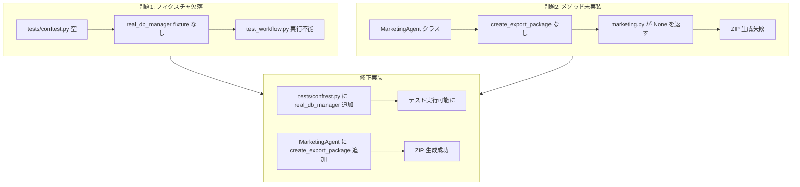

# かんたんモード フローバリデーション実装計画

## 概要

「起動してかんたんモードで作品を作って納品する流れ」を検証の結果、2つの重大な問題を特定した。本計画書はこれらの問題の修正実装を詳細に定義する。

---

## 問題サマリー

| # | 問題 | 影響範囲 | 深刻度 |
|---|------|----------|--------|
| 1 | `tests/conftest.py` が空（0バイト） | 統合テストが実行不能 | 高 |
| 2 | `MarketingAgent.create_export_package()` が未実装 | 納品パッケージ生成不可 | 高 |

---

## 問題1: `real_db_manager` フィクスチャの欠落

### 現状分析

- [`tests/integration/test_workflow.py`](autonovel/tests/integration/test_workflow.py:28) のテスト3件が `real_db_manager` フィクスチャに依存
- [`tests/integration/conftest.py`](autonovel/tests/integration/conftest.py:17) には `real_uow` のみ定義済み
- ルート [`tests/conftest.py`](autonovel/tests/conftest.py:1) は空（0バイト）

### 原因

`real_db_manager` フィクスチャがどこにも定義されていない。

### 解決策

[`tests/conftest.py`](autonovel/tests/conftest.py:1) に `real_db_manager` フィクスチャを追加する。`tests/integration/conftest.py` の `real_uow` を参考にする。

### 実装詳細

```python
# tests/conftest.py に追加
@pytest.fixture
async def real_db_manager():
    """
    実際の SQLite データベース管理器を提供する。
    FullAutoWorkflow のテストに使用される。
    """
    tmp = tempfile.NamedTemporaryFile(suffix=".db", delete=False)
    tmp.close()
    db_path = Path(tmp.name)
    db_url = f"sqlite+aiosqlite:///{db_path}"

    # スキーマ構築（同期エンジン）
    sync_url = f"sqlite:///{db_path}"
    engine = create_engine(sync_url)
    Base.metadata.create_all(engine)
    engine.dispose()

    manager = DatabaseManager(db_url)
    yield manager

    try:
        db_path.unlink()
    except OSError:
        pass
```

### 必要なインポート

```python
import tempfile
from pathlib import Path
import pytest
from sqlalchemy import create_engine
from src.backend.database.core import DatabaseManager
from src.backend.database.models import Base
```

---

## 問題2: `create_export_package` メソッドの未実装

### 現状分析

- [`src/backend/routers/marketing.py`](autonovel/src/backend/routers/marketing.py:40-48) の `export_package_get` エンドポイントが `engine.marketing.create_export_package(book_id)` を呼び出す
- [`src/agents/marketing.py`](autonovel/src/agents/marketing.py:10-28) の `MarketingAgent` には `generate_pack()` のみ存在
- アーカイブの [`archive/legacy_scripts/engine_agents_legacy.py`](autonovel/archive/legacy_scripts/engine_agents_legacy.py:166-204) に実装例あり

### 原因

レガシーコードから新アーキテクチャへの移行時に、`create_export_package` メソッドが `MarketingAgent` に移植されなかった。

### 解決策

[`src/agents/marketing.py`](autonovel/src/agents/marketing.py:1) の `MarketingAgent` クラスに `create_export_package` メソッドを追加する。

### 実装詳細

```python
async def create_export_package(self, book_id: int) -> Tuple[bytes, str]:
    """作品データ一式（本文、設定、プロット、JSONダンプ）をZIPパッケージ化する"""
    import io
    import json
    import zipfile
    
    book = await self.repo.get_book(book_id)
    if not book:
        raise ValueError("作品が見つかりません。")
    
    branch_id = book.current_branch_id if book and book.current_branch_id else 1

    chapters = await self.repo.get_all_non_anchor_chapters(book_id, branch_id=branch_id, order_by="ep_num")
    chars = await self.repo.get_all_characters(book_id)
    bible = await self.repo.get_latest_bible(book_id)
    plots = await self.repo.get_all_plots(book_id, branch_id=branch_id)

    buf = io.BytesIO()
    with zipfile.ZipFile(buf, "w", zipfile.ZIP_DEFLATED) as z:
        # 01: 本文
        full_text = "".join(f"第{c.ep_num}話 {c.title}\n\n{c.content}\n\n" for c in chapters)
        z.writestr("01_本文.txt", full_text)

        # 02: キャラクター・世界観設定
        settings_str = ""
        if bible and bible.settings:
            settings_str = json.dumps(bible.settings, ensure_ascii=False, indent=2) if isinstance(bible.settings, dict) else str(bible.settings)

        setting_text = f"【世界観設定】\n{settings_str}\n\n"
        setting_text += "【キャラクター設定】\n"
        for c in chars:
            try:
                if hasattr(c, "registry_data"):
                    reg = c.registry_data or {}
                    if isinstance(reg, str):
                        try:
                            reg = json.loads(reg)
                        except:
                            reg = {}
                elif hasattr(c, "model_dump"):
                    reg = c.model_dump()
                else:
                    reg = {}
            except Exception:
                reg = {}
            setting_text += f"■ {c.name} ({c.role})\n性格: {reg.get('personality', '')}\n能力: {reg.get('ability', '')}\n\n"
        z.writestr("02_キャラクター・世界観設定集.txt", setting_text)

        # 03: プロット概要
        plot_text = "【プロット概要】\n"
        for p in plots:
            plot_text += f"第{p.ep_num}話: {p.title}\n{p.one_line_summary or ''}\n\n"
        z.writestr("03_プロット概要.txt", plot_text)

        # 04: JSON ダンプ（機械可読）
        dump = {
            "book_id": book.id,
            "title": book.title,
            "genre": book.genre,
            "chapters": [{"ep_num": c.ep_num, "title": c.title, "content": c.content} for c in chapters],
            "characters": [{"name": c.name, "role": c.role} for c in chars],
            "plots": [{"ep_num": p.ep_num, "title": p.title, "one_line_summary": p.one_line_summary} for p in plots],
        }
        z.writestr("04_データダンプ.json", json.dumps(dump, ensure_ascii=False, indent=2))

    zip_data = buf.getvalue()
    zip_filename = f"export_{book_id}.zip"
    return zip_data, zip_filename
```

### 必要なインポート

```python
from typing import Any, Dict, Optional, Tuple
import io
import json
import zipfile
```

---

## ワークフロー図



---

## 実装タスク一覧

### タスク1: `tests/conftest.py` に `real_db_manager` フィクスチャを追加

- [ ] `tests/conftest.py` を開く（現在空）
- [ ] 必要なインポートを追加
- [ ] `real_db_manager` フィクスチャ関数を実装
- [ ] `real_uow` との整合性を確認

### タスク2: `src/agents/marketing.py` に `create_export_package` メソッドを追加

- [ ] `src/agents/marketing.py` を開く
- [ ] 必要なインポートを追加（`Tuple`, `io`, `json`, `zipfile`）
- [ ] `create_export_package` メソッドを実装
- [ ] `MarketingAgent.__init__` で `repo` が渡されているか確認

### タスク3: 統合テストの実行確認

- [ ] `pytest tests/integration/test_workflow.py` を実行
- [ ] 3つのテストがパスすることを確認

### タスク4: 手動検証

- [ ] アプリケーションを起動
- [ ] かんたんモードで作品を1つ作成
- [ ] 納品パッケージをダウンロード
- [ ] ZIP が正しく生成されることを確認

---

## リスクと軽減策

| リスク | 影響 | 軽減策 |
|--------|------|--------|
| `repo` が `MarketingAgent` に正しく注入されていない | メソッド実行時エラー | コンストラクタで `repo` の存在確認を追加 |
| データベースモデルのフィールド名が異なる | ZIP 生成失敗 | 各フィールドの存在確認とフォールバック処理 |
| 非同期コンテキストでの zipfile 使用 | パフォーマンス問題 | `io.BytesIO` でメモリ内で処理 |

---

## 成功基準

1. `pytest tests/integration/test_workflow.py -v` が3件すべてパスする
2. `GET /api/marketing/export_package/{book_id}?api_key=xxx` が有効な ZIP を返す
3. 生成された ZIP に以下のファイルが含まれる:
   - `01_本文.txt`
   - `02_キャラクター・世界観設定集.txt`
   - `03_プロット概要.txt`
   - `04_データダンプ.json`