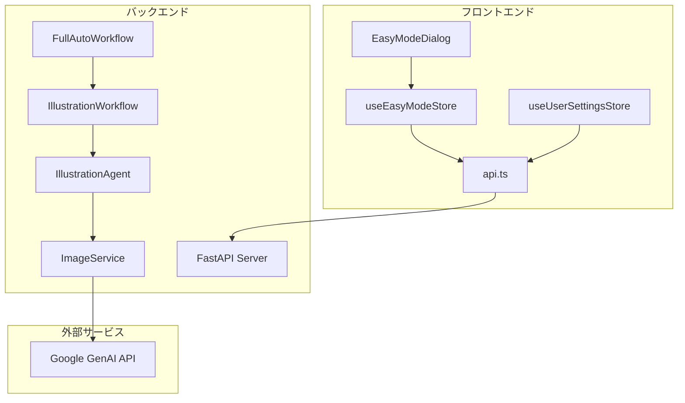
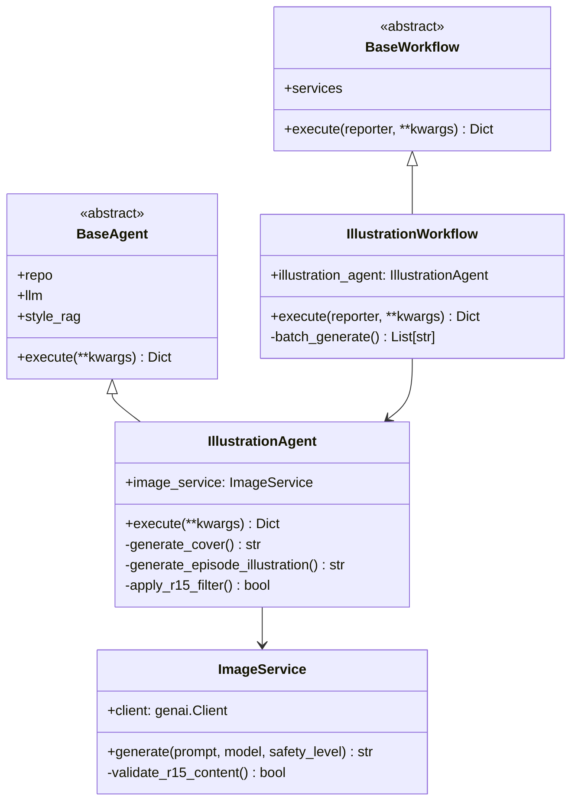
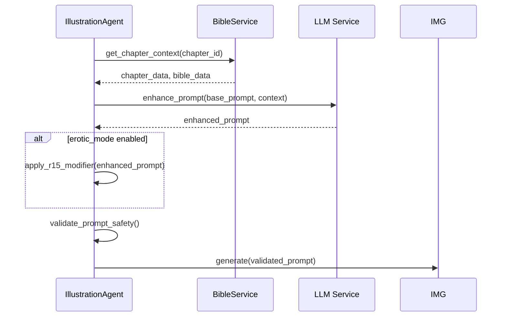
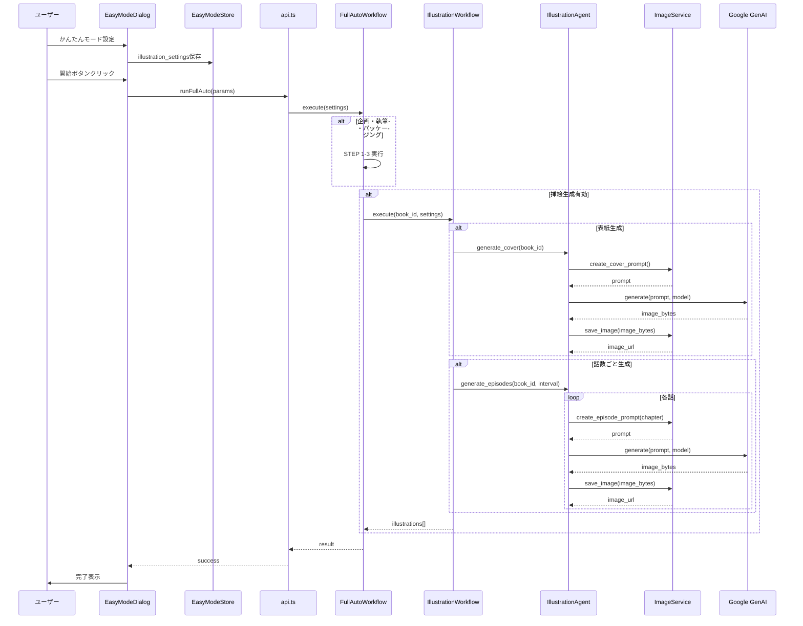

# 挿絵制作サブエージェント 実装計画書

## 1. 概要

### 目的
- ユーザーが明示的に有効化するオプトイン方式で挿絵を自動生成するサブエージェント
- かんたんモード（EasyMode）でも選択可能
- 表紙・話数ごとの挿絵を生成
- 官能モードではR15レベルのコンテンツ対応

### 使用モデル
- `imagen-4.0-fast-generate-001`: 高速生成（プレビュー用）
- `imagen-4.0-generate-001`: 高品質生成（最終版用）

---

## 2. アーキテクチャ設計

### 2.1 システム構成図



### 2.2 クラス図



---

## 3. データモデル設計

### 3.1 バックエンドモデル

```python
# autonovel/src/models/illustration.py

from dataclasses import dataclass
from enum import Enum
from typing import Optional

class IllustrationType(Enum):
    COVER = "cover"           # 表紙
    EPISODE = "episode"       # 話数ごと

class IllustrationModel(Enum):
    FAST = "imagen-4.0-fast-generate-001"
    QUALITY = "imagen-4.0-generate-001"

class SafetyLevel(Enum):
    BLOCK_MOST = "BLOCK_MOST"
    BLOCK_SOME = "BLOCK_SOME"
    BLOCK_FEW = "BLOCK_FEW"
    R15_CONTENT = "R15_CONTENT"  # 官能モード用

@dataclass
class IllustrationRequest:
    book_id: int
    illustration_type: IllustrationType
    episode_number: Optional[int] = None
    model: IllustrationModel = IllustrationModel.QUALITY
    safety_level: SafetyLevel = SafetyLevel.BLOCK_SOME
    prompt_override: Optional[str] = None

@dataclass
class IllustrationResult:
    request: IllustrationRequest
    image_url: str
    prompt: str
    model_used: str
    generation_time_ms: int
```

### 3.2 フロントエンド型定義

```typescript
// frontend/src/types/api.ts に追加

export type IllustrationType = 'cover' | 'episode';
export type IllustrationModel = 'fast' | 'quality';

export interface IllustrationSettings {
  enabled: boolean;
  illustrationType: IllustrationType;
  model: IllustrationModel;
  generateCover: boolean;
  generateEpisodeIllustrations: boolean;
  episodeInterval: number;  // 何話ごとに生成するか
}

export interface IllustrationGenerateParams {
  bookId: number;
  illustrationType: IllustrationType;
  episodeNumber?: number;
  model: IllustrationModel;
  enableR15: boolean;
}

export interface IllustrationResult {
  imageUrl: string;
  prompt: string;
  modelUsed: string;
  generationTimeMs: number;
}
```

---

## 4. APIエンドポイント設計

### 4.1 REST API

```
POST /api/illustrations/generate
  - 単一挿絵生成

POST /api/illustrations/batch
  - 一括生成（表紙+話数ごと）

GET /api/illustrations/{book_id}
  - 書籍の挿絵一覧取得

DELETE /api/illustrations/{illustration_id}
  - 挿絵削除
```

### 4.2 リクエスト/レスポンス例

```json
// POST /api/illustrations/generate
{
  "book_id": 123,
  "illustration_type": "cover",
  "model": "quality",
  "enable_r15": false
}

// Response
{
  "image_url": "/static/illustrations/123_cover.png",
  "prompt": "A dramatic fantasy book cover...",
  "model_used": "imagen-4.0-generate-001",
  "generation_time_ms": 12500
}
```

---

## 5. フロントエンド変更

### 5.1 useEasyModeStore 拡張

```typescript
// frontend/src/store/useEasyModeStore.ts

interface EasyModeState {
  // 既存フィールド...
  enableErotic: boolean;
  eroticIntensity: number;

  // 新規追加
  enableIllustration: boolean;
  illustrationType: 'cover' | 'episode';
  illustrationModel: 'fast' | 'quality';
  generateCover: boolean;
  generateEpisodeIllustrations: boolean;
  episodeInterval: number;  // 例: 3 = 3話ごとに生成
}
```

### 5.2 EasyModeDialog UI変更

```
┌─────────────────────────────────────────┐
│ かんたんモード設定                        │
├─────────────────────────────────────────┤
│ [ジャンル選択...]                        │
│ [物語類型選択...]                        │
│ [プロット選択...]                        │
│                                         │
│ ☑ 官能モードを有効にする                  │
│   強度: [━━━━━━━○━━] 70%               │
│                                         │
│ ─────────────────────────────────────── │
│                                         │
│ ☑ 挿絵を生成する                         │
│   種類: (●) 表紙のみ                     │
│        ( ) 表紙 + 話数ごと               │
│        ( ) 話数ごとのみ                   │
│                                         │
│   モデル: (●) 高品質 (imagen-4.0)        │
│          ( ) 高速 (imagen-4.0-fast)      │
│                                         │
│   間隔: [3] 話ごとに生成                  │
│                                         │
│   ⚠️ 官能モード有効時、R15レベルの        │
│      コンテンツが含まれる場合があります     │
│                                         │
│ [キャンセル]              [開始]          │
└─────────────────────────────────────────┘
```

---

## 6. プロンプトエンジニアリング

### 6.1 表紙用プロンプトテンプレート

```python
COVER_PROMPT_TEMPLATE = """
Create a stunning book cover illustration for a {genre} novel.

Title: {title}
Genre: {genre}
Theme: {theme}
Target audience: {audience}

Style requirements:
- Professional book cover quality
- Dramatic lighting and composition
- Suitable for {platform} publication
- {style_preference}

{erotic_modifier}

Output format: High-resolution illustration suitable for book cover.
"""

EROTIC_MODIFIER_R15 = """
Content note: This is a R15 (PG-13 equivalent) novel with mild romantic 
and suggestive content. Include tasteful artistic representation of 
emotional tension and romantic atmosphere without explicit content.
"""
```

### 6.2 話数ごと挿絵プロンプトテンプレート

```python
EPISODE_PROMPT_TEMPLATE = """
Create an atmospheric illustration for Chapter {chapter_number} of a {genre} novel.

Chapter title: {chapter_title}
Synopsis: {synopsis}
Key scene elements: {scene_elements}
Emotional tone: {emotional_tone}

Character appearances:
{character_descriptions}

Style: {style_preference}
Setting: {setting_description}

{erotic_modifier}

Output format: Scene illustration with cinematic composition.
"""

EROTIC_MODIFIER_R15 = """
Content note: This chapter contains R15-level romantic tension.
Depict emotional intimacy and suggestive atmosphere artistically
without explicit content.
"""
```

### 6.3 プロンプト生成フロー



---

## 7. R15コンテンツセーフティ設計

### 7.1 セーフティレベル定義

```python
class SafetyConfig:
    STANDARD = {
        "harm_block_threshold": "BLOCK_MOST",
        "harm_category_blocked": ["HARM_CATEGORY_SEXUALLY_EXPLICIT"],
    }
    
    R15 = {
        "harm_block_threshold": "BLOCK_SOME",
        "harm_category_blocked": ["HARM_CATEGORY_SEXUALLY_EXPLICIT"],
        "allow_suggestive": True,
        "max_nudity": "artistic_nude",
        "allow_intimate_clothing": True,
    }
```

### 7.2 コンテンツフィルタリング

```python
# 官能モード時の処理
def apply_r15_filter(prompt: str, enable_r15: bool) -> str:
    if not enable_r15:
        return prompt
    
    # R15許可リストに基づいてプロンプトを修飾
    r15_safe_phrases = [
        "artistic representation",
        "emotional tension",
        "suggestive atmosphere",
        "tasteful composition",
        "implied intimacy",
    ]
    
    # 禁止フレーズを排除
    forbidden_phrases = [
        "explicit",
        "graphic sexual content",
        "detailed nudity",
    ]
    
    for phrase in forbidden_phrases:
        prompt = prompt.replace(phrase, "")
    
    return f"{prompt}\n\nStyle: R15 tasteful artistic representation."
```

---

## 8. モデル選択ロジック

### 8.1 自動選択ルール

```python
def select_model(
    illustration_type: IllustrationType,
    user_preference: IllustrationModel,
    batch_mode: bool = False
) -> str:
    """
    モデル選択ロジック
    
    - 表紙: 常に高品質モデル (imagen-4.0-generate-001)
    - 話数ごと批量: 高速→高品質の順で処理
    - ユーザーがquality選択: 高品質モデル
    - ユーザーがfast選択: 高速モデル
    """
    
    if illustration_type == IllustrationType.COVER:
        return "imagen-4.0-generate-001"
    
    if user_preference == IllustrationModel.QUALITY:
        return "imagen-4.0-generate-001"
    
    if batch_mode and user_preference == IllustrationModel.FAST:
        # バッチ処理時は高速で全生成→高品質でリ生成
        return "imagen-4.0-fast-generate-001"
    
    return "imagen-4.0-generate-001"
```

### 8.2 モデル比較

| モデル | 速度 | 品質 | 用途 |
|--------|------|------|------|
| imagen-4.0-fast-generate-001 | ~5秒 | 中程度 | プレビュー、確認用 |
| imagen-4.0-generate-001 | ~15秒 | 最高 | 最終版、表紙 |

---

## 9. エラーハンドリングとリトライ

### 9.1 リトライポリシー

```python
from tenacity import retry, stop_after_attempt, wait_exponential

@retry(
    stop=stop_after_attempt(3),
    wait=wait_exponential(multiplier=1, min=2, max=10)
)
async def generate_with_retry(
    prompt: str,
    model: str,
    safety_level: str
) -> str:
    try:
        result = await image_service.generate(
            prompt=prompt,
            model=model,
            safety_level=safety_level
        )
        return result
    except ResourceExhaustedError:
        # API quota exceeded - wait and retry
        raise
    except SafetyError:
        # Content filtered - modify prompt and retry
        modified_prompt = await modify_prompt_for_safety(prompt)
        return await image_service.generate(
            prompt=modified_prompt,
            model=model,
            safety_level="BLOCK_FEW"
        )
```

### 9.2 エラー分類

```python
class IllustrationError(Enum):
    API_QUOTA_EXCEEDED = "api_quota_exceeded"
    SAFETY_FILTERED = "safety_filtered"
    INVALID_PROMPT = "invalid_prompt"
    NETWORK_ERROR = "network_error"
    TIMEOUT = "timeout"

ERROR_HANDLERS = {
    IllustrationError.API_QUOTA_EXCEEDED: "少し時間を置いて再試行してください",
    IllustrationError.SAFETY_FILTERED: "プロンプトを調整して再試行します",
    IllustrationError.INVALID_PROMPT: "プロンプトが無効です",
    IllustrationError.NETWORK_ERROR: "ネットワークエラーが発生しました",
    IllustrationError.TIMEOUT: "生成がタイムアウトしました",
}
```

---

## 10. FullAutoWorkflow統合

### 10.1 統合ポイント

```python
# full_auto_workflow.py の execute メソッド内に追加

async def execute(self, reporter: StatusReporter, **kwargs) -> Dict[str, Any]:
    # STEP 1: 企画生成
    reporter.update_progress(0, 4, "STEP 1/4: 覇権企画を生成中...")
    plan = await self.planning_agent.execute(...)
    
    # STEP 2: 執筆
    reporter.update_progress(1, 4, "STEP 2/4: 小説を執筆中...")
    chapters = await self.writing_agent.execute(...)
    
    # STEP 3: パッケージング
    reporter.update_progress(2, 4, "STEP 3/4: パッケージング中...")
    package = await self.packaging_agent.execute(...)
    
    # STEP 4: 挿絵生成 (NEW)
    if kwargs.get("illustration_settings", {}).get("enabled"):
        reporter.update_progress(3, 4, "STEP 4/4: 挿絵を生成中...")
        illustrations = await self.illustration_workflow.execute(
            book_id=package["book_id"],
            settings=kwargs["illustration_settings"]
        )
        package["illustrations"] = illustrations
    
    return package
```

### 10.2 進捗レポート

```python
# 挿絵生成中の進捗詳細
ILLUSTRATION_PROGRESS_STEPS = [
    "表紙プロンプトを生成中...",
    "表紙イラストを生成中...",
    "第{n}話のプロンプトを生成中...",
    "第{n}話イラストを生成中...",
    "すべての挿絵を保存中...",
]
```

---

## 11. ファイル構成

### 11.1 新規作成ファイル

```
autonovel/src/
├── agents/
│   └── illustration_agent.py      # 新規
├── services/
│   └── image_service.py           # 新規
├── models/
│   └── illustration.py            # 新規
├── workflows/
│   └── illustration_workflow.py   # 新規
├── prompts/
│   └── illustration_prompts.py    # 新規
└── backend/
    └── routers/
        └── illustrations.py       # 新規

frontend/src/
├── types/
│   └── api.ts                     # 拡張
├── api.ts                         # 拡張
├── store/
│   └── useEasyModeStore.ts        # 拡張
└── components/
    └── dialogs/
        └── EasyModeDialog.tsx      # 拡張
```

---

## 12. テスト戦略

### 12.1 ユニットテスト

```python
# tests/test_illustration_agent.py

class TestIllustrationAgent:
    def test_generate_cover_prompt(self):
        """表紙プロンプト生成テスト"""
        
    def test_generate_episode_prompt(self):
        """話数ごとプロンプト生成テスト"""
        
    def test_r15_modifier_application(self):
        """R15修飾子適用テスト"""
        
    def test_model_selection(self):
        """モデル選択ロジックテスト"""
```

### 12.2 統合テスト

```python
# tests/test_illustration_workflow.py

class TestIllustrationWorkflow:
    @pytest.mark.asyncio
    async def test_full_pipeline_with_cover(self):
        """表紙生成を含むフルパイプラインテスト"""
        
    @pytest.mark.asyncio
    async def test_batch_episode_generation(self):
        """話数ごと批量生成テスト"""
        
    @pytest.mark.asyncio
    async def test_erotic_mode_r15(self):
        """官能モードR15テスト"""
```

---

## 13. 実装タスク一覧

### Phase 1: 基盤 (1-3)
- [ ] `IllustrationRequest/Result` dataclass作成
- [ ] `ImageService`実装 (GenAI SDK統合)
- [ ] `IllustrationAgent`実装

### Phase 2: ワークフロー (4-6)
- [ ] `IllustrationWorkflow`実装
- [ ] `FullAutoWorkflow`統合
- [ ] APIエンドポイント作成

### Phase 3: フロントエンド (7-9)
- [ ] TypeScript型定義追加
- [ ] `useEasyModeStore`拡張
- [ ] `EasyModeDialog`UI更新

### Phase 4: 品質保証 (10-12)
- [ ] プロンプトテンプレート作成
- [ ] R15セーフティフィルタ実装
- [ ] ユニットテスト作成

---

## 14. 設定ファイル

### 14.1 環境変数

```bash
# .env
GOOGLE_GENAI_API_KEY=your_api_key_here
ILLUSTRATION_MAX_BATCH_SIZE=50
ILLUSTRATION_DEFAULT_MODEL=quality
ILLUSTRATION_TIMEOUT_SECONDS=60
```

### 14.2 設定クラス

```python
# autonovel/config/illustration.py

from pydantic import BaseModel

class IllustrationConfig(BaseModel):
    api_key: str
    max_batch_size: int = 50
    default_model: str = "quality"
    timeout_seconds: int = 60
    retry_attempts: int = 3
    
    class Config:
        env_prefix = "ILLUSTRATION_"
```

---

## 15. Mermaid図: 完全フロー



---

## 16. リスクと対策

| リスク | 影響 | 対策 |
|--------|------|------|
| API quota超過 | 高 | リトライ + exponential backoff |
| セーフティフィルタ誤判定 | 中 | R15モード時はフィルタ緩く |
| 長時間生成 | 中 | 進捗表示 + タイムアウト設定 |
| プロンプト最適化不足 | 低 | LLMによるプロンプト拡張 |

---

## 17. パフォーマンス目標

- 表紙生成: 15秒以内
- 話数ごと1枚: 10秒以内
- 批量10枚: 2分以内
- 同時実行: 最大3並列

---

## 18. 承認後アクション

この計画が承認された場合:
1. Codeモードに切り替えて実装開始
2. Phase 1から順番に実装
3. 各Phase完了後にレビュー