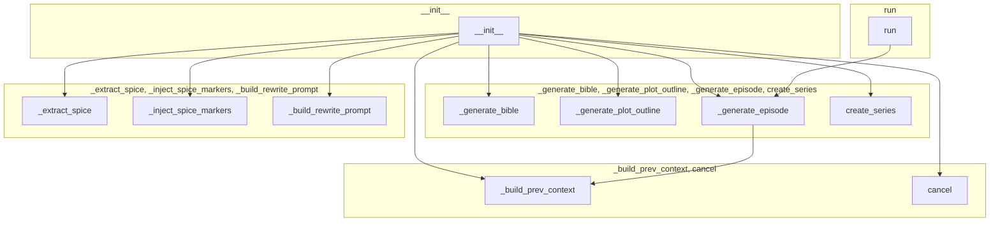

# パイプライン分割設計

## 目的
`src/easy_mode/pipeline.py` の関数/メソッド・依存関係を完全調査し、分割設計のための影響範囲を把握する。

## メソッド一覧

| Method | Lines | Complexity | External Deps | Internal Deps | Group |
|--------|-------|------------|---------------|---------------|-------|
| __init__ | 51 | high | engine, preset, llm | - | initialization |
| run | 63 | high | - | _generate_episode | orchestration |
| _generate_episode | 63 | high | - | _build_prev_context | generation |
| _build_prev_context | 55 | high | - | - | helper |
| cancel | 10 | low | - | - | helper |
| _generate_bible | 4 | low | - | - | generation |
| _generate_plot_outline | 4 | low | - | - | generation |
| _extract_spice | 4 | low | - | - | rewrite |
| _inject_spice_markers | 4 | low | - | - | rewrite |
| _build_rewrite_prompt | 5 | low | - | - | rewrite |
| create_series | 16 | low | engine | - | generation |

## グルーピング図

以下は、機能ごとにメソッドをグルーピングした概念図です。



## ASCII クラス図

```
+------------------+       +---------------------+       +----------------------+
|   BibleGenerator |       |   PlotGenerator     |       |   EpisodeWriter      |
|------------------|       |---------------------|       |----------------------|
| +generate()      |       | +generate()         |       | +write()             |
| +parse()         |       | +interpolate_tension|       | +build_writing_prompt|
| +fallback()      |       | +select_plot_pattern|       |                      |
+------------------+       +---------------------+       +----------------------+
          ^                         ^                         ^
          |                         |                         |
          |                         |                         |
+------------------+       +---------------------+       +----------------------+
| EpisodeAuditor   |       | EpisodeRewriter     |       | SeriesFinalizer      |
|------------------|       |---------------------|       |----------------------|
| +audit()         |       | +rewrite()          |       | +finalize()          |
|                  |       | +extract_spice()    |       | +finalize_result()   |
|                  |       | +inject_spice_markers|       |                      |
+------------------+       +---------------------+       +----------------------+
          ^                         ^
          |                         |
          |                         |
+------------------+       +---------------------+
| ProgressReporter |       |      Pipeline       |
|------------------|       |---------------------|
| +report()        |       | +run()              |
|                  |       | +cancel()           |
+------------------+       +---------------------+

Dependencies:
- Pipeline uses all other modules via dependency injection.
- BibleGenerator depends on preset, llm, retry_config.
- PlotGenerator depends on preset, target_episodes.
- EpisodeWriter depends on llm, preset, retry_config.
- EpisodeAuditor depends on auditor, target_audit_score.
- EpisodeRewriter depends on llm, genre, retry_config.
- SeriesFinalizer depends on preset.
- ProgressReporter depends on progress_callback.

## 各モジュールの公開 API

### BibleGenerator (`bible_generator.py`)
- `__init__(self, preset, llm, retry_config) -> None`
- `generate(self, target_episodes: int) -> dict[str, Any]`
- `parse(self, bible_content: str) -> dict[str, Any]`  # オプション
- `fallback(self, config: PipelineConfig) -> dict[str, Any]`  # オプション

### PlotGenerator (`plot_generator.py`)
- `__init__(self, preset, target_episodes: int) -> None`
- `generate(self, bible: dict[str, Any]) -> list[dict[str, Any]]`
- `interpolate_tension(self, outline: list[dict], target_episodes: int) -> list[dict]`
- `select_plot_pattern(self, genre: str) -> dict`

### EpisodeWriter (`episode_writer.py`)
- `__init__(self, llm, preset, retry_config) -> None`
- `write(self, ep_num: int, bible: dict, plot: dict, prev_context: str) -> str`
- `build_writing_prompt(self, ep_num: int, bible: dict, plot: dict, prev_context: str) -> str`

### EpisodeAuditor (`episode_auditor.py`)
- `__init__(self, auditor, target_audit_score: int) -> None`
- `audit(self, content: str, bible: dict, plot: dict, ep_num: int, genre: str) -> AuditResult`

### EpisodeRewriter (`episode_rewriter.py`)
- `__init__(self, llm, genre: str, retry_config) -> None`
- `rewrite(self, content: str, improvements: list[str], spice_elements: list) -> str`
- `extract_spice(self, text: str) -> list`
- `inject_spice_markers(self, text: str, spice_elements: list) -> str`

### SeriesFinalizer (`series_finalizer.py`)
- `__init__(self, preset) -> None`
- `finalize(self, series_result: SeriesResult) -> dict`
- `finalize_result(self, final_content: dict) -> dict`

### ProgressReporter (`progress_reporter.py`)
- `__init__(self, progress_callback: Optional[callable]) -> None`
- `report(self, ep_num: int, total_episodes: int, stage: str) -> None`

### Pipeline (`pipeline.py`)
- `__init__(self, engine, config: PipelineConfig, bible_generator: Optional[BibleGenerator] = None, plot_generator: Optional[PlotGenerator] = None, episode_writer: Optional[EpisodeWriter] = None, episode_auditor: Optional[EpisodeAuditor] = None, episode_rewriter: Optional[EpisodeRewriter] = None, series_finalizer: Optional[SeriesFinalizer] = None, progress_reporter: Optional[ProgressReporter] = None, retry_config: Optional[RetryConfig] = None) -> None`
- `async def run(self) -> SeriesResult`
- `def cancel(self) -> None`

## 考察
- 外部依存は `__init__` と `create_series` にのみ存在し、主に `engine`, `preset`, `llm` である。
- 内部依存は `run` → `_generate_episode` → `_build_prev_context` の線形チェーンのみ。
- 各グループは比較的独立しており、モジュール分割の候補となる。
- 行数が多いメソッドは `__init__`, `run`, `_generate_episode`, `_build_prev_context`, `_generate_bible` などで、これらは分割によるサイズ削減が期待できる。

## 完了基準
本ファイルにグルーピング図を作成し、影響範囲を明示した。
