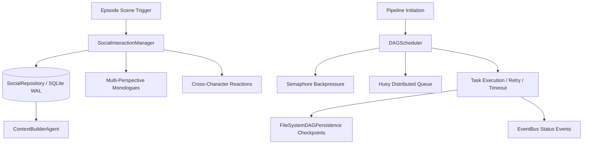

# 第2の柱：状態管理・非同期インフラ本格強化 アーキテクチャガイド

## 1. 概要
AutoNovelの「第2の柱」は、長編小説の執筆におけるキャラクター関係性の動的追跡（ソーシャルシミュレーション）と、高並行かつ耐障害性に優れた非同期タスクオーケストレーション（Huey + DAGScheduler）を実現する本格運用インフラです。



## 2. コアコンポーネント

### 2.1 ソーシャル・ダイナミクス永続化レイヤ
- **ORMモデル**: `CharacterRelationship`, `CharacterJournal`, `CharacterComment`, `RelationshipHistory`
- **`SocialRepository`**:
  - 非同期セッション対応（SQLAlchemy 2.0 AsyncSession）
  - 関係性（親愛度・信頼度・緊張度・深度・動的ステート）の永続化
  - 時系列履歴の記録とローテーションクリーンアップ（`cleanup_old_history`）
  - 直近重要手記・主要関係性トレンド要約の自動集計
- **`SocialInteractionManager`**:
  - キャラクター手記および相互コメントの `asyncio.gather` 並行生成
  - `compute_dynamics_state` による状態タグ（allies, rivals, hostile, friendly, neutral）の自動判定
  - `ContextBuilderAgent` へのトークン予算（1200文字制限）付き動的ソーシャルコンテキスト注入

### 2.2 Huey 非同期タスクキュー
- **フォールバック設計**: Redis が利用可能な場合は RedisHuey、接続不能な場合はローカル SqliteHuey に自動フォールバック。
- **実行可能タスク**: `execute_agent_node_task`, `run_novel_dag_pipeline_task`
- **ワーカー実行**: `python scripts/run_worker.py`（SIGINT/SIGTERM グレイスフルシャットダウン対応）
- **ヘルスチェック**: `GET /api/system/huey/health` または `check_huey_health()`

### 2.3 DAGScheduler（有向非巡回グラフスケジューラ）
- **並行制御とバックプレッシャー**: CPU・RAM・GPU のセマフォ制御、固定取得順序によるデッドロック防止。
- **タイムアウト＆リトライ**: `DAGTaskNode.timeout_seconds` による `asyncio.wait_for` タイムアウト監視と自動リトライ。
- **カスケードキャンセル**: 上流ノードが回復不能な失敗（リトライ上限超過）を起こした際、下流の依存ノードを自動的に `cancelled` へ遷移。
- **チェックポイント永続化**: 各ノード完了時に `FileSystemDAGPersistence` へチェックポイントを自動保存。障害時の中断地点からの復旧が可能。
- **リアルタイム監視**: `EventBus` によるライフサイクルイベント発行、および `GET /api/tasks/dag/{dag_id}` による進行状況取得。

## 3. 運用・保守コマンド
```bash
# 1. DB マイグレーションとテーブル整合性確認
python scripts/migrate_social_db.py

# 2. 包括的ヘルスチェック
python scripts/health_check_pillar2.py

# 3. 高負荷ベンチマーク実行
python scripts/benchmark_social_dag.py

# 4. Huey ワーカー起動
python scripts/run_worker.py -w 4 -k process
```
