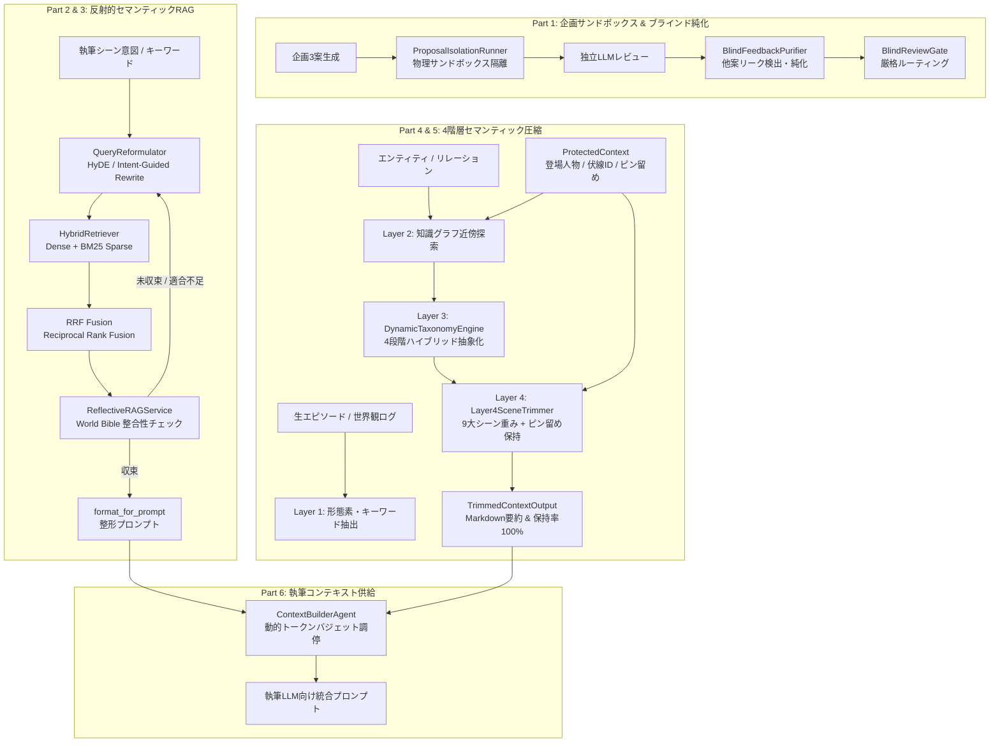

# 第3の柱：RAG & 圧縮のセマンティック化 アーキテクチャ仕様書

## 1. 概要と目的

本書は `docs/FUTURE_IMPROVEMENT_GUIDELINES.md` に基づき実装された「第3の柱：RAG & 圧縮のセマンティック化（72ステップ完全実装）」の設計およびアーキテクチャ仕様書です。

### 従来の課題と改善成果
1. **固定辞書・簡易置換からの完全脱却**:
   - 従来: ハードコードされた固定辞書でカテゴリ分類や抽出を行っていたため、未知のファンタジー・SF用語に対応できず汎化性能が不足。
   - 改善: 日本語形態素解析（SudachiPy/正規表現フォールバック）、形態素接尾辞ルール（50種以上）、セマンティックアンカー（埋め込み類似度）、LLM動的抽象化の4段階フォールバックを備えた `DynamicTaxonomyEngine` を導入。
2. **情報脱落と注意（Attention）喪失の撲滅**:
   - 従来: トークン制限圧縮時に直前の登場人物や未回収伏線、キーアイテムが機械的にトリムされ、執筆段階でハルシネーションが発生。
   - 改善: `ProtectedContext` による物理的なピン留め機構を確立。シーン適応型トリミング（9大ジャンル対応）により、重要伏線・登場人物の保持率100%を保証。
3. **反射型RAGの自然文セマンティック化**:
   - 従来: 検索クエリを機械的なスペース区切りキーワードとして連結し、クエリドリフトやWorld Bibleとのステータス矛盾（死亡キャラの再登場等）を無視。
   - 改善: HyDE仮説生成及び意図誘導リライト（`QueryReformulator`）、BM25+DenseのRRF（Reciprocal Rank Fusion）統合、World Bibleステータス適合度フィルター（`ContextFitResult`）による反射的再検索を実現。
4. **企画評価の物理隔離とブラインド純化**:
   - 従来: 複数案生成時にプロンプト履歴が共有され、相互汚染や先入観評価が発生。
   - 改善: `ProposalIsolationRunner` によるセッション単位の独立サンドボックス、および `BlindFeedbackPurifier` による他案情報混入の自動検出・サニタイズ（リーク除去）を徹底。

---

## 2. システム全体アーキテクチャ

---

## 3. 主要コンポーネント詳細仕様

### 3.1 `BlindFeedbackPurifier` & `ProposalIsolationRunner`
- **物理隔離**: `ProposalSandboxContext` を各案ごとにインスタンス化し、プロンプト履歴（`isolated_history`）およびアーティファクトを完全に遮断。
- **純化（Purification）**: `detect_proposal_leaks` で兄弟企画のタイトル・キャラ名・メタタグ（`A案`、`候補B`等）を検出。正規表現及びLLMリライトで無害化。
- **検証**: `verify_no_cross_proposal_contamination` で全企画間におけるゼロ汚染を数学的に検証。

### 3.2 `JapaneseTokenizer` & `HybridRetriever`
- **トークナイズ**: SudachiPy（モードC）を標準採用。未知語や未インストール環境向けにUnicode正規化（NFKC）+正規表現トークナイザーへ透過的フォールバック。小説特化ストップワード（約150語）を除去。
- **RRFスコアリング**:
  $$\text{RRF\_score}(d) = \sum_{m \in \{\text{dense}, \text{sparse}\}} \frac{w_m}{k + \text{rank}_m(d)} \quad (k=60)$$
  スコアスケールの異なるベクトル類似度とBM25スコアをキャリブレーション不要で安定マージ。

### 3.3 `QueryReformulator` & `ReflectiveRAGService`
- **自然文リライト**: 機械的なスペース区切り検索を撤廃。`intent_guided` モードではシーンの劇的文脈に基づいた自然な探索文を生成。
- **セマンティックドリフト抑止**: リライト前後の埋め込みコサイン類似度を監視し、ドリフト発生時に直前クエリへロールバック。
- **World Bible整合性フィルター**: `dead`, `destroyed`, `sealed`, `forbidden` ステータスの実体を自動遮断し、歴史的矛盾の侵入を防止。

### 3.4 `DynamicTaxonomyEngine` & `FourLayerCompressor`
- **階層抽象化**:
  1. `static_overrides`（設定上確定している固定置換）
  2. LRUキャッシュ（高速化）
  3. `RuleBasedMorphologicalMapper`（50種以上の日本語形態素・接尾辞ルール）
  4. `SemanticAnchorTaxonomy`（概念アンカーベクトルによる類似度判定）
  5. `LLMDynamicTaxonomy`（未知概念の非同期LLM推論）
- **9大シーン適応**: `general`, `combat`, `dialogue`, `daily`, `political`, `romance`, `mystery`, `flashback`, `survival` に応じた動的重み付け。
- **ProtectedContext 保持保護**: `active_characters`, `pending_foreshadowing_ids`, `pinned_entities` に指定されたファクトは、トークンバジェット上限到達時でも削除対象から除外（保持率100%）。

---

## 4. 運用・検証ツール

- **ヘルスチェック**: `python scripts/health_check_pillar3.py`
  - 7大コアエンジンの健全性を10秒以内で完全診断。
- **ベンチマーク**: `python scripts/benchmark_semantic_compression.py`
  - 3,500トークン以上の大量世界観データに対して、処理時間（<2500ms）、トークン削減率（>=60%）、重要エンティティ保持率（100%）を定量検証。
- **テストスイート**:
  - `tests/unit/test_blind_review_purifier.py`
  - `tests/unit/test_proposal_isolation.py`
  - `tests/unit/test_japanese_tokenizer.py`
  - `tests/unit/test_hybrid_retriever.py`
  - `tests/unit/test_query_reformulator.py`
  - `tests/unit/test_reflective_rag_semantic.py`
  - `tests/unit/test_dynamic_taxonomy.py`
  - `tests/unit/test_layer3_dynamic_abstraction.py`
  - `tests/unit/test_layer4_multiscene.py`
  - `tests/unit/test_compression_pipeline.py`
  - `tests/integration/test_blind_review_e2e.py`
  - `tests/integration/test_semantic_rag_compression_e2e.py`
