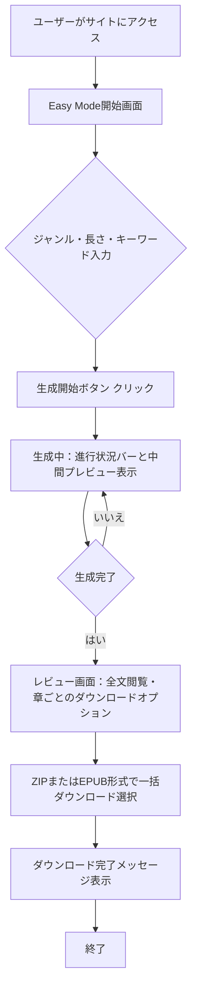

# Easy Mode フローデザイン

## ユーザーストーリー

1. ユーザーがサイトにアクセス
2. 「簡単モード」ボタンをクリック（またはデフォルトで簡単モード）
3. ストーリーのジャンル・長さ・キーワードを入力
4. 「生成開始」ボタンをクリック
5. 生成進行状況バーと中間プレビューが表示
6. 生成完了後、レビュー画面で全文閲覧・章ごとのダウンロードオプション
7. ZIP または EPUB 形式で一括ダウンロード選択
8. ダウンロード完了メッセージ表示

## 画面遷移図 (Mermaid)

## 詳細ステップ

### ステップ1: サイトアクセス
- ユーザーがサイトのトップページにアクセス
- デフォルトで Easy Mode が選択されている状態で開始

### ステップ2: Easy Mode開始画面
- シンプルなインターフェースでジャンル、長さ、キーワードの入力フィールドを表示
- 「生成開始」ボタンを強調表示

### ステップ3: 入力項目
- ジャンル：ドロップダウンまたはテキスト入力（例：ファンタジー、ラブコメ、SFなど）
- 長さ：目標文字数（例：短編：1000-3000字、中編：3000-10000字、長編：10000字以上）
- キーワード：カンマ区切りで複数入力可能（必須ではない）

### ステップ4: 生成開始
- ユーザーが「生成開始」ボタンをクリック
- システムが入力値をバリデート（必須項目の確認など）
- バックエンドで生成ジョブを開始し、ジョブIDをフロントエンドに返却

### ステップ5: 生成中
- 進行状況バー（0-100%）を表示
- 中間プレビューとして生成途中のテキストの一部を表示（例：毎章完了ごとに更新）
- キャンセルボタンを提供（オプション）

### ステップ6: レビュー画面
- 生成完了後、全文をスクロール可能なビューで表示
- 章ごとに折りたたみ可能なセクションまたはタブで分割表示
- 各章ごとにダウンロードボタン（テキスト形式）
- 全文のズレや誤字脱字の簡易チェック機能（オプション）

### ステップ7: 一括ダウンロード選択
- ZIP形式：すべての章を個別のテキストファイルにまとめてアーカイブ
- EPUB形式：電子書籍標準フォーマットで出力（目次、メタデータ含む）
- 選択された形式でダウンロード準備を開始

### ステップ8: 完了通知
- ダウンロードが完了したらトースト通知またはバナーで完了メッセージ ordeor
- ダウンロードリンクの再提供（有効期限付き）
- または新しいストーリー生成へのボタンを表示

## 非機能要件
- レスポンシブデザイン：モバイルデバイスでも快適に操作可能
- アクセシビリティ：スクリーンリーダー対応、十分なコントラスト比
- パフォーマンス：生成開始から結果表示までの遅延を最小限に抑える（バックエンド最適化と併せて）
- エラーハンドリング：入力エラー、生成エラー、タイムアウト時に適切なメッセージと再試行オプションを表示