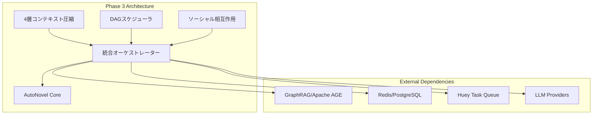
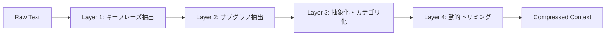
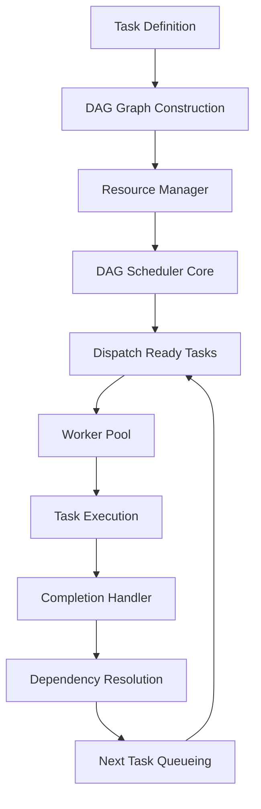
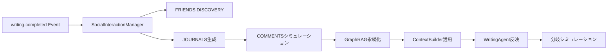

# Phase 3 アーキテクチャ設計書

## 概要

Phase 3（中期・効率性・拡張性向上）は、AutoNovel の基盤機能を強化し、大規模・長期運用に耐えるアーキテクチャを確立するフェーズです。以下の3つの主要コンポーネントから構成されます。



---

## 1. 4層コンテキスト圧縮機構

### 1.1 アーキテクチャ概要



### 1.2 各層の詳細仕様

#### Layer 1: キーフレーズ抽出
- **アルゴリズム**: TF-IDF / KeyBERT / BM25 (設定で切替可能)
- **入力**: 生テキスト
- **出力**: `List[Tuple[str, float]]` キーフレーズ+スコア
- **設定**: `top_k`, `min_score`, `method`

#### Layer 2: サブグラフ抽出・プリューニング
- **入力**: エンティティリスト、リレーションリスト、キーフレーズ
- **処理**: 
  1. キーフレーズからシードノード特定
  2. BFSで `max_hops` 以内のノード抽出
  3. 関連性スコア計算（キーフレーズ一致×距離減衰×タイプ重み）
  4. `relevance_threshold` でプリューニング
  5. `max_nodes` 制限でトップK選択
- **出力**: `{nodes: [...], edges: [...], stats: {...}}`

#### Layer 3: 抽象化・カテゴリ化
- **モード**: 
  - **Model-based**: BART要約モデル (`facebook/bart-large-cnn`)
  - **Rule-based**: ノード/エッジタイプ→カテゴリマッピング
- **カテゴリ**: 武術スキル、統治システム、魔法システム、組織・派閥、地理・地形、歴史・年表、アイテム・装備、種族・血統
- **出力**: `Dict[str, List[Dict[content, category]]]`

#### Layer 4: 動的トリミング
- **重要度計算**: カテゴリ重み × キーフレーズ一致ボーナス
- **必須保持**: `preserve_categories` 設定カテゴリ
- **トークン予算**: `max_tokens` 以内で貪欲選択
- **閾値フィルタ**: `importance_threshold` 未満除外
- **出力**: 自然文形式の圧縮済みコンテキスト

### 1.3 キャッシュ機構
- **ストレージ**: Redis
- **キー設計**: `compress:v1:{hash(raw_text)}:{entities_hash}`
- **保存対象**: L1キーフレーズ、L2サブグラフ、L3抽象化結果
- **TTL**: 設定可能（デフォルト 1時間）

### 1.4 設定ファイル
```yaml
# config/context_compression.yaml
compression:
  enabled: true
  layer1_keyphrase:
    method: "tfidf"
    top_k: 50
    min_score: 0.01
  layer2_subgraph:
    max_hops: 2
    relevance_threshold: 0.05
    edge_pruning: true
    max_nodes: 200
  layer3_abstraction:
    model: "facebook/bart-large-cnn"
    max_length: 128
    abstraction_categories: [...]
  layer4_trimming:
    importance_threshold: 0.4
    max_tokens: 4000
    preserve_categories:
      - "主要キャラ"
      - "核心設定"
      - "伏線"
```

---

## 2. DAGベースハイブリッドバッチタスクスケジューラ

### 2.1 アーキテクチャ概要



### 2.2 コアコンポーネント

#### DAG Models (`dag_models.py`)
- `TaskType`: `LLM_INFERENCE`, `IMAGE_GENERATION`, `LIGHTWEIGHT`, `DATABASE`, `VECTOR_SEARCH`
- `ResourceRequirement`: CPU/メモリ/GPUメモリ/GPU数
- `TaskNode`: ID、名前、タイプ、依存リスト、リソース要求、優先度、リトライ/タイムアウト
- `DAGGraph`: ノード/エッジ管理、サイクル検出、トポロジカルソート

#### Resource Manager (`resource_manager.py`)
- システムリソース自動検出 (psutil/GPUtil)
- タスクタイプ別動的ワーカープールサイズ計算
- リソース可用性チェック

#### DAG Scheduler Core (`dag_scheduler.py`)
- 状態管理: pending/ready/running/completed/failed
- レディキュー管理 (deque)
- 並列ディスパッチ (リソース制約考慮)
- 完了処理・依存解決・次タスクキューイング
- リトライ・タイムアウト・エラーハンドリング
- ハイブリッドバッチ処理 (同一ワークフロー連続実行最適化)
- 細粒度エラー回復・下流タスク制御

#### Huey統合 (`dag_adapter.py`, `dag_launcher.py`)
- `@dag_task` デコレータでメタデータ付与
- 既存 Huey タスクへの透過的移行

### 2.3 メトリクス
| メトリクス | タイプ | ラベル | 説明 |
|-----------|--------|--------|------|
| `dag_queue_depth` | Gauge | task_type | キュー長 |
| `dag_running_tasks` | Gauge | task_type | 実行中タスク数 |
| `dag_task_duration_seconds` | Histogram | task_type | 実行時間分布 |
| `dag_task_total` | Counter | task_type, status | 総実行数 |
| `dag_resource_utilization` | Gauge | resource | リソース使用率 |

### 2.4 管理API
| エンドポイント | メソッド | 説明 |
|--------------|--------|------|
| `/admin/dag/queue` | GET | キュー状況取得 |
| `/admin/dag/running` | GET | 実行中タスク一覧 |
| `/admin/dag/cancel/{task_id}` | POST | タスクキャンセル |
| `/admin/dag/retry/{task_id}` | POST | 手動リトライ |
| `/admin/dag/priority/{task_id}` | POST | 優先度変更 |
| `/admin/dag/graph/{dag_id}` | GET | Mermaid.jsグラフ出力 |
| `/admin/dag/trace/{task_id}` | GET | 実行トレース |
| `/admin/dag/bottleneck` | GET | ボトルネック分析 |

---

## 3. ソーシャルメディア風キャラクタ相互作用

### 3.1 アーキテクチャ概要



### 3.2 データモデル (Apache AGE / PostgreSQL)

#### Journal Entry ノード
```cypher
CREATE VLABEL journal_entry (
    id agtype,
    character_id agtype,
    scene_id agtype,
    theme agtype,
    content agtype,
    timestamp agtype,
    embedding agtype  -- pgvector
);
```

#### Comment On エッジ
```cypher
CREATE VLABEL comment_on (
    reacting_character agtype,
    sentiment agtype,      -- positive/negative/neutral
    response_type agtype,  -- reply/reaction/quote
    content agtype,
    timestamp agtype
);
```

### 3.3 3つのメカニズム

#### FRIENDS DISCOVERY
- 既存キャラ・関係・シーン文脈から関連新規キャラ提案
- LLMで3-5人生成 → Characterエンティティ作成 → 関係エッジ作成

#### JOURNALS生成
- 共有テーマベースで複数キャラの内面独白・日記生成
- `journal_entry` ノードとして GraphRAG 保存
- `embedding` ベクトル埋め込み生成・保存

#### COMMENTS シミュレーション
- ジャーナルに対する関連キャラ（共登場・グラフ近接）から反応生成
- `comment_on` エッジ作成 (sentiment, response_type, content)

### 3.4 ContextBuilder / WritingAgent 統合
- ContextBuilder: シーン関連ジャーナル・コメント取得・コンテキスト注入
- WritingAgent: プロンプトに「キャラクターの内面・直近の心情」セクション注入

### 3.5 IF分岐シミュレーション
```python
async def simulate_branch_impact(
    book_id: int,
    branch_choices: List[Dict],
    current_relationships: Dict,
) -> Dict[str, Any]:
    """分岐選択が関係性グラフに与える影響をシミュレーション"""
    # 選択ごとのジャーナル・コメント生成シミュレーション
    # 関係性スコア変化予測・長期影響定量評価
```

### 3.5 API エンドポイント
| エンドポイント | メソッド | 説明 |
|--------------|--------|------|
| `/books/{book_id}/characters/{char_id}/journals` | GET | キャラのジャーナル取得 |
| `/books/{book_id}/scenes/{scene_id}/journals` | GET | シーンのジャーナル取得 |
| `/books/{book_id}/characters/{char_id}/relationship_timeline` | GET | 関係性タイムライン |
| `POST /books/{book_id}/simulate_branch` | POST | 分岐シミュレーション実行 |
| `GET /books/{book_id}/relationship_graph` | GET | 関係性グラフ可視化 |

---

## 4. 共通基盤

### 4.1 設定管理
- `config/phase3_common.yaml`: 共通機能フラグ・リソース制限・ログ・メトリクス・キャッシュ・タイムアウト・リトライ・サーキットブレーカー
- `config/context_compression.yaml`: 圧縮パイプライン固有設定

### 4.2 設定読み込みユーティリティ
- `src/utils/phase3_config.py`: 型安全な設定読み込み・シングルトンアクセス

### 4.3 例外階層
- `Phase3Error` (基底) → `CompressionError`, `DAGSchedulerError`, `SocialInteractionError`
- 各サブ例外: 詳細なエラーコード (`PHASE3_COMPRESSION_XXX` 等)

### 4.4 共通メトリクス
- `phase3_operation_duration_seconds`: 操作時間ヒストグラム
- `phase3_operation_total`: 操作回数カウンタ
- `record_phase3_operation()` 共通記録関数

### 4.5 テスト基盤
- `tests/conftest_phase3.py`: 共通フィクスチャ (モックLLM/Graph/Redis、サンプルデータ)
- `tests/unit/test_phase3_fixtures.py`: フィクスチャ動作確認テスト

---

## 5. 運用・監視

### 5.1 Prometheus メトリクス
| コンポーネント | 主要メトリクス |
|--------------|--------------|
| 圧縮 | 圧縮率、層別処理時間、キャッシュヒット率 |
| DAGスケジューラ | キュー深度、実行中タスク数、実行時間、リソース使用率 |
| ソーシャル | 生成数、感情分布、関係性変化、分岐シミュレーション数 |

### 5.2 アラート設定
- 圧縮失敗率 > 5%
- DAG タスクキュー滞留 > 100
- ソーシャル生成エラー率 > 10%
- DAG デッドロック検出

### 5.3 ランブック
- 圧縮エラー時のフォールバック手順
- DAG デッドロック解消手順
- ソーシャルデータ破損時の復旧手順
- スケールアウト手順

---

## 6. 実装進捗管理

| ステップ | 項目 | 状態 |
|---------|------|------|
| 1 | 共通設定ファイル作成 | ✅ 完了 |
| 2 | 設定読み込みユーティリティ | ✅ 完了 |
| 3 | 共通例外定義 | ✅ 完了 |
| 4 | 共通メトリクス基盤 | ✅ 完了 |
| 5 | 共通テストフィクスチャ | ✅ 完了 |
| 6 | 共通ドキュメント雛形 | ✅ 完了 |
| 7-26 | Item 2: 4層圧縮完成 | 🔄 進行中 |
| 27-48 | Item 6: DAGスケジューラ | ⏳ 待機 |
| 49-66 | Item 5: ソーシャル相互作用 | ⏳ 待機 |
| 67-72 | 統合・検証・運用 | ⏳ 待機 |

---

## 7. 次のアクション

現在 **Step 7 (Item 2 第1層キーフレーズ抽出改良)** から実装を開始します。