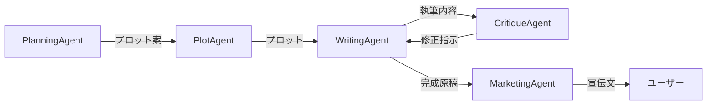

# エージェント相互作用図

```mermaid
graph LR
    PlanningAgent[PlanningAgent] -->|プロット案| PlotAgent[PlotAgent]
    PlotAgent -->|プロット| WritingAgent[WritingAgent]
    WritingAgent -->|執筆内容| CritiqueAgent[CritiqueAgent]
    CritiqueAgent -->|修正指示| WritingAgent
    WritingAgent -->|完成原稿| MarketingAgent[MarketingAgent]
    MarketingAgent -->|宣伝文| User[ユーザー]
```
