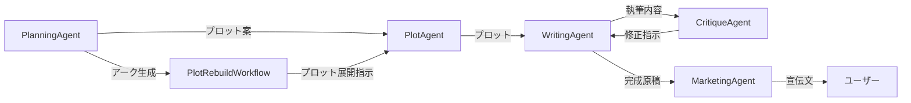

# エージェント相互作用図

## 再構築パイプライン (Proposal C)

プロット再構築は `PlotRebuildWorkflow` がオーケストレーターとして担当する。
`PlanningAgent` はアーク生成 (`generate_arcs`) のみ、`PlotAgent` はプロット展開
(`expand_plots`) のみを担い、再構築ロジックの重複を排除している。
