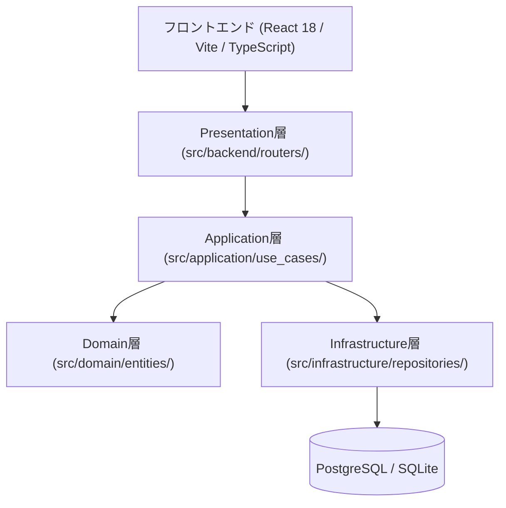

# AutoNovel システムアーキテクチャ仕様書

## 1. 全体構造概要 (Clean / Layered Architecture)

AutoNovel は FastAPI + React 18 を中核とした、マルチエージェント型AI小説生成基盤です。



## 2. レイヤーの責務境界
1. **Presentation層 (`src/backend/routers/`)**:
    - HTTP リクエストの受付、認証/認可（`get_current_user`, `require_admin`）、入力バリデーション、ユースケース呼び出し。
2. **Application層 (`src/application/use_cases/`)**:
    - ビジネスワークフローのオーケストレーション、トランザクション境界（`UnitOfWork`）管理。
3. **Domain層 (`src/domain/`)**:
    - ドメインモデル（`Novel`, `Episode`, `Character` 等）、値オブジェクト、ドメインルール。
4. **Infrastructure層 (`src/infrastructure/`)**:
    - データベース永続化（SQLAlchemy リポジトリ）、外部LLM API、ベクターストア（ChromaDB/pgvector）。
```