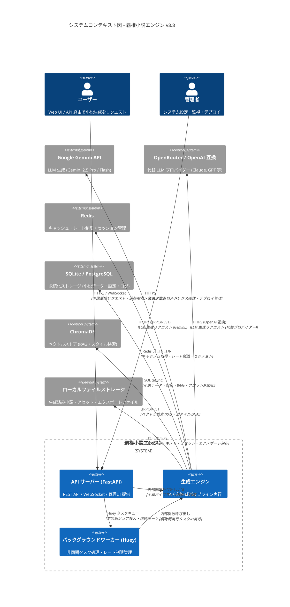

# C4 アーキテクチャ図 - システムコンテキスト図

## 概要
覇権小説エンジン v3.3 のシステム全体像を示す。外部システム・ユーザーとの境界を明確化。

## 境界の説明

| 境界 | 説明 | プロトコル |
|------|------|------------|
| ユーザー ↔ API | フロントエンド・CLI・外部連携からのアクセス | HTTPS, WebSocket |
| 管理者 ↔ API | 運用管理・設定変更・監視 | HTTPS |
| API ↔ Engine | 同期呼び出し・依存性注入 | Python インプロセス |
| API ↔ Worker | 非同期タスクキュー | Huey (SQLite/Redis バックエンド) |
| Engine ↔ 外部 LLM | 推論 API 呼び出し | HTTPS (gRPC/REST) |
| Engine ↔ Redis | キャッシュ・レート制限 | Redis RESP |
| Engine ↔ DB | 永続化 | SQL (aiosqlite/asyncpg) |
| Engine ↔ ChromaDB | ベクトル検索 | gRPC/HTTP |
| Engine ↔ Storage | ファイル I/O | ローカル FS / S3 互換 |

## 非機能要件への対応

- **可用性**: API はステートレス、Worker は冗長化可能
- **拡張性**: Engine は DI コンテナで依存性注入、プロバイダー切替容易
- **セキュリティ**: API キー認証・レート制限・CORS・セキュリティヘッダー
- **観測性**: OpenTelemetry 自動計装・Prometheus メトリクス・構造化ログ