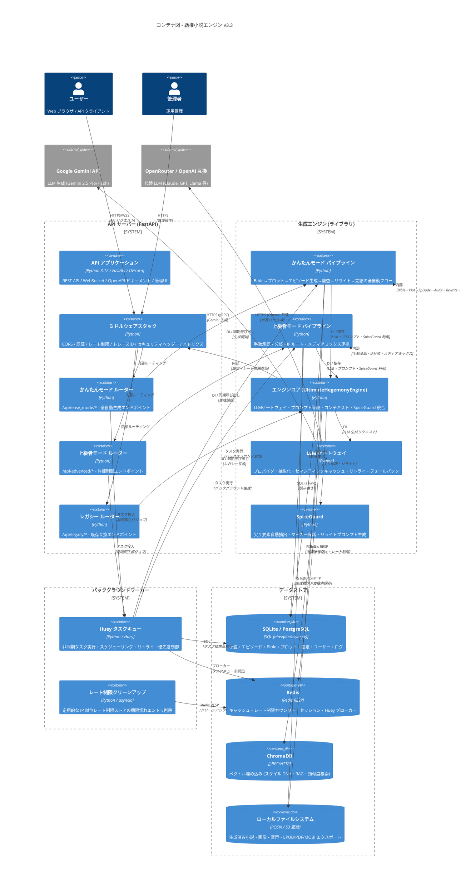

# C4 アーキテクチャ図 - コンテナ図

## 概要
覇権小説エンジン v3.3 のコンテナ（実行単位・デプロイ単位）レベルの構成を示す。



## コンテナ詳細

| コンテナ | 技術スタック | 責務 | スケーリング |
|---------|-------------|------|-------------|
| API アプリケーション | FastAPI + Uvicorn | HTTP 終端・ルーティング・OpenAPI | 水平 (ステートレス) |
| ミドルウェアスタック | Starlette Middleware | 横断的関心事 (認証・CORS・レート制限・トレース) | - |
| かんたんモード ルーター | FastAPI Router | `/api/easy_mode/*` エンドポイント | - |
| 上級者モード ルーター | FastAPI Router | `/api/advanced/*` エンドポイント | - |
| レガシー ルーター | FastAPI Router | 互換性維持 | - |
| かんたんモード パイプライン | Python Library | 全自動生成フロー制御 | - |
| 上級者モード パイプライン | Python Library | 手動承認・分岐・メディアミックス | - |
| エンジンコア | Python Library | LLM・プロンプト・コンテキスト統合 | - |
| LLM ゲートウェイ | Python Library | プロバイダー抽象化・キャッシュ・リトライ | - |
| SpiceGuard | Python Library | 尖り保護・マーカー・リライトプロンプト | - |
| Huey タスクキュー | Huey + SQLite/Redis | 非同期タスク・スケジューリング | 垂直 (単一インスタンス推奨) |
| SQLite/PostgreSQL | aiosqlite/asyncpg | 永続化ストレージ | 読み取りレプリカで水平可 |
| Redis | redis-py | キャッシュ・レート制限・ブローカー | クラスタで水平可 |
| ChromaDB | chromadb-client | ベクトル検索 | シャーディングで水平可 |
| ファイルシステム | ローカル/S3 | 生成物・アセット保存 | オブジェクトストレージで水平可 |

## デプロイメント単位

```
┌─────────────────────────────────────┐
│  Kubernetes Deployment / Docker     │
│  ─────────────────────────────────  │
│  ├─ API Server (FastAPI) x N       │ ← 水平スケール
│  ├─ Huey Worker x M                │ ← タスク並列度制御
│  ├─ Redis (Cluster)                │ ← キャッシュ・キュー
│  ├─ PostgreSQL (Primary/Replica)   │ ← 読み取りスケール
│  ├─ ChromaDB (Cluster)             │ ← ベクトル検索スケール
│  └─ Object Storage (S3/MinIO)      │ ← 生成物ストレージ
└─────────────────────────────────────┘
```

## コンテナ間通信パターン

| From → To | パターン | プロトコル | 非同期/同期 |
|----------|---------|-----------|-------------|
| API → Engine | 同期呼び出し | インプロセス (DI) | 同期 |
| API → Huey | タスク投入 | 関数呼び出し | 非同期 (Fire & Forget) |
| Huey → Pipeline | タスク実行 | 関数呼び出し | 同期 (Worker 内) |
| Engine → LLM | API 呼び出し | HTTPS (gRPC/REST) | 同期 (タイムアウト付き) |
| Engine → Redis | コマンド | Redis RESP | 同期 (ミリ秒) |
| Engine → DB | クエリ | SQL (async) | 同期 |
| Engine → ChromaDB | ベクトル検索 | gRPC/HTTP | 同期 |
| Engine → FS | ファイル I/O | POSIX/S3 API | 同期/非同期 |