# C4 アーキテクチャ図 - コンポーネント図

## 概要
覇権小説エンジンの主要コンポーネント（クラス・モジュールレベル）とその依存関係を示す。

```mermaid
C4Component
    title コンポーネント図 - 覇権小説エンジン v3.3

    Container_Boundary(api, "API サーバー") {
        Component(router_easy, "EasyModeRouter", "FastAPI Router", "/api/easy_mode/generate, /status, /episodes, /report")
        Component(router_adv, "AdvancedRouter", "FastAPI Router", "/api/advanced/*, /plots, /episodes, /marketing")
        Component(middleware, "MiddlewareStack", "Starlette Middleware", "Auth / RateLimit / TraceID / SecurityHeaders / Metrics")
    }

    Container_Boundary(easy, "かんたんモード パイプライン") {
        Component(pipeline, "EasyModePipeline", "Orchestrator", "run() - Bible→Plot→Episode Loop→Finalize 制御")
        Component(bible_gen, "BibleGenerator", "Generator", "generate() - Bible 自動生成・パース・フォールバック")
        Component(plot_gen, "PlotGenerator", "Generator", "generate() - テンション曲線×展開パターンでプロット生成")
        Component(ep_writer, "EpisodeWriter", "Generator", "write() - 執筆プロンプト構築・LLM 呼び出し・リトライ")
        Component(ep_auditor, "EpisodeAuditor", "Auditor", "audit() - 監査エージェント呼び出し・スコア正規化")
        Component(ep_rewriter, "EpisodeRewriter", "Rewriter", "rewrite() - SpiceGuard 付きリライト・マーカー操作")
        Component(finalizer, "SeriesFinalizer", "Finalizer", "finalize() - タイトル・あらすじ・メタデータ生成")
        Component(progress, "ProgressReporter", "Utility", "report() - 進捗コールバック呼び出し")
    }

    Container_Boundary(engine, "エンジンコア") {
        Component(engine_core, "UltimateHegemonyEngine", "Facade", "全依存を保持・DI コンテナから注入")
        Component(llm_gateway, "LLMGenerateResultProxy", "Gateway", "generate_json() / generate_text() / プロバイダー抽象化")
        Component(llm_factory, "LLMProviderFactory", "Factory", "get_client() - モデル名からクライアント選択")
        Component(semantic_cache, "SemanticCacheManager", "Cache", "ベクトルストア活用セマンティックキャッシュ")
        Component(spice_guard, "SpiceGuard", "Guard", "extract_spice() / inject_markers() / build_rewrite_prompt()")
        Component(spice_extractor, "SpiceExtractor", "Extractor", "extract() - 普遍/ジャンル/キャラクター パターンで尖り抽出")
        Component(marker_injector, "SpiceMarkerInjector", "Marker", "inject() / remove() / clean_output() - マーカー操作")
        Component(prompt_builder, "RewritePromptBuilder", "Builder", "build() - SPICE マーカー付きリライトプロンプト構築")
    }

    Container_Boundary(adv, "上級者モード パイプライン") {
        Component(adv_pipeline, "AdvancedPipeline", "Orchestrator", "手動承認・IF分岐・メディアミックス連携")
        Component(if_router, "IFRouter", "Router", "条件分岐ルーティング")
        Component(media_mix, "MediaMixGenerator", "Generator", "漫画台本・音声台本・動画台本生成")
        Component(ebook_exporter, "EbookExporter", "Exporter", "EPUB/PDF/MOBI/HTML 出力")
    }

    Container_Boundary(data, "データアクセス") {
        Component(repo, "DataRepository", "Repository", "CRUD・検索・トランザクション管理")
        Component(db_mgr, "DatabaseManager", "Manager", "接続プール・マイグレーション・セッション管理")
        Component(vector_store, "ChromaVectorStore", "VectorStore", "ベクトル埋め込み保存・類似度検索")
        Component(chroma_provider, "ChromaClientProvider", "Provider", "ChromaDB クライアントライフサイクル管理")
    }

    Container_Boundary(llm, "LLM クライアント") {
        Component(gemini_client, "GeminiApiClient", "Client", "Gemini API (gRPC) - generate_json / generate_text")
        Component(openai_client, "OpenAIApiClient", "Client", "OpenAI 互換 API - generate_json / generate_text")
        Component(engine_client, "EngineLLMClient", "Adapter", "スレッドローカルセマフォ・トークン統計付きアダプター")
    }

    Container_Boundary(worker, "バックグラウンドワーカー") {
        Component(huey_app, "HueyApp", "TaskQueue", "タスク定義・スケジューリング・リトライ・優先度")
        Component(rate_cleanup, "RateLimitCleanup", "BackgroundTask", "定期的な期限切れエントリ削除")
    }

    %% 依存関係
    Rel(router_easy, pipeline, "生成開始", "create_series() → pipeline.run()")
    Rel(router_adv, adv_pipeline, "生成開始", "AdvancedPipeline 起動")
    Rel(middleware, engine_core, "設定参照", "レート制限・設定値取得")

    Rel(pipeline, bible_gen, "Bible生成", "bible_gen.generate(target_eps)")
    Rel(pipeline, plot_gen, "プロット生成", "plot_gen.generate(bible)")
    Rel(pipeline, ep_writer, "執筆", "ep_writer.write(ep_num, bible, plot, context)")
    Rel(pipeline, ep_auditor, "監査", "ep_auditor.audit(content, bible, plot, ep, genre)")
    Rel(pipeline, ep_rewriter, "リライト", "ep_rewriter.rewrite(content, improvements, spices)")
    Rel(pipeline, finalizer, "完結処理", "finalizer.finalize(bible, plot, episodes)")
    Rel(pipeline, progress, "進捗報告", "progress.report(stage, current, total)")

    Rel(bible_gen, llm_gateway, "LLM生成", "generate_json() with retry")
    Rel(plot_gen, llm_gateway, "不使用", "テンプレートベース生成")
    Rel(ep_writer, llm_gateway, "LLM生成", "generate_text() with retry")
    Rel(ep_auditor, engine_core, "監査エージェント", "engine.auditor.audit()")
    Rel(ep_rewriter, llm_gateway, "リライト生成", "generate_text() with retry")
    Rel(ep_rewriter, spice_guard, "尖り抽出・マーカー", "spice_guard.extract_spice() / inject_markers()")
    Rel(finalizer, engine_core, "プリセット参照", "タイトル・あらすじ生成")

    Rel(engine_core, llm_gateway, "LLM生成", "DI 注入")
    Rel(engine_core, llm_factory, "クライアント取得", "get_client(model)")
    Rel(engine_core, semantic_cache, "キャッシュ", "get()/set()")
    Rel(engine_core, spice_guard, "尖り保護", "DI 注入")

    Rel(spice_guard, spice_extractor, "抽出", "extract(text)")
    Rel(spice_guard, marker_injector, "マーカー操作", "inject()/remove()/clean_output()")
    Rel(spice_guard, prompt_builder, "プロンプト構築", "build()")
    Rel(spice_extractor, spice_guard, "パターン参照", "UNIVERSAL_PATTERNS / GENRE_PATTERNS")

    Rel(llm_gateway, llm_factory, "クライアント取得", "get_client(model)")
    Rel(llm_gateway, semantic_cache, "キャッシュ確認", "get(key)")
    Rel(llm_factory, gemini_client, "Gemini 生成", "generate_json/generate_text")
    Rel(llm_factory, openai_client, "OpenAI互換生成", "generate_json/generate_text")
    Rel(engine_client, gemini_client, "アダプター", "スレッドローカルセマフォ・トークン統計")

    Rel(adv_pipeline, if_router, "分岐制御", "条件評価→ルート選択")
    Rel(adv_pipeline, media_mix, "メディア生成", "漫画/音声/動画台本")
    Rel(adv_pipeline, ebook_exporter, "エクスポート", "EPUB/PDF/MOBI/HTML")

    Rel(bible_gen, repo, "Bible 保存", "CRUD 操作")
    Rel(pipeline, repo, "全データ保存", "CRUD 操作")
    Rel(ep_writer, repo, "エピソード保存", "CRUD 操作")
    Rel(repo, db_mgr, "接続管理", "セッション取得・トランザクション")
    Rel(vector_store, chroma_provider, "クライアント取得", "ChromaDB クライアント")
    Rel(engine_core, vector_store, "ベクトル検索", "類似度検索・埋め込み保存")
```



## コンポーネント分類

### オーケストレーション層
| コンポーネント | 役割 | 公開メソッド |
|--------------|------|-------------|
| `EasyModePipeline` | かんたんモード全工程制御 | `run()`, `cancel()`, `_generate_episode()` |
| `AdvancedPipeline` | 上級者モード制御 | `run()`, `add_branch()`, `export_media()` |
| `ProgressReporter` | 進捗通知 | `report(stage, current, total)` |

### 生成層
| コンポーネント | 役割 | 公開メソッド |
|--------------|------|-------------|
| `BibleGenerator` | Bible 自動生成 | `generate(target_episodes)`, `parse()`, `fallback()` |
| `PlotGenerator` | プロット生成 | `generate(bible)`, `interpolate_tension()`, `select_pattern()` |
| `EpisodeWriter` | エピソード執筆 | `write(ep, bible, plot, context)`, `build_prompt()` |
| `EpisodeAuditor` | 監査・スコアリング | `audit(content, bible, plot, ep, genre)` |
| `EpisodeRewriter` | SpiceGuard付きリライト | `rewrite(content, improvements, spices)`, `inject_markers()`, `clean_markers()` |
| `SeriesFinalizer` | 完結・メタデータ生成 | `finalize(bible, plot, episodes)` |

### エンジンコア層
| コンポーネント | 役割 | 公開メソッド |
|--------------|------|-------------|
| `UltimateHegemonyEngine` | 全依存保持・ファサード | プロパティアクセス (`planner`, `writer`, `llm` 等) |
| `LLMGenerateResultProxy` | LLM 生成統一インターフェース | `generate_json()`, `generate_text()`, `get_client()` |
| `LLMProviderFactory` | プロバイダー選択 | `get_client(model)`, `get_available_providers()` |
| `SemanticCacheManager` | セマンティックキャッシュ | `get(key)`, `set(key, value, ttl)` |
| `SpiceGuard` | 尖り保護ファサード | `extract_spice()`, `inject_markers()`, `build_rewrite_prompt()` |
| `SpiceExtractor` | 尖り要素抽出 | `extract(text)`, `_extract_universal()`, `_extract_genre()`, `_extract_character()` |
| `SpiceMarkerInjector` | マーカー操作 | `inject()`, `remove()`, `clean_output()` |
| `RewritePromptBuilder` | リライトプロンプト構築 | `build(content, improvements, elements)` |

### LLM 層
| コンポーネント | 役割 | 公開メソッド |
|--------------|------|-------------|
| `GeminiApiClient` | Gemini API 呼び出し | `generate_json()`, `generate_text()` (gRPC) |
| `OpenAIApiClient` | OpenAI 互換 API 呼び出し | `generate_json()`, `generate_text()` (REST) |
| `EngineLLMClient` | アダプター | `generate_json()`, `generate_text()` (セマフォ・統計付き) |

### データ層
| コンポーネント | 役割 | 公開メソッド |
|--------------|------|-------------|
| `DataRepository` | CRUD 抽象化 | `create()`, `get()`, `update()`, `delete()`, `search()` |
| `DatabaseManager` | 接続管理 | `get_session()`, `init_db()`, `dispose()` |
| `ChromaVectorStore` | ベクトル検索 | `add()`, `search()`, `delete()` |
| `ChromaClientProvider` | クライアント管理 | `get_client()`, `close()` |

## 依存性の方向性（アーキテクチャ原則）

```
API ルーター
    ↓
パイプライン (オーケストレーション)
    ↓
生成コンポーネント (Writer/Auditor/Rewriter/Generator)
    ↓
エンジンコア (LLM Gateway / SpiceGuard / Factory)
    ↓
LLM クライアント / データアクセス / 外部サービス
```

**ルール**: 上位層は下位層のみに依存。循環依存なし。DI コンテナで下位→上位へ注入。

## 主要インターフェース

```python
# LLM 生成統一インターフェース
class BaseLLMClient(ABC):
    async def generate_json(...): ...
    async def generate_text(...): ...

# リポジトリ抽象化
class DataRepository(ABC):
    def create(self, entity): ...
    def get(self, id): ...
    def update(self, entity): ...
    def delete(self, id): ...

# ベクトルストア抽象化
class VectorStore(ABC):
    def add(self, embeddings, metadata): ...
    def search(self, query, k): ...
    def delete(self, ids): ...
```