# C4 アーキテクチャ図 - コードレベル図

## 概要
主要クラス・インターフェースの詳細な関係性とメソッドシグネチャを示す。

```mermaid
classDiagram
    %% ===================== エンジンコア =====================
    class UltimateHegemonyEngine {
        +api_key: str
        +repo: DataRepository
        +db: DatabaseManager
        +llm: LLMGenerateResultProxy
        +cooldown: AdaptiveCooldown
        +plot_service: PlotService
        +planner: PlanningAgent
        +writer: WritingAgent
        +pm: PromptManager
        +ctx_mgr: ContextManager
        +formatter: TextFormatter
        +validator: LogicalAuditor
        +auditor: LogicalAuditor
        +narrative: NarrativeController
        +critique: CritiqueAgent
        +marketing: MarketingAgent
        +bible_agent: WorldBibleGenerator
        +plot_agent: PlotAgent
        +style_rag: StyleRagManager
        +__init__(api_key, repo, db, llm, cooldown, plot_service, planner, writer, pm, ctx_mgr, formatter, validator, auditor, narrative, critique, marketing, bible_agent, plot_agent, style_rag)
        +dispose()
        +sync_bible(book_id, reporter)
        +resolve_bible_setting(setting_id, status)
        +determine_target_tension(book_id, ep_num, genre, story_type)
        +validate_tension_deviation(ep_num, tension, book_id, tolerance)
    }

    class LLMGenerateResultProxy {
        +llm_factory: LLMProviderFactory
        +__init__(llm_factory)
        +get_client(model_name) BaseLLMClient
        +generate_json(purpose, prompt, schema, system, temp, model, stream_cb) GenerateResult
        +generate_text(purpose, prompt, system, temp, model, stream_cb) GenerateResult
        +_normalize_response(response) _Response
        +_usage_metric(usage, key, default) int
    }

    class LLMProviderFactory {
        +genai_client: genai.Client
        +cooldown: AdaptiveCooldown
        +__init__(genai_client, cooldown)
        +get_client(provider) BaseLLMClient
        +get_available_providers() List[str]
    }

    class SemanticCacheManager {
        +vector_store: ChromaVectorStore
        +__init__(vector_store)
        +get(key) Any
        +set(key, value, ttl)
    }

    %% ===================== LLM クライアント =====================
    class BaseLLMClient {
        <<abstract>>
        +generate_json(model, prompt, system, schema, temp, max_retries, stream_cb, retry_state, nsfw) Tuple[Dict, str, Any]
        +generate_text(model, prompt, system, temp, max_retries, stream_cb, retry_state, nsfw) Tuple[str, Any]
    }

    class GeminiApiClient {
        +client: genai.Client
        +cooldown: AdaptiveCooldown
        +__init__(client, cooldown)
        +generate_json(...) Tuple[Dict, str, Any]
        +generate_text(...) Tuple[str, Any]
    }

    class OpenAIApiClient {
        +cooldown: AdaptiveCooldown
        +base_url: str
        +api_key: str
        +__init__(cooldown, base_url, api_key)
        +generate_json(...) Tuple[Dict, str, Any]
        +generate_text(...) Tuple[str, Any]
    }

    class EngineLLMClient {
        +ai_api: GeminiApiClient
        +_local: threading.local
        +__init__(ai_api)
        +generate_json(model, prompt, schema, system, temp, ep_num, stream_cb) GenerateResult
        +generate_text(...) GenerateResult
        +_safe_update_token_stats(prompt, completion, reporter)
    }

    %% ===================== LLM ゲートウェイ =====================
    class LLMGenerateResultProxy {
        +llm_factory: LLMProviderFactory
        +generate_json(purpose, prompt, schema, system, temp, model, stream_cb) GenerateResult
        +generate_text(purpose, prompt, system, temp, model, stream_cb) GenerateResult
    }

    %% ===================== パイプライン =====================
    class EasyModePipeline {
        +engine: UltimateHegemonyEngine
        +config: PipelineConfig
        +preset: Dict
        +_cancelled: bool
        +retry_config: RetryConfig
        +bible_generator: BibleGenerator
        +plot_generator: PlotGenerator
        +episode_writer: EpisodeWriter
        +episode_auditor: EpisodeAuditor
        +episode_rewriter: EpisodeRewriter
        +series_finalizer: SeriesFinalizer
        +progress_reporter: ProgressReporter
        +__init__(engine, config, bible_gen, plot_gen, ep_writer, ep_auditor, ep_rewriter, finalizer, progress, retry)
        +run() SeriesResult
        +cancel()
        +_generate_episode(ep, bible, plot, prev) EpisodeResult
        +_build_prev_context(episodes) str
    }

    class PipelineConfig {
        +genre: str
        +target_episodes: int
        +max_rewrite_iterations: int
        +target_audit_score: float
        +enable_spice_guard: bool
        +progress_callback: Callable
    }

    class BibleGenerator {
        +preset: Dict
        +engine_llm: LLMGenerateResultProxy
        +retry_config: RetryConfig
        +generate(target_eps) Dict
        +parse(text) Dict
        +fallback(variables) Dict
        +_get_preset_defaults() Dict
        +_generate_with_retry(prompt, vars, op) str
        +cancel()
    }

    class PlotGenerator {
        +preset: Dict
        +target_episodes: int
        +generate(bible) List[Dict]
        +interpolate_tension(progress, curve) float
        +select_pattern(ep, is_catharsis) Dict
    }

    class EpisodeWriter {
        +engine_llm: LLMGenerateResultProxy
        +preset: Dict
        +retry_config: RetryConfig
        +write(ep, bible, plot, context) str
        +build_prompt(ep, bible, plot, context, style, hooks, erotic) str
        +_generate_with_retry(prompt, vars, op) str
        +cancel()
    }

    class EpisodeAuditor {
        +engine_auditor: LogicalAuditor
        +target_audit_score: float
        +audit(content, bible, plot, ep, genre) AuditResult
        +cancel()
    }

    class AuditResult {
        +score: float
        +passed: bool
        +issues: List[str]
        +improvements: List[str]
        +needs_human_review: bool
        +details: Dict
    }

    class EpisodeRewriter {
        +engine_llm: LLMGenerateResultProxy
        +genre: str
        +retry_config: RetryConfig
        +spice_guard: SpiceGuard
        +rewrite(content, improvements, spices) str
        +inject_markers(content, elements) str
        +clean_markers(text) str
        +build_prompt(content, improvements, elements) str
        +extract_spice(text) List[SpiceElement]
        +_generate_with_retry(prompt, vars, op) str
        +cancel()
    }

    class SeriesFinalizer {
        +preset: Dict
        +finalize(bible, plot, episodes) Dict
    }

    class ProgressReporter {
        +callback: Callable
        +report(stage, current, total)
    }

    %% ===================== SpiceGuard =====================
    class SpiceGuard {
        +genre: str
        +extractor: SpiceExtractor
        +marker: SpiceMarkerInjector
        +prompt_builder: RewritePromptBuilder
        +extract_spice(text) List[SpiceElement]
        +inject_markers(text, elements) str
        +remove_markers(text) str
        +build_rewrite_prompt(content, improvements, elements) str
        +clean_output(text) str
    }

    class SpiceExtractor {
        +genre: str
        +compiled_patterns: Dict
        +universal_patterns: Dict
        +genre_patterns: Dict
        +preset: Dict
        +extract(text) List[SpiceElement]
        +_extract_universal(text) List[SpiceElement]
        +_extract_genre(text) List[SpiceElement]
        +_extract_character(text) List[SpiceElement]
        +_deduplicate_and_sort(elements) List[SpiceElement]
    }

    class SpiceMarkerInjector {
        +inject(text, elements) str
        +remove(text) str
        +clean_output(text) str
    }

    class RewritePromptBuilder {
        +marker_injector: SpiceMarkerInjector
        +build(content, improvements, elements) str
    }

    class SpiceElement {
        +type: str
        +text: str
        +position: int
        +priority: str
        +metadata: Dict
    }

    %% ===================== データモデル =====================
    class EpisodeResult {
        +episode_num: int
        +title: str
        +content: str
        +word_count: int
        +audit_score: float
        +audit_passed: bool
        +rewrite_count: int
        +spice_elements: List[SpiceElement]
        +metadata: Dict
        +needs_human_review: bool
    }

    class SeriesResult {
        +genre: str
        +title: str
        +concept: str
        +total_episodes: int
        +episodes: List[EpisodeResult]
        +bible: Dict
        +plot_outline: List[Dict]
        +metadata: Dict
        +created_at: datetime
        +status: str
    }

    %% ===================== DI コンテナ =====================
    class InfraContainer {
        +config: Settings
        +global_config: GlobalConfig
        +db: DatabaseManager
        +chroma_client_provider: ChromaClientProvider
        +vector_store: ChromaVectorStore
        +audit_logger: Logger
        +cooldown: AdaptiveCooldown
        +max_concurrent_api_calls: int
        +concurrency_semaphore: asyncio.Semaphore
    }

    class AppContainer2 {
        +InfraContainer
        +api_key: str
        +repo: DataRepository
        +llm: LLMGenerateResultProxy
        +plot_service: PlotService
        +planner: PlanningAgent
        +writer: WritingAgent
        +pm: PromptManager
        +ctx_mgr: ContextManager
        +auditor: LogicalAuditor
        +marketing: MarketingAgent
        +bible_generator: WorldBibleGenerator
        +plot_expander: PlotAgent
        +validator: LogicalAuditor
        +narrative: NarrativeController
        +critique: CritiqueAgent
        +style_rag: StyleRagManager
        +formatter: TextFormatter
        +engine: UltimateHegemonyEngine
        +engine_facade: UltimateHegemonyEngine
    }

    %% ===================== 設定 =====================
    class Settings {
        +model_writing: str
        +model_planning: str
        +model_plot_expansion: str
        +model_climax: str
        +model_stable_fallback: str
        +model_ultra_stable: str
        +model_embedding: str
        +openai_base_url: str
        +openai_api_key: str
        +database_url: str
        +redis_url: str
        +redis_max_connections: int
        +redis_default_ttl: int
        +redis_namespace: str
        +prompt_cache_max_size: int
        +context_window_target_ratio: float
        +context_window_min_reserve: int
        +context_trimming_enabled: bool
        +prefetch_enabled: bool
        +prefetch_episode_count: int
        +hybrid_search_alpha: float
        +stress_catharsis_threshold: int
        +stress_filler_threshold: int
        +stress_climax_bonus: int
        +stress_hate_gain_base: int
        +max_history_len: int
        +auto_backup: bool
        +safe_append_mode: str
        +cooldown_base: float
        +cooldown_min: float
        +cooldown_max: float
        +max_concurrency: int
        +max_concurrent_api_calls: int
        +optimized_prompt_patch: str
        +fail_fast_mode: bool
        +enable_dogfeeding: bool
        +enable_heavy_audit: bool
        +draft_polish_enabled: bool
        +polishing_min_content_ratio: float
        +actor_critic_enabled: bool
        +actor_critic_max_iterations: int
        +actor_critic_severity_threshold: str
        +specialized_amplifier_enabled: bool
        +enable_nsfw: bool
        +safety_filter_level: str
        +catharsis_threshold: int
        +catharsis_reset_value: int
        +wave_pattern_ratio: Dict
        +catharsis_density_range: Dict
        +min_immersion_score: float
        +cost_input_flash: float
        +cost_input_pro: float
        +cost_output_flash: float
        +cost_output_pro: float
        +content_separator: str
        +max_prompt_chars: int
        +default_golden_peaks: int
        +nsfw_default_enabled: bool
        +cors_allowed_origins: str
        +api_host: str
        +api_port: int
        +log_level: str
        +ENV_OVERRIDE_MAP: Dict
        +get_settings() Settings
        +reset_settings()
        +get_auto_concurrency() int
        +validate_consistency() List[str]
    }

    %% ===================== 関係 =====================
    AppContainer2 --> InfraContainer : 継承
    InfraContainer --> Settings : 生成
    AppContainer2 --> UltimateHegemonyEngine : 生成 (全依存注入)
    UltimateHegemonyEngine --> LLMGenerateResultProxy : 保持
    UltimateHegemonyEngine --> LLMProviderFactory : 保持
    UltimateHegemonyEngine --> SemanticCacheManager : 保持
    UltimateHegemonyEngine --> SpiceGuard : 保持
    LLMGenerateResultProxy --> LLMProviderFactory : 保持
    LLMProviderFactory ..> BaseLLMClient : 生成
    BaseLLMClient <|-- GeminiApiClient
    BaseLLMClient <|-- OpenAIApiClient
    EngineLLMClient --> GeminiApiClient : アダプター
    EasyModePipeline --> BibleGenerator : 保持
    EasyModePipeline --> PlotGenerator : 保持
    EasyModePipeline --> EpisodeWriter : 保持
    EasyModePipeline --> EpisodeAuditor : 保持
    EasyModePipeline --> EpisodeRewriter : 保持
    EasyModePipeline --> SeriesFinalizer : 保持
    EasyModePipeline --> ProgressReporter : 保持
    BibleGenerator --> LLMGenerateResultProxy : 保持
    EpisodeWriter --> LLMGenerateResultProxy : 保持
    EpisodeAuditor --> LogicalAuditor : 保持
    EpisodeRewriter --> LLMGenerateResultProxy : 保持
    EpisodeRewriter --> SpiceGuard : 保持
    SeriesFinalizer --> Dict : preset 保持
    ProgressReporter --> Callable : callback 保持
    SpiceGuard --> SpiceExtractor : 保持
    SpiceGuard --> SpiceMarkerInjector : 保持
    SpiceGuard --> RewritePromptBuilder : 保持
    SpiceExtractor --> Dict : パターン定義参照
    SpiceMarkerInjector ..> SpiceElement : 操作
    RewritePromptBuilder --> SpiceMarkerInjector : 保持
    SpiceElement : データクラス
    EpisodeResult : データクラス
    SeriesResult : データクラス
    PipelineConfig : データクラス
    AuditResult : データクラス
    AppContainer2 --> UltimateHegemonyEngine : 生成
    EasyModePipeline ..> EpisodeResult : 生成
    EasyModePipeline ..> SeriesResult : 生成
```



## 主要クラス詳細

### UltimateHegemonyEngine (エンジンコアファサード)
```python
class UltimateHegemonyEngine:
    def __init__(
        self,
        api_key: str,
        repo: Optional[DataRepository] = None,
        db: Optional[DatabaseManager] = None,
        llm: Optional[LLMGenerateResultProxy] = None,
        cooldown: Optional[AdaptiveCooldown] = None,
        plot_service: Optional[PlotService] = None,
        planner: Optional[PlanningAgent] = None,
        writer: Optional[WritingAgent] = None,
        pm: Optional[PromptManager] = None,
        ctx_mgr: Optional[ContextManager] = None,
        formatter: Optional[TextFormatter] = None,
        validator: Optional[LogicalAuditor] = None,
        auditor: Optional[LogicalAuditor] = None,
        narrative: Optional[NarrativeController] = None,
        critique: Optional[CritiqueAgent] = None,
        marketing: Optional[MarketingAgent] = None,
        bible_agent: Optional[WorldBibleGenerator] = None,
        plot_agent: Optional[PlotAgent] = None,
        style_rag: Optional[StyleRagManager] = None,
    ) -> None:
        # 全依存を明示的に属性として保存
        self._planner = planner
        self._writer = writer
        # ... 他の依存も同様
```

**特徴**:
- 全依存をコンストラクタで明示的に受け取り（DI 対応）
- プロパティ経由でアクセス時、未設定なら `_legacy_dep` にフォールバック（DeprecationWarning 付き）
- `ai_api` / `llm_client` は `FutureWarning` 付きで `llm` へリダイレクト

### EasyModePipeline (かんたんモード オーケストレーター)
```python
class EasyModePipeline:
    def __init__(
        self,
        engine: UltimateHegemonyEngine,
        config: PipelineConfig,
        bible_generator: Optional[BibleGenerator] = None,
        plot_generator: Optional[PlotGenerator] = None,
        episode_writer: Optional[EpisodeWriter] = None,
        episode_auditor: Optional[EpisodeAuditor] = None,
        episode_rewriter: Optional[EpisodeRewriter] = None,
        series_finalizer: Optional[SeriesFinalizer] = None,
        progress_reporter: Optional[ProgressReporter] = None,
        retry_config: Optional[RetryConfig] = None,
    ) -> None:
        # DI 未指定なら自動生成
        self.bible_generator = bible_generator or BibleGenerator(...)
        # ...

    async def run(self) -> SeriesResult:
        # 1. Bible生成
        bible = await limit_concurrency(self.bible_generator.generate(...))
        # 2. プロット生成
        plot_outline = self.plot_generator.generate(bible)
        # 3. 各話生成ループ
        for ep_num in range(1, target_eps + 1):
            episode = await limit_concurrency(self._generate_episode(...))
        # 4. 完結処理
        return SeriesResult(...)
```

**特徴**:
- 全サブモジュールを DI で受け取り（テスタビリティ確保）
- `limit_concurrency` でグローバルセマフォ制御
- キャンセル・進捗報告・リトライ内蔵

### SpiceGuard (尖り保護システム)
```python
class SpiceGuard:
    def __init__(self, genre: str):
        self.genre = genre
        self.extractor = SpiceExtractor(genre)
        self.marker = SpiceMarkerInjector()
        self.prompt_builder = RewritePromptBuilder(self.marker)

    def extract_spice(self, text: str) -> List[SpiceElement]:
        return self.extractor.extract(text)

    def inject_markers(self, text: str, elements: List[SpiceElement]) -> str:
        return self.marker.inject(text, elements)

    def build_rewrite_prompt(self, content, improvements, elements) -> str:
        return self.prompt_builder.build(content, improvements, elements)
```

**抽出フロー**:
```
text → SpiceExtractor.extract()
    → _extract_universal()     # 普遍パターン (正規表現)
    → _extract_genre()         # ジャンル別パターン (キーワード/正規表現)
    → _extract_character()     # キャラクター固有 (プリセットから)
    → _deduplicate_and_sort()  # 重複除去・優先度ソート
    → List[SpiceElement]
```

### LLMGenerateResultProxy (LLM 生成統一プロキシ)
```python
class LLMGenerateResultProxy:
    async def generate_json(
        self,
        purpose_or_request: Union[str, LLMRequestOptions] = "writing",
        prompt: str = "",
        response_schema: Any = None,
        system_instruction: Optional[str] = None,
        temp: float = 0.7,
        model_name: Optional[str] = None,
        stream_callback: Optional[Callable] = None,
    ) -> GenerateResult:
        # LLMRequestOptions なら展開、文字列なら purpose としてモデル解決
        # provider = self.get_client(model)
        # response = await provider.generate_json(...)
        # return GenerateResult(...)

    async def generate_text(...) -> GenerateResult: ...
```

**特徴**:
- `@overload` で `Union[str, LLMRequestOptions]` を型安全に処理
- `purpose` 文字列なら `resolve_model()` / `select_model()` でモデル決定
- セマンティックキャッシュ・リトライ・フォールバックは下位層で実装

### DI コンテナ (InfraContainer / AppContainer2)
```python
class InfraContainer(containers.DeclarativeContainer):
    config = providers.Singleton(get_settings)  # pydantic-settings BaseSettings
    global_config = providers.Singleton(GlobalConfig)
    db = providers.Singleton(DatabaseManager, db_url=lambda c: c.database_url)
    chroma_client_provider = providers.Singleton(ChromaClientProvider, db_path=lambda c: str(c.chroma_db_path))
    vector_store = providers.Singleton(ChromaVectorStore, client_provider=chroma_client_provider)
    cooldown = providers.Singleton(AdaptiveCooldown, base_sec=2.0, min_sec=0.5, max_sec=10.0)
    max_concurrent_api_calls = providers.Singleton(lambda c: c.max_concurrent_api_calls, config)
    concurrency_semaphore = providers.Factory(asyncio.Semaphore, max_concurrent_api_calls)

class AppContainer2(InfraContainer):
    api_key = providers.Object("DUMMY")  # 本番は環境変数から
    repo = providers.Singleton(DataRepository)
    llm = providers.Singleton(LLMGenerateResultProxy, llm_factory=InfraContainer.llm_factory)
    plot_service = providers.Singleton(PlotService, repo=repo)
    planner = providers.Singleton(PlanningAgent, ...)
    writer = providers.Singleton(WritingAgent, ...)
    pm = providers.Singleton(PromptManager)
    ctx_mgr = providers.Singleton(ContextManager)
    auditor = providers.Singleton(LogicalAuditor)
    marketing = providers.Singleton(MarketingAgent)
    bible_generator = providers.Singleton(WorldBibleGenerator)
    plot_expander = providers.Singleton(PlotAgent)
    validator = providers.Singleton(LogicalAuditor)
    narrative = providers.Singleton(NarrativeController)
    critique = providers.Singleton(CritiqueAgent)
    style_rag = providers.Singleton(StyleRagManager)
    formatter = providers.Singleton(TextFormatter)

    engine = providers.Factory(UltimateHegemonyEngine,
        api_key=api_key, repo=repo, db=InfraContainer.db, llm=llm,
        cooldown=InfraContainer.cooldown, plot_service=plot_service,
        planner=planner, writer=writer, pm=pm, ctx_mgr=ctx_mgr,
        formatter=formatter, validator=validator, auditor=auditor,
        narrative=narrative, critique=critique, marketing=marketing,
        bible_agent=bible_generator, plot_agent=plot_expander, style_rag=style_rag
    )
```

**特徴**:
- `InfraContainer` でインフラ層、`AppContainer2` でアプリ層を分離
- 全依存を `AppContainer2.engine` で明示的に注入（循環依存回避）
- `concurrency_semaphore` は `Factory` で遅延生成（イベントループ作成後）
- `providers.Callable` で設定値から導出値を生成