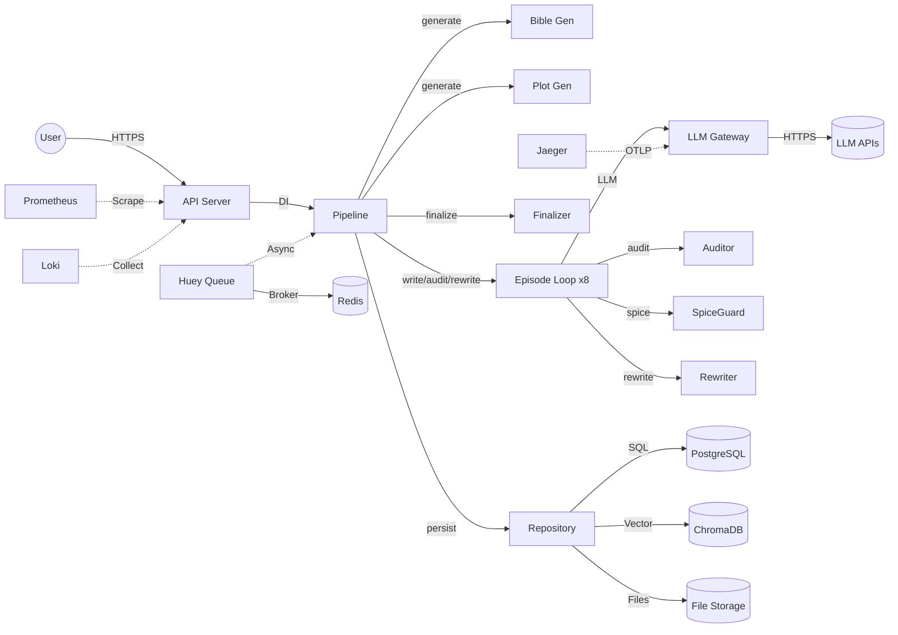

# データフロー図

## 概要
覇権小説エンジンにおけるデータの流れと変換、ストレージ間の移動、機密情報の取り扱いを示す。

```mermaid
flowchart TD
    %% ===================== 外部入力 =====================
    User((ユーザー)) -->|HTTPS POST /api/easy_mode/generate\n{genre, target_eps}| API[APIサーバー\nFastAPI]
    Admin((管理者)) -->|HTTPS 管理操作| API
    
    %% ===================== API 層 =====================
    API -->|認証・レート制限\nトレースID生成| Middleware[ミドルウェアスタック]
    Middleware -->|ルーティング| RouterEasy[かんたんモード ルーター]
    Middleware -->|ルーティング| RouterAdv[上級者モード ルーター]
    
    %% ===================== パイプライン層 =====================
    RouterEasy -->|create_series().run()| Pipeline[EasyModePipeline]
    
    %% === Step 1: Bible生成 ===
    Pipeline -->|bible_gen.generate(target_eps)| BibleGen[BibleGenerator]
    BibleGen -->|プリセット変数構築| PresetLoader[プリセットローダー]
    PresetLoader -.->|YAML/JSON/Jinja2| PresetFiles[(プリセットファイル群\nzarma/, aku_reijo/...)]
    BibleGen -->|generate_json(purpose="bible")| LLMGateway[LLMゲートウェイ]
    LLMGateway -->|get_client("gemini")| LLMFactory[LLMProviderFactory]
    LLMFactory -.->|GeminiApiClient| LLMClient[LLMクライアント]
    LLMClient -->|HTTPS gRPC| GeminiAPI[(Google Gemini API)]
    GeminiAPI -.->|JSONレスポンス| LLMClient
    LLMClient -.->|正規化| LLMGateway
    LLMGateway -.->|GenerateResult| BibleGen
    BibleGen -->|parse() / fallback()| BibleDict[Bible Dict]
    
    %% === Step 2: プロット生成 ===
    Pipeline -->|plot_gen.generate(bible)| PlotGen[PlotGenerator]
    PlotGen -->|テンション曲線補間\n展開パターン選択| PlotOutline[List[PlotDict]]
    PlotGen -.->|テンプレートのみ| LLMGateway
    
    %% === Step 3: 各話生成ループ ===
    loop 8話
        Pipeline -->|_build_prev_context()| PrevContext[前話要約]
        Pipeline -->|ep_writer.write(ep, bible, plot, context)| EpWriter[EpisodeWriter]
        EpWriter -->|build_prompt(Style DNA, Hooks, Erotic Rules)| PromptBuilder[プロンプト構築]
        EpWriter -->|generate_text(purpose="writing")| LLMGateway
        LLMGateway -->|get_client(model)| LLMFactory
        LLMFactory -.->|Gemini/OpenAI| LLMClient
        LLMClient -->|HTTPS| LLMProviders[(外部LLMプロバイダー\nGemini / OpenRouter / OpenAI)]
        LLMProviders -.->|生成テキスト| LLMClient
        LLMClient -.->|正規化| LLMGateway
        LLMGateway -.->|GenerateResult| EpWriter
        EpWriter -.->|コンテンツ| Pipeline
        
        Pipeline -->|ep_auditor.audit(content, bible, plot, ep, genre)| EpAuditor[EpisodeAuditor]
        EpAuditor -->|engine.auditor.audit()| EngineAuditor[LogicalAuditor/監査エージェント]
        EngineAuditor -.->|監査結果 (score, issues, improvements)| EpAuditor
        EpAuditor -.->|AuditResult (score 0-100)| Pipeline
        
        alt スコア < 95 かつ リライト回数 < 3
            Pipeline -->|ep_rewriter.rewrite(content, improvements, spices)| EpRewriter[EpisodeRewriter]
            EpRewriter -->|extract_spice(content)| SpiceGuard[SpiceGuard]
            SpiceGuard -->|extractor.extract()| SpiceExtractor[SpiceExtractor]
            SpiceExtractor -.->|普遍/ジャンル/キャラパターン| PatternRegistry[PatternRegistry]
            SpiceExtractor -.->|キャラ禁句/キャッチフレーズ| PresetLoader
            SpiceExtractor -.->|List[SpiceElement]| SpiceGuard
            SpiceGuard -.->|List[SpiceElement]| EpRewriter
            EpRewriter -->|inject_markers()| MarkerInjector[SpiceMarkerInjector]
            MarkerInjector -.->|protected_content| EpRewriter
            EpRewriter -->|PromptBuilder.build()| PromptBuilder2[RewritePromptBuilder]
            PromptBuilder2 -->|SPICEマーカー付きプロンプト| EpRewriter
            EpRewriter -->|generate_text(purpose="rewrite")| LLMGateway
            LLMGateway -.->|LLMFactory → LLMClient → LLMProviders| RewrittenText[リライト済みテキスト]
            EpRewriter -->|clean_markers()| MarkerInjector
            MarkerInjector -.->|clean_content| EpRewriter
            EpRewriter -.->|最終コンテンツ| Pipeline
            Pipeline -->|再監査| EpAuditor
        end
    end
    
    %% === Step 4: 完結処理 ===
    Pipeline -->|finalizer.finalize(bible, plot, episodes)| Finalizer[SeriesFinalizer]
    Finalizer -.->|タイトル・あらすじ・タグ・キャッチコピー| Metadata[メタデータ Dict]
    Finalizer -.->|SeriesResult| Pipeline
    
    %% === 永続化 ===
    Pipeline -->|repo.create() / update()| Repo[DataRepository]
    Repo -->|SQL (async)| DB[(SQLite / PostgreSQL\n小説・エピソード・Bible・プロット)]
    Pipeline -->|vector_store.add()| VectorStore[ChromaVectorStore]
    VectorStore -->|埋め込み生成・保存| ChromaDB[(ChromaDB\nベクトル埋め込み)]
    Pipeline -->|fs.write()| FileStorage[(ローカルFS / S3\n生成済み小説・アセット)]
    
    %% === 非同期バックグラウンド ===
    RouterEasy -.->|Huey タスク投入| Huey[Huey Task Queue]
    Huey -->|Worker 実行| WorkerPipeline[Pipeline (バックグラウンド)]
    Huey -.->|Redis ブローカー| Redis[(Redis\nタスクキュー・キャッシュ・レート制限)]
    Huey -.->|結果永続化| DB
    
    %% === 定期クリーンアップ ===
    Scheduler[Huey スケジューラ] -.->|定期実行| RateCleanup[RateLimitCleanup]
    RateCleanup -->|期限切れ削除| Redis
    
    %% === 観測性 ===
    Pipeline -.->|MetricsMiddleware| Prometheus[(Prometheus\nkaku_*_metrics)]
    Pipeline -.->|StructuredLogger + TraceContext| Loki[(Loki / ログ集約)]
    LLMGateway -.->|OpenTelemetry| Jaeger[(Jaeger / トレース)]
    API -.->|TraceContext.set_trace_id()| TraceContext[TraceContext\ncontextvars]
```

## データ変換フロー詳細

### 1. Bible生成フロー

```
入力: genre="zarma", target_episodes=8
    │
    ├─ プリセット読み込み (YAML/Jinja2)
    │     ├─ episode_structure (humiliation_ep=2, trigger_ep=3...)
    │     ├─ style_dna, hooks, erotic_rules, characters
    │
    ├─ 変数マージ
    │     ├─ world_rules_json="{}"
    │     ├─ concept, protagonist_name, betrayal_type...
    │     ├─ humiliation_ep="2", trigger_ep="3"...
    │
    ├─ LLM生成 (generate_json, purpose="bible")
    │     ├─ プロンプト: bible_template.j2 + variables
    │     ├─ スキーマ: BibleSchema (Pydantic)
    │
    ├─ パース
    │     ├─ 成功: JSON.parse() → Dict
    │     └─ 失敗: fallback(variables) → Dict (generation_failed=true)
    │
    └─ 出力: Bible Dict (world, concept, protagonist, cheat_ability...)
```

### 2. エピソード生成フロー (1話分)

```
入力: ep_num=3, bible, plot, prev_episodes
    │
    ├─ 前話要約構築 (_build_prev_context)
    │     └─ 直近3話の title + content[:200]...
    │
    ├─ 執筆 (EpisodeWriter)
    │     ├─ プロンプト構築
    │     │     ├─ Bible, Plot, PrevContext
    │     │     ├─ Style DNA, Hooks, Erotic Rules
    │     │     └─ 制約: POV漏れ禁止, Show Don't Tell, フック必須...
    │     ├─ LLM生成 (generate_text, purpose="writing", リトライ3回)
    │     └─ 出力: コンテンツ文字列
    │
    ├─ 監査 (EpisodeAuditor)
    │     ├─ engine.auditor.audit(content, context)
    │     ├─ スコア正規化 (1000点→100点)
    │     └─ 出力: AuditResult (score, passed, issues, improvements)
    │
    ├─ リライト (EpisodeRewriter) ※スコア<95の場合
    │     ├─ SpiceGuard.extract_spice() → List[SpiceElement]
    │     ├─ MarkerInjector.inject() → SPICEマーカー注入
    │     ├─ PromptBuilder.build() → 改善指示 + マーカー付き原文
    │     ├─ LLM生成 (generate_text, purpose="rewrite", リトライ3回)
    │     ├─ MarkerInjector.clean_markers() → マーカー除去
    │     └─ 最大3回繰り返し
    │
    └─ 出力: EpisodeResult
          episode_num, title, content, word_count,
          audit_score, audit_passed, rewrite_count,
          spice_elements, metadata, needs_human_review
```

### 3. 完結・メタデータ生成フロー

```
入力: bible, plot_outline, episodes[]
    │
    ├─ 総文字数 = Σ ep.word_count
    ├─ 平均監査スコア = avg(ep.audit_score)
    ├─ タイトル生成 (preset.titles.title_templates[0])
    ├─ あらすじ生成 (preset.marketing.synopsis_structure)
    ├─ タグ生成 (preset.marketing.tags[:10])
    ├─ キャッチコピー生成 (preset.marketing.catchphrase_templates[0])
    │
    └─ 出力: metadata Dict
          title, concept, total_words, average_audit_score,
          episodes_completed, synopsis, tags, catchphrase
```

## ストレージ別データ配置

| ストレージ | データ種別 | スキーマ/形式 | アクセスパターン |
|-----------|-----------|--------------|-----------------|
| SQLite/PostgreSQL | 小説・エピソード・Bible・プロット・ユーザー・設定・ログ | SQL (SQLAlchemy ORM) | CRUD, 検索, トランザクション |
| Redis | キャッシュ, レート制限カウンター, セッション, Huey ブローカー | キーバリュー (TTL付き) | 高速読み書き, Pub/Sub |
| ChromaDB | ベクトル埋め込み (スタイル DNA, RAG, 類似度検索) | ベクトル + メタデータ | 類似度検索 (k-NN) |
| ローカルFS/S3 | 生成済み小説テキスト, 画像, 音声, EPUB/PDF/MOBI | ファイル (パス: /storage/{book_id}/) | ストリーミング読み書き |
| ファイルシステム (プリセット) | ジャンル別テンプレート (YAML/JSON/Jinja2) | 構造化データ | 起動時読み込み, 参照のみ |

## 機密情報の取り扱い

| 情報種別 | 保存場所 | 暗号化 | アクセス制御 |
|---------|---------|-------|-------------|
| API キー (Gemini, OpenRouter) | 環境変数 / .env | OS キーリング推奨 | プロセスメモリのみ, ログ出力禁止 |
| データベース URL (認証含む) | 環境変数 / settings.toml | 暗号化推奨 | 接続プール内のみ |
| ユーザー生成コンテンツ | DB / FS | 保存時暗号化 (将来) | RBAC (著者のみアクセス) |
| トレース ID | メモリ (contextvars) / ヘッダー | なし (PII 非含有) | リクエスト単位で自動クリア |
| LLM 送信プロンプト | 一時メモリ / ログ (マスク) | なし | LLM プロバイダーのポリシー準拠 |

### セキュリティ対策

1. **API キー**: コードにハードコード禁止、環境変数 `KAKU_GEMINI_API_KEY`, `KAKU_OPENAI_API_KEY` から読み込み
2. **ログマスキング**: `StructuredLogger` で `api_key`, `password`, `token` 等を自動マスク
3. **レート制限**: IP/APIキー単位、メモリ/Redis ストア、TTL 自動削除
4. **CORS**: `config.cors_config` で許可オリジン制限
5. **セキュリティヘッダー**: `X-Content-Type-Options: nosniff`, `X-Frame-Options: DENY`, `CSP` 等
6. **入力検証**: Pydantic モデルで全 API 入力をバリデーション

## データフロー図 (簡略版)



## データライフサイクル

| データ | 作成 | 更新 | 削除 | 保持期間 |
|--------|------|------|------|---------|
| Bible | 生成時 | 同期時 | 書籍削除時 | 永続 |
| エピソード | 生成時 | リライト時 | 書籍削除時 | 永続 |
| プロット | 生成時 | 再生成時 | 書籍削除時 | 永続 |
| 監査ログ | 監査時 | - | 書籍削除時 | 1年 (設定可) |
| LLM 使用量 | 呼び出し時 | - | - | 30日 |
| レート制限 | リクエスト時 | TTL 経過 | 自動 | 60秒ウィンドウ |
| トレース | リクエスト時 | 完了時 | 即時 | メモリのみ |