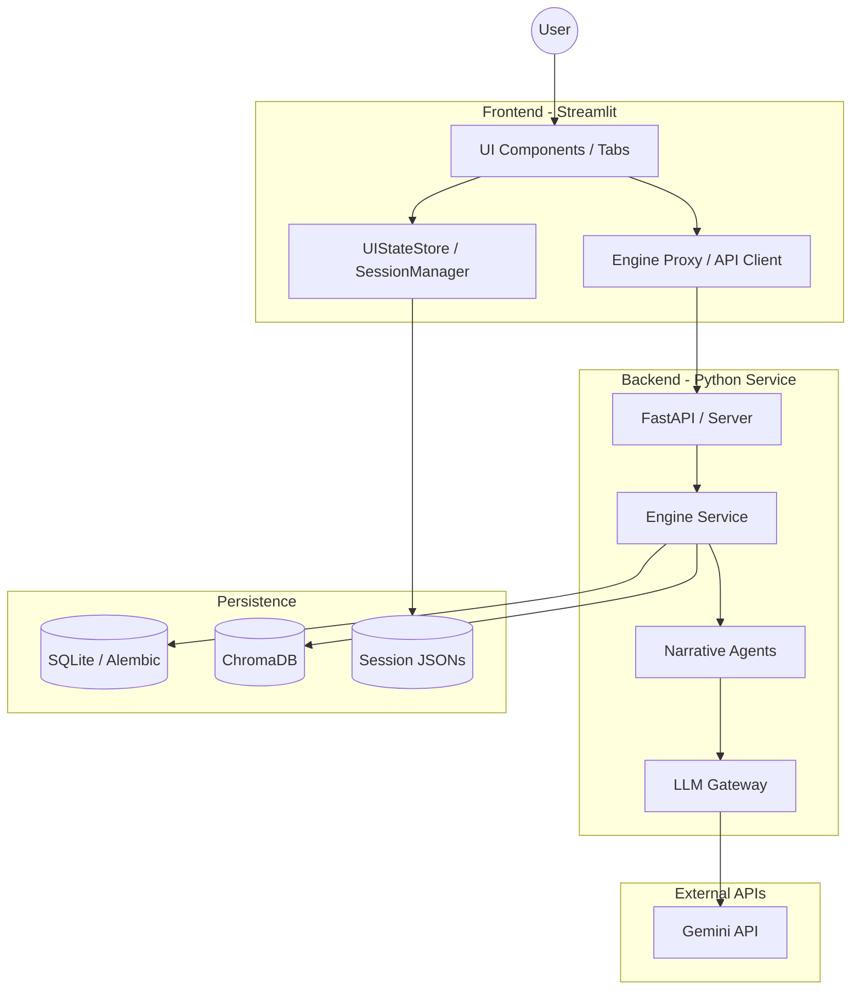

# Project Architecture Overview

This document provides a high-level overview of the Hegemony Novel Engine's system architecture.

## 1. System Model (C4 Level 2: Container Diagram)

## 2. Core Architectural Patterns

### 2.1 State Management (Mediator Pattern)
Instead of direct `st.session_state` access, the system uses a `UIStateStore` acting as a mediator.
- **UI Layer** $\rightarrow$ **UIStateStore** $\rightarrow$ **AppStateModel (Pydantic)** $\rightarrow$ **SessionManager** $\rightarrow$ **st.session_state / Disk**.

### 2.2 Engine Interaction (Proxy Pattern)
The UI does not call the backend logic directly. It uses a Proxy layer.
- **UI Tabs** $\rightarrow$ **UltimateHegemonyEngineProxy** $\rightarrow$ **EngineService** $\rightarrow$ **Backend API**.

### 2.3 Feature Extension (Plugin Pattern)
New capabilities are added via dynamic module loading.
- **PluginLoader** $\rightarrow$ Scans `plugins/` $\rightarrow$ `importlib` $\rightarrow$ Registers hooks.

## 3. Component Responsibilities

| Component | Primary Responsibility | Key Files |
| :--- | :--- | :--- |
| **Orchestrator** | App lifecycle, routing, and initialization | `streamlit_app/app.py` |
| **State Keeper** | Type-safe session state and persistence | `streamlit_app/state.py` |
| **Engine Mediator** | Simplifying API calls for the UI | `streamlit_app/engine.py` |
| **Plugin Hub** | Dynamic extension of system logic | `src/core/plugin_loader.py` |
| **Reliability Agent** | Health checks and error boundary management | `streamlit_app/health_check.py` |

## 4. Package Layering (Refactoring Outcome)

The codebase is split into two top-level packages with a clear dependency direction:

| Package | Role | Contents |
| :--- | :--- | :--- |
| `src/` | **Business Logic Layer** | Engine (`src/engine_service.py`), Agents (`src/agents/*`), Services (`src/services/*`), Backend (`src/backend/*`), Core/DI (`src/core/*`), Models (`src/models/*`), Shared utils (`src/shared/*`) |
| `streamlit_app/` | **UI Layer** | All Streamlit components, tabs, sidebar, landing, pages config, and the API client |

**Rules:**
1. `src/` is the business logic layer (Engine, Services, DB, Domain Agents).
2. `streamlit_app/` is the UI layer (all Streamlit components).
3. The UI layer may import `src` business logic **directly** (e.g. `from src.shared.resilient_http import ResilientHttpClient`, `from src.engine_service import EngineService`).
4. Thin re-export wrappers previously duplicated under `src/` (e.g. `src/ui_components.py`, `src/sidebar.py`, `src/state.py`) have been **removed**; the UI now references `streamlit_app.*` modules directly.

