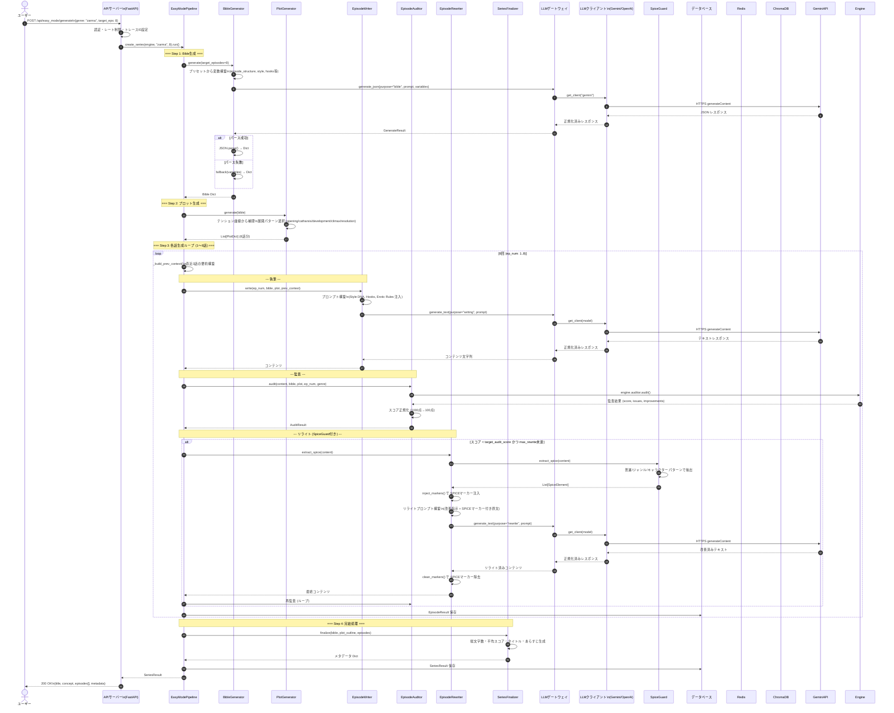

# シーケンス図 - かんたんモード生成フロー

## 概要
ジャンル選択のみで、企画から完結まで全自動生成する「かんたんモード」のエンドツーエンドフロー。

## 主要メッセージフロー

| Step | Actor | Action | 同期/非同期 |
|------|-------|--------|-------------|
| 1 | User → API | 生成リクエスト | 同期 (HTTP) |
| 2 | API → Pipeline | パイプライン起動 | 同期 (インプロセス) |
| 3 | Pipeline → BibleGen | Bible生成 | 同期 |
| 4 | BibleGen → LLM → LLMClient → Gemini | LLM生成 | 同期 (タイムアウト付き) |
| 5 | Pipeline → PlotGen | プロット生成 | 同期 (テンプレートベース) |
| 6 | Loop: Pipeline → EpWriter → LLM → Gemini | 執筆 | 同期 |
| 7 | Pipeline → EpAuditor → Engine.auditor | 監査 | 同期 |
| 8 | Pipeline → EpRewriter → SpiceGuard → LLM | リライト | 同期 (最大3回) |
| 9 | Pipeline → Finalizer | 完結処理 | 同期 |
| 10 | Pipeline → DB | 結果永続化 | 同期 (トランザクション) |
| 11 | API → User | 結果返却 | 同期 (HTTP) |

## エラーハンドリング・リトライ

- **LLM生成失敗**: 指数バックオフで最大3回リトライ (`RetryConfig`)
- **Bible生成失敗**: フォールバックBibleで継続 (メタデータに失敗理由記録)
- **監査エラー**: デフォルトスコア85で継続
- **リライト失敗**: 元コンテンツで継続
- **キャンセル**: `_cancelled` フラグで即座に中断、空 SeriesResult 返却

## 並行制御

- `concurrency_semaphore` (Factory で遅延生成) で全 LLM 呼び出しをグローバル制御
- `max_concurrent_api_calls` (設定値、デフォルト5) で同時実行数制限