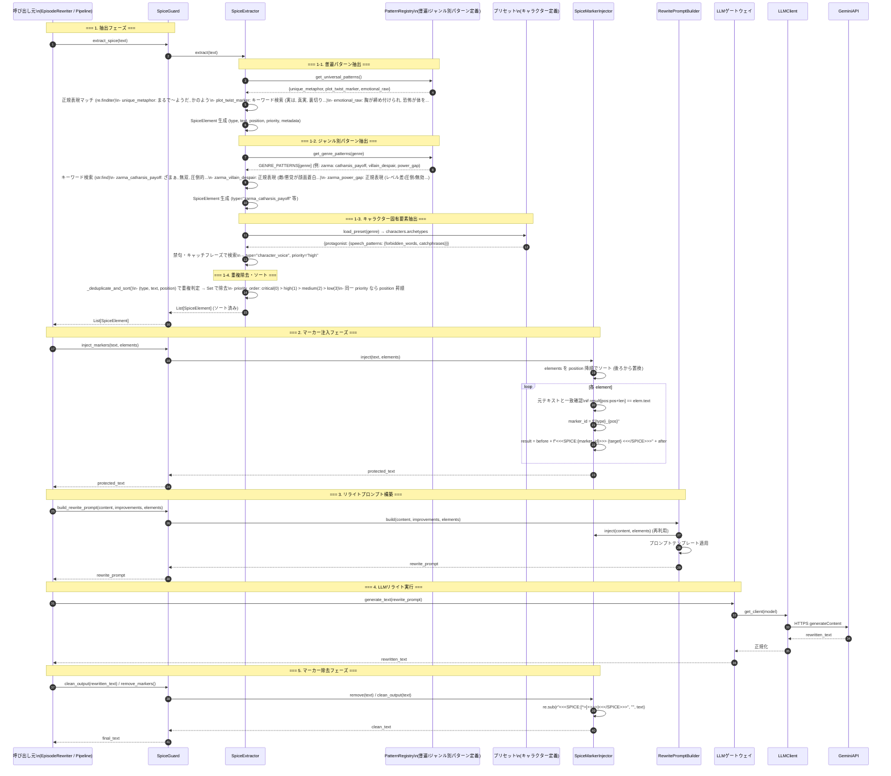

# シーケンス図 - SpiceGuard 動作フロー

## 概要
テキストから「尖り要素」を自動抽出し、リライト時に保護マーカーを注入・除去する SpiceGuard の内部動作フロー。



## 内部データフロー詳細

### SpiceExtractor 内部処理

```
text (入力文字列)
    │
    ├─ _extract_universal() ──▶ universal_patterns (3種類)
    │     ├─ unique_metaphor: regex finditer
    │     ├─ plot_twist_marker: keyword finditer
    │     └─ emotional_raw: regex finditer
    │
    ├─ _extract_genre() ──▶ genre_patterns (ジャンル×3-4種類)
    │     ├─ keyword-based: str.find (高速)
    │     └─ regex-based: regex finditer
    │
    ├─ _extract_character() ──▶ preset.archetypes
    │     ├─ forbidden_words → type="character_voice"
    │     └─ catchphrases → type="character_voice"
    │
    └─ _deduplicate_and_sort()
          ├─ key=(type, text, position) で Set 除去
          └─ sort by (priority_order, position)
```

### PatternRegistry パターン定義例

```python
# 普遍パターン
UNIVERSAL_PATTERNS = {
    "unique_metaphor": {
        "patterns": [
            r"(?:まるで|まるで|ようだ|かのように|ような)(.{10,60}?)(?:だ|です|。|！)",
            r"(?:かのよう|ごとく|如く)(.{5,40}?)(?:だ|です|。)",
        ],
        "priority": "high",
    },
    "plot_twist_marker": {
        "keywords": ["実は", "真実", "正体", "裏切り", "秘密", "覚醒", "真の", "隠された", "偽り", "罠"],
        "priority": "critical",
    },
    "emotional_raw": {
        "patterns": [
            r"(?:胸が|心が|背筋が|息が|震えが|涙が|熱が|冷や汗が)(?:締め付けられ|凍る|跳ねる|詰まる|止まらない|溢れる|引く|熱くなる|冷たくなる)(.{0,20}?)",
        ],
        "priority": "high",
    },
}

# ジャンル別 (zarma 抜粋)
GENRE_PATTERNS = {
    "zarma": {
        "catharsis_payoff": {
            "keywords": ["ざまぁ", "見返し", "無双", "圧倒的", "完全制圧", "土下座", "謝罪", "恐怖", "絶望", "無様"],
            "priority": "critical",
        },
        "villain_despair": {
            "patterns": [r"(?:敵|悪党|裏切り者|元仲間)(?:の|が)(?:顔面蒼白|青ざめ|震え|叫び|懇願|涙目)"],
            "priority": "high",
        },
        "power_gap": {
            "patterns": [r"(?:レベル|ステータス|戦力|実力)(?:差|圧倒|無効|通用しない|ゴミ|雑魚)"],
            "priority": "high",
        },
    },
    # ... 他8ジャンル
}
```

### CompiledPatternCache (正規表現事前コンパイル)

```python
class CompiledPatternCache:
    def __init__(self):
        self._cache: Dict[str, Dict[str, List[re.Pattern]]] = {}
    
    def get(self, genre: str) -> Dict[str, List[re.Pattern]]:
        if genre not in self._cache:
            self._cache[genre] = self._compile_for_genre(genre)
        return self._cache[genre]
    
    def _compile_for_genre(self, genre: str):
        compiled = {}
        # 普遍パターン
        for ptype, config in UNIVERSAL_PATTERNS.items():
            if "patterns" in config:
                compiled[ptype] = [re.compile(p) for p in config["patterns"]]
        # ジャンル別
        for ptype, config in GENRE_PATTERNS.get(genre, {}).items():
            if "patterns" in config:
                key = f"{genre}_{ptype}"
                compiled[key] = [re.compile(p) for p in config["patterns"]]
        return compiled
```

### パフォーマンス最適化ポイント

| 箇所 | 対策 | 効果 |
|------|------|------|
| キーワード検索 | `str.find` + 事前小文字化 | `re.finditer` より高速 |
| 正規表現 | 事前コンパイル (`re.compile`) | 再利用で高速 |
| 重複除去 | Set + tuple key | O(n) で除去 |
| ソート | priority_order dict + position | O(n log n) |
| マーカー注入 | 逆順ソートで後ろから置換 | 位置ズレ防止・O(n) |
| キャッシュ | CompiledPatternCache (グローバル) | ジャンル毎1回のみコンパイル |

### パフォーマンス目標

- 10,000文字テキスト: 抽出 < 100ms
- メモリ使用量: ジャンル毎 < 5MB (コンパイル済みパターン含む)
- マーカー注入: 要素数 100 個 < 10ms