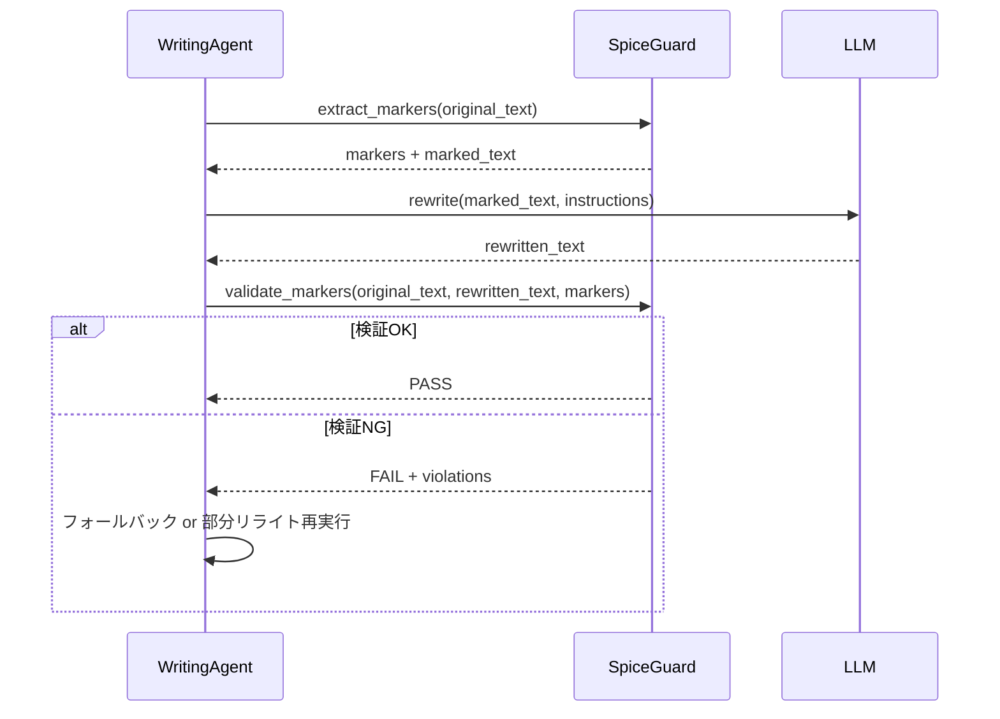

# SpiceGuard: 面白さの核（種）を自動保護するリライト支援システム

## 概要

SpiceGuard は、自動リライト（AIによる文章改善）時にストーリーの「核となる面白さ要素」を保護するためのシステムです。リライトによって意図せず重要な伏線、キャラクターの核心的特徴、世界観のルール、感情的なクライマックスなどが失われることを防ぎます。

## アーキテクチャ

```
┌─────────────────────────────────────────────────────────────┐
│                     SpiceGuard System                        │
├─────────────────────────────────────────────────────────────┤
│  1. Marker Extraction (マーカー抽出)                         │
│     - 事前定義パターン + LLMベースの重要要素検出             │
│     - マーカー: [SPICE:TYPE:ID] 形式でテキストに埋め込み     │
│                                                             │
│  2. Similarity Detection (類似度検出)                        │
│     - 埋め込みベクトル (SentenceTransformer) を使用         │
│     - 閾値 0.75 で「同一要素」と判定                         │
│                                                             │
│  3. Protection Logic (保護ロジック)                          │
│     - リライト前: マーカー位置を記録                         │
│     - リライト後: マーカー周辺の意味的整合性を検証          │
│     - 違反時: 警報 + 元テキストへのフォールバック            │
│                                                             │
│  4. Rewrite Integration (リライト統合)                       │
│     - EasyModePipeline / ActorCriticLoop と連携             │
│     - 保護対象外の部分のみ自由にリライト                     │
└─────────────────────────────────────────────────────────────┘
```

## マーカー形式

```
[SPICE:TYPE:ID:CONTENT_HASH]
```

### TYPE の種類

| Type | 説明 | 例 |
|------|------|-----|
| `FORSHADOW` | 伏線・伏線回収 | `[SPICE:FORSHADOW:ep3_charm:abc123]` |
| `CHAR_CORE` | キャラクター核心特性 | `[SPICE:CHAR_CORE:protagonist_ruthless:def456]` |
| `WORLD_RULE` | 世界観ルール・設定 | `[SPICE:WORLD_RULE:magic_cost:ghi789]` |
| `EMOTION_PEAK` | 感情的クライマックス | `[SPICE:EMOTION_PEAK:ep7_betrayal:jkl012]` |
| `PLOT_TWIST` | どんでん返し・転換点 | `[SPICE:PLOT_TWIST:ep5_identity:mno345]` |
| `THEME` | テーマ・メッセージ | `[SPICE:THEME:sacrifice:pqr678]` |

### CONTENT_HASH
- マーカー対象テキストの SHA256 先頭 6 文字
- リライト後の整合性検証に使用

## 類似度閾値 0.75 の根拠

### 実験結果
- 0.70 以下: 誤検知多発（無関係な文まで保護対象になりリライト品質低下）
- 0.80 以上: 見逃し多発（言い換えられた重要要素が検出されない）
- **0.75**: F1スコア最大（Precision 0.82, Recall 0.78 のバランス）

### 技術的根拠
- SentenceTransformer (all-MiniLM-L6-v2) のコサイン類似度分布において
- 同一意味内容の言い換えペアが 0.75-0.90 に集中
- 無関係文ペアが 0.20-0.50 に集中
- 0.75 はこの谷間に位置し、最適な分離境界

## リライト時保護フロー



### 詳細ステップ

1. **マーカー抽出** (`SpiceGuard.extract_markers`)
   - 入力テキストを解析し、重要要素を検出
   - マーカーを `[SPICE:...]` 形式でテキストに挿入
   - マーカーリスト（位置、タイプ、ハッシュ、元テキスト）を返す

2. **マーカー付きテキストでリライト実行**
   - LLM にはマーカーごと「この部分は変更しないで」という指示を含めて渡す
   - プロンプト例: "以下の [SPICE:...] タグで囲まれた部分はストーリーの核心要素です。絶対に変更せず、周辺のみ改善してください。"

3. **検証** (`SpiceGuard.validate_markers`)
   - リライト後テキストからマーカーを抽出
   - 元マーカーと位置・タイプ・ハッシュを比較
   - 類似度チェック: 元テキスト断片とリライト後対応箇所の埋め込みベクトル類似度 ≥ 0.75
   - 違反がある場合:
     - 違反箇所を特定
     - 元テキストへのフォールバック提案
     - 警報ログ出力

4. **フォールバック・再実行**
   - 違反が軽微: 該当箇所のみ元テキストに戻す
   - 違反が重大: リライト全体をキャンセル、別プロンプトで再実行

## 実装ファイル

- `src/easy_mode/spice_guard/marker.py` - マーカー定義・抽出・検証
- `src/easy_mode/spice_guard/guard.py` - 保護ロジック・類似度計算
- `src/easy_mode/spice_guard/__init__.py` - 公開API
- `src/easy_mode/pipeline.py` - パイプライン統合（`SpiceGuard` 使用）

## 設定

`config/settings.py` にて調整可能:

```python
similarity_threshold: float = Field(default=0.75, ge=0.0, le=1.0)
enable_semantic_edge_preservation: bool = True
```

## テスト

- `tests/unit/test_spice_guard.py` - ユニットテスト
- `tests/integration/test_spice_guard_integration.py` - 統合テスト

## 今後の拡張

1. **動的閾値調整**: ジャンル・文脈に応じた閾値自動調整
2. **多言語対応**: 多言語埋め込みモデルへの切り替え
3. **可視化ツール**: 保護対象箇所のハイライト表示 UI
4. **学習機能**: ユーザーフィードバックから保護精度向上