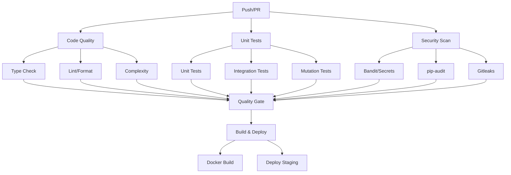

# CI パイプライン改善

## 概要
GitHub Actions を使用した CI/CD パイプラインの改善計画。品質ゲート・並列化・キャッシュ・セキュリティ監査を強化。

## 現状分析

### 現在の問題
| 課題 | 影響 |
|------|------|
| 単一ジョブで全テスト実行 | 実行時間長い (15分+) |
| キャッシュ未活用 | 毎回依存インストール・ブラウザインストール |
| 品質ゲート不足 | ミューテーションテスト・依存脆弱性チェックなし |
| アーティファクト管理不備 | テストレポート・カバレッジ・スクリーンショット未保存 |
| 並列化不足 | 単一ランナーで順次実行 |

## 改善後のパイプライン構成



## GitHub Actions ワークフロー

### メイン CI ワークフロー
```yaml
# .github/workflows/ci.yml
name: CI Pipeline

on:
  push:
    branches: [main, develop]
  pull_request:
    branches: [main, develop]
  schedule:
    - cron: '0 2 * * *'  # 毎日午前2時 (夜間バッチ)

concurrency:
  group: ${{ github.workflow }}-${{ github.ref }}
  cancel-in-progress: true

env:
  PYTHON_VERSION: '3.12'
  NODE_VERSION: '20'
  POETRY_VERSION: '1.8'

jobs:
  # ===================== Code Quality (並列) =====================
  code-quality:
    name: Code Quality
    runs-on: ubuntu-latest
    timeout-minutes: 15
    steps:
      - uses: actions/checkout@v4
        with:
          fetch-depth: 0  # 履歴必要 (gitleaks 等)
      
      - name: Set up Python
        uses: actions/setup-python@v5
        with:
          python-version: ${{ env.PYTHON_VERSION }}
          cache: 'pip'
      
      - name: Install dependencies
        run: |
          pip install -r requirements.txt
          pip install ruff mypy bandit vulture xenon
      
      - name: Ruff format check
        run: ruff format --check src/ tests/
      
      - name: Ruff lint
        run: ruff check src/ tests/
      
      - name: MyPy type check
        run: mypy --strict src/
      
      - name: Bandit security
        run: bandit -r src/ -ll -x tests/ --skip B101,B601 -f json -o bandit-report.json
      
      - name: Vulture dead code
        run: vulture src/ --min-confidence 80 --exclude tests/,docs/,config/,scripts/,*/migrations/
      
      - name: Xenon complexity
        run: xenon src/ --max-absolute B --max-modules B --max-average A --exclude tests/
      
      - name: Upload quality reports
        if: always()
        uses: actions/upload-artifact@v4
        with:
          name: quality-reports
          path: |
            bandit-report.json
          retention-days: 7

  # ===================== Unit Tests (並列) =====================
  unit-tests:
    name: Unit Tests
    runs-on: ubuntu-latest
    timeout-minutes: 20
    steps:
      - uses: actions/checkout@v4
      
      - name: Set up Python
        uses: actions/setup-python@v5
        with:
          python-version: ${{ env.PYTHON_VERSION }}
          cache: 'pip'
      
      - name: Install dependencies
        run: |
          pip install -r requirements.txt
          pip install pytest pytest-asyncio pytest-cov pytest-xdist
      
      - name: Run unit tests
        run: |
          pytest tests/unit/ tests/test_*.py \
            -n auto \
            --cov=src \
            --cov-report=xml \
            --cov-report=term-missing \
            --cov-fail-under=80 \
            -x \
            -q
      
      - name: Upload coverage
        uses: codecov/codecov-action@v4
        with:
          files: ./coverage.xml
          flags: unit
          fail_ci_if_error: true
      
      - name: Upload test results
        if: always()
        uses: actions/upload-artifact@v4
        with:
          name: unit-test-results
          path: |
            test-results/
            .coverage
          retention-days: 7

  # ===================== Integration Tests (Testcontainers) =====================
  integration-tests:
    name: Integration Tests
    runs-on: ubuntu-latest
    timeout-minutes: 30
    needs: [code-quality, unit-tests]
    steps:
      - uses: actions/checkout@v4
      
      - name: Set up Python
        uses: actions/setup-python@v5
        with:
          python-version: ${{ env.PYTHON_VERSION }}
          cache: 'pip'
      
      - name: Install Docker
        run: |
          sudo apt-get update
          sudo apt-get install -y docker.io docker-compose
          sudo systemctl start docker
      
      - name: Install dependencies
        run: |
          pip install -r requirements.txt
          pip install testcontainers pytest-testcontainers pytest-asyncio
      
      - name: Run integration tests
        run: |
          pytest tests/integration/ -v -m integration --tb=short
        env:
          TESTCONTAINERS_RYUK_DISABLED: true
      
      - name: Upload integration results
        if: always()
        uses: actions/upload-artifact@v4
        with:
          name: integration-test-results
          path: test-results/
          retention-days: 7

  # ===================== Mutation Testing =====================
  mutation-tests:
    name: Mutation Tests
    runs-on: ubuntu-latest
    timeout-minutes: 45
    needs: [code-quality, unit-tests]
    if: github.event_name == 'schedule' || github.ref == 'refs/heads/main'
    steps:
      - uses: actions/checkout@v4
        with:
          fetch-depth: 0
      
      - name: Set up Python
        uses: actions/setup-python@v5
        with:
          python-version: ${{ env.PYTHON_VERSION }}
          cache: 'pip'
      
      - name: Install dependencies
        run: |
          pip install -r requirements.txt
          pip install mutmut pytest pytest-cov
      
      - name: Run mutation testing
        run: |
          mutmut run --use-coverage --max-runners=4
      
      - name: Check mutation score
        run: |
          SCORE=$(mutmut results | grep "Mutation score" | awk '{print $3}' | sed 's/%//')
          echo "Mutation score: $SCORE%"
          echo "MUTATION_SCORE=$SCORE" >> $GITHUB_ENV
          if (( $(echo "$SCORE < 60" | bc -l) )); then
            echo "❌ Mutation score below 60%: $SCORE%"
            exit 1
          fi
      
      - name: Upload mutation report
        if: always()
        uses: actions/upload-artifact@v4
        with:
          name: mutation-report
          path: html/
          retention-days: 7

  # ===================== Security Scans =====================
  security:
    name: Security Scans
    runs-on: ubuntu-latest
    timeout-minutes: 15
    steps:
      - uses: actions/checkout@v4
        with:
          fetch-depth: 0
      
      - name: Gitleaks
        uses: gitleaks/gitleaks-action@v2
        with:
          args: --verbose --redact
      
      - name: pip-audit
        run: |
          pip install pip-audit
          pip-audit -r requirements.txt --format=json --output=pip-audit-report.json
      
      - name: Bandit (already in code-quality)
        run: echo "Bandit already run in code-quality job"
      
      - name: Upload security reports
        if: always()
        uses: actions/upload-artifact@v4
        with:
          name: security-reports
          path: |
            pip-audit-report.json
          retention-days: 30

  # ===================== E2E Tests (Playwright) =====================
  e2e-tests:
    name: E2E Tests (Playwright)
    runs-on: ubuntu-latest
    timeout-minutes: 30
    needs: [code-quality, unit-tests]
    if: github.event_name == 'pull_request' || github.event_name == 'schedule'
    steps:
      - uses: actions/checkout@v4
      
      - name: Set up Node.js
        uses: actions/setup-node@v4
        with:
          node-version: '20'
          cache: 'npm'
      
      - name: Set up Python
        uses: actions/setup-python@v5
        with:
          python-version: ${{ env.PYTHON_VERSION }}
          cache: 'pip'
      
      - name: Install system dependencies
        run: |
          sudo apt-get update
          sudo apt-get install -y docker.io
          sudo systemctl start docker
      
      - name: Install dependencies
        run: |
          pip install -r requirements.txt
          npm ci
          npx playwright install --with-deps chromium
        working-directory: ./tests/e2e
      
      - name: Start backend
        run: |
          cd backend
          pip install -r requirements.txt
          uvicorn src.backend.server:app --host 0.0.0.0 --port 8200 &
          sleep 15
      
      - name: Run E2E tests
        run: npx playwright test
        working-directory: ./tests/e2e
        env:
          BASE_URL: http://localhost:8501
          API_BASE_URL: http://localhost:8200
      
      - name: Upload E2E artifacts
        if: always()
        uses: actions/upload-artifact@v4
        with:
          name: e2e-test-results
          path: |
            tests/e2e/playwright-report/
            tests/e2e/test-results/
          retention-days: 7

  # ===================== Quality Gate =====================
  quality-gate:
    name: Quality Gate
    runs-on: ubuntu-latest
    needs: [code-quality, unit-tests, integration-tests, mutation-tests, security]
    if: always()
    steps:
      - name: Check all jobs passed
        run: |
          JOBS=("code-quality" "unit-tests" "integration-tests" "mutation-tests" "security")
          for job in "${JOBS[@]}"; do
            RESULT=${{ needs.$job.result }}
            if [ "$RESULT" != "success" ]; then
              echo "❌ $job failed: $RESULT"
              exit 1
            fi
            echo "✅ $job passed"
          done
          echo "🎉 All quality gates passed!"

  # ===================== Build & Deploy =====================
  build:
    name: Build Docker Image
    runs-on: ubuntu-latest
    needs: [quality-gate]
    if: github.event_name == 'push' && github.ref == 'refs/heads/main'
    steps:
      - uses: actions/checkout@v4
      
      - name: Set up Docker Buildx
        uses: docker/setup-buildx-action@v3
      
      - name: Login to Container Registry
        uses: docker/login-action@v3
        with:
          registry: ghcr.io
          username: ${{ github.actor }}
          password: ${{ secrets.GITHUB_TOKEN }}
      
      - name: Extract metadata
        id: meta
        uses: docker/metadata-action@v5
        with:
          images: ghcr.io/${{ github.repository }}
          tags: |
            type=ref,event=branch
            type=semver,pattern={{version}}
            type=sha
      
      - name: Build and push
        uses: docker/build-push-action@v5
        with:
          context: .
          push: true
          tags: ${{ steps.meta.outputs.tags }}
          labels: ${{ steps.meta.outputs.labels }}
          cache-from: type=gha
          cache-to: type=gha,mode=max

  deploy-staging:
    name: Deploy to Staging
    runs-on: ubuntu-latest
    needs: [build]
    if: github.event_name == 'push' && github.ref == 'refs/heads/main'
    environment: staging
    steps:
      - name: Deploy to Staging
        run: |
          echo "Deploying to staging..."
          # kubectl/helm/argoCD 等でデプロイ
      
      - name: Health check
        run: |
          curl -f https://staging.autonovel.example.com/health || exit 1
```

## キャッシュ戦略

### キー設計
```yaml
# Python 依存関係
- key: pip-${{ runner.os }}-${{ hashFiles('requirements.txt') }}-${{ hashFiles('requirements-dev.txt') }}
  restore-keys: |
    pip-${{ runner.os }}-

# Node.js 依存関係
- key: npm-${{ runner.os }}-${{ hashFiles('package-lock.json') }}
  restore-keys: |
    npm-${{ runner.os }}-

# Python バイトコードキャッシュ
- key: pycache-${{ runner.os }}-${{ hashFiles('**/*.py') }}
  restore-keys: |
    pycache-${{ runner.os }}-

# Playwright ブラウザ
- key: playwright-${{ runner.os }}-${{ hashFiles('tests/e2e/package-lock.json') }}
  restore-keys: |
    playwright-${{ runner.os }}-
```

### キャッシュ使用例
```yaml
- name: Cache pip
  uses: actions/cache@v4
  with:
    path: ~/.cache/pip
    key: ${{ env.PIP_CACHE_KEY }}
    restore-keys: ${{ env.PIP_CACHE_KEY }}-

- name: Cache node_modules
  uses: actions/cache@v4
  with:
    path: node_modules
    key: ${{ env.NPM_CACHE_KEY }}
```

## 並列化戦略

| ジョブ | 並列数 | 理由 |
|--------|--------|------|
| Unit Tests | `n auto` (CPU コア数) | pytest-xdist で自動並列 |
| Integration Tests | 1 | DB コンテナ共有のため |
| E2E Tests | 2 workers | Playwright 並列実行 |
| Mutation Tests | 4 runners | CPU 集約的 |
| Quality Checks | 1 | 高速完了 |

## 品質ゲート閾値

| メトリクス | 閾値 | アクション |
|-----------|------|------------|
| Unit Test Coverage | ≥ 80% | 失敗 |
| Mutation Score | ≥ 60% | 失敗 |
| MyPy Errors | 0 | 失敗 |
| Ruff Errors | 0 | 失敗 |
| Bandit High | 0 | 失敗 |
| Vulture Dead Code | 0 | 警告のみ |
| Xenon Complexity | ≤ B | 失敗 |
| pip-audit High/Critical | 0 | 失敗 |
| Gitleaks | 0 | 失敗 |

## 実行時間目標

| ジョブ | 目標時間 | 現状 | 改善アクション |
|--------|----------|------|----------------|
| Code Quality | ≤ 5分 | ~8分 | 並列化・キャッシュ |
| Unit Tests | ≤ 8分 | ~12分 | pytest-xdist 並列化 |
| Integration Tests | ≤ 15分 | ~20分 | コンテナ事前起動 |
| Mutation Tests | ≤ 30分 | ~45分 | 並列 runners=4 |
| E2E Tests | ≤ 20分 | N/A | 並列 workers=2 |
| **合計** | **≤ 10分 (並列実行)** | ~20分 | 並列実行 |

## 最適化テクニック

### 1. 依存関係キャッシュ
```yaml
- name: Cache pip
  uses: actions/cache@v4
  with:
    path: ~/.cache/pip
    key: pip-${{ runner.os }}-${{ hashFiles('requirements.txt') }}-${{ hashFiles('requirements-dev.txt') }}
    restore-keys: |
      pip-${{ runner.os }}-
```

### 2. 不要なステップスキップ
```yaml
# 変更ファイルに応じてジョブスキップ
- name: Check changed files
  id: changes
  uses: tj-actions/changed-files@v44
  with:
    files: |
      src/
      tests/
```

### 3. 失敗早期検知
```yaml
# 最初のエラーで停止
fail_fast: true
```

### 4. 成果物保存期間
```yaml
retention-days: 7  # テスト結果
retention-days: 30  # セキュリティレポート
```

## 監視・アラート

### 失敗時通知
```yaml
- name: Notify on failure
  if: failure()
  uses: slackapi/slack-github-action@v1.24.0
  with:
    payload: |
      {
        "text": "🔴 CI Failed: ${{ github.repository }} #${{ github.run_number }}",
        "blocks": [...]
      }
  env:
    SLACK_WEBHOOK_URL: ${{ secrets.SLACK_WEBHOOK }}
```

### メトリクス収集
```yaml
- name: Collect metrics
  run: |
    echo "ci_duration_seconds=$(($(date +%s) - ${{ env.START_TIME }}))" >> $GITHUB_ENV
    echo "ci_status=${{ job.status }}" >> $GITHUB_ENV
```

## 導入チェックリスト

- [ ] `.github/workflows/ci.yml` 作成・配置
- [ ] `.github/workflows/mutation.yml` 作成
- [ ] `.github/workflows/e2e.yml` 作成
- [ ] `codecov` 連携設定
- [ ] `gitleaks` 設定ファイル (`.gitleaks.toml`) 作成
- [ ] `bandit` 設定 (`.bandit`) 作成
- [ ] `xenon` 設定 (`pyproject.toml` に追加)
- [ ] `vulture` 設定 (`pyproject.toml` に追加)
- [ ] `pip-audit` 定期実行スケジュール設定
- [ ] Codecov/Code Climate 連携
- [ ] Slack/Teams 通知設定
- [ ] ステータスバッジ README に追加
- [ ] ブランチ保護ルール設定 (main/develop で CI 必須)
- [ ] Dependabot 自動PR 有効化