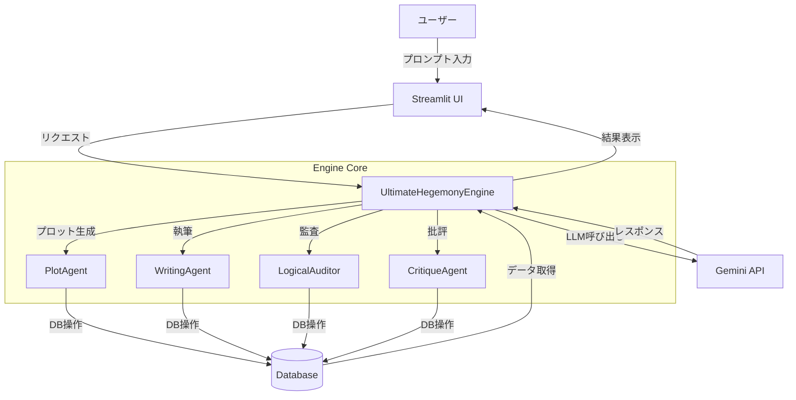

# データフロー図 (Mermaid)

```mermaid
graph TD
    User[ユーザー] -->|プロンプト入力| UI[Streamlit UI]
    UI -->|リクエスト| Engine[UltimateHegemonyEngine]
    
    subgraph "Engine Core"
        Engine -->|プロット生成| PlotAgent[PlotAgent]
        Engine -->|執筆| WritingAgent[WritingAgent]
        Engine -->|監査| Auditor[LogicalAuditor]
        Engine -->|批評| Critique[CritiqueAgent]
    end
    
    PlotAgent -->|DB操作| DB[(Database)]
    WritingAgent -->|DB操作| DB
    Auditor -->|DB操作| DB
    Critique -->|DB操作| DB
    
    Engine -->|LLM呼び出し| LLM[Gemini API]
    LLM -->|レスポンス| Engine
    
    DB -->|データ取得| Engine
    Engine -->|結果表示| UI
```
