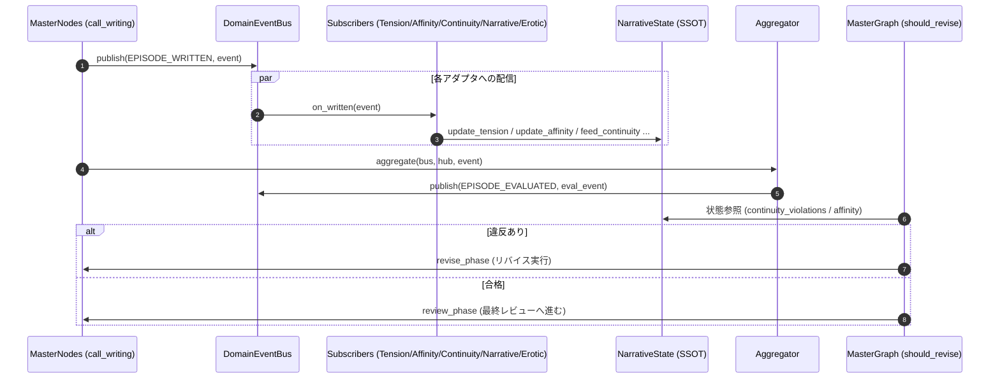

# ドメインイベントバス アーキテクチャ仕様書 (Domain Event Bus Architecture)

本システムにおけるナラティブ生成、評価、整合性チェック、自己修復ループを結ぶ軽量非同期ドメインイベントバス (`DomainEventBus`) の仕様とイベント一覧です。

---

## 1. 概要
`DomainEventBus` (`src/shared/domain_event_bus.py`) は、パイプラインの各エージェント・ノード・プロトタイプアダプタ間の疎結合な連携を実現する非同期 Pub/Sub 基盤です。
単一の真実源（SSOT）である `NarrativeState` ハブと連携し、各話執筆完了時のシグナル集約および LangGraph / MasterGraph へのリバイスフィードバックを行います。

---

## 2. ドメインイベント一覧

| イベント種別 (`NarrativeEventType`) | 発行元 (Publisher) | 購読先 (Subscribers / Consumers) | ペイロード (`payload`) 内容 | 目的・作用 |
| :--- | :--- | :--- | :--- | :--- |
| **`EPISODE_WRITTEN`** | `master_nodes.py` (`call_writing_graph_node`), `GatewayLLMGenerator`, バッチランナー | `tension_sub`, `affinity_sub`, `continuity_sub`, `narrative_sub`, `erotic_sub` | `{"text": str, "scene": dict, "tension": float, ...}` | 各話執筆完了時に発行され、全解析アダプタが並行・直列に `NarrativeState` ハブを更新 |
| **`EPISODE_EVALUATED`** | `src/prototype/aggregator.py` (`aggregate()`) | `master_graph.py` (`should_revise_writing`), ログ / レポーター, SSEブロードキャスター | `hub.to_dict()` (全エピソード状態、違反リスト、テンション曲線、好感度マップ等) | 全購読者のハブ反映結果を集約し、品質・整合性の最終判定材料としてブロードキャスト |
| **`REVISION_REQUESTED`** | `master_nodes.py` (`revise_writing_node`), 自己推敲ループ | `polish_adapter`, 執筆エージェント, SSEブロードキャスター | `{"ep": int, "violations": list, "target_field": str, "prompt": str}` | 整合性違反やスコア不足が検出されたエピソードに対して、自動修正・再生成をトリガー |

---

## 3. 処理フロー図 (Mermaid)

---

## 4. 並行性と耐久性
- **50話並行実行安全性**: `asyncio.gather` による大量イベント同時発行時もハブ更新が安全に処理されるよう設計（`test_domain_event_bus_concurrency_50_episodes` にて検証済み）。
- **同期 / 非同期透過性**: 同期ハンドラ・非同期コルーチンハンドラの両方を自動判定して安全に実行。
