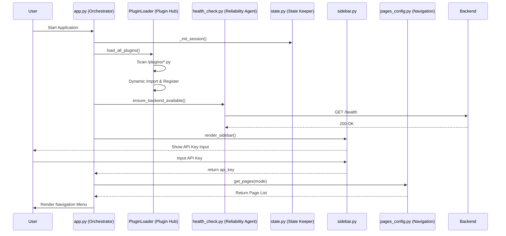
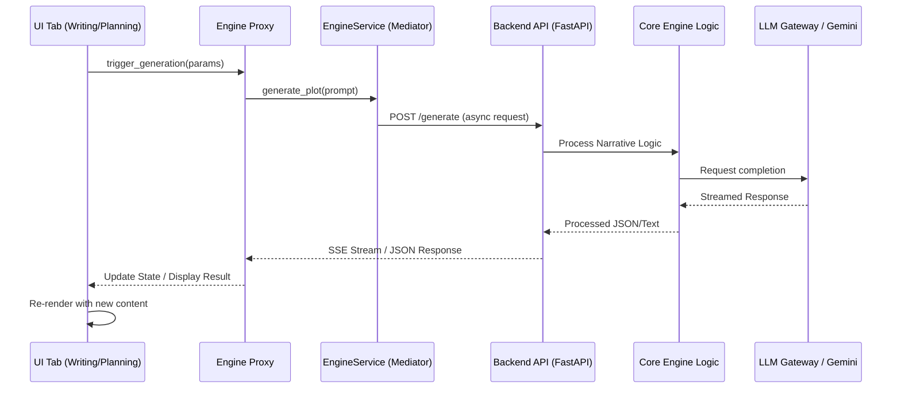
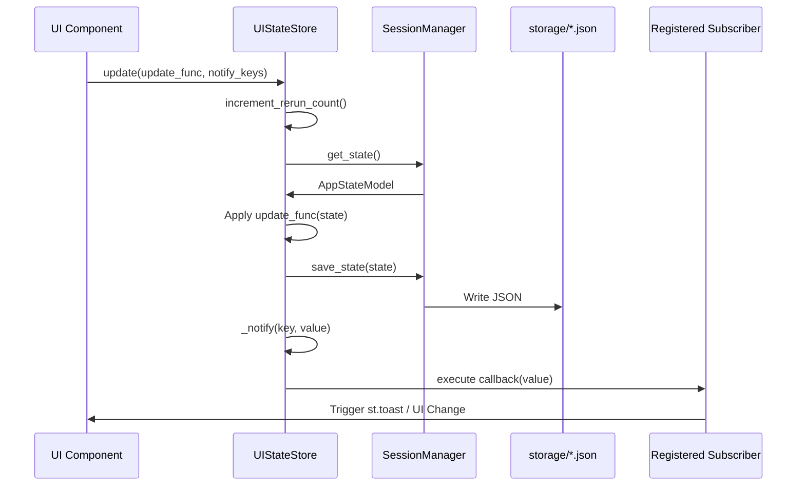
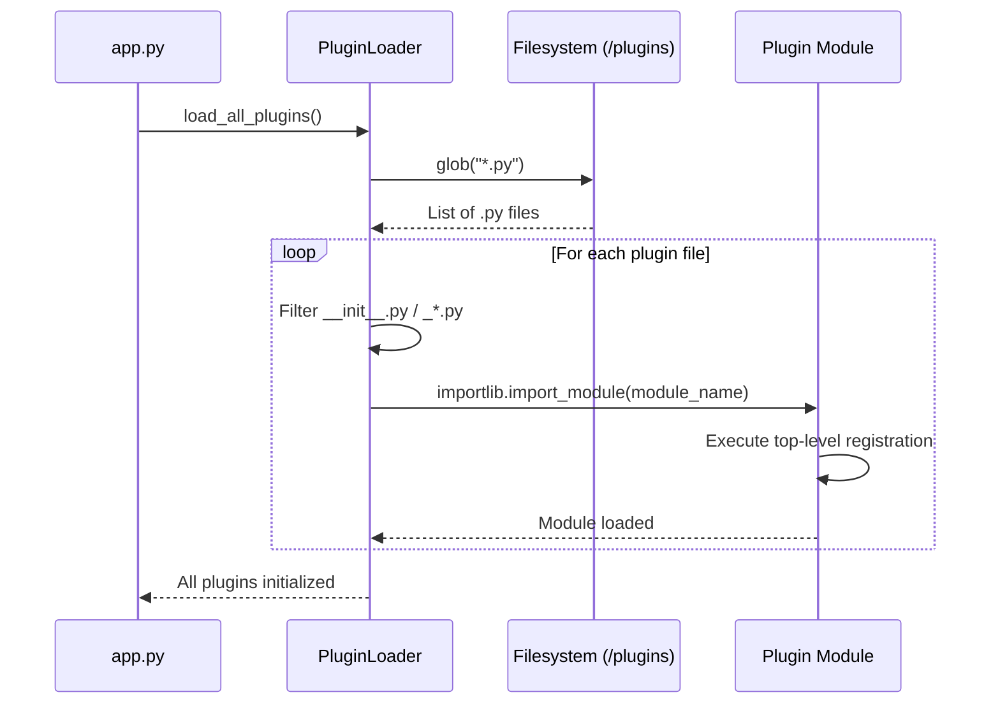

# System Sequences

This directory contains Mermaid sequence diagrams illustrating the key data flows of the Hegemony Novel Engine.

## 1. Application Startup Sequence
`docs/sequences/startup.mmd`

## 2. Generation Request Sequence
`docs/sequences/generation.mmd`

## 3. State Change & Notification Flow
`docs/sequences/state_change.mmd`

## 4. Plugin Loading Flow
`docs/sequences/plugin_load.mmd`

