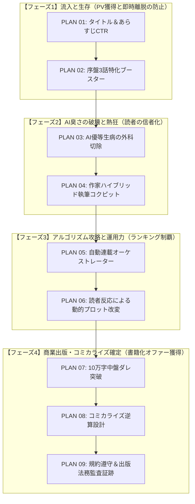

# AutoNovel カクヨム1位＆商業出版化 完全制覇マスター実装計画書（全9案・108ステップ）

**プロジェクト**: AutoNovel v4.9.0 → 商業化特化エンジン  
**目的**: カクヨムでの日間・総合ランキング1位獲得、および商業ライトノベルレーベルからの書籍化・コミカライズ（Webtoon含む）オファーを確実に勝ち取るための包括的改造ロードマップ。  
**設計方針**: 各計画書は、**小型・低性能LLM（ローカルLLMや小型コード生成AI）でも迷わず1ステップずつ単一ファイル単位で実装・テスト可能な粒度（1案につき12ステップ）**に徹底分解されています。

---

## 全9案 実装計画書一覧（リンク）

| 案番 | 実装計画書ファイル | 主要テーマ | ステップ数 |
| :---: | :--- | :--- | :---: |
| **01** | [PLAN 01: タイトル＆あらすじCTR爆発エンジン](file:///e:/hhh/plans/PLAN_01_TITLE_CTR_ENGINE_12STEPS.md) | カクヨム上位作の構文解析・初速CTR最大化・A/Bテスト | 全12ステップ |
| **02** | [PLAN 02: 序盤3話特化型 ドーパミン注入・クリフハンガー強制エンジン](file:///e:/hhh/plans/PLAN_02_OPENING_BOOSTER_12STEPS.md) | 冒頭0秒インパクト・説明描写禁止・毎話末尾の引き強制 | 全12ステップ |
| **03** | [PLAN 03: AI優等生病の外科的切除](file:///e:/hhh/plans/PLAN_03_ANTI_AI_PROSE_REFORM_12STEPS.md) | 感情の三段論法破壊・生々しいエゴ・下品な打算の注入 | 全12ステップ |
| **04** | [PLAN 04: 作家ハイブリッド執筆コクピット](file:///e:/hhh/plans/PLAN_04_HYBRID_WRITING_COCKPIT_12STEPS.md) | 作家の性癖・狂気（Emotional Spine）とAI協調インラインリライトUI | 全12ステップ |
| **05** | [PLAN 05: 開幕ブースト＆自動連載オーケストレーター](file:///e:/hhh/plans/PLAN_05_AUTO_SERIALIZATION_ORCHESTRATOR_12STEPS.md) | 初日5話開幕投下・スマホ閲覧ピーク（7:30, 12:15, 19:00, 21:00）自動予約連載 | 全12ステップ |
| **06** | [PLAN 06: 読者反応による動的プロット改変](file:///e:/hhh/plans/PLAN_06_AUDIENCE_STEERING_12STEPS.md) | コメント・★感情分析によるヘイト悪役制裁前倒し・プロット動的舵取り | 全12ステップ |
| **07** | [PLAN 07: 10万字中盤ダレ突破（第2アーク強制相転移）](file:///e:/hhh/plans/PLAN_07_MIDPOINT_CATALYST_12STEPS.md) | 20〜30話（5万字）中弛み阻止・新勢力乱入・単行本1巻完結 | 全12ステップ |
| **08** | [PLAN 08: コミカライズ逆算設計（Comic-First Architecture）](file:///e:/hhh/plans/PLAN_08_COMIC_FIRST_ARCHITECTURE_12STEPS.md) | バズる見開きキラーカット（表情差分・視覚落差）からの小説本文逆算生成 | 全12ステップ |
| **09** | [PLAN 09: 規約遵守＆出版法務コンプライアンス](file:///e:/hhh/plans/PLAN_09_LEGAL_COMPLIANCE_AUDIT_12STEPS.md) | カクヨムAI規約・コンテスト応募適格性・人間関与比率Git風証跡 | 全12ステップ |
| **計** | **全9計画書** | **商業エンタメ小説化完全パイプライン** | **合計 108ステップ** |

---

## 4段階実行フェーズと依存関係

---

## 小型・低性能LLMでの実装進行ルール

各計画書をAIエージェントや小型LLMに実装させる際は、以下のガイドラインを厳守してください：

1. **「1回に1ステップのみ」プロンプトに渡す**:
   - 複数ステップを一度に渡さず、`Step 1: Pydanticモデル定義` のみを指示し、完了（型チェック合格）したら `Step 2` へ進む。
2. **TDD（テスト先行）の厳守**:
   - 各計画書では偶数ステップ等で「テストの作成」が先行しています。テストが正しく失敗することを確認してから実装ステップに移ること。
3. **単一ファイルの独立性**:
   - すべてのステップは「単一ファイルの作成または編集」で完結するように設計されています。他モジュールへの広範な破壊的変更は禁止。
