# AutoNovel テストカバレッジ80%突破 マスター統合ロードマップ（全72ステップ）

**対象**: AutoNovel v4.9.4 全リポジトリ (`e:\hhh`)  
**目標**: ユニットテストカバレッジ **21.86%（13,067行） → 80.0%以上（38,500行以上）**  
**構造**: P1〜P6（各12ステップ、合計72ステップ）の完全自己完結計画書群  
**作成日**: 2026-09-15

---

## 📊 カバレッジ押し上げ試算表

| 計画書 | 対象レイヤー | 未カバー行 | 目標削減行 | 累計カバー行 | 累計カバレッジ |
|:---|:---|:---:|:---:|:---:|:---:|
| **現在** | （現行コードベース実測値） | 35,052 | - | 13,067 | **21.86%** |
| **[P1](./P1_COVERAGE_DATABASE_12STEPS.md)** | データベース・インフラ・永続化層 | 2,078 | **+2,600** | 15,667 | **32.55%** |
| **[P2](./P2_COVERAGE_SERVICES_12STEPS.md)** | コアサービス・検索・キャッシュ層 | 11,384 | **+4,800** | 20,467 | **42.53%** |
| **[P3](./P3_COVERAGE_AGENTS_12STEPS.md)** | マルチエージェント・執筆＆監査エンジン | 6,675 | **+4,500** | 24,967 | **51.88%** |
| **[P4](./P4_COVERAGE_WORKFLOWS_12STEPS.md)** | ワークフロー・タスク実行＆非同期基盤 | 4,383 | **+3,600** | 28,567 | **59.36%** |
| **[P5](./P5_COVERAGE_EASYMODE_12STEPS.md)** | Easy Mode・出版エクスポート＆メディアミックス | 3,800 | **+3,300** | 31,867 | **66.22%** |
| **[P6](./P6_COVERAGE_ROUTERS_DOMAIN_12STEPS.md)** | APIルーター・認可ガード・ドメイン＆コア基盤 | 6,400 | **+5,500** | 37,367 | **77.65%** |
| **最終調整** | 既存テストの支線カバー・エッジケース | - | **+1,500** | **38,867** | **80.77% ✅** |

---

## 🗺️ 全72ステップ 体系マップ

```mermaid
graph TD
    subgraph P1["P1: データベース・インフラ層 (12 Steps)"]
        P1_1["1. WorkspaceManager"] --> P1_2["2. RetryLogging"]
        P1_2 --> P1_3["3. ConnectionWrapper"] --> P1_4["4. DatabaseManager"]
        P1_4 --> P1_5["5. UoW Context"] --> P1_6["6. UoW LazyLoad"]
        P1_6 --> P1_7["7. BaseRepository"] --> P1_8["8. Book/Plot Repo"]
        P1_8 --> P1_9["9. Bible Repo"] --> P1_10["10. Episode/Scene Repo"]
        P1_10 --> P1_11["11. Infra SQLAlchemy"] --> P1_12["12. UoW Integration"]
    end

    subgraph P2["P2: サービス・キャッシュ・検索層 (12 Steps)"]
        P2_1["1. Redis CRUD"] --> P2_2["2. Redis Fallback"]
        P2_2 --> P2_3["3. Chroma/Memory Store"] --> P2_4["4. PgVector Store"]
        P2_4 --> P2_5["5. Semantic Cache"] --> P2_6["6. Reflective RAG"]
        P2_6 --> P2_7["7. RAG Prefetch"] --> P2_8["8. GraphRAG Sync"]
        P2_8 --> P2_9["9. BookScore Service"] --> P2_10["10. Anti-AI Detectors"]
        P2_10 --> P2_11["11. Cadence Reformatter"] --> P2_12["12. Conflict Report"]
    end

    subgraph P3["P3: エージェント・執筆＆監査層 (12 Steps)"]
        P3_1["1. ContextBuilder"] --> P3_2["2. PlotAgent"]
        P3_2 --> P3_3["3. EpisodeWriter"] --> P3_4["4. VoiceLinter"]
        P3_4 --> P3_5["5. Audit Integrity"] --> P3_6["6. Consistency/Creativity"]
        P3_6 --> P3_7["7. Hook/Emotion"] --> P3_8["8. Erotic Continuity"]
        P3_8 --> P3_9["9. Erotic Filter"] --> P3_10["10. Density Controller"]
        P3_10 --> P3_11["11. Illustration Agent"] --> P3_12["12. Multi-Agent Flow"]
    end

    subgraph P4["P4: ワークフロー・タスク実行層 (12 Steps)"]
        P4_1["1. GraphState Base"] --> P4_2["2. Writing Nodes"]
        P4_2 --> P4_3["3. Writing Flow"] --> P4_4["4. Retry/Escalation"]
        P4_4 --> P4_5["5. Plot LangGraph"] --> P4_6["6. Generation Tasks"]
        P4_6 --> P4_7["7. Multimedia Tasks"] --> P4_8["8. DAG Scheduler"]
        P4_8 --> P4_9["9. Checkpoint Saver"] --> P4_10["10. Background Task"]
        P4_10 --> P4_11["11. Patch Validator"] --> P4_12["12. Task Integration"]
    end

    subgraph P5["P5: Easy Mode・出版エクスポート層 (12 Steps)"]
        P5_1["1. Ebook Metadata"] --> P5_2["2. EPUB Container"]
        P5_2 --> P5_3["3. Ruby & Styling"] --> P5_4["4. MediaMix Models"]
        P5_4 --> P5_5["5. Manga Name"] --> P5_6["6. Audio Script"]
        P5_6 --> P5_7["7. IF Routes Condition"] --> P5_8["8. Route Graph Solver"]
        P5_8 --> P5_9["9. Asset Pack ZIP"] --> P5_10["10. Narou/Kakuyomu"]
        P5_10 --> P5_11["11. Kindle/Kobo"] --> P5_12["12. Phase3 Integration"]
    end

    subgraph P6["P6: APIルーター・ドメイン・コア層 (12 Steps)"]
        P6_1["1. Sanitizer Rules"] --> P6_2["2. JWT & Auth Guard"]
        P6_2 --> P6_3["3. Branches Router"] --> P6_4["4. Orchestrated Router"]
        P6_4 --> P6_5["5. Billing Webhook"] --> P6_6["6. Collab & Hooks"]
        P6_6 --> P6_7["7. Novel Aggregate"] --> P6_8["8. Character & Bible"]
        P6_8 --> P6_9["9. Plot & Branch"] --> P6_10["10. Core AsyncUtils"]
        P6_10 --> P6_11["11. Plugin Loader"] --> P6_12["12. Router E2E Smoke"]
    end

    P1 --> P2 --> P3 --> P4 --> P5 --> P6
```



---

## 🤖 低性能LLM向け 実行プロンプトテンプレート

低性能なLLM（パラメータ8B〜14B級、または推論能力の低いモデル）に本計画書を実行させる際は、以下のフォーマットで1ステップずつプロンプトを投入してください：

```markdown
【指示】
あなたは AutoNovel のテスト実装エージェントです。
以下の仕様書に従い、指定されたファイル「のみ」を作成してください。
コードは省略（... や # TODO）を一切含めず、提示されたコードをそのまま完全に出力してください。

【対象仕様書】
plans/P1_COVERAGE_DATABASE_12STEPS.md の Step 1

【作成対象ファイル】
tests/unit/database/test_workspace_manager.py

【実行・検証コマンド】
.venv\Scripts\python -m pytest tests/unit/database/test_workspace_manager.py -v
```

---

## 🎯 各計画書へのリンク

1. [P1_COVERAGE_DATABASE_12STEPS.md](./P1_COVERAGE_DATABASE_12STEPS.md) — データベース・インフラ層（全12ステップ）
2. [P2_COVERAGE_SERVICES_12STEPS.md](./P2_COVERAGE_SERVICES_12STEPS.md) — サービス・キャッシュ・検索層（全12ステップ）
3. [P3_COVERAGE_AGENTS_12STEPS.md](./P3_COVERAGE_AGENTS_12STEPS.md) — エージェント・執筆＆監査層（全12ステップ）
4. [P4_COVERAGE_WORKFLOWS_12STEPS.md](./P4_COVERAGE_WORKFLOWS_12STEPS.md) — ワークフロー・タスク実行層（全12ステップ）
5. [P5_COVERAGE_EASYMODE_12STEPS.md](./P5_COVERAGE_EASYMODE_12STEPS.md) — Easy Mode・出版エクスポート層（全12ステップ）
6. [P6_COVERAGE_ROUTERS_DOMAIN_12STEPS.md](./P6_COVERAGE_ROUTERS_DOMAIN_12STEPS.md) — APIルーター・ドメイン・コア層（全12ステップ）
