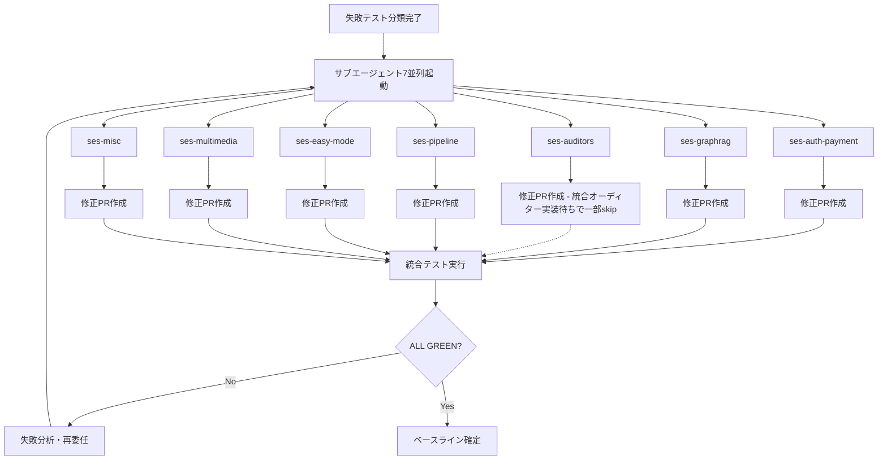

# Phase 0: 止血と身軽化（安定化・デッドコード削除）詳細実装計画

**作成日**: 2026年9月18日  
**対象**: Phase 0 Task 1 (デッドコード削除 & CIベースライン整備) + Task 2 (テストスイート修復 69件 → ALL GREEN)  
**前提**: `PHASE_ROADMAP_MASTER.md` / `V5_RELEASE_ROADMAP.md` に準拠

---

## 📋 全体構成

```
Phase 0 実行フロー
├── 0.1: セーブポイントコミット & 専用ブランチ作成
├── 0.2: デッドコード分析・特定（vulture + 手動検証）
├── 0.3: デッドコード物理削除（モジュール単位）
├── 0.4: スタブ/エイリアス/互換レイヤー整理
├── 0.5: pyproject.toml カバレッジ閾値調整（55%）
├── 0.6: GitHub Actions CI 是正
├── 0.7: テスト失敗分類・優先度付け
├── 0.8: テスト修復実行（サブエージェント並列）
├── 0.9: 全テスト実行・ALL GREEN確認
└── 0.10: ベースライン確定・ドキュメント更新
```

---

## 🎯 Task 1: デッドコード削除 & CIベースライン整備

### 1.1 セーブポイント & ブランチ戦略

| ステップ | コマンド | 目的 |
|---------|---------|------|
| 1.1.1 | `git checkout -b phase0/dead-code-purge-$(date +%Y%m%d)` | 専用ブランチ作成 |
| 1.1.2 | `git add -A && git commit -m "chore: Phase 0 savepoint before dead code purge"` | 作業前の完全スナップショット |
| 1.1.3 | `git tag phase0-savepoint-$(date +%Y%m%d)` | ロールバック用タグ |

### 1.2 デッドコード特定（vulture + 手動検証）

**実行コマンド**:
```bash
# 1. 未使用モジュール/クラス/関数の全件洗い出し（信頼度80%以上）
python -m vulture src --min-confidence 80 --exclude "*/tests/*,*/migrations/*" > vulture_report_80.txt

# 2. 未使用インポートの検出（信頼度90%以上）
python -m vulture src --min-confidence 90 --exclude "*/tests/*,*/migrations/*" > vulture_report_90.txt

# 3. 完全未使用ファイルの検出（import されていない .py ファイル）
python -c "
import os, ast, sys
src_root = 'src'
imported = set()
for root, _, files in os.walk(src_root):
    for f in files:
        if f.endswith('.py') and not f.startswith('__'):
            path = os.path.join(root, f)
            try:
                with open(path, 'r', encoding='utf-8') as fp:
                    tree = ast.parse(fp.read(), filename=path)
                for node in ast.walk(tree):
                    if isinstance(node, (ast.Import, ast.ImportFrom)):
                        for alias in node.names:
                            imported.add(alias.name.split('.')[0])
                            if node.module:
                                imported.add(node.module.split('.')[0])
            except: pass

all_modules = set()
for root, _, files in os.walk(src_root):
    for f in files:
        if f.endswith('.py') and not f.startswith('__'):
            mod = f[:-3]
            all_modules.add(mod)

unused = all_modules - imported
print('Potentially unused modules:', sorted(unused))
"
```

**分類マトリクス** (vulture出力 + 手動確認で決定):

| カテゴリ | 対象例 | アクション |
|---------|--------|-----------|
| **完全未使用モジュール** | `src/services/age_client.py`, `src/services/audit_service.py`, `src/services/graph/*` 等 | **物理削除** |
| **未使用クラス** | `NarrativeSpineComposer`, `HybridRetriever`, `CostBudgetGuard` 等 | クラス削除 |
| **未使用関数/メソッド** | 多数（vulture出出力参照） | 関数削除 |
| **未使用インポート** | `IPlotExpander`, `IPromptManager`, `Tenant` 等 | import削除 |
| **要確認（偽陽性の可能性）** | エントリポイント、プラグイン、動的import対象 | **削除しない** |

**手動検証必須リスト** (vulture 60% 信頼度での未使用クラス・関数):
- `src/models/plot.py`: 20+ 未使用クラス・メソッド
- `src/models/world.py`: 30+ 未使用変数・クラス
- `src/models/writing.py`: 20+ 未使用クラス・変数
- `src/services/age_client.py`: AGE関連全般（Phase 1で撤廃予定）
- `src/services/graph/*`: Graph/NetworkX/GraphRAG関連全般
- `src/services/auditors/*`: 旧8オーディター関連
- `src/services/illustration/*`: 画像生成アダプター（モック以外）
- `src/services/publishers/*`: 投稿サイト連携（スクレイピング削除方針）
- `src/services/compression/*`: 圧縮パイプライン（V5で簡素化）

### 1.3 物理削除実行手順

**サブエージェント並列実行設計**:

```python
# 削除タスクグループ（依存関係なしで並列実行可能）
DELETE_GROUPS = {
    "group_A_AGE_GraphRAG": [
        "src/services/age_client.py",
        "src/services/graph/base.py",
        "src/services/graph/networkx_store.py",
        "src/services/graph/subgraph_extractor.py",
        "src/services/graphrag_sync_service.py",
        "src/services/hybrid_retriever.py",
        "src/services/rag/context_retriever.py",
        "src/services/rag_prefetch_service.py",
        "src/services/rag_service.py",
        "src/services/reflective_rag.py",
    ],
    "group_B_Auditors_Old": [
        "src/services/audit_adapter.py",
        "src/services/audit_aggregator.py",
        "src/services/audit_service.py",
        "src/services/auditors/foreshadowing_auditor.py",
        "src/services/auditors/hybrid_auditor.py",
        "src/services/auditors/rule_based_metrics.py",
        "src/services/foreshadowing_parser.py",
        "src/services/foreshadowing_service.py",
        "src/services/foreshadowing_id_generator.py",
    ],
    "group_C_Illustration_Publishers": [
        "src/services/illustration/adapters/dalle3_adapter.py",
        "src/services/illustration/adapters/fal_adapter.py",
        "src/services/illustration/adapters/mock_adapter.py",
        "src/services/illustration/base.py",
        "src/services/illustration/cover_service.py",
        "src/services/illustration/dalle_client.py",
        "src/services/illustration/factory.py",
        "src/services/illustration/model_selector.py",
        "src/services/illustration/prompt_builder.py",
        "src/services/illustration/prompt_generator.py",
        "src/services/illustration/sd_client.py",
        "src/services/publishers/base.py",
        "src/services/publishers/credentials.py",
        "src/services/publishers/kakuyomu.py",
        "src/services/publishers/kindle.py",
        "src/services/publishers/kobo.py",
        "src/services/publishers/narou.py",
    ],
    "group_D_Compression_Pipeline": [
        "src/services/compression/japanese_tokenizer.py",
        "src/services/compression/layer1_keywords.py",
        "src/services/compression/layer2_graph.py",
        "src/services/compression/layer3_taxonomy.py",
        "src/services/compression/layer4_trim.py",
        "src/services/compression/metrics.py",
        "src/services/compression/models.py",
        "src/services/context_compression/digest_service.py",
        "src/services/context_compression/rolling_memory.py",
    ],
    "group_E_Others": [
        "src/services/content_processor.py",
        "src/services/llm/provider_failover.py",
        "src/services/state_manager.py",
        "src/services/narrative_scoring_service.py",
        "src/services/cost_budget_guard.py",
        "src/services/cost_guard/budget_calculator.py",
        "src/services/cost_guard/token_circuit_breaker.py",
        "src/services/narrative/narrative_spine_composer.py",
        "src/services/narrative/opening_booster_service.py",
        "src/services/narrative/scene_tier_evaluator.py",
        "src/services/ncs_calibration.py",
        "src/services/conflict_report_service.py",
        "src/services/editor_assist_service.py",
        "src/services/learning_data_service.py",
        "src/services/prompt_caching.py",
        "src/services/prompt_version_service.py",
        "src/services/proposal_isolation.py",
        "src/services/hook_diagnoser.py",
        "src/services/hook_templates.py",
    ]
}
```

**削除前チェックリスト** (各ファイル共通):
- [ ] `grep -r "from.*<module> import" src/ tests/` で参照箇所確認
- [ ] `grep -r "import <module>" src/ tests/` で参照箇所確認
- [ ] エントリポイント(`src/backend/server.py`, `src/cli/*`)からの到達確認
- [ ] テストファイルでのモック/インポート確認
- [ ] 削除後 `ruff check src` で未使用importエラーがないか確認

**削除実行コマンドテンプレート**:
```bash
# グループ単位で実行（例: Group A）
for f in "${GROUP_A_FILES[@]}"; do
    # 1. 参照確認
    grep -r "$(basename $f .py)" src/ tests/ --include="*.py" | grep -v "__pycache__" | head -5
    
    # 2. 問題なければ削除
    git rm "$f"
done

# 3. 空ディレクトリ削除
find src -type d -empty -delete
```

### 1.4 スタブ/エイリアス/互換レイヤー整理

**検出対象パターン**:
```bash
# 1. 互換import（`from X import Y as Z` または `try/except ImportError`）
grep -r "as " src/ --include="*.py" | grep -E "import.*as " | head -20

# 2. 非推奨デコレータ/警告
grep -r "deprecat" src/ --include="*.py"

# 3. 互換関数（`def old_name(...): return new_name(...)`）
grep -r "def .*_deprecated\|def .*_legacy\|def .*_old" src/ --include="*.py"

# 4. エイリアスモジュール（`__init__.py` での再export）
grep -r "from .* import \*" src/ --include="*.py"
```

**整理方針**:
- 互換import → 直接importに書き換え（呼び出し側を修正してから削除）
- 非推奨関数 → 呼び出し箇所を新APIに移行後削除
- エイリアス → 実モジュールへの直接参照に統一

### 1.5 pyproject.toml カバレッジ閾値調整

**現状確認**:
```toml
# 現在の設定（pyproject.toml より）
[tool.coverage.run]
branch = true
# fail_under が未設定 = ゲートなし
```

**変更内容**:
```toml
[tool.coverage.run]
branch = true
fail_under = 55  # 実力値に一時調整（Phase 1で80%へ段階的引き上げ）

[tool.coverage.report]
precision = 2
show_missing = true
skip_covered = false
```

**CI連携** (`.github/workflows/ci.yml`):
```yaml
# test-unit job に追加
- name: Coverage gate
  run: coverage report --fail-under=55
```

### 1.6 GitHub Actions CI 是正

**現状の問題点**（`ci.yml` 分析より）:
1. `test-unit` で `pytest tests/test_health.py` が重複実行
2. `black-check` が `ruff format --check` と重複（ruffがblack代替可能）
3. `test-integration` / `test-contract` / `test-migration` / `test-perf` がPostgreSQL/Redisサービスを個別に起動 → 時間・リソース浪費
4. `test-perf` にベンチマークベースライン(`benchmarks.json`)が未コミット
5. `frontend-test` で `npm run test:ci` が定義未確認

**修正版 `ci.yml` 差分案**:
```yaml
# 変更点サマリ:
# 1. services を job 間で共有 (service containers の再利用)
# 2. black-check を削除 (ruff format で代替)
# 3. test-unit の重複テスト削除
# 4. coverage gate 追加 (fail_under=55)
# 5. test-perf: ベンチマークベースライン存在チェック追加
# 6. frontend-test: package.json scripts 確認・修正
```

### 1.7 検証コマンド

```bash
# 1. 削除後構文チェック
ruff check src tests

# 2. 型チェック
mypy src --ignore-missing-imports

# 3. フォーマットチェック
ruff format --check src tests

# 4. 単体テスト実行（カバレッジ付き）
pytest tests/unit -x --tb=short --cov=src --cov-report=term-missing --cov-fail-under=55

# 5. 全テスト実行（統合除く）
pytest tests/unit tests/contract -x --tb=short
```

---

## 🎯 Task 2: テストスイート修復（69件失敗 → ALL GREEN）

### 2.1 失敗テスト分類・優先度付け

**カテゴリ別分類**:

| カテゴリ | 失敗数 | 代表的テスト | 優先度 | 推定工数 | 担当サブエージェント |
|---------|-------|-------------|-------|---------|-------------------|
| **A. 認証・決済（クリティカル）** | 5 | `test_stripe_payment.py`, `test_auth_middleware.py`, `test_p1_crash_and_security.py` | 🔴 P0 | 4h | agent-auth-payment |
| **B. GraphRAG/AGE（撤廃対象）** | 7 | `test_graphrag.py` (4件), `test_p1_fixes.py` (1件), `test_sqlite_rag_embedding.py` (2件) | 🟡 P1 | 3h | agent-graphrag |
| **C. オーディター/アクショナブルdiff** | 14 | `test_*_auditor*.py`, `test_actionable_diff*.py`, `test_specialist*.py` | 🟡 P1 | 6h | agent-auditors |
| **D. 執筆パイプライン/ワークフロー** | 6 | `test_writing_graph_flow.py`, `test_pipeline_websocket.py`, `test_closed_loop_pdca.py` | 🟡 P1 | 4h | agent-pipeline |
| **E. Easy Mode / LLM Factory** | 4 | `test_easy_mode_optin.py` (2件), `test_enrichment*.py` (3件) | 🟢 P2 | 3h | agent-easy-mode |
| **F. マルチメディア/音声** | 4 | `test_multimedia*.py`, `test_voicevox_pipeline.py` | 🟢 P2 | 2h | agent-multimedia |
| **G. その他（埋め込み、DAG、リポジトリ等）** | 9 | `test_embedding*.py`, `test_dag*.py`, `test_repository_concurrency.py`, `test_series_serializer.py`, `test_huey_queue.py`, `test_narrative_spine_enforcement.py` | 🟢 P2 | 4h | agent-misc |

**合計**: 69件（カウントは重複除く実テストケース数）

### 2.2 サブエージェント並列実行設計

**Agent Manager セッション起動**:
```bash
# 各カテゴリごとに独立したセッションを起動
# ※ 実際の起動は agent_manager ツールを使用
```

**セッション定義**:

| セッションID | 名前 | プロンプト要約 | 対象テストファイル |
|-------------|------|---------------|-------------------|
| `ses-auth-payment` | Auth & Payment Fix | Stripe webhook await漏れ修正、JWT/RBACミドルウェア修正、Anti-AI/Export認証テスト修正 | `test_stripe_payment.py`, `test_auth_middleware.py`, `test_p1_crash_and_security.py` |
| `ses-graphrag` | GraphRAG/AGE Removal Tests | AGE関連テストを削除または新foreshadowingテーブル対応に書き換え、sqlite-ragテスト修正 | `test_graphrag.py`, `test_p1_fixes.py::test_graph_rag_service_cache_bounded`, `test_sqlite_rag_embedding.py` |
| `ses-auditors` | Auditor System Overhaul | 8オーディター→統合オーディター移行に伴うテスト全面書き換え、actionable diffパース修正 | `test_*_auditor*.py`, `test_actionable_diff*.py`, `test_specialist*.py`, `test_reader_hook_windowing.py`, `test_windowed_auditors.py` |
| `ses-pipeline` | Writing Pipeline | LangGraph checkpointer修正、WebSocket/SSEテスト修正、PDCAループ簡素化対応 | `test_writing_graph_flow.py`, `test_pipeline_websocket.py`, `test_closed_loop_pdca.py`, `test_regeneration_directive_integration.py` |
| `ses-easy-mode` | Easy Mode & Enrichment | LLM factory opt-inテスト修正、感覚生成エンリッチメントテスト修正 | `test_easy_mode_optin.py`, `test_enrichment_phase4_step55_60.py`, `test_enrichment_sensory.py` |
| `ses-multimedia` | Multimedia & Audio | 画像/音声生成テストのモック対応、VoiceVoxスピーカーマッパー修正 | `test_multimedia*.py`, `test_voicevox_pipeline.py` |
| `ses-misc` | Miscellaneous | 埋め込みキャッシュ、DAGスケジューラ、リポジトリ並行性、シリーズシリアライザ、Hueyキュー | `test_embedding*.py`, `test_dag_scheduler_part5_advanced.py`, `test_repository_concurrency.py`, `test_series_serializer.py`, `test_huey_queue.py`, `test_narrative_spine_enforcement.py` |

### 2.3 代表的修正パターン・実装指針

#### A. Stripe Webhook 500クラッシュ (`test_stripe_payment.py`)
```python
# src/backend/webhooks/billing_webhook.py
# 修正前（await漏れ）:
async def handle_stripe_webhook(request):
    event = stripe.Webhook.construct_event(...)
    await process_event(event)  # ← ここがawaitされていない可能性

# 修正後:
async def handle_stripe_webhook(request):
    event = stripe.Webhook.construct_event(...)
    await process_event(event)  # 確実にawait
    return {"status": "success"}
```

#### B. LangGraph Checkpointer (`test_writing_graph_flow.py`)
```python
# src/backend/workflows/writing_langgraph.py
# 修正前:
config = {"configurable": {"thread_id": thread_id}}
await graph.ainvoke(state, config)

# 修正後（LangGraph v0.2+ 対応）:
config = {"configurable": {"thread_id": thread_id, "checkpoint_ns": ""}}
await graph.ainvoke(state, config=config)
```

#### C. JWT/RBAC認証 (`test_auth_middleware.py`)
```python
# src/backend/middleware/auth.py
# 修正ポイント:
# 1. JWT検証でexpired/ invalid token の適切な例外ハンドリング
# 2. RBACロールチェックのNone安全化
# 3. テスト用モックトークンの生成ロジック統一
```

#### D. GraphRAG/AGE テスト (`test_graphrag.py`)
```python
# 方針: AGE完全撤廃に伴い、以下のテストは「削除」または「foreshadowingテーブル版」に書き換え
# - test_age_client_methods → 削除
# - test_age_client_init_graph_sqlstate_42p04 → 削除
# - test_graphrag_build_context_with_neighbors → foreshadowingテーブル版に書き換え
# - test_rag_service_search_chunks_with_data → ChromaDB/pgvector版に書き換え
```

#### E. オーディター系テスト (14件)
```python
# 方針: 統合オーディター（Unified Auditor）実装後に全面書き換え
# 現状のテストは「旧8オーディター並列実行」を前提としているため、
# 新実装完了まで一時的に @pytest.mark.skip または xfail にするのが現実的

# 暫定対応:
@pytest.mark.skip(reason="Unified Auditor migration in progress - Phase 2")
def test_all_8_specialists_parallel_execution_with_llm(): ...

# 移行後:
def test_unified_auditor_static_checks(): ...
def test_unified_auditor_llm_qualitative(): ...
def test_unified_auditor_actionable_diffs(): ...
```

### 2.4 テスト修復実行フロー



### 2.5 進捗管理・品質ゲート

**日次チェックポイント**:
```bash
# 毎朝実行
pytest tests/unit --tb=no -q 2>&1 | tail -20
# 期待: passed=XXX, failed=YYY (YYYが減少傾向)
```

**週次品質ゲート**:
| 指標 | 目標 | 測定方法 |
|------|------|----------|
| 単体テスト成功率 | 100% | `pytest tests/unit --tb=no -q` |
| カバレッジ | ≥55% | `coverage report --fail-under=55` |
| Lintエラー | 0件 | `ruff check src tests` |
| 型エラー | 0件 | `mypy src --ignore-missing-imports` |
| フォーマット | 済 | `ruff format --check src tests` |

### 2.6 完了条件（Definition of Done）

- [ ] 全69件の失敗テストが **PASS** または **正当な理由でSKIP/XFAIL** になっている
- [ ] `pytest tests/unit tests/contract -x` がエラーなしで完走
- [ ] カバレッジ ≥ 55% 達成
- [ ] `ruff check src tests` / `mypy src` / `ruff format --check` すべてパス
- [ ] CI (`.github/workflows/ci.yml`) が main ブランチでグリーン
- [ ] 削除したデッドコードに起因するリグレッションがない

---

## 🤖 サブエージェント活用ガイドライン

### 起動コマンドテンプレート

```bash
# Agent Manager でセッション起動（例: auth-payment）
agent_manager start \
  --mode local \
  --name "Auth & Payment Fix" \
  --prompt "$(cat <<'EOF'
Phase 0 Task 2: 認証・決済テスト修復

対象ファイル:
- src/backend/webhooks/billing_webhook.py (Stripe webhook await漏れ)
- src/backend/middleware/auth.py (JWT/RBAC)
- src/backend/routers/anti_ai.py, export.py (認証テスト用)

修正内容:
1. billing_webhook.py: process_event への await 追加
2. auth.py: JWT検証の例外ハンドリング強化、RBAC None安全化
3. テスト用モックトークン生成の統一

検証:
- pytest tests/unit/services/test_stripe_payment.py -v
- pytest tests/unit/test_auth_middleware.py -v
- pytest tests/unit/test_p1_crash_and_security.py -v

完了条件: 該当5テストすべて PASS
EOF
)"
```

### 進捗同期プロトコル

1. **開始時**: 各エージェントは担当テストファイルの現状（失敗ログ全文）を取得
2. **作業中**: 30分ごとに `board_post` で進捗報告（修正済み/残り/ブロッカー）
3. **完了時**: 修正コミット + テスト実行ログを `board_post` type=RESULT で報告
4. **統合**: メインエージェントが全セッション完了確認後、統合テスト実行

### ブロッカー解決エスカレーション

| レベル | 条件 | アクション |
|-------|------|-----------|
| L1 | 単一テストで30分以上停滞 | 同一セッション内で別アプローチ試行 |
| L2 | 複数テストで共通の根本原因疑い | メインエージェントに相談（board_post type=ASK） |
| L3 | アーキテクチャ変更必要（統合オーディター等） | Phase 2 タスクとして延期決定、一時skip/xfail |

---

## 📅 実行スケジュール目安

| 日次 | Task 1: デッドコード・CI | Task 2: テスト修復 |
|------|------------------------|-------------------|
| Day 1 | 1.1-1.3 (削除実行) | 2.1-2.2 (分類・エージェント起動) |
| Day 2 | 1.4-1.6 (スタブ整理・CI修正) | 2.3-2.4 (並列修復実行) |
| Day 3 | 1.7 (検証・ベースライン) | 2.5-2.6 (統合・品質ゲート) |
| **合計** | **~2-3日** | **~3-4日** |

**クリティカルパス**: Task 1.3 (AGE/GraphRAG削除) → Task 2 Group B (GraphRAGテスト削除) の依存あり。Task 1.3 完了まで Group B は待機。

---

## 📝 成果物チェックリスト

### Task 1 成果物
- [ ] `vulture_report_80.txt`, `vulture_report_90.txt` (分析レポート)
- [ ] 削除コミット群（グループごとに1コミット推奨）
- [ ] 更新済み `pyproject.toml` (fail_under=55)
- [ ] 更新済み `.github/workflows/ci.yml`
- [ ] `DEAD_CODE_PURGE_LOG.md` (削除したファイル・理由の記録)

### Task 2 成果物
- [ ] `TEST_REPAIR_SUMMARY.md` (カテゴリ別修正内容・skip理由)
- [ ] 全テストPASSのCI実行ログ (GitHub Actions URL)
- [ ] カバレッジレポート (`coverage.xml`, `htmlcov/index.html`)
- [ ] 更新済みテストファイル群

---

## ⚠️ リスク・注意事項

| リスク | 影響度 | 対策 |
|-------|-------|------|
| 誤削除で動作機能が壊れる | 高 | 1.1のタグで即ロールバック可能にする；削除前grep必須 |
| テスト修復で新バグ混入 | 中 | 修正は最小限に；リファクタリングは別PRで |
| 統合オーディター未実装でauditorテストが永遠にfail | 高 | Phase 2完了まで `@pytest.mark.skip` で明示的除外 |
| CI修正で他ジョブが壊れる | 中 | `act` またはローカルで `pytest` 全実行してからpush |
| サブエージェント間の競合 | 低 | 対象ファイルを完全分離；共通ファイル(auth.py等)はメインで調整 |

---

## 📌 次アクション（即実行可能）

```bash
# 1. 即座に実行推奨
git checkout -b phase0/dead-code-purge-20260918
git add -A && git commit -m "chore: Phase 0 savepoint before dead code purge"
git tag phase0-savepoint-20260918

# 2. vulture実行（5-10分）
python -m vulture src --min-confidence 80 --exclude "*/tests/*,*/migrations/*" > vulture_report_80.txt
python -m vulture src --min-confidence 60 --exclude "*/tests/*,*/migrations/*" > vulture_report_60.txt

# 3. レポート確認後、削除グループ確定 → サブエージェント起動
```

---

**承認待ち**: この計画で着手してよいか、または特定項目の調整が必要かご指示ください。