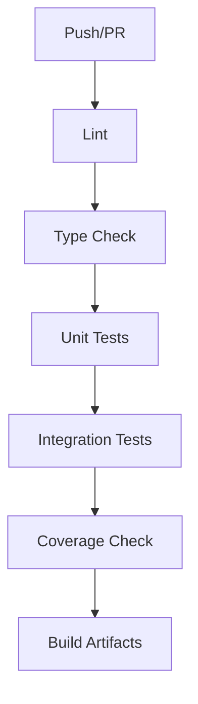

# Phase 0: 観測性とSSOT確立 - 詳細実装計画書

**作成日**: 2026-09-24  
**ベースライン**: `plans/PHASE_ROADMAP_MASTER.md` Phase 0 セクション  
**ゴール**: 正確な現状把握ができる状態を作り、開発の迷いと認知負荷をなくす

---

## 全24ステップ 概要

| Step | カテゴリ | 作業内容 | 成果物 | テスト/検証 |
|------|----------|----------|--------|-------------|
| 1 | ブランチ | 作業ブランチ `phase0-baseline` 作成・切替 | ブランチ | `git status` |
| 2 | ブランチ | セーブポイントコミット（現状タグ `pre-phase0`） | タグ | `git tag -l` |
| 3 | CI/品質 | `pyproject.toml` coverage threshold を 55% に暫定変更 | 修正済み pyproject.toml | `pytest --cov --cov-fail-under=55` PASS |
| 4 | CI/品質 | 現在のカバレッジ実力値を JSON 出力・保存 | `artifacts/coverage_baseline.json` | 手動確認 |
| 5 | CI/品質 | 全テストスイート実行時間・失敗一覧を JSON 出力 | `artifacts/test_baseline.json` | 手動確認 |
| 6 | ドキュメント | `README.md` を最新実態に同期（domain/writing、CLI、プラグイン） | 修正済み README.md | リンク切れチェック |
| 7 | ドキュメント | バージョン表記統一（pyproject.toml ↔ src/cli/main.py） | 統一済みバージョン | `autonovel --version` 整合 |
| 8 | ドキュメント | `plans/` マスターロードマップ一本化の確認・維持 | 変更なし or 更新 | `ls plans/` 単一ファイル |
| 9 | ドキュメント | `CLAUDE.md` 実態同期（コマンド・構造・注意事項） | 修正済み CLAUDE.md | 構文チェック |
| 10 | ドキュメント | `docs/adr/` 実態同期（ADR 001 等の現状反映） | 更新済み ADR | `markdownlint` |
| 11 | ドキュメント | `docs/architecture.md` 実態同期（現行アーキ図・説明） | 更新済みアーキ文書 | 構文チェック |
| 12 | 依存関係 | `pipdeptree` で依存ツリー出力・保存 | `artifacts/deptree_baseline.txt` | 循環依存なし確認 |
| 13 | 依存関係 | `pip-audit` で脆弱性スキャン・結果保存 | `artifacts/audit_baseline.json` | Critical/High 0 確認 |
| 14 | 依存関係 | ライセンス互換性チェック（`pip-licenses`） | `artifacts/licenses_baseline.csv` | 問題ライセンスなし |
| 15 | CI/CD | GitHub Actions ワークフロー図化（Mermaid） | `docs/ci-workflow.md` | 可読性確認 |
| 16 | CI/CD | CI 成果物保存期間を 30 日延長設定 | 修正済み workflow.yml | 手動確認 |
| 17 | CI/CD | 失敗時アラート（Slack/Email）設定・テスト送信 | 通知到達確認 | 実通知テスト |
| 18 | テスト/回帰 | ベースライン計測スクリプト `scripts/baseline_measure.py` 作成 | スクリプト | 単体テスト PASS |
| 19 | テスト/回帰 | `baseline_measure.py` の単体テスト作成 | `tests/scripts/test_baseline_measure.py` | `pytest` PASS |
| 20 | テスト/回帰 | カバレッジ閾値変更のリグレッションテスト作成 | `tests/config/test_coverage_threshold.py` | `pytest` PASS |
| 21 | テスト/回帰 | README リンク切れ検知テスト作成 | `tests/docs/test_readme_links.py` | `pytest` PASS |
| 22 | テスト/回帰 | バージョン整合性テスト作成 | `tests/config/test_version_consistency.py` | `pytest` PASS |
| 23 | テスト/回帰 | 依存関係ベースライン比較テスト作成 | `tests/deps/test_dependency_baseline.py` | `pytest` PASS |
| 24 | 完了 | 全ステップ完了確認・PR 作成・マージ | PR #xxx | 全テスト GREEN |

---

## ステップ詳細

### Step 1: 作業ブランチ作成・切替
```bash
git checkout -b phase0-baseline
git push -u origin phase0-baseline
```
**Done**: `git branch --show-current` → `phase0-baseline`

### Step 2: セーブポイントコミット・タグ
```bash
git add -A
git commit -m "chore: pre-phase0 savepoint"
git tag pre-phase0
git push origin pre-phase0
```
**Done**: `git tag -l | grep pre-phase0`

### Step 3: カバレッジ閾値 55% へ暫定変更
**対象**: `pyproject.toml`
```toml
[tool.coverage.run]
# 既存設定維持

[tool.coverage.report]
fail_under = 55  # 変更前の値から 55 に暫定変更
```
**検証**:
```bash
pytest --cov=src --cov-report=term-missing --cov-fail-under=55
# → PASS すること（失敗すれば閾値をさらに下げて記録）
```

### Step 4: カバレッジ実力値 JSON 出力
**スクリプト**: `scripts/measure_coverage.py`（新規）
```python
#!/usr/bin/env python3
import json, subprocess, sys

def main():
    result = subprocess.run(
        ["pytest", "--cov=src", "--cov-report=json", "--cov-report=term-missing", "-q"],
        capture_output=True, text=True
    )
    with open("coverage.json") as f:
        cov = json.load(f)
    baseline = {
        "total_coverage": cov["totals"]["percent_covered"],
        "files": {k: v["summary"]["percent_covered"] for k, v in cov["files"].items()},
        "timestamp": __import__("datetime").datetime.now().isoformat(),
        "pytest_exit_code": result.returncode
    }
    with open("artifacts/coverage_baseline.json", "w") as f:
        json.dump(baseline, f, indent=2, ensure_ascii=False)
    print(f"Baseline coverage: {baseline['total_coverage']:.1f}%")
    return 0 if result.returncode == 0 else 1

if __name__ == "__main__":
    sys.exit(main())
```
**実行**: `python scripts/measure_coverage.py`
**Done**: `artifacts/coverage_baseline.json` 存在・妥当な値

### Step 5: 全テストベースライン JSON 出力
**拡張**: `scripts/measure_coverage.py` に統合または別スクリプト
```python
# test_baseline.json 構造
{
  "total_tests": 1234,
  "passed": 1180,
  "failed": 42,
  "skipped": 12,
  "duration_seconds": 45.3,
  "failures": [{"nodeid": "...", "message": "..."}, ...],
  "timestamp": "..."
}
```

### Step 6: README.md 実態同期
**更新項目**:
- `src/domain/writing` への移行完了記載
- 統一 CLI `autonovel` コマンド体系
- 動的プラグイン機構（`src/plugins/`）
- 旧 `writing_service.py` 等の削除済み明記
- 開発コマンド一覧（`make test`, `make lint` 等）

**検証**: `markdownlint README.md` + 手動リンク確認

### Step 7: バージョン表記統一
**対象**:
- `pyproject.toml`: `version = "x.y.z"`
- `src/cli/main.py`: `__version__ = "x.y.z"`

**検証**:
```bash
# 両方一致すること
grep '^version' pyproject.toml
grep '__version__' src/cli/main.py
autonovel --version
```

### Step 8: plans/ マスターロードマップ確認
```bash
ls plans/
# → PHASE_ROADMAP_MASTER.md のみであること
```
複数存在する場合は統合・削除。

### Step 9: CLAUDE.md 実態同期
**更新項目**:
- 現在のディレクトリ構造
- 実行可能コマンド（`pytest`, `ruff`, `mypy`, `autonovel` 等）
- 既知の制約・注意事項（DB接続、環境変数等）

### Step 10: docs/adr/ 実態同期
**対象**: `docs/adr/001-agent-memory-architecture.md` 等
- 現行アーキテクチャと合致するよう更新
- 廃止された設計決定は「Superseded」マーク

### Step 11: docs/architecture.md 実態同期
- Mermaid 図で現行構成を描画
- `domain/writing`、`plugins`、`cli` の関係性を明記

### Step 12: 依存ツリー出力・保存
```bash
pipdeptree --json > artifacts/deptree_baseline.json
pipdeptree --graph-output png > artifacts/deptree_baseline.png  # 可視化用
```
**確認**: 循環依存なし、未使用パッケージ特定

### Step 13: 脆弱性スキャン・保存
```bash
pip-audit --format=json --output=artifacts/audit_baseline.json
```
**基準**: Critical/High = 0 を目標（あれば対応計画立案）

### Step 14: ライセンス互換性チェック
```bash
pip-licenses --format=csv --output-file=artifacts/licenses_baseline.csv
```
**確認**: GPL/AGPL 等のコピーレフトライセンス混入なし

### Step 15: CI/CD ワークフロー図化
**成果物**: `docs/ci-workflow.md`
```markdown
# CI/CD ワークフロー


```

### Step 16: CI 成果物保存期間延長
**対象**: `.github/workflows/ci.yml`
```yaml
- uses: actions/upload-artifact@v4
  with:
    name: coverage-report
    path: coverage.xml
    retention-days: 30  # 既存から延長
```

### Step 17: 失敗時アラート設定
**対象**: `.github/workflows/ci.yml`
```yaml
- name: Notify on failure
  if: failure()
  uses: slackapi/slack-github-action@v1.23.0
  with:
    channel-id: ${{ secrets.SLACK_CHANNEL }}
    slack-message: "CI Failed: ${{ github.repository }} ${{ github.run_id }}"
```
**テスト**: 意図的に失敗させて通知確認

### Step 18: ベースライン計測スクリプト作成
**ファイル**: `scripts/baseline_measure.py`
- Step 4・5 の機能を統合
- CLI 引数で出力先指定可能
- 終了コードで成功/失敗判定

### Step 19: baseline_measure.py 単体テスト
**ファイル**: `tests/scripts/test_baseline_measure.py`
```python
import pytest
from scripts.baseline_measure import measure_coverage, measure_tests

def test_measure_coverage_returns_dict(tmp_path):
    out = tmp_path / "cov.json"
    result = measure_coverage(output_path=out)
    assert "total_coverage" in result
    assert out.exists()

def test_measure_tests_returns_summary(tmp_path):
    out = tmp_path / "test.json"
    result = measure_tests(output_path=out)
    assert "total_tests" in result
    assert out.exists()
```

### Step 20: カバレッジ閾値リグレッションテスト
**ファイル**: `tests/config/test_coverage_threshold.py`
```python
import tomli
def test_coverage_threshold_is_55():
    with open("pyproject.toml", "rb") as f:
        config = tomli.load(f)
    assert config["tool"]["coverage"]["report"]["fail_under"] == 55
```

### Step 21: README リンク切れ検知テスト
**ファイル**: `tests/docs/test_readme_links.py`
```python
import re, requests, pytest

def extract_links(md_path):
    with open(md_path) as f:
        return re.findall(r'\[([^\]]+)\]\((https?://[^)]+)\)', f.read())

@pytest.mark.parametrize("text,url", extract_links("README.md"))
def test_readme_links_reachable(text, url):
    r = requests.head(url, allow_redirects=True, timeout=5)
    assert r.status_code < 400, f"{url} -> {r.status_code}"
```

### Step 22: バージョン整合性テスト
**ファイル**: `tests/config/test_version_consistency.py`
```python
import tomli, re

def test_version_consistency():
    with open("pyproject.toml", "rb") as f:
        pyproject_ver = tomli.load(f)["project"]["version"]
    with open("src/cli/main.py") as f:
        cli_ver = re.search(r'__version__\s*=\s*"([^"]+)"', f.read()).group(1)
    assert pyproject_ver == cli_ver
```

### Step 23: 依存関係ベースライン比較テスト
**ファイル**: `tests/deps/test_dependency_baseline.py`
```python
import json, subprocess

def test_no_new_critical_vulnerabilities():
    result = subprocess.run(["pip-audit", "--format=json"], capture_output=True, text=True)
    vulns = json.loads(result.stdout)
    critical_high = [v for v in vulns if v.get("vulnerability", {}).get("severity") in ("CRITICAL", "HIGH")]
    # ベースライン時より増えていないこと
    with open("artifacts/audit_baseline.json") as f:
        baseline = json.load(f)
    baseline_critical_high = [v for v in baseline if v.get("vulnerability", {}).get("severity") in ("CRITICAL", "HIGH")]
    assert len(critical_high) <= len(baseline_critical_high)
```

### Step 24: 完了確認・PR 作成
```bash
# 全テスト実行
pytest --cov=src --cov-fail-under=55 -q

# リンター・型チェック
ruff check .
mypy src/

# PR 作成
gh pr create --title "Phase 0: 観測性とSSOT確立" --body-file plans/PHASE_0_IMPLEMENTATION_PLAN.md
```

---

## 依存関係・並列化ガイド

```
Step 1─2 → (3─5 並列) → (6─11 並列) → (12─14 並列) → (15─17 並列) → (18─23 並列) → 24
```

- **ブロックされない**: ドキュメント更新(6-11)、依存関係調査(12-14)、CI/CD改善(15-17) は互いに独立
- **順序必須**: 1→2→3, 18→19-23

---

## 完了判定基準 (Definition of Done)

- [ ] 全 24 ステップのチェックボックス完了
- [ ] `pytest --cov-fail-under=55` PASS
- [ ] `ruff check .` / `mypy src/` PASS
- [ ] `artifacts/` 以下に 6 ファイル生成済み
- [ ] 新規テスト 6 本（Step 19-23）全 PASS
- [ ] PR 作成・レビュー承認・マージ完了
- [ ] `main` ブランチで `git tag phase0-done` 打刻