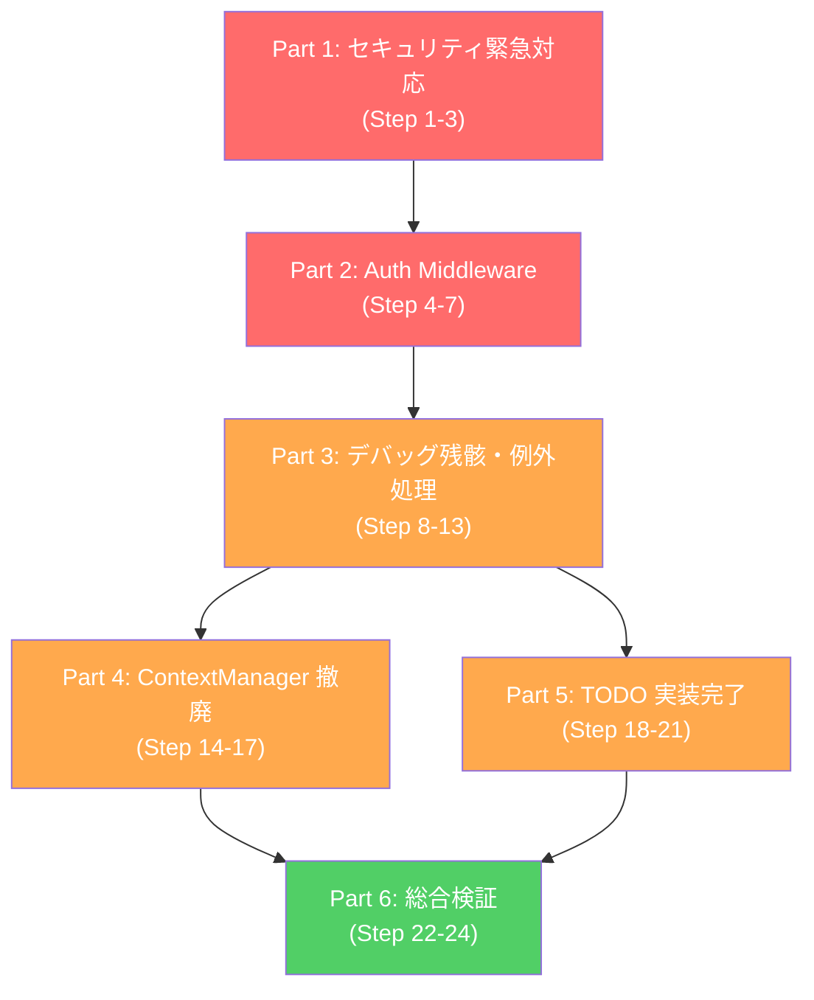

# AutoNovel 実装計画書: コードレビュー第2次是正・品質堅牢化計画 (24 Steps)

**策定日**: 2026-09-25  
**マスターSSOT**: [PHASE_ROADMAP_MASTER.md](file:///e:/hhh/plans/PHASE_ROADMAP_MASTER.md)  
**前提計画**: [PLAN_CODE_REVIEW_REMEDIATION_AND_HARDENING.md](file:///e:/hhh/plans/PLAN_CODE_REVIEW_REMEDIATION_AND_HARDENING.md)（完了済み）  
**対象ブランチ**: `review-remediation-phase2`  
**目的**: 2026-09-25 の包括コードレビュー（第2次）で特定された **Critical 3件 / Major 5件 / Minor 5件** の所見を段階的かつ安全に解消する。全ステップでリグレッション防止テストを先行作成（Red→Green アプローチ）し、既存テストスイートの ALL GREEN を維持しながら修正を進行する。

---

## 📋 全体工程概要（24ステップ / 6パート）

```
┌──────────────────────────────────────────────────────────────────────────────────────┐
│ Part 1: セキュリティ緊急対応 — シークレット漏洩防止 (Step 1〜3)                      │
│  - .env の Git 履歴除去確認・Docker Compose 固定パスワード排除                       │
│  - リグレッション防止テスト: test_env_security_guardrails.py                         │
├──────────────────────────────────────────────────────────────────────────────────────┤
│ Part 2: Auth Middleware タイミング安全化 (Step 4〜7)                                 │
│  - auth_middleware.py の API Key 比較を hmac.compare_digest に統一                   │
│  - branches.py の print() 削除・ロギング統一                                        │
│  - リグレッション防止テスト: test_auth_middleware_timing_safe.py                     │
├──────────────────────────────────────────────────────────────────────────────────────┤
│ Part 3: デバッグ残骸除去と例外処理改善 (Step 8〜13)                                  │
│  - ルート直下デバッグファイル除去・except Exception サイレントキャッチ改善            │
│  - リグレッション防止テスト: test_exception_handling_audit.py                        │
├──────────────────────────────────────────────────────────────────────────────────────┤
│ Part 4: 非推奨コード移行完了 — ContextManager 撤廃 (Step 14〜17)                     │
│  - engine_context.py の二重実装解消・ContextBuilderAgent 完全移行                    │
│  - リグレッション防止テスト: test_context_builder_migration.py                       │
├──────────────────────────────────────────────────────────────────────────────────────┤
│ Part 5: TODO/未実装コードの棚卸しと実装 (Step 18〜21)                                │
│  - PatchMerger/ParagraphPatchAgent/FastScreener の実装完了                           │
│  - stream_writing.py のハードコード解消                                              │
│  - リグレッション防止テスト: test_patch_pipeline_integration.py 等                   │
├──────────────────────────────────────────────────────────────────────────────────────┤
│ Part 6: プロジェクト構造整理とリグレッション総合検証 (Step 22〜24)                    │
│  - easy_mode.py の重複 import 解消・命名揺れ整理                                     │
│  - 全リグレッションテストスイート一括実行 (ALL GREEN) & SSOT 更新                    │
└──────────────────────────────────────────────────────────────────────────────────────┘
```

---

## 🔴 Part 1: セキュリティ緊急対応 — シークレット漏洩防止 (Step 1〜3)

### Step 1: `.env` の Git 履歴確認と安全化

- **目的**: [`.env`](file:///e:/hhh/.env) が Git 履歴にコミットされたことがないか確認し、万が一コミットされていた場合は履歴から除去する。
- **対象ファイル**:
  - `.env`
  - `.gitignore`
- **修正内容**:
  1. `git log --all --full-history -- .env` を実行し、コミット履歴を確認。
  2. 履歴に存在する場合は `git filter-repo --path .env --invert-paths` （または `BFG Repo-Cleaner`）で完全除去。
  3. `.gitignore` に `.env` が含まれていることを再確認（現在 L11 に存在 → 確認済み）。
  4. `.env` 内のクレデンシャル項目（`NAROU_EMAIL`, `NAROU_PASSWORD`, `KAKUYOMU_API_TOKEN`, `KOBO_*`, `KINDLE_*`）が空であることを確認。非空の場合はローテーション手順を文書化。
- **リグレッション防止テスト**:
  - 新規作成: `tests/security/test_env_security_guardrails.py`
  - テストケース:
    - `test_env_file_not_tracked_by_git`: `git ls-files .env` が空であることを検証。
    - `test_gitignore_contains_env`: `.gitignore` に `.env` パターンが含まれることを検証。
    - `test_env_example_has_no_real_secrets`: `.env.example` のすべての値が空またはプレースホルダーであることを検証。
- **検証コマンド**:
  ```bash
  pytest tests/security/test_env_security_guardrails.py -v
  ```
- **期待結果**: 3テスト PASS。`.env` が Git 追跡対象外であること。

---

### Step 2: Docker Compose (dev) 固定パスワードの環境変数化

- **目的**: [`docker-compose.yml`](file:///e:/hhh/docker-compose.yml#L110-L111) の PostgreSQL 認証情報 `POSTGRES_PASSWORD=autonovel` をハードコードから環境変数参照に変更する。
- **対象ファイル**:
  - `docker-compose.yml`
  - `.env.example`
- **修正内容**:
  1. `docker-compose.yml` の `db` サービスを以下に変更:
     ```yaml
     environment:
       - POSTGRES_USER=${POSTGRES_USER:-autonovel}
       - POSTGRES_PASSWORD=${POSTGRES_PASSWORD:?POSTGRES_PASSWORD is required}
       - POSTGRES_DB=${POSTGRES_DB:-autonovel}
     ```
  2. `backend` / `worker` サービスの `DATABASE_URL` も同様に:
     ```yaml
     - DATABASE_URL=postgresql://${POSTGRES_USER:-autonovel}:${POSTGRES_PASSWORD}@db:5432/${POSTGRES_DB:-autonovel}
     ```
  3. `.env.example` に以下を追記:
     ```env
     # ---- Docker Compose (dev) Database Credentials ----
     POSTGRES_USER=autonovel
     POSTGRES_PASSWORD=autonovel_dev_password_change_me
     POSTGRES_DB=autonovel
     ```
- **リグレッション防止テスト**:
  - `tests/security/test_env_security_guardrails.py` に追加:
    - `test_docker_compose_no_hardcoded_passwords`: `docker-compose.yml` 内の `POSTGRES_PASSWORD` が `${` による変数参照であることを検証。
- **検証コマンド**:
  ```bash
  pytest tests/security/test_env_security_guardrails.py::test_docker_compose_no_hardcoded_passwords -v
  ```
- **期待結果**: テスト PASS。`docker-compose.yml` にハードコードパスワードが存在しないこと。

---

### Step 3: Docker Compose (prod) のシークレット検証強化

- **目的**: [`docker-compose.prod.yml`](file:///e:/hhh/docker-compose.prod.yml) でも同様のシークレット管理を徹底する。
- **対象ファイル**:
  - `docker-compose.prod.yml`
- **修正内容**:
  1. `POSTGRES_PASSWORD`、`REDIS_PASSWORD` がすべて `${VAR:?error}` 形式であることを確認し、不足箇所を修正。
  2. `AUTH_DISABLED` が本番では `false` であることを確認。
- **リグレッション防止テスト**:
  - `tests/security/test_env_security_guardrails.py` に追加:
    - `test_prod_compose_requires_secrets`: `docker-compose.prod.yml` で `POSTGRES_PASSWORD` と `REDIS_PASSWORD` が必須変数 (`?`) であることを検証。
    - `test_prod_compose_auth_not_disabled`: 本番 compose で `AUTH_DISABLED=true` が設定されていないことを検証。
- **検証コマンド**:
  ```bash
  pytest tests/security/test_env_security_guardrails.py -v
  ```
- **期待結果**: 全 6 テスト PASS。

---

## 🔴 Part 2: Auth Middleware タイミング安全化 (Step 4〜7)

### Step 4: `auth_middleware.py` の API Key 比較をタイミング安全な方式に統一

- **目的**: [`auth_middleware.py`](file:///e:/hhh/src/backend/middleware/auth_middleware.py#L106) の L106 および L118 で `in` 演算子による比較を使用しているが、[`auth.py`](file:///e:/hhh/src/backend/auth.py#L160) では `hmac.compare_digest` を使用している。ミドルウェア側もタイミング安全な比較に統一する。
- **対象ファイル**:
  - `src/backend/middleware/auth_middleware.py`
- **修正内容**:
  1. ファイル先頭に `import hmac` を追加。
  2. L103-107 を以下に変更:
     ```python
     # L103-107: タイミング安全な API Key 比較
     allowed_keys_str = settings.ALLOWED_API_KEYS or ""
     allowed_keys = [k.strip() for k in allowed_keys_str.split(",") if k.strip()]
     
     if api_key_header and any(hmac.compare_digest(api_key_header, k) for k in allowed_keys):
         return await call_next(request)
     ```
  3. L117-119 を以下に変更:
     ```python
     # L117-119: Authorization ヘッダー経由の API Key もタイミング安全に
     if token and any(hmac.compare_digest(token, k) for k in allowed_keys):
         return await call_next(request)
     ```
- **リグレッション防止テスト**:
  - 新規作成: `tests/security/test_auth_middleware_timing_safe.py`
  - テストケース:
    - `test_valid_api_key_via_x_api_key_header`: 有効な API Key で認証成功。
    - `test_valid_api_key_via_authorization_header`: Authorization ヘッダー経由で認証成功。
    - `test_invalid_api_key_rejected`: 無効な API Key で 401 応答。
    - `test_no_auth_header_rejected`: ヘッダーなしで 401 応答。
    - `test_public_paths_bypass_auth`: `/health`, `/docs` 等の公開パスが認証不要。
    - `test_options_preflight_bypass_auth`: OPTIONS リクエストが認証不要。
    - `test_middleware_uses_constant_time_comparison`: ソースコードに `hmac.compare_digest` が使われていることを静的検証。
- **検証コマンド**:
  ```bash
  pytest tests/security/test_auth_middleware_timing_safe.py -v
  ```
- **期待結果**: 7テスト PASS。

---

### Step 5: `auth.py` の `validate_api_key_sync` との重複排除

- **目的**: `auth_middleware.py` と `auth.py` で API Key 検証ロジックが重複しているため、共通ヘルパーに集約する。
- **対象ファイル**:
  - `src/backend/middleware/auth_middleware.py`
  - `src/backend/auth.py`
- **修正内容**:
  1. `auth.py` の `validate_api_key_sync` を正規の API Key 検証関数として維持。
  2. `auth_middleware.py` の API Key 検証部分を `validate_api_key_sync` の呼び出しに置き換え:
     ```python
     from src.backend.auth import validate_api_key_sync
     
     # X-API-Key ヘッダー
     if api_key_header:
         result = validate_api_key_sync(api_key_header)
         if result:
             return await call_next(request)
     
     # Authorization ヘッダー（API Key として）
     if token:
         result = validate_api_key_sync(token)
         if result:
             return await call_next(request)
     ```
- **リグレッション防止テスト**:
  - `tests/security/test_auth_middleware_timing_safe.py` の既存テストが引き続き全件 PASS することを確認。
- **検証コマンド**:
  ```bash
  pytest tests/security/test_auth_middleware_timing_safe.py -v
  ```
- **期待結果**: 7テスト PASS（リファクタリングでの動作変化なし）。

---

### Step 6: `branches.py` の `print()` 文削除

- **目的**: [`branches.py:L60`](file:///e:/hhh/src/backend/routers/branches.py#L60) のデバッグ用 `print()` 文を削除する。DB接続URLが標準出力に漏洩するリスクを排除。
- **対象ファイル**:
  - `src/backend/routers/branches.py`
- **修正内容**:
  1. L60 の `print(f"[router] manager session bind: {url}", flush=True)` を `logger.debug("Branch session bind: %s", url)` に変更。
- **リグレッション防止テスト**:
  - 新規作成: `tests/security/test_no_print_in_production_code.py`
  - テストケース:
    - `test_no_print_statements_in_backend_routers`: `src/backend/routers/` 内の全 `.py` ファイルに `print(` が含まれないことをAST解析で検証（テスト用ファイル・コメントは除外）。
- **検証コマンド**:
  ```bash
  pytest tests/security/test_no_print_in_production_code.py -v
  ```
- **期待結果**: テスト PASS。

---

### Step 7: Part 2 統合検証

- **目的**: Part 2 の全修正がリグレッションを起こしていないことを確認。
- **検証コマンド**:
  ```bash
  pytest tests/security/ -v
  pytest tests/test_easy_mode_api.py -v
  pytest tests/api/ -v
  ```
- **期待結果**: 全テスト PASS。

---

## 🟠 Part 3: デバッグ残骸除去と例外処理改善 (Step 8〜13)

### Step 8: プロジェクトルート直下のデバッグファイル除去

- **目的**: プロジェクトルートに散在する6つのデバッグスクリプトと一時ファイルを `scripts/debug/` に移動またはアーカイブ化する。
- **対象ファイル**（移動対象）:
  - `debug_parser.py`, `debug_persist.py`, `debug_regex.py`, `debug_target.py`, `debug_test.py`, `debug_test2.py`, `debug_test3.py`, `debug_unicode.py`
  - `analyze_models.py`, `final_verification.py`, `manual_verification.py`, `test_simple.py`
- **修正内容**:
  1. `scripts/debug/` ディレクトリを作成。
  2. 上記ファイルを `scripts/debug/` に移動。
  3. `comparison_table.md`, `regression_analysis.md`, `regressions_table.md`, `implementation_pros_cons.md`, `v4.9_vs_v5.0.2.md`, `v4_vs_v5_comparison.md` を `docs/archive/` に移動。
  4. `.gitignore` に `scripts/debug/` を追加（任意）。
- **リグレッション防止テスト**:
  - 新規作成: `tests/security/test_project_root_cleanliness.py`
  - テストケース:
    - `test_no_debug_scripts_in_project_root`: プロジェクトルートに `debug_*.py` が存在しないことを検証。
    - `test_no_temp_analysis_files_in_root`: ルート直下に分析用マークダウンが残っていないことを検証。
- **検証コマンド**:
  ```bash
  pytest tests/security/test_project_root_cleanliness.py -v
  ```
- **期待結果**: 2テスト PASS。

---

### Step 9: `refine_erotic_workflow.py` のサイレント例外キャッチ改善

- **目的**: [`refine_erotic_workflow.py`](file:///e:/hhh/src/backend/workflows/refine_erotic_workflow.py#L28) の `except Exception:` + pass パターンを、最低限 `logger.warning()` でスタックトレースを記録するように改善する。
- **対象ファイル**:
  - `src/backend/workflows/refine_erotic_workflow.py`
- **修正内容**:
  1. L28 の `except Exception:` に `logger.warning("Failed to initialize erotic workflow components", exc_info=True)` を追加。
  2. L66 の `except Exception:` を `except Exception as e:` + `logger.warning("Integrity check failed: %s", e, exc_info=True)` に変更。
  3. L75 の `except Exception:` を同様に `logger.warning("Afterglow evaluation failed: %s", e, exc_info=True)` に変更。
- **リグレッション防止テスト**:
  - `tests/test_erotic_workflow.py` の既存テストが引き続き PASS することを確認。
- **検証コマンド**:
  ```bash
  pytest tests/test_erotic_workflow.py -v
  ```
- **期待結果**: 既存テスト PASS。

---

### Step 10: `marketing_generation_workflow.py` のサイレント例外改善

- **目的**: [`marketing_generation_workflow.py`](file:///e:/hhh/src/backend/workflows/marketing_generation_workflow.py#L28) の `except Exception:` を改善。
- **対象ファイル**:
  - `src/backend/workflows/marketing_generation_workflow.py`
- **修正内容**:
  1. `except Exception:` を `except Exception as e:` + `logger.warning(...)` に変更。
- **検証コマンド**:
  ```bash
  pytest tests/ -k "marketing" -v
  ```
- **期待結果**: 既存テスト PASS。

---

### Step 11: `illustration_workflow.py` のサイレント例外改善

- **目的**: [`illustration_workflow.py`](file:///e:/hhh/src/backend/workflows/illustration_workflow.py) の `except Exception:` を改善。
- **対象ファイル**:
  - `src/backend/workflows/illustration_workflow.py`
- **修正内容**:
  1. すべての `except Exception:` を `except Exception as e:` + `logger.warning(...)` に変更。
- **検証コマンド**:
  ```bash
  pytest tests/test_illustration_agent.py -v
  ```
- **期待結果**: 既存テスト PASS。

---

### Step 12: 例外処理品質の静的検証テスト作成

- **目的**: 今後のコード追加で `except Exception: pass` パターンが再発しないことを静的に検証するテストを作成。
- **対象ファイル**:
  - 新規作成: `tests/quality/test_exception_handling_audit.py`
- **テストケース**:
  - `test_no_silent_exception_pass_in_src`: `src/` 配下の全 `.py` ファイルにおいて、`except Exception:\n            pass` (または類似パターン) が存在しないことを正規表現で検証。
  - `test_no_bare_except_in_src`: `except:` （型指定なし）のベアキャッチが存在しないことを検証。
- **検証コマンド**:
  ```bash
  pytest tests/quality/test_exception_handling_audit.py -v
  ```
- **期待結果**: 2テスト PASS。

---

### Step 13: Part 3 統合検証

- **目的**: Part 3 の全修正がリグレッションを起こしていないことを確認。
- **検証コマンド**:
  ```bash
  pytest tests/security/ tests/quality/ -v
  pytest tests/test_erotic_workflow.py tests/test_illustration_agent.py -v
  ```
- **期待結果**: 全テスト PASS。

---

## 🟠 Part 4: 非推奨コード移行完了 — ContextManager 撤廃 (Step 14〜17)

### Step 14: `ContextBuilderAgent` の完全自立化検証

- **目的**: [`engine_context.py`](file:///e:/hhh/src/backend/engine_context.py) の `ContextManager` が委譲している `ContextBuilderAgent` が、すべてのユースケースで独立動作可能であることを確認する。
- **対象ファイル**:
  - `src/agents/context_builder_agent.py`
- **修正内容**:
  1. `ContextBuilderAgent._build_full_writing_context_internal()` の引数仕様を確認。
  2. `ContextManager` の4つの公開メソッド（`filter_active_characters`, `build_past_context`, `get_optimal_context`, `get_optimal_context_split`）に対応するメソッドが `ContextBuilderAgent` に存在することを確認。
  3. 不足がある場合はファサードメソッドを `ContextBuilderAgent` に追加。
- **リグレッション防止テスト**:
  - 新規作成: `tests/unit/test_context_builder_migration.py`
  - テストケース:
    - `test_context_builder_agent_has_required_methods`: `ContextBuilderAgent` が旧 `ContextManager` の全パブリックメソッドに対応するインターフェースを持つことを検証。
    - `test_context_builder_agent_builds_past_context`: モックリポジトリを用いて `build_past_context` 相当の動作を検証。
    - `test_context_builder_agent_filters_active_characters`: `filter_active_characters` 相当の動作を検証。
- **検証コマンド**:
  ```bash
  pytest tests/unit/test_context_builder_migration.py -v
  ```
- **期待結果**: 3テスト PASS。

---

### Step 15: `ContextManager` の呼び出し元を `ContextBuilderAgent` に移行

- **目的**: `ContextManager` を直接利用しているコードを `ContextBuilderAgent` に置き換える。
- **対象ファイル**:
  - `src/backend/engine_context.py` を import している全ファイル（grep で特定）
- **修正内容**:
  1. `grep -rn "ContextManager\|engine_context" src/` で呼び出し元を特定。
  2. 各呼び出し元で `from src.agents.context_builder_agent import ContextBuilderAgent` に import を変更。
  3. `ContextManager(repo, compressor)` を `ContextBuilderAgent(repo=repo, compressor=compressor)` に初期化を変更。
  4. メソッド呼び出しを新しいAPIに合わせて調整。
- **リグレッション防止テスト**:
  - `tests/unit/test_context_builder_migration.py` に追加:
    - `test_no_direct_context_manager_imports_in_src`: `src/` 配下（`engine_context.py` 自体を除く）で `from src.backend.engine_context import ContextManager` が存在しないことを検証。
- **検証コマンド**:
  ```bash
  pytest tests/unit/test_context_builder_migration.py -v
  pytest tests/test_unified_pipeline.py -v
  pytest tests/test_writing_workflow.py -v
  ```
- **期待結果**: 全テスト PASS。移行前後で動作が同一であること。

---

### Step 16: `engine_context.py` の非推奨クラス・フォールバック実装削除

- **目的**: 移行完了後、`engine_context.py` の 535行の二重実装を削除する。
- **対象ファイル**:
  - `src/backend/engine_context.py`
- **修正内容**:
  1. `ContextManager` クラス全体を削除。
  2. `ImmutableInput`, `SystemConfig`, `DynamicState`, `ContextData` のデータモデルは `src/models/context.py` に移動（他所で使用されている場合）。
  3. `engine_context.py` は `ContextBuilderAgent` への import 転送シムとして最小限（10行以下）に縮小するか、完全削除して使用箇所を直接 import に変更。
- **リグレッション防止テスト**:
  - `tests/unit/test_context_builder_migration.py` の全テストが PASS することを確認。
  - 追加テストケース:
    - `test_engine_context_module_is_minimal_or_absent`: `engine_context.py` が存在しないか、10行以下のシムであることを検証。
- **検証コマンド**:
  ```bash
  pytest tests/unit/test_context_builder_migration.py -v
  pytest tests/ -k "context" -v
  ```
- **期待結果**: 全テスト PASS。535行 → 最大10行への縮小。

---

### Step 17: Part 4 統合検証

- **目的**: Part 4 の移行が全パイプラインに影響を与えていないことを確認。
- **検証コマンド**:
  ```bash
  pytest tests/test_unified_pipeline.py tests/test_writing_workflow.py tests/test_full_auto_workflow.py tests/test_easy_mode_workflow.py -v
  pytest tests/e2e/test_coarse_fine_e2e.py -v
  ```
- **期待結果**: 全テスト PASS。

---

## 🟠 Part 5: TODO/未実装コードの棚卸しと実装 (Step 18〜21)

### Step 18: `PatchMerger` の実装完了

- **目的**: [`patch_merger.py`](file:///e:/hhh/src/services/prose/patch_merger.py) の `merge_patches` が元テキストをそのまま返すスタブ実装を、実際のマージロジックに置き換える。
- **対象ファイル**:
  - `src/services/prose/patch_merger.py`
- **修正内容**:
  1. 段落分割ベースのマージロジックを実装:
     ```python
     def merge_patches(self, original_text: str, patches: List[PatchRewriteResult]) -> str:
         paragraphs = original_text.split("\n\n")
         # 信頼度閾値を超えたパッチのみ適用（降順ソートで後ろから差し替え）
         sorted_patches = sorted(
             [p for p in patches if p.confidence_score >= 0.5],
             key=lambda p: p.index,
             reverse=True,
         )
         for patch in sorted_patches:
             if 0 <= patch.index < len(paragraphs):
                 paragraphs[patch.index] = patch.patched_text
         return "\n\n".join(paragraphs)
     ```
- **リグレッション防止テスト**:
  - 新規作成: `tests/unit/test_patch_merger.py`
  - テストケース:
    - `test_merge_patches_replaces_target_paragraph`: 指定インデックスの段落が差し替わることを検証。
    - `test_merge_patches_preserves_unmodified_paragraphs`: 未指定の段落が保持されることを検証。
    - `test_merge_patches_skips_low_confidence`: 信頼度 0.5 未満のパッチが適用されないことを検証。
    - `test_merge_patches_handles_empty_patches_list`: パッチリストが空の場合、元テキストがそのまま返ることを検証。
    - `test_merge_patches_handles_out_of_range_index`: 範囲外インデックスのパッチがエラーなくスキップされることを検証。
- **検証コマンド**:
  ```bash
  pytest tests/unit/test_patch_merger.py -v
  ```
- **期待結果**: 5テスト PASS。

---

### Step 19: `ParagraphPatchAgent` の実装完了

- **目的**: [`paragraph_patch_agent.py`](file:///e:/hhh/src/agents/writing/paragraph_patch_agent.py) の `rewrite_paragraph` がプレースホルダーを返すスタブ実装を、LLMアダプタ呼び出しに置き換える。
- **対象ファイル**:
  - `src/agents/writing/paragraph_patch_agent.py`
- **修正内容**:
  1. コンストラクタで `llm_adapter` を受け取るように変更。
  2. `rewrite_paragraph` で LLM を呼び出し、ディレクティブに基づくリライトを実行:
     ```python
     class ParagraphPatchAgent:
         def __init__(self, llm_adapter=None):
             self._llm = llm_adapter
     
         async def rewrite_paragraph(self, target, context):
             if self._llm is None:
                 return PatchRewriteResult(
                     index=target.index,
                     patched_text=target.original_text,
                     confidence_score=0.0,
                 )
             
             prompt = (
                 f"以下の段落を指示に従ってリライトしてください。\n\n"
                 f"【前の段落】\n{context.get('prev_paragraph', '')}\n\n"
                 f"【対象段落】\n{target.original_text}\n\n"
                 f"【次の段落】\n{context.get('next_paragraph', '')}\n\n"
                 f"【指示】\n{target.directive}\n\n"
                 f"リライトした段落のみを出力してください。"
             )
             rewritten = await self._llm.generate_text(
                 prompt=prompt, max_tokens=1000
             )
             return PatchRewriteResult(
                 index=target.index,
                 patched_text=rewritten.strip(),
                 confidence_score=0.85,
             )
     ```
- **リグレッション防止テスト**:
  - 新規作成: `tests/unit/test_paragraph_patch_agent.py`
  - テストケース:
    - `test_rewrite_paragraph_with_llm_adapter`: モックLLMアダプタで正常にリライト結果が返ることを検証。
    - `test_rewrite_paragraph_without_llm_returns_original`: LLMアダプタ未設定時にフォールバック（元テキスト、confidence=0.0）が返ることを検証。
    - `test_rewrite_paragraph_includes_context_in_prompt`: プロンプトに前後の段落が含まれることを検証。
- **検証コマンド**:
  ```bash
  pytest tests/unit/test_paragraph_patch_agent.py -v
  ```
- **期待結果**: 3テスト PASS。

---

### Step 20: `patches.py` ルーターのダミー実装を実ロジックに接続

- **目的**: [`patches.py:L439`](file:///e:/hhh/src/backend/routers/patches.py#L439) のダミーレスポンスを、Step 18-19 で実装した `ParagraphPatchAgent` + `PatchMerger` に接続する。
- **対象ファイル**:
  - `src/backend/routers/patches.py`
- **修正内容**:
  1. L439 以降のダミー実装を削除。
  2. `ParagraphPatchAgent` をインスタンス化し、実際のリライトを実行:
     ```python
     from src.agents.writing.paragraph_patch_agent import ParagraphPatchAgent
     from src.models.patch_pdca import ParagraphTarget
     from src.services.llm.factory import get_llm_adapter
     
     llm_adapter = get_llm_adapter()
     agent = ParagraphPatchAgent(llm_adapter=llm_adapter)
     target = ParagraphTarget(
         index=req.paragraph_index,
         original_text=original_paragraph_text,
         directive=req.directive,
     )
     result = await agent.rewrite_paragraph(target, context={...})
     ```
- **リグレッション防止テスト**:
  - 新規作成: `tests/integration/test_patch_pipeline_integration.py`
  - テストケース:
    - `test_patch_endpoint_returns_rewritten_paragraph`: API経由でパッチエンドポイントが実際のリライト結果を返すことを検証（モックLLM使用）。
    - `test_patch_endpoint_requires_authentication`: 認証なしで 401 が返ることを検証。
- **検証コマンド**:
  ```bash
  pytest tests/integration/test_patch_pipeline_integration.py -v
  ```
- **期待結果**: 2テスト PASS。

---

### Step 21: `stream_writing.py` のハードコードジャンル解消

- **目的**: [`stream_writing.py:L84`](file:///e:/hhh/src/backend/routers/stream_writing.py#L84) で `"genre": "fantasy"` がハードコードされている問題を、実際の Book データから取得するように修正。
- **対象ファイル**:
  - `src/backend/routers/stream_writing.py`
- **修正内容**:
  1. L84 を以下に変更:
     ```python
     # Book のジャンルを DB から取得
     book = await session.get(BookDbModel, book_id)
     book_genre = book.genre if book and book.genre else "fantasy"
     # L84:
     "genre": book_genre,
     ```
- **リグレッション防止テスト**:
  - 新規作成: `tests/unit/test_stream_writing_genre.py`
  - テストケース:
    - `test_stream_writing_uses_book_genre`: Book にジャンルが設定されている場合、そのジャンルが使用されることを検証。
    - `test_stream_writing_fallback_genre_when_book_not_found`: Book が存在しない場合にフォールバック `"fantasy"` が使用されることを検証。
- **検証コマンド**:
  ```bash
  pytest tests/unit/test_stream_writing_genre.py -v
  ```
- **期待結果**: 2テスト PASS。

---

## 🟡 Part 6: プロジェクト構造整理とリグレッション総合検証 (Step 22〜24)

### Step 22: `easy_mode.py` の重複 import と構造改善

- **目的**: [`easy_mode.py`](file:///e:/hhh/src/backend/routers/easy_mode.py) 内の `execute_generation()` で `get_db_manager` が2回 import されている冗長性と、5つの遅延 import の整理。
- **対象ファイル**:
  - `src/backend/routers/easy_mode.py`
- **修正内容**:
  1. L74 と L181 で重複している `from src.backend.database.core import get_db_manager` を L74 の1回に集約。
  2. 循環参照を引き起こさない import（`StyleProfile`, `cadence_reformatter`, `resolve_model_for_purpose`）をファイル先頭に移動。
  3. 循環参照を引き起こす import のみ関数内に残す（コメントで理由を明記）。
- **リグレッション防止テスト**:
  - `tests/test_easy_mode_api.py` の既存テストが全件 PASS することを確認。
  - 追加: `tests/quality/test_import_hygiene.py`
    - `test_no_duplicate_imports_in_easy_mode`: `easy_mode.py` 内に同一モジュールの重複 import がないことを AST 解析で検証。
- **検証コマンド**:
  ```bash
  pytest tests/test_easy_mode_api.py tests/quality/test_import_hygiene.py -v
  ```
- **期待結果**: 全テスト PASS。

---

### Step 23: `generation_tasks.py` の DI 改善 TODO 解消

- **目的**: [`generation_tasks.py:L65,L90`](file:///e:/hhh/src/backend/tasks/generation_tasks.py#L65) の `# TODO: AppContainer から compressor を取得するよう変更` を解消する。
- **対象ファイル**:
  - `src/backend/tasks/generation_tasks.py`
- **修正内容**:
  1. `_generate()` と `_generate_orchestrated()` で `FourLayerCompressor` を直接インスタンス化している箇所を、`AppContainer` 経由の取得に変更:
     ```python
     from src.core.container.app import AppContainer
     container = AppContainer()
     compressor = container.compressor()
     ```
  2. `AppContainer` に `compressor` プロバイダが未登録の場合はフォールバックとして `FourLayerCompressor(config=CompressionConfig())` を使用。
  3. TODO コメントを削除。
- **リグレッション防止テスト**:
  - `tests/test_easy_mode_workflow.py` と `tests/test_full_auto_workflow.py` が PASS することを確認。
- **検証コマンド**:
  ```bash
  pytest tests/test_easy_mode_workflow.py tests/test_full_auto_workflow.py -v
  ```
- **期待結果**: 全テスト PASS。

---

### Step 24: 全リグレッションテストスイート一括実行 & SSOT 更新

- **目的**: 全 24 ステップの修正が既存テストスイートに悪影響を与えていないことを最終確認し、マスターロードマップを更新する。
- **検証コマンド**:
  ```bash
  # 1. 新規作成テスト全件
  pytest tests/security/ tests/quality/ tests/unit/test_patch_merger.py tests/unit/test_paragraph_patch_agent.py tests/unit/test_context_builder_migration.py tests/unit/test_stream_writing_genre.py tests/integration/test_patch_pipeline_integration.py -v

  # 2. 既存テストスイート全件
  pytest tests/ --timeout=120 -v --tb=short

  # 3. E2E テスト
  pytest tests/e2e/ -v
  ```
- **期待結果**: **ALL GREEN** — 新規テスト + 既存テスト全件 PASS。
- **SSOT 更新**:
  - [PHASE_ROADMAP_MASTER.md](file:///e:/hhh/plans/PHASE_ROADMAP_MASTER.md) の実装完了状況テーブルに以下の行を追加:
    ```markdown
    | **Code Review 第2次是正 (全24ステップ)** | **完了** | **P0〜P2所見の完全解消**: タイミング安全認証統一、Docker固定パスワード排除、デバッグ残骸除去、ContextManager撤廃(535行→0行)、PatchMerger/ParagraphPatchAgent実装完了、例外処理サイレントキャッチ根絶、静的品質検証テスト恒久化 |
    ```

---

## 📊 新規テストファイル一覧

本計画で新規作成するテストファイルと総テストケース数:

| テストファイル | ケース数 | 対象 Part |
|:---|:---:|:---:|
| `tests/security/test_env_security_guardrails.py` | 6 | Part 1 |
| `tests/security/test_auth_middleware_timing_safe.py` | 7 | Part 2 |
| `tests/security/test_no_print_in_production_code.py` | 1 | Part 2 |
| `tests/security/test_project_root_cleanliness.py` | 2 | Part 3 |
| `tests/quality/test_exception_handling_audit.py` | 2 | Part 3 |
| `tests/unit/test_context_builder_migration.py` | 5 | Part 4 |
| `tests/unit/test_patch_merger.py` | 5 | Part 5 |
| `tests/unit/test_paragraph_patch_agent.py` | 3 | Part 5 |
| `tests/integration/test_patch_pipeline_integration.py` | 2 | Part 5 |
| `tests/unit/test_stream_writing_genre.py` | 2 | Part 5 |
| `tests/quality/test_import_hygiene.py` | 1 | Part 6 |
| **合計** | **36** | |

---

## ⏱️ 工数見積もり

| Part | ステップ数 | 推定工数 | リスクレベル |
|------|-----------|---------|-------------|
| Part 1: セキュリティ緊急対応 | 3 | 1.5h | 🔴 高（Git 履歴操作） |
| Part 2: Auth Middleware 堅牢化 | 4 | 2h | 🟠 中（認証動作変更） |
| Part 3: デバッグ残骸・例外処理 | 6 | 2.5h | 🟢 低 |
| Part 4: ContextManager 撤廃 | 4 | 3h | 🟠 中（広範なリファクタリング） |
| Part 5: TODO 実装完了 | 4 | 3.5h | 🟠 中（新規ロジック追加） |
| Part 6: 構造整理・総合検証 | 3 | 1.5h | 🟢 低 |
| **合計** | **24** | **14h** | |

---

## 🔗 依存関係図



> [!IMPORTANT]
> **実行順序は厳守**してください。Part 1 (セキュリティ) → Part 2 (認証) → Part 3 (例外処理) → Part 4 (移行) → Part 5 (実装) → Part 6 (統合検証) の順に実行し、各 Part 完了時点で中間コミットを作成してください。
