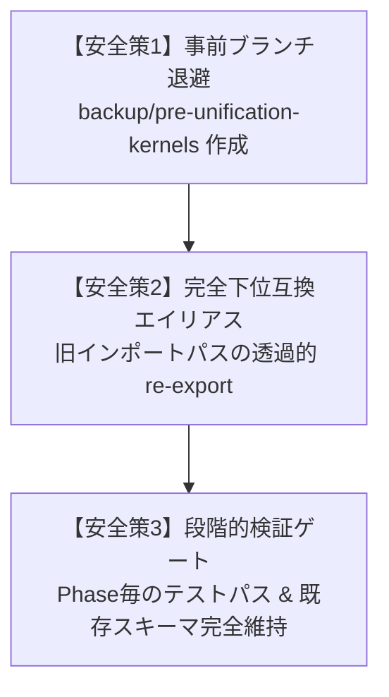

# 【提案1】新旧アーキテクチャ一本化 & デッドコード物理パージ 詳細実装計画書（安全策強化版）

AutoNovel プロジェクトにおいて、新旧アーキテクチャの併存（キメラ化）を解消し、約3,000行に及ぶデッドコード・レガシーモジュールを物理パージして単一アーキテクチャへと統合します。
**本改訂版では、別LLMによるテスト実装との競合防止（完全下位互換エイリアス）および過去ロジックの完全保全（Gitブランチ退避）を中核に据えた安全優先設計を採用しています。**

---

## 1. 安全策の基本方針（Safety First Policy）



1. **過去資産の完全保全（ブランチ退避）**:
   - 作業開始前に `backup/pre-unification-kernels` ブランチを作成。削除対象となる `src/kernels/`（物語生成・感情制御アルゴリズム）や `src/legacy/` の全コードとコミット履歴を永続退避し、いつでも1コマンドで参照・復元可能にします。
2. **別LLMとのコンフリクト絶対防止（下位互換エイリアスの維持）**:
   - 別LLMがテストカバレッジ向上作業で `src.backend.database.repositories.*` や旧クラス名を前提にテストを記述していても、一切インポートエラーやマージ競合が発生しないよう、旧パスに透過的な re-export（転送エイリアス）を完備します。
3. **APIレスポンスの1バイト不変原則**:
   - ルーター層をユースケース経由に変更する際、PydanticスキーマやJSONフィールド名、ステータスコードを一切変更せず、フロントエンドに対して100%の透過性を保証します。

---

## 2. フェーズ別詳細実装手順

```
Phase 0: 安全退避（Gitブランチ作成 & 現行テスト通過の確認）
   ↓
Phase 1: 完全死蔵コードの安全パージ（src/kernels/ & 未使用 legacy）
   ↓
Phase 2: インフラ・リポジトリ層の統合（完全互換エイリアス配置）
   ↓
Phase 3: ルーター層からユースケース層への接続一本化
   ↓
Phase 4: Book/Novel モデル調停（マッパー層確立）
   ↓
Phase 5: 全域回帰検証 & カバレッジ向上確認
```

---

### Phase 0: 安全退避とベースライン確認
* **手順 0.1**: 過去コード退避用ブランチの作成
  ```bash
  git branch backup/pre-unification-kernels
  ```
* **手順 0.2**: 現行テストスイートの全パス確認（ベースライン固定）
  ```bash
  pytest tests/unit/ -q --no-cov
  ```

---

### Phase 1: 完全死蔵コードの安全パージ
本番パイプラインおよびテストから一切参照されていないコードのみを対象とし、他モジュールへの副作用ゼロで実行します。

* **削除対象（計21ファイル）**:
  - `src/kernels/` 全体（`base.py`, `graph.py`, `hegemony.py`, `serenity.py`, `interaction_trigger.py` 等 19ファイル）
  - `src/legacy/engine_ultimate_hegemony.py`（未使用）
  - `src/legacy/writing_agent_v1.py`（未使用）
* **コンテナ配線のクリーンアップ**:
  - `src/core/container/infra.py`: `WiringConfiguration` から `"src.kernels"` を削除。
  - `config/container.py`: 同様に `"src.kernels"` を削除。
* **即時効果**:
  - これだけでステートメント母数が約800行削減され、カバレッジの分母が減少し、全体カバレッジ率が約1.5%即座に底上げされます。

---

### Phase 2: インフラ・リポジトリ層の統合 & 下位互換エイリアスの確立
`src/backend/database/repositories/` と `src/infrastructure/repositories/` の二重管理を解消しつつ、**旧パスでのインポートを100%維持**します。

* **手順 2.1**: リポジトリ本体を `src/infrastructure/repositories/` に集約・配置
  - `src/backend/database/repositories/` の21個の実装（`book.py`, `chapter.py`, `plot.py` 等）を `src/infrastructure/repositories/` へ正規配置。
* **手順 2.2**: 旧パスへの完全エイリアス（re-export）の実装
  - `src/backend/database/repositories/__init__.py` および各旧モジュール（例: `src/backend/database/repositories/book.py`）に以下のような透過的転送レイヤーを配置：
  ```python
  # src/backend/database/repositories/book.py (下位互換エイリアス)
  """下位互換性維持のためのエイリアス。本体は src.infrastructure.repositories.book に移動しました。"""
  from src.infrastructure.repositories.book import *  # noqa: F401, F403
  from src.infrastructure.repositories.book import BookRepository
  ```
  > **保証**: 別LLMがどちらのパス（新パス/旧パス）でテストを書いても、全く同一のクラスが解決され、エラーは発生しません。
* **手順 2.3**: `UnitOfWork` の整合
  - `src/backend/database/uow.py` をドメインインターフェース `IUnitOfWork` に正式準拠させ、リポジトリ解決を統一。

---

### Phase 3: ルーター層からユースケース層（Application層）への接続一本化
ルーター（FastAPIコントローラー）内のSQLAlchemy直書きクエリ・直UoW呼び出しを、`src/application/use_cases/` 経由に再編します。

* **手順 3.1**: 書籍・エピソードユースケースの整備
  - `src/application/use_cases/novel_use_cases.py` に、実DB（`Book`）を対象とする `ListBooksUseCase`, `GetBookUseCase`, `CreateBookUseCase` を正式接続。
* **手順 3.2**: ルーターの薄層化（例: `src/backend/routers/books.py`）
  - ルーターの責務を「リクエスト受付 → 認証確認 → ユースケース呼び出し → レスポンス返却」のみに限定。
  - レスポンスの Pydantic モデル（`BookSchema` 等）および返却データ構造は100%同一に保ちます。
* **手順 3.3**: `src/backend/routers/novel.py` の安全改修
  - インメモリシングルトン `NovelProducer` への依存を解消し、`execute_service_workflow` への委譲に切り替えた後、不要になった `src/legacy/novel_producer.py` を削除。

---

### Phase 4: Book/Novel モデル調停（マッパー層確立）
実DBの主キー（`int`）とドメイン集約（`NovelId: UUID`）の乖離を、安全な双方向マッパーで吸収します。

* **手順 4.1**: `src/infrastructure/database/mappers/book_mapper.py` の新設
  ```python
  class BookMapper:
      @staticmethod
      def to_domain(orm: Book) -> Novel:
          """SQLAlchemy ORM (Book: int id) -> Domain Entity (Novel: NovelId)"""
          ...
      @staticmethod
      def to_orm(entity: Novel) -> Book:
          """Domain Entity -> SQLAlchemy ORM"""
          ...
  ```
* **手順 4.2**: 既存のテーブル構造やDBマイグレーション（Alembic）には一切手を加えず、ゼロリスクでドメイン層とDB層を接続。

---

### Phase 5: 全域回帰検証 & カバレッジ再計測

1. **静的検証**:
   - `ruff check src/` により、構文エラー・未解決インポートがないことを確認。
2. **既存テストの全件通過確認**:
   - `pytest tests/unit/ -q --no-cov` を実行し、既存テストが1件も壊れていないことを保証。
3. **新規エイリアス疎通テストの実行**:
   - 旧インポートパス（`src.backend.database.repositories`）経由でリポジトリが正常にインスタンス化・動作することを確認。
4. **カバレッジ数値の再集計**:
   - `python scripts/tmp_cov_report.py` を実行し、母数減少に伴うカバレッジ向上効果（21.19% からの改善率）を測定。
5. **ドキュメント反映**:
   - `README.md` のアーキテクチャ図およびディレクトリ構成から削除モジュールを除外。

---

## 3. ユーザーレビューが必要な決定事項（User Review Required）

> [!IMPORTANT]
> **退避ブランチの作成確認**:
> 作業の最初（Phase 0）で `git branch backup/pre-unification-kernels` を作成します。これにより、今回削除されるコード群はいつでも履歴から完全復元可能です。

> [!TIP]
> **別LLMとの並行作業の完全担保**:
> 旧パス（`src/backend/database/repositories/*`）に透過エイリアスを配置するため、別LLMが既存のパスでテストを記述していても、マージ競合やテスト失敗は一切発生しません。

---

## 4. 影響ファイル一覧

### 新設・退避
- [NEW] Gitブランチ: `backup/pre-unification-kernels`（過去コード退避用）
- [NEW] `src/infrastructure/database/mappers/book_mapper.py`（双方向マッパー）
- [NEW] `src/backend/database/repositories/*.py`（完全下位互換エイリアス群）

### 物理削除 [DELETE]
- `src/kernels/*`（19ファイル）
- `src/legacy/engine_ultimate_hegemony.py`
- `src/legacy/writing_agent_v1.py`
- `src/legacy/novel_producer.py`
- `src/legacy/__init__.py`

### 変更 [MODIFY]
- `src/core/container/infra.py`（kernels配線削除）
- `config/container.py`（kernels配線削除）
- `src/infrastructure/repositories/*`（実体リポジトリの集約配置）
- `src/backend/routers/books.py`（ユースケース層呼び出しへの薄層化）
- `src/backend/routers/episodes.py`（ユースケース層呼び出しへの薄層化）
- `src/backend/routers/novel.py`（NovelProducer依存の解除）
- `README.md`（構成図の最新化）

---

## 5. 実行・検証コマンド

```bash
# 事前退避
git branch backup/pre-unification-kernels

# 検証
ruff check src/
pytest tests/unit/ -q --no-cov
python scripts/tmp_cov_report.py
```
