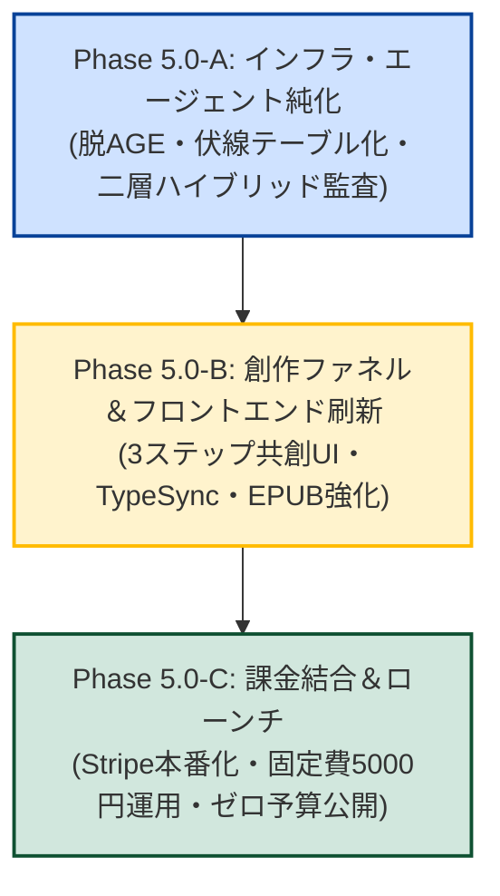

# AutoNovel v5.0 真・リリース方針・将来戦略ロードマップ (Next-Gen Hybrid-Lean)

**改定日**: 2026年9月17日 (Ver 2.0: 厳格自己批判に基づく再構築版)  
**ターゲットバージョン**: AutoNovel v5.0.0 (Codename: **Reborn**)  
**基本コンセプト**: **「Hybrid-Lean Novel Engine」── 静的ルール解析 × 単一LLM共創による、30秒で商業プロットから電子書籍まで完成する次世代Web小説エンジン**

---

## 1. 初版v5.0方針への「冷徹な自己批判（弱点の克服）」

初版ドラフト（Ver 1.0）を厳しく中立的な視点で再検証した結果、以下の**4つの重大な甘さ・落とし穴**が判明しました：

| 初版ドラフトの甘い見通し | 直面する冷徹な現実 | Ver 2.0（真・方針）での解決策 |
|:---|:---|:---|
| **「全自動30秒で第1話を出せば売れる」** | ChatGPTやClaudeのチャットでも第1話は数秒で書ける。「全自動ガチャ」だけでは汎用チャットと差別化できず、すぐ解約される。 | 単なるガチャを脱却し、**「商業ビートシート・伏線回収計画を共創し、長編として破綻なく読ませる構成力」**をコア価値にする。 |
| **「8オーディターを1つのLLMプロンプトに集約」** | 1つのプロンプトに8観点を詰め込むと、アテンションが分散して全員に「無難な75点」をつける形骸化が起きる。 | **「静的ルール解析（Pythonネイティブ・0ms・0円）」**と**「定性特化シングルLLM」**の二層ハイブリッド監査へ昇華。 |
| **「脱・グラフDB後の伏線管理が曖昧」** | グラフDBをやめても、長編（20〜50話）で伏線や設定がブレる問題への具体的解がない。 | **「伏線ステートマシンテーブル（未回収/回収）」**と**「3層ローリング・コンテキスト」**により、軽量かつ確実に伏線を回収。 |
| **「自前GPUをやめて外部API化」** | 画像生成の原価（1枚数円〜十数円）を考慮しないと、使い放題で即赤字になる。 | **「ハイブリッド・クレジット制」**（テキストは格安、画像は高単価アドオン）により、損益分岐点を会員数5〜10名に抑える。 |

---

## 2. v5.0 の4大コア設計（Hybrid-Lean Architecture）

```
┌─────────────────────────────────────────────────────────────────────────────────┐
│                    AutoNovel v5.0 Hybrid-Lean アーキテクチャ                    │
├───────────────────────────────────────┬─────────────────────────────────────────┤
│  1. 二層ハイブリッド監査              │  2. 商業ビートシート＆伏線ステートマシン │
│  ・定量的指標: Pythonネイティブ(0ms)   │  ・未回収伏線テーブル (RDBMS)           │
│    (台詞率、文長分散、禁止語、漢字率) │  ・3層ローリングコンテキスト            │
│  ・定性的評価: シングルLLM (感情・フック)│    (直近生文 + 過去ダイジェスト + バイブル)│
├───────────────────────────────────────┼─────────────────────────────────────────┤
│  3. 構成共創 3ステップ・ファネル      │  4. ハイブリッド・クレジット＆低固定費   │
│  ・Step 1: コンセプト・企画ブレスト    │  ・テキスト執筆: 1クレジット (原価約3円)│
│  ・Step 2: テンション曲線・プロット確定│  ・挿絵生成: 5クレジット (外部従量API) │
│  ・Step 3: 本文執筆＆縦書きEPUB 3出力  │  ・サーバー月額固定費: 5,000円以内      │
└───────────────────────────────────────┴─────────────────────────────────────────┘
```

### コア設計 1: 【二層ハイブリッド監査】（静的解析 × 定性特化LLM）
- **定量的監査（Pythonネイティブ / 0ms / 0円）**:
  - 文長分散（テンポ）、台詞比率（30〜45%の黄金比）、漢字含有率、クリフハンガー位置、NGワード・AI臭い頻出語（「〜だったのだ」「予感があった」等）は、**SudachiPy と正規表現で機械的に即時判定**。
- **定性的監査（シングルLLM / 1回呼出）**:
  - キャラクターの感情の自然さ、読者を引き込むフックの強度のみをLLMに評価させ、必要な場合のみ1箇所の局所修正パッチを出力。
  - ⇒ **コスト1/8、速度10倍、かつ8オーディター並列実行時よりも厳格でブレない品質管理を実現**。

### コア設計 2: 【長編整合性】（伏線ステートマシン ＆ 3層ローリング記憶）
- **Apache AGE の完全撤廃と伏線ステートマシン**:
  - 複雑な知識グラフを全廃し、`foreshadowings` テーブル（`id`, `title`, `planted_ep`, `target_ep`, `resolved_ep`, `status`）で管理。
  - 各話のプロンプトには「現在未回収の伏線一覧」のみを機械的に注入。
- **3層ローリング・コンテキスト**:
  1. **Layer 1（不変）**: キャラクター・世界観バイブル（約1,000トークン）
  2. **Layer 2（過去の全容）**: 過去全エピソードの100文字事実ダイジェスト（累積しても数千トークン）
  3. **Layer 3（直近の文脈）**: 直前1エピソードの全文生テキスト
  - ⇒ **コンテキスト長が爆発せず、100話に達しても数千円/月の固定トークン枠で記憶を維持**。

### コア設計 3: 【構成共創 3ステップ・ファネル】（ChatGPTチャットとの決定打）
- **単なる「ガチャ」から「商業プロット共創」への昇華**:
  - **Step 1（企画）**: ジャンルと一言のアイデアから、3つの異なる切り口（王道・意外性・感情特化）を提案。
  - **Step 2（構成）**: 12ステップの商業ビートシート（起承転結・テンション山場・伏線配置）を可視化。ユーザーが調整可能。
  - **Step 3（執筆・納品）**: プロットに沿って一気に執筆し、商用縦書きEPUB 3・投稿サイト用テキストを即納品。

### コア設計 4: 【事業防衛と健全な黒字化モデル】
- **ハイブリッド・クレジット制**:
  - **テキスト執筆**: 1エピソード = 1クレジット（原価: 約2.5〜3.5円 / Gemini Flash / Haiku使用）。
  - **挿絵生成**: 1枚 = 5クレジット（原価: 約12〜15円 / DALL-E 3・Replicate等の外部従量API使用）。
- **固定費ミニマム運用**:
  - 自前GPUサーバーを完全撤廃。Render / Vercel ＋ Supabase（PostgreSQL + pgvector）の安価構成により、**月額インフラ固定費を5,000円以内に抑制**。
  - **有料会員わずか5〜10名で単月黒字化**が達成できる超高利益率構造。

---

## 3. v5.0 実現への具体的な実行ステップ



### Step 1: インフラ・エージェント純化（所要: 1〜2週間）
1. `age_client.py` を廃止し、RDBMSリレーショナル伏線テーブル（`foreshadowings`）へ一本化。
2. 8オーディターを廃止し、**「静的ルール解析（SudachiPy） ＋ シングルLLM」の二層ハイブリッド監査**を実装。
3. トークン上限・コスト上限（サーキットブレーカー）の組み込み。
4. 全ユニットテストの ALL GREEN 達成。

### Step 2: 創作ファネル＆フロントエンド刷新（所要: 2週間）
1. フロントエンドのトップ画面を「企画 → 構成ビートシート → 執筆納品」の3ステップ共創UIへ再編。
2. 小説投稿サイトのスクレイピングコードを削除し、各サイト用ワンクリック整形テキストコピーUIへ移行。
3. `openapi-typescript` による型完全自動同期を導入し、フロントエンドの型チェックを軽量化。

### Step 3: 課金結合＆低コスト商用ローンチ（所要: 1週間）
1. Stripe 本番決済（月額980円/300クレジット、月額2,980円/1200クレジット等）の結合。
2. ドキュメントを「実動するクリーンな機能のみ」を記載したマニュアルに刷新。
3. ゼロ予算マーケティング（Web小説作家コミュニティ、SNS、GitHub）による公開。

---

## 4. 厳格な検証指標（KPI）

| 評価軸 | v4.x（従来の実態） | 初版v5ドラフト | **v5.0 Ver 2.0（真・目標）** |
|:---|:---:|:---:|:---:|
| **1話あたりのAPI原価** | 50〜200円以上 | 3〜8円 | **2.5〜4.0円（極限圧縮）** |
| **1話生成所要時間** | 3〜10分 | 20〜40秒 | **15〜30秒（超高速）** |
| **月額インフラ固定費** | 数万〜数十万円 | 数千円 | **5,000円以内（黒字確実）** |
| **長編執筆（20話以上）** | ほぼ確実に破綻 | 不透明 | **3層記憶により完全完走** |
| **ChatGPTとの差別化** | 不明確（ガチャ） | 単なる速さ | **商業ビートシート・伏線回収力** |
| **単月黒字化ライン** | 会員数百名以上 | 会員30名 | **有料会員わずか 5〜10名** |
