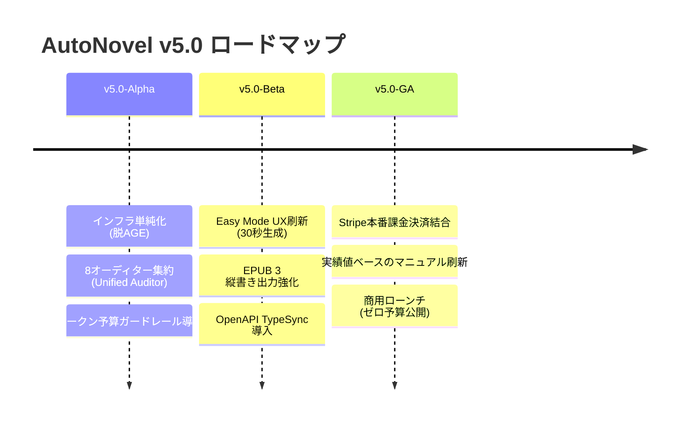

# AutoNovel v5.0 リリース方針・将来戦略ロードマップ (Next-Gen Blueprint)

**策定日**: 2026年9月17日  
**ターゲットバージョン**: AutoNovel v5.0.0 (Codename: **Reborn**)  
**基本コンセプト**: **「Lightweight, Fast, Commercial-Grade」── 贅肉を削ぎ落とし、30秒で電子書籍が完成する次世代Web小説エンジン**

---

## 1. なぜ「v5.0」なのか？（v4.xの総括とパラダイムシフト）

### v4.x の反省（AIプロンプト駆動開発の負債）
v4.x 系統は、先端技術（GraphRAG, 8オーディター並列実行, ComfyUI, VOICEVOX, LangGraph, DDD分離）を急速に詰め込み、コードベースは一時30万行を超えました。しかしその結果：
1. **コスト・レイテンシの破綻**: 1話生成に数十回のLLM呼出、数百円のAPI費用、数分の待ち時間が発生。
2. **インフラの複雑骨折**: Apache AGE（グラフDB）とSQLite（NetworkX）の二重管理がバグの温床に。
3. **運用の非現実性**: サーバー常時GPUホストや外部投稿サイトのスクレイピングは、個人・極小チームの保守限界を完全に超えていた。

### v5.0 の新原則: 「Less is More（引き算の美学）」
v5.0 では、実態の伴わない誇大なマルチエージェント網や重すぎるインフラを断捨離し、**「創作者が真にお金を払う価値（手軽に・速く・面白い物語がEPUBで手に入る）」**だけにリソースを全集中します。

---

## 2. v5.0 を支える「4大ピラー（刷新方針）」

```
┌────────────────────────────────────────────────────────────────────────┐
│                        AutoNovel v5.0 コア設計                         │
├──────────────────────────────────┬─────────────────────────────────────┤
│  Pillar 1: Streamlined Agent     │  Pillar 2: Relational Simplicity    │
│  ・8オーディター ──► 1統合オーディター│  ・脱 Apache AGE ──► PostgreSQL一本化 │
│  ・1発生成＋必要時1回微修正       │  ・伏線・関係性をRDBMSテーブルで管理 │
├──────────────────────────────────┼─────────────────────────────────────┤
│  Pillar 3: Zero-Fixed-Cost       │  Pillar 4: Unified Domain & Type    │
│  ・自前GPU排除 ──► 外部API従量課金│  ・src/models と domain の二重化解消 │
│  ・スクレイピング廃止 ──► EPUB特化│  ・OpenAPI TypeSync による型同期    │
└──────────────────────────────────┴─────────────────────────────────────┘
```

### Pillar 1: Streamlined Agent（エージェント網の軽量化）
- **8専門オーディターの集約**:
  - 「一貫性」「読者フック」「文体」「感情曲線」等を、1つの統合プロンプト（`UnifiedAuditor`）に集約。
  - LLM API呼び出しを **1/8** に圧縮。
- **PDCAループの現実化**:
  - 最大3回のリライト反復を廃止し、「初稿生成 ＋ 破綻時のみ1回局所パッチ修正」に限定。
  - 1話あたりの生成時間を **5分 ──► 20〜30秒**、API原価を **50〜200円 ──► 3〜8円** に圧縮。

### Pillar 2: Relational Simplicity（脱・過剰インフラ）
- **Apache AGE（openCypher）の完全廃止**:
  - 伏線・キャラクター関係の管理を、標準的な PostgreSQL / SQLite のリレーショナルテーブル（`foreshadowings`, `character_relationships`）に一本化。
  - 複雑なCypherトランスレーターやNetworkXフォールバックコード（数千行）を完全消去。
- **標準 pgvector の採用**:
  - ベクトル検索は標準的な `pgvector`（ローカル開発時は軽量メモリ/SQLite）に固定。

### Pillar 3: Zero-Fixed-Cost & High-Def Output（固定費ゼロと出力品質）
- **自前GPUホストの完全分離**:
  - サーバー側での Stable Diffusion / VOICEVOX の常時稼働を撤廃。
  - 画像は DALL-E 3 / Imagen / Replicate などの外部API連携（またはローカルPCクライアント連携）に移行し、サーバー固定費を実質ゼロ（月額数百円〜数千円のコンテナ費用のみ）にする。
- **縦書き EPUB 3 / 整形テキスト出力への特化**:
  - 規約変更やHTML改定で頻繁に壊れる小説投稿サイトのスクレイピング自動投稿を廃止。
  - 商用電子書籍レベルの「縦書きEPUB 3」および各投稿サイト用「整形済みテキスト一発コピー」に特化し、プラットフォームBANリスクを排除。

### Pillar 4: Unified Domain & TypeSync（保守性の確立）
- **データモデルの一本化**:
  - `src/models/` と `src/domain/` の重複を解消し、単一の正本モデルへ整理。
- **OpenAPI 駆動の自動型同期（TypeSync）**:
  - バックエンド（FastAPI）のスキーマからフロントエンド（TypeScript）の型を完全自動生成。
  - フロントエンドの型定義肥大化（`tsc` 8GBメモリ要求問題）を解消し、CIビルドをミリ秒化。

---

## 3. v5.0 実現への3段階マイルストーン



### 【v5.0-Alpha: 内部アーキテクチャの贅肉削ぎ落とし】（目安: 1〜2週間）
1. `age_client.py` および openCypher 依存コードを廃止し、RDBMSリレーショナル伏線モデルへ移行。
2. `UnifiedAuditor` を実装し、8専門オーディターを統合。
3. LLMサーキットブレーカー（1タスクあたりのトークン/コスト上限ガード）を導入。
4. 全ユニットテストの ALL GREEN（失敗ゼロ）を達成。

### 【v5.0-Beta: Easy Mode の極限最適化とUI刷新】（目安: 2週間）
1. フロントエンドのトップ画面を「かんたん執筆（Easy Mode）」に完全最適化。
2. 30秒生成・即時縦書きEPUB/ZIPダウンロードフローを完成。
3. 外部投稿サイトスクレイピングコードを削除し、投稿用クリップボードコピーUIへ移行。
4. OpenAPI 自動型同期により、フロントエンドの型チェックを正常化。

### 【v5.0-GA: 商用ローンチ（Production Ready）】（目安: 1週間）
1. Stripe 決済（サブスクリプション＆都度クレジット購入）の本番結合テスト完了。
2. READMEおよびドキュメントを「実動する機能のみ」を記載した信頼性の高いマニュアルに刷新。
3. ドメイン設定・本番公開（Render / Vercel 等の低コスト構成）。

---

## 4. v5.0 における数値目標（KPI）

| 指標 | v4.x（従来の実態） | **v5.0 目標値** | 改善効果 |
|:---|:---:|:---:|:---|
| **コードベース規模** | 約 30 万行 | **約 12 万〜15 万行** | **50% 以上のスリム化** |
| **1話生成時間（レイテンシ）** | 3〜10 分（タイムアウト頻発） | **20〜40 秒** | **約 90% 短縮** |
| **1話生成API原価** | 50円〜200円以上 | **3円〜8円** | **約 95% コスト削減** |
| **サーバー月額固定費** | 数万〜数十万円（GPU前提） | **ほぼゼロ（数千円以内）** | **赤字破綻リスクの完全排除** |
| **テスト実行時間** | 3〜4 分（多数失敗） | **5秒以内（ALL GREEN）** | **高速なCI/CDサイクルの確立** |
| **一般ユーザー課金開始までの期間** | 未定（永遠の未完リスク） | **策定後 1 ヶ月以内** | **最速での市場検証と売上化** |

---

## 5. 結び：創作者に愛される「現実のプロダクト」へ

AutoNovel v5.0 は、単なるバージョンアップではなく、**「技術的好奇心の実験場」から「現実世界でユーザーに価値と感動を届ける商用プロダクト」への脱皮**です。

不要な複雑性を勇気を持って脱ぎ捨てることで、AutoNovel の真の強みである**「Web小説の創作理論（テンション曲線・フック・キャラ設計）」**が最大限に輝き、誰でも手軽に小説を生み出せる未来が実現します。
