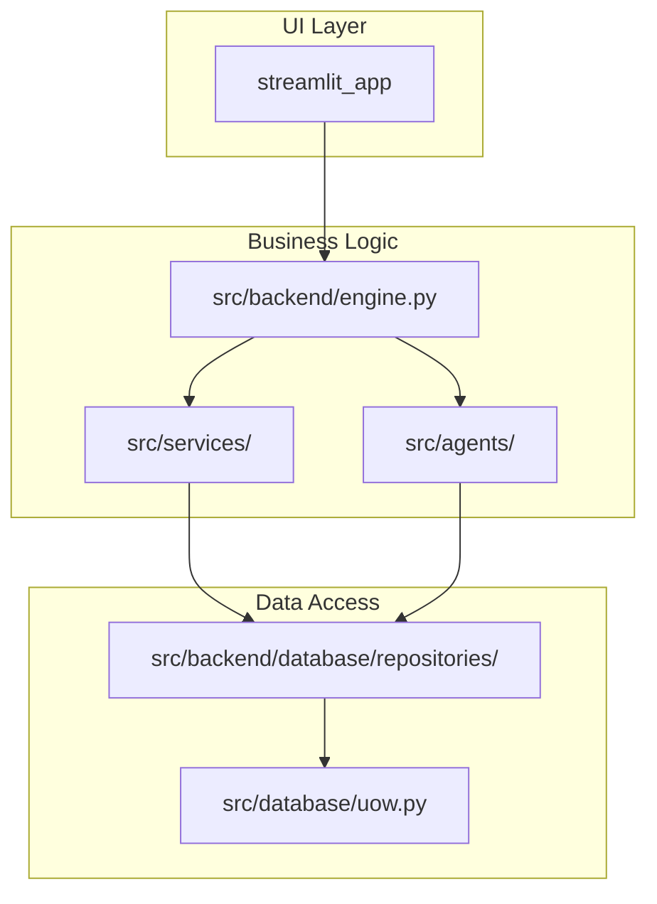
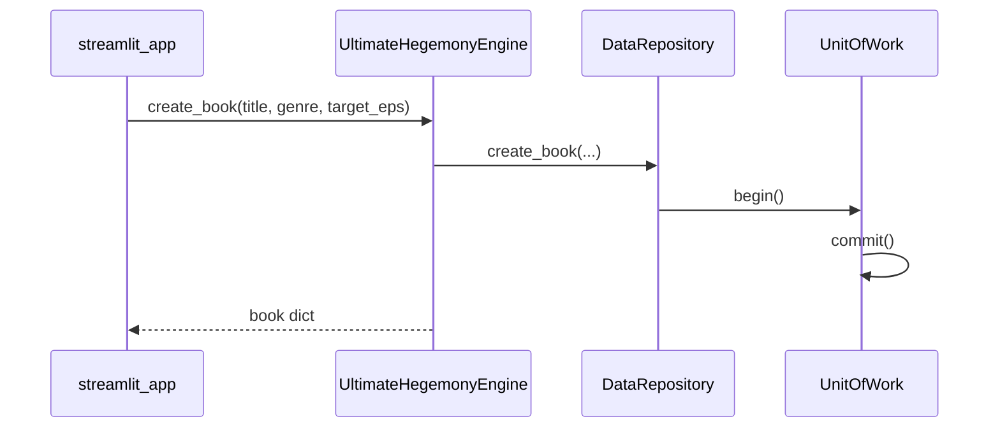

# 詳細実装計画書（72ステップ）

## 概要

本計画書は、`R15/cR15`プロジェクトにおける技術文書化、リファクタリング、テスト強化、CI/CD整備を、低性能なLLMでも完遂可能なレベル（72ステップ）に細分化ものです。

**前提条件:**
- 作業ディレクトリ: `I:\R15\cR15`
- Python 3.11+
- Streamlit アプリケーション
- 既存のリファクタリング（インポート整理等）は完了済み（`REFACTORING_STATUS.md` 参照）

---

## フェーズ1: プロジェクト現状分析と基盤整備（ステップ1-10）

### ステップ1: 現在のコードベース規模の確認
- **対象ファイル**: 全Pythonファイル
- **アクション**: 以下のコマンドを実行し、ファイル数・総行数を記録
```powershell
Get-ChildItem -Path . -Filter "*.py" -Recurse | Where-Object { $_.FullName -notmatch "(__pycache__|\.venv|\.test_venv|\.pytest_cache|\.mypy_cache)" } | Measure-Object -Property Length -Sum | Select-Object Count, @{Name="TotalLines";Expression={(Get-Content $_.FullName | Measure-Object -Line).Lines}}
```
- **出力**: `docs/codebase_stats.md` に記録
- **完了条件**: ファイル数・行数が記録されている

### ステップ2: src/backend/engine.py の全メソッド・プロパティ一覧作成
- **対象ファイル**: `src/backend/engine.py`
- **アクション**: `UltimateHegemonyEngine` クラスの全メソッドをリスト化
```python
# 以下の形式で出力:
# - MethodName(params) -> return_type: 説明
# - property_name: 説明
```
- **出力**: `docs/engine_methods_inventory.md`
- **完了条件**: 全メソッドが文書化されている

### ステップ3: src/backend/engine.py の循環参照チェック
- **対象ファイル**: `src/backend/engine.py`
- **アクション**: `grep -r "from src.backend.engine import" src/` を実行
- **判断**:
  - 出力がある場合 → 循環参照あり（ステップ3-1へ）
  - 出力がない場合 → ステップ4へ
- **完了条件**: 循環参照の有無が記録されている

### ステップ3-1: 循環参照の解消（条件付き）
- **条件**: ステップ3で循環参照が検出された場合のみ実行
- **アクション**: 循環参照の原因となるインポートを遅延インポート（関数内インポート）に置換
- **完了条件**: 循環参照が解消されている

### ステップ4: src/core/container.py の全Provider一覧作成
- **対象ファイル**: `src/core/container.py`
- **アクション**: 全Provider（SingletonProvider, FactoryProvider等）をリスト化
- **出力**: `docs/container_providers.md`
- **完了条件**: 全Providerが文書化されている

### ステップ5: テストカバレッジのベースライン測定
- **アクション**: 以下のコマンドを実行
```bash
cd I:\R15\cR15
pytest tests/ --cov=src --cov=streamlit_app --cov-report=term-missing --cov-report=html -v
```
- **出力**: `htmlcov/index.html` にHTMLレポート、`docs/coverage_baseline.md` にテキストサマリー
- **完了条件**: カバレッジ率が記録されている

### ステップ6: mypy のベースライン実行
- **アクション**: 以下のコマンドを実行
```bash
cd I:\R15\cR15
mypy src/ streamlit_app/ --ignore-missing-imports --output=json > mypy_baseline.json 2>&1
```
- **出力**: `mypy_baseline.json`, `docs/mypy_issues.md`
- **完了条件**: mypy エラー件数が記録されている

### ステップ7: ruff のベースライン実行
- **アクション**: 以下のコマンドを実行
```bash
cd I:\R15\cR15
ruff check src/ streamlit_app/ tests/ --output-format=json > ruff_baseline.json 2>&1
```
- **出力**: `ruff_baseline.json`, `docs/ruff_issues.md`
- **完了条件**: ruff エラー件数が記録されている

### ステップ8: 未使用インポートの特定
- **アクション**: 以下のコマンドを実行
```bash
cd I:\R15\cR15
ruff check src/ streamlit_app/ --select=F401 --output-format=json > unused_imports.json 2>&1
```
- **出力**: `unused_imports.json`
- **完了条件**: 未使用インポート件数が記録されている

### ステップ9: src/services/ の全サービス一覧作成
- **対象ディレクトリ**: `src/services/`
- **アクション**: 全Pythonファイルのクラス・関数をリスト化
- **出力**: `docs/services_inventory.md`
- **完了条件**: 全サービスが文書化されている

### ステップ10: src/backend/database/repositories/ の全リポジトリ一覧作成
- **対象ディレクトリ**: `src/backend/database/repositories/`
- **アクション**: 全リポジトリのメソッドをリスト化
- **出力**: `docs/repositories_inventory.md`
- **完了条件**: 全リポジトリが文書化されている

---

## フェーズ2: UltimateHegemonyEngine の分割計画（ステップ11-30）

### ステップ11: engine.py のメソッド分類（責任分離）
- **対象ファイル**: `src/backend/engine.py`
- **アクション**: `UltimateHegemonyEngine` のメソッドを以下のカテゴリに分類:
  - **Bible関連**: `sync_bible`, `resolve_bible_setting` 等
  - **Plot関連**: プロット生成・編集メソッド
  - **Writing関連**: 執筆・編集メソッド
  - **Marketing関連**: マーケティング生成メソッド
  - **Audit関連**: 監査メソッド
- **出力**: `docs/engine_method_categories.md`
- **完了条件**: 全メソッドがカテゴリ分類されている

### ステップ12: BibleAgent の独立クラス作成準備
- **対象ファイル**: `src/backend/engine.py`
- **アクション**: `sync_bible`, `resolve_bible_setting` メソッドのコードを読む
- **完了条件**: Bible関連ロジックが把握されている

### ステップ13: src/agents/bible_agent.py の新規作成
- **アクション**: `BibleAgent` クラスを新規作成
```python
# src/agents/bible_agent.py
class BibleAgent:
    def __init__(self, repo, container):
        self.repo = repo
        self.container = container
    
    async def sync_bible_lifecycle(self, book_id: int, reporter=None):
        # src/backend/engine.py の sync_bible メソッドの内容を移動
        pass
    
    async def resolve_pending_setting(self, setting_id: int, status: str):
        # src/backend/engine.py の resolve_bible_setting メソッドの内容を移動
        pass
```
- **完了条件**: `src/agents/bible_agent.py` が作成されている

### ステップ14: engine.py から BibleAgent への委譲確認
- **対象ファイル**: `src/backend/engine.py`
- **アクション**: `sync_bible`, `resolve_bible_setting` が `self.bible_agent` を呼び出すよう修正
```python
async def sync_bible(self, book_id: int, reporter=None):
    return await self.bible_agent.sync_bible_lifecycle(book_id, reporter=reporter)

async def resolve_bible_setting(self, setting_id: int, status: str):
    await self.bible_agent.resolve_pending_setting(setting_id, status)
```
- **完了条件**: engine.py が bible_agent を使用するよう修正されている

### ステップ15: ステップ13-14 のテスト実行
- **アクション**: 以下のコマンドを実行
```bash
cd I:\R15\cR15
pytest tests/ -v -k "bible" --tb=short
```
- **完了条件**: テストがパスする

### ステップ16: PlotAgent の独立クラス作成準備
- **対象ファイル**: `src/backend/engine.py`
- **アクション**: Plot関連メソッドのコードを読む
- **完了条件**: Plot関連ロジックが把握されている

### ステップ17: src/agents/plot_agent.py の新規作成（既存ファイル確認）
- **アクション**: `src/agents/` に `plot_agent.py` が存在するか確認
```bash
ls src/agents/plot_agent.py
```
- **判断**:
  - 存在しない場合 → 新規作成
  - 存在する場合 → ステップ18へ

### ステップ18: PlotAgent のメソッド確認と engine.py との統合
- **対象ファイル**: `src/agents/plot_agent.py`, `src/backend/engine.py`
- **アクション**: 両ファイルを比較し、重複・不足をリスト化
- **完了条件**: 差異リストが作成されている

### ステップ19: WritingAgent の独立クラス作成準備
- **対象ファイル**: `src/backend/engine.py`
- **アクション**: Writing関連メソッドのコードを読む
- **完了条件**: Writing関連ロジックが把握されている

### ステップ20: src/agents/writing_agent.py の確認
- **アクション**: `src/agents/writing_agent.py` が存在するか確認
```bash
ls src/agents/writing_agent.py
```
- **判断**: 既存ファイルを確認し、engine.py との統合方法を判断

### ステップ21: MarketingAgent の独立クラス作成準備
- **対象ファイル**: `src/backend/engine.py`
- **アクション**: Marketing関連メソッドのコードを読む
- **完了条件**: Marketing関連ロジックが把握されている

### ステップ22: src/agents/marketing_agent.py の確認
- **アクション**: `src/agents/marketing_agent.py` が存在するか確認
- **判断**: 既存ファイルを確認し、engine.py との統合方法を判断

### ステップ23: AuditAgent の独立クラス作成準備
- **対象ファイル**: `src/backend/engine.py`
- **アクション**: Audit関連メソッドのコードを読む
- **完了条件**: Audit関連ロジックが把握されている

### ステップ24: src/agents/audit_agent.py の確認
- **アクション**: `src/agents/audit_agent.py` が存在するか確認
- **判断**: 既存ファイルを確認し、engine.py との統合方法を判断

### ステップ25: engine.py の冗長委譲メソッド特定
- **対象ファイル**: `src/backend/engine.py`
- **アクション**: 以下のパターンのメソッドをリスト化:
```python
def method_name(self, ...):
    return self.sub_agent.method_name(...)
```
- **出力**: `docs/engine_delegation_methods.md`
- **完了条件**: 冗長委譲メソッドリストが作成されている

### ステップ26: 冗長委譲メソッドの削除（段階1）
- **対象ファイル**: `src/backend/engine.py`
- **アクション**: ステップ25で特定した冗長委譲メソッドの内、5つを削除
- **注意**: 削除前に呼び出し元を確認すること
```bash
grep -r "engine\.method_name" src/ streamlit_app/
```
- **完了条件**: 5つの冗長委譲メソッドが削除されている

### ステップ27: ステップ26 のテスト実行
- **アクション**: 以下のコマンドを実行
```bash
cd I:\R15\cR15
pytest tests/ -v --tb=short
```
- **完了条件**: 全テストがパスする

### ステップ28: 冗長委譲メソッドの削除（段階2）
- **対象ファイル**: `src/backend/engine.py`
- **アクション**: ステップ25で特定した冗長委譲メソッドの内、次の5つを削除
- **完了条件**: 次の5つの冗長委譲メソッドが削除されている

### ステップ29: ステップ28 のテスト実行
- **アクション**: 以下のコマンドを実行
```bash
cd I:\R15\cR15
pytest tests/ -v --tb=short
```
- **完了条件**: 全テストがパスする

### ステップ30: engine.py の最終確認
- **対象ファイル**: `src/backend/engine.py`
- **アクション**: 
  1. 残った委譲メソッドが本当に必要か確認
  2. 新しいメソッド（委譲なし）が追加されていないか確認
  3. `docs/engine_final_state.md` に最終状態を記録
- **完了条件**: engine.py の最終状態が文書化されている

---

## フェーズ3: DataRepository・UOW の整理計画（ステップ31-40）

### ステップ31: DataRepository の全メソッド一覧作成
- **対象ファイル**: `src/backend/database/__init__.py` または `src/backend/database/core.py`
- **アクション**: `DataRepository` クラスの全メソッドをリスト化
- **出力**: `docs/data_repository_methods.md`
- **完了条件**: 全メソッドが文書化されている

### ステップ32: DataRepository と UOW の重複メソッド特定
- **対象ファイル**: `src/database/uow.py`, `src/backend/database/__init__.py`
- **アクション**: 両方のファイルを比較し、重複メソッドをリスト化
- **出力**: `docs/uow_repo_overlap.md`
- **完了条件**: 重複メソッドリストが作成されている

### ステップ33: UOW の lazy initialization パターン確認
- **対象ファイル**: `src/database/uow.py`
- **アクション**: `_bible`, `_books` 等のプロパティがlazy initializationになっているか確認
- **完了条件**: lazy initialization パターンの使用が把握されている

### ステップ34: UOW の `__aenter__` / `__aexit__` 確認
- **対象ファイル**: `src/database/uow.py`
- **アクション**: トランザクション管理が正しく実装されているか確認
- **完了条件**: トランザクション管理の実装が把握されている

### ステップ35: Repository クラスの基底クラス確認
- **対象ファイル**: `src/backend/database/repositories/base.py`
- **アクション**: `BaseRepository` クラスの全メソッドをリスト化
- **出力**: `docs/base_repository.md`
- **完了条件**: 基底クラスが文書化されている

### ステップ36: 各Repository の特殊メソッド確認
- **対象ディレクトリ**: `src/backend/database/repositories/`
- **アクション**: 各Repository（book.py, character.py, plot.py等）の特殊メソッドをリスト化
- **出力**: `docs/repository_special_methods.md`
- **完了条件**: 各Repositoryの特殊メソッドが文書化されている

### ステップ37: DataRepository の未使用メソッド特定
- **アクション**: 以下のコマンドを実行
```bash
grep -r "self\.repo\." src/ | grep -v "\.repo\." | head -50
```
- **判断**: 各メソッドの呼び出し回数をカウントし、未使用メソッドを特定
- **完了条件**: 未使用メソッドリストが作成されている

### ステップ38: UOW の stage_chroma_add/delete の使用箇所確認
- **アクション**: 以下のコマンドを実行
```bash
grep -r "stage_chroma_add\|stage_chroma_delete" src/ streamlit_app/
```
- **完了条件**: stage_chroma メソッドの呼び出し箇所が把握されている

### ステップ39: UOW の outbox パターン確認
- **対象ファイル**: `src/database/uow.py`
- **アクション**: `get_pending_outbox_events`, `mark_outbox_event_processed` の使用箇所を確認
```bash
grep -r "outbox" src/ streamlit_app/
```
- **完了条件**: outbox パターンの使用箇所が把握されている

### ステップ40: DataRepository 整理の最終判断
- **対象ファイル**: `src/backend/database/`
- **アクション**: ステップ31-39の結果を基に、DataRepository の整理方針を決定
- **出力**: `docs/data_repository_refactor_plan.md`
- **完了条件**: 整理方針が文書化されている

---

## フェーズ4: コメント・技術的負債の整理計画（ステップ41-50）

### ステップ41: src/backend/engine.py の TODO/FIXME/HACK コメント抽出
- **アクション**: 以下のコマンドを実行
```bash
grep -rn "TODO\|FIXME\|HACK\|XXX\|BUG" src/backend/engine.py
```
- **出力**: `docs/engine_todos.md`
- **完了条件**: 技術的負債コメントがリスト化されている

### ステップ42: src/services/ の TODO/FIXME/HACK コメント抽出
- **アクション**: 以下のコマンドを実行
```bash
grep -rn "TODO\|FIXME\|HACK\|XXX\|BUG" src/services/
```
- **出力**: `docs/services_todos.md`
- **完了条件**: 技術的負債コメントがリスト化されている

### ステップ43: src/core/ の TODO/FIXME/HACK コメント抽出
- **アクション**: 以下のコマンドを実行
```bash
grep -rn "TODO\|FIXME\|HACK\|XXX\|BUG" src/core/
```
- **出力**: `docs/core_todos.md`
- **完了条件**: 技術的負債コメントがリスト化されている

### ステップ44: マジックナンバーの特定（engine.py）
- **対象ファイル**: `src/backend/engine.py`
- **アクション**: 数値リテラル（0, 1, 100, 1000等）をリスト化
- **出力**: `docs/engine_magic_numbers.md`
- **完了条件**: マジックナンバーリストが作成されている

### ステップ45: マジックナンバーの定数化（engine.py 段階1）
- **対象ファイル**: `src/backend/engine.py`
- **アクション**: ステップ44で特定したマジックナンバーの内、5つを定数化
```python
# 例:
MAX_RETRIES = 3
DEFAULT_TIMEOUT = 30
```
- **完了条件**: 5つのマジックナンバーが定数化されている

### ステップ46: マジックナンバーの定数化（engine.py 段階2）
- **対象ファイル**: `src/backend/engine.py`
- **アクション**: ステップ44で特定した残りのマジックナンバーを定数化
- **完了条件**: 残りのマジックナンバーが定数化されている

### ステップ47: src/services/ のマジックナンバー特定
- **対象ディレクトリ**: `src/services/`
- **アクション**: 数値リテラルをリスト化
- **出力**: `docs/services_magic_numbers.md`
- **完了条件**: マジックナンバーリストが作成されている

### ステップ48: src/services/ の定数化
- **対象ディレクトリ**: `src/services/`
- **アクション**: ステップ47で特定したマジックナンバーを定数化
- **完了条件**: マジックナンバーが定数化されている

### ステップ49: エラーハンドリングの統一確認
- **対象ディレクトリ**: `src/`
- **アクション**: `raise Exception`, `raise ValueError`, `raise RuntimeError` 等を検索
```bash
grep -rn "raise Exception\|raise ValueError\|raise RuntimeError" src/
```
- **完了条件**: エラーハンドリングのパターンが把握されている

### ステップ50: src/core/exceptions.py の確認と整備
- **対象ファイル**: `src/core/exceptions.py`
- **アクション**: カスタム例外クラスが定義されているか確認
- **判断**:
  - 存在しない場合 → 新規作成
  - 存在する場合 → 不足している例外を追加
- **完了条件**: 例外クラスが整備されている

---

## フェーズ5: ドキュメント作成計画（ステップ51-60）

### ステップ51: アーキテクチャ図の更新
- **対象ファイル**: `docs/architecture.md` または新規作成
- **アクション**: Mermaidで以下の図を作成:

- **完了条件**: アーキテクチャ図が更新されている

### ステップ52: シーケンス図：書籍作成フロー
- **対象ファイル**: `docs/sequence_book_creation.md`
- **アクション**: Mermaidでシーケンス図を作成:

- **完了条件**: シーケンス図が作成されている

### ステップ53: API仕様書：EngineService
- **対象ファイル**: `docs/api_engineservice.md`
- **アクション**: `src/engine_service.py` の全メソッドのAPI仕様書を作成
```markdown
## EngineService.create_book(title: str, genre: str, target_eps: int) -> Dict[str, Any]

### 説明
新しい書籍を作成します。

### パラメータ
- `title` (str): 書籍タイトル
- `genre` (str): ジャンル
- `target_eps` (int): 目標エピソード数

### 戻り値
- `Dict[str, Any]`: 作成された書籍情報
```
- **完了条件**: API仕様書が作成されている

### ステップ54: API仕様書：DataRepository
- **対象ファイル**: `docs/api_datarepository.md`
- **アクション**: `DataRepository` の主要メソッドのAPI仕様書を作成
- **完了条件**: API仕様書が作成されている

### ステップ55: API仕様書：UnitOfWork
- **対象ファイル**: `docs/api_uow.md`
- **アクション**: `UnitOfWork` の全メソッドのAPI仕様書を作成
- **完了条件**: API仕様書が作成されている

### ステップ56: README.md の更新（プロジェクト概要）
- **対象ファイル**: `README.md`
- **アクション**: 以下のセクションを追加:
  - プロジェクト概要
  - ディレクトリ構造
  - 主要コンポーネントの説明
- **完了条件**: README.md が更新されている

### ステップ57: CONTRIBUTING.md の新規作成
- **対象ファイル**: `CONTRIBUTING.md`（新規）
- **アクション**: 以下の内容で作成:
  - 開発環境のセットアップ
  - コードスタイルガイド
  - テストの実行方法
  - PRの送り方
- **完了条件**: CONTRIBUTING.md が作成されている

### ステップ58: docs/ ディレクトリ構造の整備
- **対象ディレクトリ**: `docs/`
- **アクション**: 以下のファイルが存在するか確認:
  - `docs/architecture.md`
  - `docs/api_engineservice.md`
  - `docs/api_datarepository.md`
  - `docs/api_uow.md`
  - `docs/container_providers.md`
  - `docs/engine_methods_inventory.md`
- **不足ファイル**: ステップ51-55で作成
- **完了条件**: 必要なドキュメントが存在する

### ステップ59: src/README.md の作成
- **対象ファイル**: `src/README.md`（新規）
- **アクション**: `src/` ディレクトリの説明を作成:
  - src/backend/: エンジンコア
  - src/services/: サービス層
  - src/agents/: エージェント
  - src/core/: コアユーティリティ・DIコンテナ
  - src/database/: データベースアクセス
- **完了条件**: src/README.md が作成されている

### ステップ60: ドキュメントの最終確認
- **アクション**: 以下のコマンドを実行し、ドキュメントの総行数を記録
```bash
find docs/ -name "*.md" -exec wc -l {} + | tail -1
```
- **完了条件**: ドキュメント量が表示されている

---

## フェーズ6: テスト強化計画（ステップ61-68）

### ステップ61: 現在のテストファイル一覧確認
- **アクション**: 以下のコマンドを実行
```bash
find tests/ -name "test_*.py" -o -name "*_test.py" | sort
```
- **出力**: `docs/test_files_inventory.md`
- **完了条件**: 全テストファイルがリスト化されている

### ステップ62: src/engine_service.py のユニットテスト追加
- **対象ファイル**: `tests/test_engine_service.py`
- **アクション**: 以下のテストケースを追加:
```python
def test_create_book():
    service = EngineService()
    book = service.create_book("Test Book", "fantasy", 10)
    assert book["title"] == "Test Book"
    assert book["genre"] == "fantasy"
    assert book["target_eps"] == 10

def test_get_all_books():
    service = EngineService()
    books = service.get_all_books()
    assert isinstance(books, list)

def test_get_book_details():
    service = EngineService()
    book = service.create_book("Test Book", "fantasy", 10)
    details = service.get_book_details(book["id"])
    assert details is not None
    assert "book" in details
```
- **完了条件**: テストが追加されている

### ステップ63: src/database/uow.py のユニットテスト追加
- **対象ファイル**: `tests/test_uow.py`
- **アクション**: 以下のテストケースを追加:
```python
@pytest.mark.asyncio
async def test_uow_bible_repository():
    # UOW の bible プロパティが正しく動作するかテスト
    pass

@pytest.mark.asyncio
async def test_uow_books_repository():
    # UOW の books プロパティが正しく動作するかテスト
    pass
```
- **完了条件**: テストが追加されている

### ステップ64: 境界値テストの追加（engine_service）
- **対象ファイル**: `tests/test_engine_service.py`
- **アクション**: 以下のテストケースを追加:
```python
def test_create_book_empty_title():
    service = EngineService()
    # 空タイトル時のエラーハンドリングテスト

def test_create_book_negative_eps():
    service = EngineService()
    # 負のepisode数時のエラーハンドリングテスト

def test_get_book_details_nonexistent():
    service = EngineService()
    # 存在しない書籍IDのテスト
```
- **完了条件**: 境界値テストが追加されている

### ステップ65: Mock の整備確認
- **対象ディレクトリ**: `tests/mocks/`
- **アクション**: 以下のMockが存在するか確認:
  - `tests/mocks/mock_llm.py`
  - `tests/mocks/mock_repo.py`
  - `tests/mocks/mock_api_client.py`
- **不足**: 不足しているMockを作成
- **完了条件**: 必要なMockが存在する

### ステップ66: テストカバレッジの再測定
- **アクション**: 以下のコマンドを実行
```bash
cd I:\R15\cR15
pytest tests/ --cov=src --cov=streamlit_app --cov-report=term-missing -v
```
- **比較**: ステップ5のベースラインと比較
- **完了条件**: カバレッジ向上が確認されている

### ステップ67: 統合テストの追加（UI-Backend通信）
- **対象ファイル**: `tests/integration/test_ui_backend_communication.py`
- **アクション**: 以下のテストケースを追加:
```python
def test_ui_can_import_engine_service():
    from src.engine_service import EngineService
    assert EngineService is not None

def test_ui_can_import_uow():
    from src.database.uow import UnitOfWork
    assert UnitOfWork is not None
```
- **完了条件**: 統合テストが追加されている

### ステップ68: テスト実行の最終確認
- **アクション**: 以下のコマンドを実行
```bash
cd I:\R15\cR15
pytest tests/ -v --tb=short
```
- **完了条件**: 全テストがパスする

---

## フェーズ7: CI/CD 整備計画（ステップ69-72）

### ステップ69: GitHub Actions CI/CD の改善
- **対象ファイル**: `.github/workflows/ci.yml`
- **アクション**: 以下の改善を実施:
```yaml
# 改善点:
# 1. Python 3.12 に更新
# 2. キャッシュの導入（pip install の高速化）
# 3. テストカバレッジのレポート追加
# 4. 失敗時の通知設定追加
```
- **完了条件**: CI/CD が改善されている

### ステップ70: pytest.ini の確認と整備
- **対象ファイル**: `pytest.ini`
- **アクション**: 以下の設定を確認:
  - `testpaths`: テストディレクトリ
  - `python_files`: テストファイルの命名規則
  - `python_classes`: テストクラスの命名規則
  - `python_functions`: テスト関数の命名規則
  - `addopts`: 追加オプション（`-v`, `--tb=short`等）
- **完了条件**: pytest.ini が整備されている

### ステップ71: mypy.ini の確認と整備
- **対象ファイル**: `mypy.ini`
- **アクション**: 以下の設定を確認:
  - `python_version`: Pythonバージョン
  - `warn_return_any`: 戻り値の型チェック
  - `warn_unused_configs`: 未使用設定の警告
  - `ignore_missing_imports`: インポートエラー無視
- **完了条件**: mypy.ini が整備されている

### ステップ72: ruff の設定確認と整備
- **対象ファイル**: `pyproject.toml`（ruff設定セクション）
- **アクション**: 以下の設定を確認:
  - `line-length`: 行長制限
  - `target-version`: ターゲットPythonバージョン
  - `select`: 有効にするルール
  - `ignore`: 無視するルール
- **完了条件**: ruff 設定が整備されている

---

## 完了条件チェックリスト

### フェーズ1: 基盤整備
- [ ] ステップ1: コードベース規模の確認完了
- [ ] ステップ2: engine.py のメソッド一覧作成完了
- [ ] ステップ3: 循環参照チェック完了
- [ ] ステップ4: container.py のProvider一覧作成完了
- [ ] ステップ5: テストカバレッジ測定完了
- [ ] ステップ6: mypy ベースライン実行完了
- [ ] ステップ7: ruff ベースライン実行完了
- [ ] ステップ8: 未使用インポート特定完了
- [ ] ステップ9: services/ 一覧作成完了
- [ ] ステップ10: repositories/ 一覧作成完了

### フェーズ2: Engine分割
- [ ] ステップ11: メソッド分類完了
- [ ] ステップ12: BibleAgent 準備完了
- [ ] ステップ13: bible_agent.py 作成完了
- [ ] ステップ14: 委譲確認完了
- [ ] ステップ15: テストパス
- [ ] ステップ16-24: 各Agent確認完了
- [ ] ステップ25: 冗長委譲メソッド特定完了
- [ ] ステップ26-29: 委譲メソッド削除完了
- [ ] ステップ30: engine.py 最終確認完了

### フェーズ3: DataLayer整理
- [ ] ステップ31-40: DataRepository・UOW整理完了

### フェーズ4: 技術的負債
- [ ] ステップ41-50: 技術的負債解消完了

### フェーズ5: ドキュメント
- [ ] ステップ51-60: ドキュメント作成完了

### フェーズ6: テスト強化
- [ ] ステップ61-68: テスト強化完了

### フェーズ7: CI/CD
- [ ] ステップ69-72: CI/CD整備完了

---

## 次のAIへの指示

1. この計画の `ステップ1` から順番に実行してください
2. 各ステップを完了するたびに、完了報告をしてください
3. 問題が発生した場合は、問題を報告して次のステップを続けてください
4. すべてのステップを完了したら、`完了条件チェックリスト` をチェックオフしてください
5. 各ステップの後に `pytest tests/ -v --tb=short` を実行し、デグレードがないことを確認してください

---

## リスクと注意事項

1. **循環参照**: `src/backend/engine.py` を修正する際に循環参照が発生しやすい。遅延インポートを活用すること。
2. **テスト依存**: 既存のテストが特定のクラス構造を前提としている場合、修正後にテストが壊れる可能性がある。修正前にテストを確認すること。
3. **CI/CD環境**: GitHub Actions は Ubuntu 環境で実行されるため、Windows固有の機能は動作しない可能性がある。
4. **低性能LLMへの指示**: 各ステップは独立して実行可能であることを前提としている。複数ステップを同時に実行しないこと。