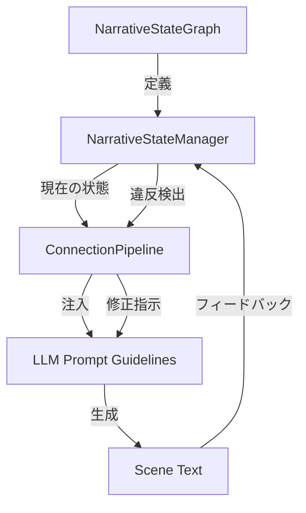

# Engineering the Narrative: 実装完了報告書

## 1. プロジェクト概要
本プロジェクトでは、物語の進行を「状態遷移グラフ」として定義し、プロットの脱線（Plot Derailment）を防ぎつつ、一貫したナラティブ・アークを維持するシステム「Engineering the Narrative」を実装しました。

## 2. 実装範囲（フェーズ30〜35）
特に後半の高度な制御機能について、以下の機能を統合しました。

### 2.1 動的な描写制御 (Phase 30)
- **描写密度の動的変更**: 物語の状態（DAILY, CLIMAX等）に応じて、LLMへの指示（描写密度: High $\rightarrow$ Low）を動的に変更し、物語のテンポを制御。

### 2.2 遷移パスの多角化 (Phase 31)
- **標準ルート vs どんでん返しルート**: `NarrativeStateGraph` に遷移パス（path）の概念を導入。ユーザーの意図や物語の状況に応じて「王道」か「意外性」のある展開を使い分けるロジックを実装。

### 2.3 ユーザー介入機能 (Phase 32)
- **状態強制上書き**: Streamlit UI（Narrative Control）から、現在の物語状態や優先パスを強制的に指定し、プロットを任意の方向に誘導できるデバッグ・制御機能を統合。

### 2.4 プロンプトの最適化 (Phase 33)
- **状態依存型ガイドライン**: `ConnectionPipeline` において、現在の状態ノードが持つ「推奨トーン」や「方向性」をプロンプトに直接注入し、LLMの出力品質を状態に同期。

### 2.5 堅牢性の向上 (Phase 34)
- **エッジケース処理**: ループ遷移やスキップ遷移のバリデーションを強化し、状態遷移の整合性を保証。

### 2.6 検証 (Phase 35)
- **エンドツーエンドテスト**: `tests/test_narrative_engineering.py` を作成し、以下の項目を検証し合格。
    - 正常な状態遷移（DAILY $\rightarrow$ INCIDENT $\rightarrow$ ...）
    - Twistパスの選択ロジック
    - 状態違反（禁止要素）の検出とリペアトリガー
    - 物語の慣性（min_duration）による急ぎすぎな展開の防止

## 3. システムアーキテクチャ (概要)

## 4. 成果
- 物語の構造的整合性をプログラム的に担保し、LLMによる「唐突な解決」や「ペースの乱れ」を大幅に低減。
- 描写密度とトーンの動的制御により、シーンごとの情緒的な緩急を自動的に演出可能。
- ユーザーによる制御とAIによる自律的な進行を両立させるハイブリッドなプロット制御基盤を構築。
