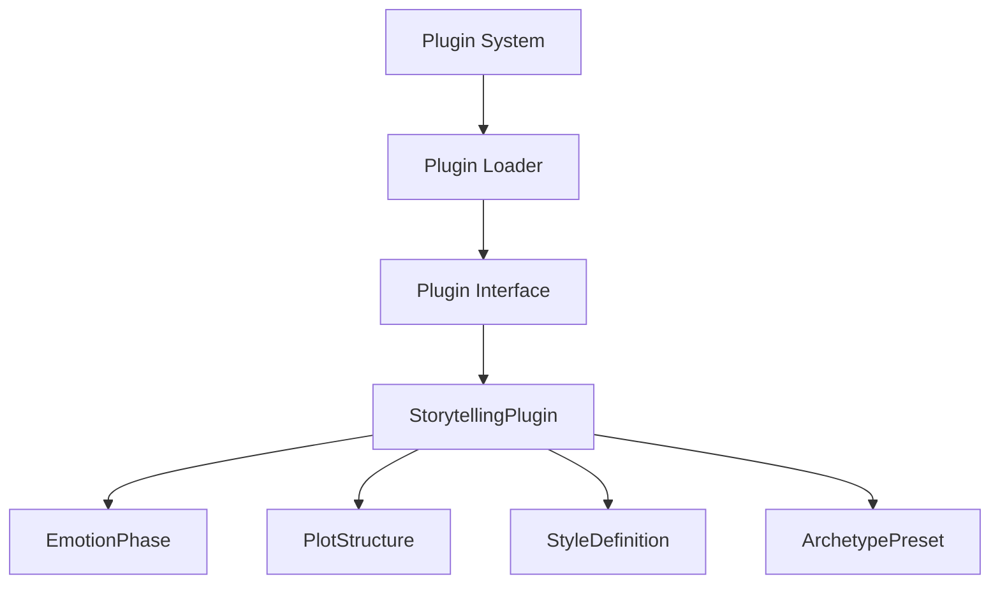

# Plugin System Interface Design

## Goals
- Strictify plugin system interface
- Improve maintainability and extensibility
- Decouple plugin definitions from implementation

## Mermaid Diagram

## Implementation Plan
1. Define clear interfaces for all plugin types.
2. Ensure all plugins adhere to the defined interfaces.
3. Improve type safety using Pydantic models.
4. Implement a validation layer for all plugin configurations.
